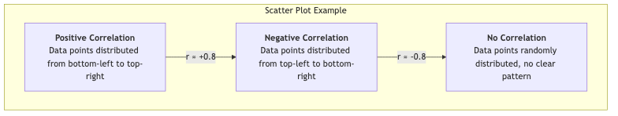

# Investigación Correlacional

En el camino de la exploración científica, no solo queremos saber "cómo son las cosas" (investigación descriptiva), sino que también deseamos comprender cómo están interconectadas. **La investigación correlacional** es precisamente un paradigma de investigación que busca explorar si existe una **relación** entre dos o más variables, así como su **fuerza** y **dirección**. La pregunta central que responde es: "¿Cuando A cambia, B también cambia sistemáticamente?"

La investigación correlacional es un método de investigación cuantitativo no experimental. Los investigadores no manipulan ninguna variable como lo harían en un experimento, sino que simplemente miden variables existentes y luego utilizan técnicas estadísticas para analizar las relaciones entre ellas. Por ejemplo, un investigador podría medir las "horas diarias de estudio" de un grupo de estudiantes y sus "calificaciones en exámenes", para explorar si hay una relación entre ambos. Este tipo de investigación desempeña un papel crucial en psicología, sociología, educación, investigación de mercados y muchas otras áreas.

## Comprensión de los Conceptos Clave de la Correlación

Para entender la investigación correlacional, se deben comprender varios conceptos fundamentales:

*   **Correlación**: Se refiere a la tendencia de dos o más variables a cambiar juntas. Cuando el valor de una variable cambia, el valor de otra variable también tiende a cambiar de manera predecible.
*   **Coeficiente de Correlación**: Es un valor estadístico entre -1.0 y +1.0 (generalmente denotado por *r*) que se utiliza para cuantificar la fuerza y dirección de la correlación.
    *   **Dirección**:
        *   **Correlación Positiva**: *r* > 0. Dos variables cambian en la misma dirección. Una aumenta y la otra también tiende a aumentar. Por ejemplo, altura y peso.
        *   **Correlación Negativa**: *r* < 0. Dos variables cambian en direcciones opuestas. Una aumenta y la otra tiende a disminuir. Por ejemplo, el precio de un bien y su demanda.
    *   **Fuerza**:
        *   Cuanto más cercano sea el valor absoluto del coeficiente de correlación a 1, más fuerte será la relación. *r* = +1.0 o -1.0 indica una correlación lineal perfecta.
        *   Cuanto más cercano sea el coeficiente de correlación a 0, más débil será la relación. *r* = 0 indica que no hay relación lineal entre las dos variables.

### Visualización de la Correlación: Diagrama de Dispersión

Un diagrama de dispersión es la mejor herramienta para visualizar la relación entre dos variables. Al observar el patrón de distribución de los puntos de datos en el gráfico, podemos determinar intuitivamente la dirección y fuerza de la correlación.

<!--

<!--

## "La correlación no implica causalidad": La advertencia más crucial

Esta es la regla de oro que se debe tener en mente al interpretar investigaciones correlacionales. Incluso si encontramos una fuerte correlación entre dos variables, **absolutamente no podemos** concluir solo por eso que una variable "causa" el cambio en la otra. Hay dos razones principales detrás de esto:

1.  **Problema de la tercera variable**: Puede haber una tercera variable oculta y no medida que influye simultáneamente en las dos variables observadas, creando así una asociación espuria. Un ejemplo clásico: los estudios encuentran una fuerte correlación positiva entre las ventas de helado y las muertes por ahogamiento. Pero no podemos decir que comer helado cause ahogamientos. La verdadera tercera variable es "el clima caluroso", que hace que la gente quiera comer helado y nadar, aumentando simultáneamente ambos factores.

2.  **Problema de la direccionalidad**: Incluso si realmente existe una relación causal entre dos variables, la investigación correlacional no puede decirnos cuál es la causa y cuál es el efecto. Por ejemplo, los estudios encuentran una correlación positiva entre la autoestima y el rendimiento académico. Pero ¿la alta autoestima conduce a un alto rendimiento académico, o el excelente rendimiento académico mejora la autoestima de los estudiantes? La investigación correlacional no puede responder a esta pregunta.

## Cómo realizar un estudio correlacional

1.  **Definir preguntas de investigación y variables**
    Definir claramente cuáles son las dos (o más) variables cuya relación se quiere explorar. Por ejemplo: "¿Existe una relación entre la satisfacción laboral de los empleados y su desempeño en el trabajo?"

2.  **Operacionalizar y medir las variables**
    Diseñar métodos específicos de medición para cada variable. Por ejemplo, usar una escala bien establecida de "satisfacción laboral" para medir la satisfacción, y "puntuaciones anuales de evaluación de desempeño" para medir el desempeño.

3.  **Muestreo y recopilación de datos**
    Seleccionar una muestra representativa de la población objetivo y medir simultáneamente todas las variables relevantes para cada individuo de la muestra.

4.  **Análisis e interpretación de datos**
    Utilizar software estadístico para calcular el coeficiente de correlación entre variables (por ejemplo, el coeficiente de correlación de Pearson) y dibujar diagramas de dispersión. Basándose en el valor del coeficiente de correlación y el nivel de significancia, determinar si existe una correlación estadísticamente significativa entre las variables, y describir su dirección y fuerza.

5.  **Sacar conclusiones con precaución**
    Al informar los resultados, el lenguaje debe ser extremadamente cuidadoso, afirmando solamente que "A está asociado con B", y nunca que "A causa B". Al mismo tiempo, explorar activamente posibles terceras variables y explicaciones con distintas direcciones.

## Casos de Aplicación

**Caso 1: Investigación en Psicología Educativa**

*   **Situación**: Un investigador educativo quiere saber si la tasa de finalización de tareas por parte de los estudiantes está relacionada con sus calificaciones finales en un examen.
*   **Aplicación**: Recopiló las tasas de finalización de tareas (en porcentaje) de todos los estudiantes en una clase durante el semestre y sus calificaciones finales en el examen. Calculando el coeficiente de correlación, encontró una correlación positiva moderada (*r* = +0.55) entre ambas. Puede concluir que los estudiantes con tasas más altas de finalización de tareas **tienden a** obtener calificaciones más altas en el examen final. Pero no puede decir que completar las tareas en sí "cause" calificaciones altas (quizás "la motivación para aprender" sea una tercera variable que influya en ambas).

**Caso 2: Investigación en Salud Pública**

*   **Situación**: Epidemiólogos quieren estudiar la relación entre fumar y el cáncer de pulmón.
*   **Aplicación**: Como es imposible estudiar este problema mediante experimentos (es decir, obligar a un grupo de personas a fumar), utilizaron una investigación correlacional a gran escala. Al investigar los hábitos de fumar (número de cigarrillos fumados al día) y su estado de salud durante las próximas décadas, los investigadores encontraron una correlación positiva extremadamente fuerte entre ambos. Aunque esto por sí solo no puede establecer completamente una relación causal, combinado con otras evidencias como las biológicas, proporciona un apoyo muy sólido para la cadena causal entre ambas variables.

**Caso 3: Análisis de Marketing**

*   **Situación**: Una empresa quiere saber si existe una relación entre su gasto en publicidad en redes sociales y las ventas del producto.
*   **Aplicación**: La empresa analizó datos de los últimos 24 meses, con una variable siendo el gasto mensual en publicidad y la otra siendo las ventas online de ese mes. Encontraron una fuerte correlación positiva entre ambas. Esto indica que los meses con mayores gastos en publicidad también tuvieron mayores ventas. Este hallazgo puede servir como referencia para la asignación futura del presupuesto, pero también es necesario estar alerta ante terceras variables (por ejemplo, promociones estacionales podrían aumentar simultáneamente el gasto en publicidad y las ventas).

## Ventajas y Limitaciones de la Investigación Correlacional

**Ventajas Principales**

*   **Valor predictivo**: Cuando dos variables están fuertemente correlacionadas, podemos usar el valor de una variable para predecir el valor de la otra.
*   **Estudio de variables que no se pueden manipular**: Para variables que no se pueden manipular mediante experimentos por razones éticas o prácticas (por ejemplo, rasgos de personalidad, trasfondo familiar, enfermedades), la investigación correlacional es el único método viable de investigación.
*   **Exploratoria**: Puede servir como investigación preliminar para estudios experimentales, ayudando a los investigadores a identificar posibles relaciones causales dignas de un estudio más profundo.

**Limitaciones Potenciales**

*   **No puede establecer causalidad**: Esta es su limitación más fundamental y central.
*   **Fácil de malinterpretar**: Los medios de comunicación y el público a menudo interpretan erróneamente la correlación como causalidad, lo que lleva a información incorrecta.
*   **Solo revela relaciones lineales**: Los coeficientes de correlación estándar solo pueden medir relaciones lineales. Si existe una relación no lineal entre dos variables (por ejemplo, una curva en forma de U), el coeficiente de correlación puede ser muy bajo, ocultando así la verdadera y fuerte asociación entre ellas.

## Extensiones y Conexiones

*   **Investigación Descriptiva**: La base de la investigación correlacional; primero debemos ser capaces de describir las variables antes de poder estudiar las relaciones entre ellas.
*   **Investigación Experimental**: Una vez que la investigación correlacional encuentra una asociación interesante, se puede utilizar una investigación experimental rigurosa para probar si existe un mecanismo causal detrás de ella.
*   **Análisis de Regresión**: Una extensión y mejora de la investigación correlacional. Cuando hay múltiples variables independientes, el análisis de regresión no solo puede revelar su relación con la variable dependiente, sino también analizar la importancia relativa o el poder predictivo único de cada variable independiente.

---
*Referencia: La base estadística de la investigación correlacional fue sentada por Francis Galton y Karl Pearson, y el coeficiente de correlación de Pearson sigue siendo uno de los indicadores estadísticos más utilizados hoy en día. Cualquier libro básico sobre métodos de investigación en psicología o ciencias sociales tendrá una discusión detallada sobre la investigación correlacional y su distinción con la causalidad.*