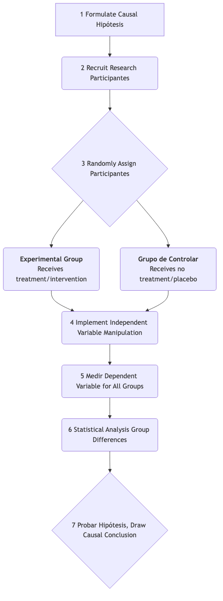

# Investigación Experimental

Entre todos los métodos de investigación científica, la **Investigación Experimental** es el estándar más cercano a revelar la **Causalidad** de los fenómenos. No se limita a observar el mundo, sino que interviene activa y sistemáticamente en él para verificar si un cambio en un factor "causa" un cambio en otro. Cuando deseas responder de forma definitiva preguntas como "¿Fue A la causa de que ocurriera B?", la investigación experimental proporciona el marco lógico más riguroso y poderoso.

Su idea central radica en el **control**. Los investigadores manipulan con precisión una o más **Variables Independientes** en un entorno altamente controlado y observan los efectos medibles de esta manipulación sobre las **Variables Dependientes**, mientras controlan estrictamente o aleatorizan todas las demás variables irrelevantes que pudieran tener influencia. Es precisamente este control y manipulación exactos de las variables lo que permite a la investigación experimental ir más allá de la "correlación" y llegar a conclusiones "causales".

## Elementos Clave de la Investigación Experimental

Un estudio experimental estandarizado debe incluir los siguientes componentes esenciales, que juntos forman su cadena lógica rigurosa.

*   **Hipótesis**: Una afirmación comprobable sobre la relación causal entre variables independientes y dependientes. Por ejemplo, "La ingesta de cafeína (variable independiente) puede mejorar las puntuaciones de los participantes (variable dependiente) en una prueba de memoria".
*   **Manipulación**: Los investigadores deben cambiar activamente el nivel de la variable independiente. Por ejemplo, administrar píldoras de cafeína a un grupo de participantes y un placebo sin cafeína a otro grupo.
*   **Control**: Este es el núcleo del experimento. Los investigadores deben eliminar o mantener constantes todos los demás factores que podrían afectar a la variable dependiente (es decir, **variables de confusión**) tanto como sea posible. El método de control más crucial es la **asignación aleatoria** de los participantes a los distintos grupos experimentales.
*   **Grupo Experimental vs. Grupo de Control**:
    *   **Grupo Experimental**: El grupo que recibe la manipulación de la variable independiente (es decir, "tratamiento" o "intervención").
    *   **Grupo de Control**: El grupo que no recibe el tratamiento o recibe un "tratamiento cero" (por ejemplo, un placebo). La presencia de un grupo de control proporciona una línea de base para la comparación; sin él, no podríamos determinar si los cambios observados se deben realmente a la variable independiente.

### Diagrama de Flujo del Diseño Experimental Verdadero

 

## Cómo Diseñar y Realizar un Experimento

1.  **Formular una Hipótesis Causal**
    Basándose en teorías o observaciones, define claramente la relación causal que deseas probar. Por ejemplo, "¿Puede el aprendizaje con una nueva aplicación educativa (variable independiente) mejorar más eficazmente las calificaciones de los estudiantes (variable dependiente) que los métodos tradicionales de enseñanza?"

2.  **Operacionalizar las Variables**
    Traduce las variables abstractas en operaciones concretas y medibles. Por ejemplo, "usar la nueva aplicación educativa" se define específicamente como "uso diario de la aplicación durante 30 minutos de aprendizaje interactivo"; "las calificaciones" se definen como "puntuaciones en un examen final estandarizado".

3.  **Reclutar y Asignar Aleatoriamente a los Participantes**
    Recluta un grupo de participantes elegibles (por ejemplo, "estudiantes de un determinado curso"), y luego asígnalos aleatoriamente al grupo experimental y al grupo de control mediante métodos como lanzar una moneda o usar tablas de números aleatorios.

4.  **Aplicar la Intervención**
    Los estudiantes del grupo experimental aprenden utilizando la nueva aplicación educativa según lo prescrito. Los estudiantes del grupo de control continúan utilizando métodos tradicionales de aprendizaje (por ejemplo, leer libros de texto). Asegúrate de que los dos grupos sean lo más consistentes posible en cuanto a otras condiciones (por ejemplo, tiempo total de estudio, profesores, etc.).

5.  **Medir los Resultados**
    Al finalizar el período experimental (por ejemplo, un semestre), aplica una prueba estandarizada a todos los participantes y registra sus puntuaciones.

6.  **Analizar los Datos**
    Utiliza herramientas estadísticas (por ejemplo, prueba t o ANOVA) para comparar si existe una diferencia estadísticamente significativa en las puntuaciones promedio entre el grupo experimental y el grupo de control. Si la puntuación promedio del grupo experimental es significativamente más alta que la del grupo de control, puedes concluir con cierto nivel de confianza que la nueva aplicación educativa "causó" la mejora en las puntuaciones.

## Casos de Aplicación

**Caso 1: Prueba de la Experiencia del Usuario en el Diseño Web**

*   **Escenario**: Un diseñador web cree que mover el botón de registro de la parte superior a la inferior de la página puede reducir la distracción del usuario, aumentando así las tasas de finalización de lectura de artículos.
*   **Experimento**: Dividió aleatoriamente a 10,000 nuevos visitantes en dos grupos. Al Grupo A se le mostró la página web antigua con el botón en la parte superior, y al Grupo B se le mostró la nueva página web con el botón en la parte inferior. Analizando datos del backend, el diseñador descubrió que los usuarios del Grupo B tenían una profundidad de desplazamiento promedio y tasas de finalización de lectura significativamente más altas que los del Grupo A. Esto confirmó su hipótesis causal.

**Caso 2: Prueba de la Efectividad de Fertilizantes en Agricultura**

*   **Escenario**: Un agrónomo desarrolló un nuevo fertilizante ecológico, afirmando que puede aumentar el rendimiento del trigo.
*   **Experimento**: Seleccionó un campo experimental homogéneo y lo dividió en 20 parcelas pequeñas. Aleatoriamente seleccionó 10 parcelas para aplicar el nuevo fertilizante (grupo experimental), y las otras 10 parcelas para aplicar una cantidad igual de fertilizante tradicional (grupo de control). En el momento de la cosecha, midió el rendimiento del trigo en cada parcela. Comparando los rendimientos promedio de los dos grupos, pudo determinar científicamente el efecto del nuevo fertilizante.

**Caso 3: El "Experimento del Malvavisco" en Psicología**

*   **Escenario**: El psicólogo Walter Mischel quería estudiar el efecto de la capacidad de los niños para posponer la gratificación (variable independiente) sobre su éxito futuro (variable dependiente).
*   **Experimento**: Les ofreció a los niños una elección: comerse un malvavisco inmediatamente o esperar 15 minutos y recibir dos. Este es un diseño cuasiexperimental clásico. Siguió a estos niños durante décadas y descubrió que los niños que pudieron esperar más tiempo generalmente tuvieron un mejor desempeño académico, desarrollo profesional y otros aspectos en el futuro. Este experimento reveló una profunda conexión causal entre el autocontrol y el éxito a largo plazo.

## Ventajas y Limitaciones de la Investigación Experimental

**Ventajas Principales**

*   **Fuerte Capacidad de Inferencia Causal**: Entre todos los métodos de investigación, es el más eficaz para establecer relaciones causales entre variables.
*   **Alta Reproducibilidad**: Los procedimientos estandarizados y el control preciso de las variables hacen que los experimentos sean fáciles de replicar y verificar por otros investigadores.
*   **Precisión**: Puede medir con precisión la magnitud del efecto de la variable independiente sobre la variable dependiente.

**Limitaciones Potenciales**

*   **Problemas de Validez Externa**: El entorno altamente controlado del laboratorio puede estar muy alejado del mundo real complejo y dinámico, dificultando la generalización de las conclusiones experimentales a situaciones reales (es decir, baja "validez ecológica").
*   **Restricciones Éticas**: Muchas preguntas de investigación (por ejemplo, estudiar el impacto del abuso en el desarrollo infantil) están absolutamente prohibidas por consideraciones éticas de usar métodos experimentales.
*   **Dificultad de Implementación y Alto Costo**: Diseñar y ejecutar una investigación experimental rigurosa normalmente requiere recursos significativos, tiempo y experiencia.
*   **Efecto Hawthorne**: Los participantes pueden cambiar sus patrones de comportamiento naturales porque son conscientes de que están siendo estudiados, afectando así los resultados del experimento.

## Extensiones y Conexiones

*   **Investigación Cuasiexperimental**: Cuando no es posible realizar una asignación aleatoria completa (por ejemplo, al estudiar diferencias entre estudiantes de dos clases diferentes), los investigadores utilizan diseños cuasiexperimentales. Aún implica manipulación y control, pero la fuerza de la inferencia causal es más débil que en los experimentos verdaderos.
*   **Investigación Correlacional**: Cuando no se pueden realizar experimentos, la investigación correlacional puede ser una alternativa para encontrar asociaciones entre variables, aunque no pueda llegar a conclusiones causales.

---
*Referencia Fuente: Los fundamentos filosóficos de los métodos experimentales fueron sentados por filósofos como David Hume y John Stuart Mill. "Experimental and Quasi-Experimental Designs for Research" de Donald T. Campbell y Julian C. Stanley es una obra fundamental en este campo.*