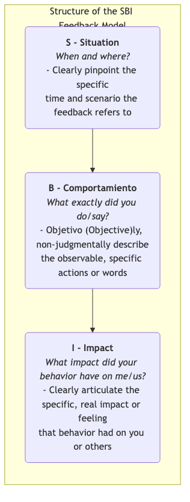

# Modelo de Retroalimentación SBI

En la colaboración en equipo y el crecimiento personal, la **retroalimentación** es un combustible indispensable. Sin embargo, los métodos inadecuados de retroalimentación suelen tener efectos contraproducentes. Una retroalimentación vaga (por ejemplo, "Lo hiciste bien") no proporciona una orientación específica, mientras que una retroalimentación excesivamente subjetiva o juiciosa (por ejemplo, "Eres muy descuidado") fácilmente desencadena actitudes defensivas y resistencia en el destinatario, convirtiendo una conversación que debería ser constructiva en una discusión improductiva. El **modelo de retroalimentación SBI (Situación-Comportamiento-Impacto)** es una herramienta de comunicación estructurada, sencilla, clara y no juiciosa diseñada para resolver este problema.

El modelo SBI, desarrollado por el **Center for Creative Leadership (CCL)**, una institución líder mundial en desarrollo directivo, se centra en desglosar claramente la retroalimentación en tres partes secuenciales lógicas para garantizar que su retroalimentación sea **específica, objetiva y centrada en el comportamiento y su impacto**, en lugar de en juicios abstractos sobre el carácter personal.

*   **S - Situación**: El momento y lugar específicos a los que se refiere la retroalimentación.
*   **B - Comportamiento**: Las acciones o palabras observables y específicas que la persona mostró en esa situación.
*   **I - Impacto**: Las consecuencias y efectos específicos de ese comportamiento en usted, en el equipo o en el proyecto.

Siguiendo esta estructura "S-B-I", puede transformar la retroalimentación desde juicios vagos "sobre la persona" hasta descripciones claras "sobre la acción", aumentando así considerablemente la probabilidad de que la retroalimentación sea comprendida y aceptada por el destinatario, y sentando una base objetiva y respetuosa para discusiones y mejoras posteriores.

## Los Tres Componentes del Modelo SBI

Las tres partes del modelo SBI forman conjuntamente una declaración de retroalimentación completa y persuasiva.

1.  **S - Situación**
    *   **Propósito**: Proporcionar un contexto claro para la retroalimentación, ayudando al destinatario a recordar rápidamente el evento específico al que se refiere. Esto evita generalizaciones vagas y "sacar a relucir asuntos antiguos".
    *   **Clave**: Sea específico, no vago. No diga "Siempre haces...", sino más bien "En nuestra reunión semanal del proyecto de ayer por la mañana...".

2.  **B - Comportamiento**
    *   **Propósito**: Centrar firmemente la retroalimentación en las acciones y palabras **específicas, objetivas y observables** del destinatario.
    *   **Clave**: Describa solamente lo que vio o escuchó directamente. **Evite absolutamente cualquier palabra que implique suposiciones subjetivas, especulaciones sobre motivos o juicios sobre el carácter**. No diga "Parecías no estar preparado", sino más bien "Cuando presentaste el plan, te detuviste tres veces para buscar datos". No diga "Me interrumpiste", sino más bien "Comenzaste a hablar mientras yo todavía estaba terminando mi oración".

3.  **I - Impacto**
    *   **Propósito**: Este es el núcleo de la retroalimentación. Tiene como objetivo ayudar al destinatario a comprender por qué su comportamiento es importante y cuáles fueron las consecuencias específicas que tuvo sobre otras personas o sobre el trabajo. Esto es clave para motivar al destinatario a cambiar.
    *   **Clave**: Articule claramente el impacto o sentimiento real que tuvo este comportamiento sobre "**mí**" o "**nosotros**". Empezar con declaraciones en primera persona puede reducir eficazmente la actitud defensiva del destinatario. Por ejemplo: "Esto me hizo sentir que mi opinión no fue completamente respetada", o "Esto hizo que nuestro cliente cuestionara nuestra profesionalidad".

## Cómo Usar el Modelo SBI para Dar Retroalimentación

Usar el modelo SBI no se trata solo de aplicar una fórmula; se trata de adoptar una postura de comunicación respetuosa y abierta.

1.  **Paso Uno: Preparar la Retroalimentación (S-B-I)**
    Antes de iniciar una conversación de retroalimentación, organice claramente en su mente o en papel su contenido SBI. Asegúrese de que su descripción sea específica, objetiva y no juiciosa.

2.  **Paso Dos: Iniciar la Conversación**
    Elija un momento y lugar adecuados y privados. Al comenzar la conversación, exprese claramente su intención positiva, por ejemplo: "Me gustaría compartir contigo algunas observaciones, con la esperanza de que nos ayuden a colaborar más fluidamente en el futuro."

3.  **Paso Tres: Expresar Claramente el Modelo SBI**
    Siga estrictamente el orden "S-B-I" y exprese su retroalimentación claramente y con calma.
    *   "**(S)** En la reunión semanal del equipo con el cliente del lunes por la mañana, **(B)** cuando el cliente planteó una pregunta directa sobre el presupuesto, inmediatamente enumeraste tres de nuestros casos exitosos anteriores en detalle para respaldar nuestro valor. **(I)** Esto me hizo sentir muy tranquilo y seguro, y noté que la expresión del cliente se relajó visiblemente, lo cual aumentó considerablemente su confianza en nosotros." (Este es un ejemplo de retroalimentación positiva)

4.  **Paso Cuatro: Hacer una Pausa y Escuchar la Perspectiva del Otro**
    Después de haber expresado claramente el SBI, el paso más importante es **hacer una pausa** y ceder la palabra al otro. Utilice una pregunta abierta para invitarle a compartir su perspectiva, por ejemplo: "¿Qué piensas sobre lo que acabo de decir?" o "Me gustaría saber qué estabas pensando en ese momento".

5.  **Paso Cinco: Discutir en Conjunto y Mirar Hacia el Futuro**
    Una vez que ambas partes hayan intercambiado completamente sus perspectivas, cambie el enfoque de la conversación hacia el futuro. Discutan conjuntamente: "¿Qué podemos hacer en el futuro para mantener los aspectos positivos / mejorar las áreas débiles?"

## Casos de Aplicación

**Caso 1: Dar Retroalimentación a un Compañero que Habla Demasiado en las Reuniones**

*   **Retroalimentación Inadecuada**: "Hablas demasiado en las reuniones; siempre te sales del tema." (Juiciosa, vaga)
*   **Retroalimentación SBI**:
    *   **S**: "En la reunión semanal del equipo de hoy, cuando estábamos discutiendo el tercer punto del orden del día, 'Plan de Marketing del Próximo Trimestre',"
    *   **B**: "Me di cuenta de que cuando presentaste tu plan, explicaste detalladamente la información de fondo de todas las actividades similares anteriores, lo cual tomó aproximadamente 15 minutos."
    *   **I**: "Esto me hizo sentir un poco ansioso porque temía que no tuviéramos suficiente tiempo para discutir los planes de los otros dos compañeros. Además, me resultó un poco difícil captar los puntos clave de tu plan."
    *   **(Iniciar Diálogo)**: "Me gustaría entender, ¿estabas tratando de asegurarte de que todos comprendiéramos bien el contexto en ese momento?"

**Caso 2: Felicitar a un Nuevo Empleado que Ayuda Proactivamente a Otros**

*   **Retroalimentación Inadecuada**: "¡Xiao Wang, eres genial, sigue así!" (Vaga, carece de orientación específica)
*   **Retroalimentación SBI**:
    *   **S**: "Xiao Wang, me di cuenta de ayer por la tarde, cuando el equipo de soporte al cliente estaba ocupado respondiendo llamadas,"
    *   **B**: "Fuiste proactivo y fuiste a ayudarles a procesar 5 tickets pendientes en línea."
    *   **I**: "Tu acción no solo alivió considerablemente la presión sobre el equipo de servicio al cliente, sino que también me mostró tu fuerte espíritu de equipo y sentido de pertenencia, lo cual mejoró el ambiente general de nuestro equipo. ¡Muchas gracias!"

**Caso 3: Dar Retroalimentación a su Superior (Retroalimentación Ascendente)**

*   **Situación**: Su superior suele asignarle tareas urgentes sobre la marcha durante las reuniones del equipo.
*   **Retroalimentación SBI**:
    *   **S**: "Jefe, durante nuestra reunión de planificación del proyecto del miércoles,"
    *   **B**: "Al final de la reunión, me asignó dos nuevas tareas urgentes que debían completarse antes del viernes."
    *   **I**: "Esto me hizo sentir un poco sorprendido porque significaba que tenía que dejar de lado mis tareas principales planificadas originalmente de alta prioridad para completarlas. Estoy preocupado de que esto pueda afectar la ruta crítica de todo nuestro proyecto."
    *   **(Iniciar Diálogo)**: "Me gustaría confirmar con usted si la prioridad de estas dos nuevas tareas es realmente más alta que la de las tareas principales en las que estoy trabajando actualmente. ¿O cómo podríamos ajustar el cronograma?"

## Ventajas y Desafíos del Modelo SBI

**Ventajas Principales**

*   **Específica, Objetiva y Basada en Evidencia**: Basa la retroalimentación en hechos observables, evitando elogios vagos y acusaciones infundadas.
*   **Reduce la Actitud Defensiva**: Al centrarse en el "comportamiento" y su "impacto", en lugar de juzgar a "la persona", reduce considerablemente la resistencia del destinatario, facilitando así la conversación.
*   **Señala Claramente la Dirección**: La sección de "impacto" le dice claramente al destinatario por qué su comportamiento debe mantenerse o cambiarse, facilitando así que lo comprenda y actúe.
*   **Simple y Fácil de Aprender**: La estructura del modelo es sencilla, fácil de recordar y puede practicarse deliberadamente en el trabajo diario.

**Desafíos Potenciales**

*   **Requiere Práctica Deliberada**: Para usar hábil y naturalmente el modelo SBI, especialmente cuando se enfrenta conflictos o se da retroalimentación negativa, se requiere mucha práctica deliberada para superar nuestros patrones habituales y juiciosos de comunicación.
*   **Altas Demandas en la Observación del "Comportamiento"**: Requiere que seamos observadores conscientes en nuestra vida diaria, capaces de capturar y describir con precisión detalles específicos del comportamiento.

## Extensiones y Conexiones

*   **Comunicación No Violenta (CNV)**: El modelo SBI se alinea altamente con la filosofía de la Comunicación No Violenta. Los cuatro componentes de la CNV son "Observación, Sentimiento, Necesidad, Solicitud". La "Situación-Comportamiento" en el modelo SBI corresponde a la "Observación", y el "Impacto" está profundamente relacionado con nuestros "Sentimientos" y "Necesidades".
*   **Variación BI-C de la Retroalimentación**: En algunos escenarios donde se necesita expresar con mayor fuerza las expectativas (especialmente después de dar retroalimentación negativa), se puede agregar un componente adicional **C - Consecuencia/Elección** al modelo SBI, informando claramente al destinatario sobre las posibles consecuencias si el comportamiento no cambia, o qué opciones tiene.

---
*Referencia: El modelo de retroalimentación SBI fue desarrollado y popularizado por el Center for Creative Leadership (CCL) y es una de las herramientas principales de comunicación en sus programas de formación directiva, aplicándose ampliamente en el desarrollo de habilidades comunicativas para directivos y equipos en todo el mundo.*