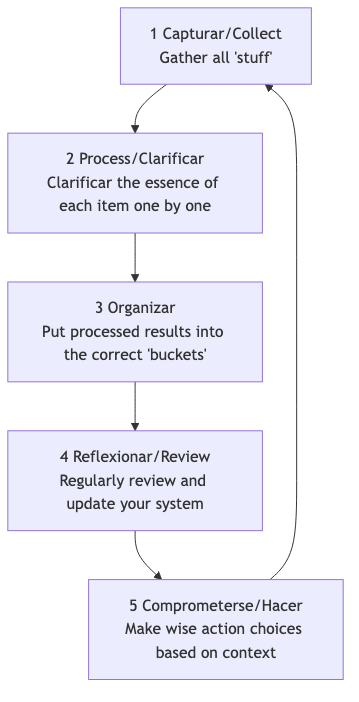

# GTD (Getting Things Done)

Nuestro cerebro es inherentemente una "CPU" excelente para **generar ideas**, pero es un "disco duro" extremadamente deficiente para **almacenar información**. Cuando intentamos usar nuestro cerebro para recordar todas nuestras tareas pendientes, citas, ideas y compromisos, se llena con estos "asuntos incompletos", lo que genera estrés, ansiedad y desorden mental, dificultando enfocarnos en la tarea actual. **GTD (Getting Things Done)**, creado por el experto en productividad David Allen, es un sistema mundialmente reconocido de **productividad personal y gestión de flujos de trabajo**.

La filosofía central de GTD es lograr un estado de trabajo sin estrés, altamente enfocado y eficiente denominado **"Mind Like Water"**, extrayendo todas las tareas pendientes de tu mente y colocándolas en un **sistema externo y confiable**, y luego siguiendo un proceso claro y riguroso para **organizar y procesar** dichas tareas. No es un simple truco de gestión del tiempo, sino un sistema operativo completo diseñado para liberar tu mente y permitirte afrontar con calma el trabajo complejo y la vida cotidiana.

## Los Cinco Pasos Clave de GTD

1.  **Capturar**: Retira inmediatamente de tu mente cualquier cosa que llame tu atención—ya sea una tarea laboral, un recado personal, una inspiración repentina o una cita futura—y colócala en tu "**Bandeja de entrada**". La bandeja de entrada puede ser física (como una bandeja de documentos, una libreta) o digital (como un buzón de correo electrónico, una aplicación de tareas). Lo fundamental es asegurarte de que tengas la menor cantidad posible de bandejas de entrada y que puedas confiar plenamente en ellas y vaciarlas por completo.

2.  **Procesar**: Vacía regularmente (al menos una vez al día) tu bandeja de entrada. Sigue estrictamente el principio de **un elemento a la vez**, toma uno por uno los elementos de tu bandeja y pregúntate una cuestión fundamental: "**¿Qué es esto? ¿Requiere acción?**"
    *   Si **no se requiere acción**: Puede ser **basura** (elimínala directamente), **información que podría ser útil en el futuro** (archívala en una carpeta de referencia), o una **idea en incubación** (colócala en una lista de "Tal vez/Quizás").

    *   Si **se requiere acción**: Procede al siguiente paso de organización.

3.  **Organizar**: Para los elementos que requieren acción, colócalos en diferentes "contenedores" según su naturaleza.
    *   **Regla de los "Dos Minutos"**: Si la acción puede completarse **en menos de dos minutos**, **hazla inmediatamente**, sin necesidad de más organización.
    *   **Delegar a otros**: Si la tarea debe ser realizada por otra persona, **delega** inmediatamente y colócala en una lista de "**Esperando Respuesta**" para seguimiento.
    *   **Calendario**: Para acciones con una **fecha o hora específica** (por ejemplo, reuniones, citas), colócalas en tu **calendario**.
    *   **Lista de Próximas Acciones**: Para acciones que requieren tu atención personal, más de un paso y no tienen una fecha específica, divídelas en la **primera acción concreta, visible y física**, y colócalas en diferentes listas de "**Próximas Acciones**" según el **contexto**. Los contextos pueden ser "@computadora", "@oficina", "@teléfono", "@supermercado", etc.
    *   **Lista de Proyectos**: Cualquier resultado que requiera **más de una acción** para completarse debe definirse como un "**Proyecto**" y colocarse en la lista de proyectos. Esta lista solo registra el nombre del proyecto; sus próximas acciones específicas se almacenan en la lista correspondiente de próximas acciones.

4.  **Revisar**: Para mantener la confiabilidad del sistema, debes realizar **revisiones regulares**.
    *   **Revisión Diaria**: Revisa rápidamente tu calendario y tu lista de próximas acciones diariamente para planificar el trabajo del día.
    *   **Revisión Semanal**: Este es un **componente crucial de GTD**. Una vez por semana (generalmente los fines de semana), dedica 1-2 horas a realizar una revisión completa, detallada y de limpieza de todo el sistema, asegurándote de que todos los proyectos estén bajo control y todas las listas estén actualizadas.

5.  **Actuar**: En cualquier momento dado, cuando debas decidir "¿Qué debo hacer ahora?", puedes hacer una elección sabia y calmada desde tu lista de acciones basándote en los siguientes criterios:
    *   **Contexto**: ¿Dónde estás ahora? ¿Qué herramientas tienes disponibles? (por ejemplo, si estás en la oficina, consulta la lista "@oficina")
    *   **Tiempo Disponible**: ¿Cuánto tiempo libre tienes ahora? (por ejemplo, si solo tienes 10 minutos, elige una tarea que puedas completar rápidamente)
    *   **Energía Disponible**: ¿Cuál es tu nivel actual de energía? (por ejemplo, si te sientes con energía, realiza una tarea que requiera alta concentración)
    *   **Prioridad**: Bajo las condiciones anteriores, ¿qué tarea es la más importante?

### Diagrama del Flujo de Trabajo GTD

## Casos de Aplicación

**Caso 1: Un Gerente de Departamento Ocupado**

*   **Capturar**: Su bandeja de entrada podría incluir: buzón de correo electrónico, mensajes de WeChat, notas tomadas durante reuniones y ideas repentinas que surgen en su mente.
*   **Procesar y Organizar**:
    *   Un correo electrónico "sobre la notificación del presupuesto del próximo trimestre" -> No requiere acción -> **Archivar** en la carpeta de referencia "Finanzas de la Empresa".
    *   Una idea "recordar al subordinado Xiao Zhang que entregue el informe semanal" -> Se puede hacer en 2 minutos -> **Enviar inmediatamente** un mensaje a Xiao Zhang.
    *   Una tarea "preparar la actividad anual del equipo" -> Requiere múltiples pasos -> Añadir "Actividad del Equipo" a la **Lista de Proyectos**; colocar la primera acción "Comunicarse con Recursos Humanos para obtener una lista de lugares posibles" en la lista de **Próximas Acciones** "@Oficina".
    *   Una cita "reunión con un cliente el miércoles próximo a las 3 PM" -> **Colocar en el Calendario**.
*   **Actuar**: Cuando está en la oficina, tiene una hora libre y se siente energético, puede abrir la lista "@Oficina" y elegir trabajar en "Comunicarse con Recursos Humanos".

**Caso 2: Gestión de Proyectos de un Freelancer**

*   **Lista de Proyectos**: Podría incluir "Proyecto de diseño del sitio web del Cliente A", "Rediseño del blog personal", "Aprender un nuevo lenguaje de programación", etc.
*   **Lista de Próximas Acciones**:
    *   **@Teléfono**: Llamar al Cliente A para confirmar comentarios sobre los diseños preliminares.
    *   **@Computadora-Diseño**: Revisar el diseño de la página principal del sitio web según los comentarios recibidos.
    *   **@Computadora-Escritura**: Escribir un artículo de blog sobre "diseño responsivo".
    *   **@Leer/Aprender**: Ver el tercer capítulo del curso de programación.
*   **Revisión Semanal**: El viernes por la tarde revisa el progreso de todos los proyectos, asegurándose de que cada proyecto tenga al menos una "próxima acción", y planifica las prioridades para la próxima semana.

**Caso 3: Un Estudiante que Gestiona Académicos y Vida Cotidiana**

*   **Bandeja de Entrada**: Notificaciones de grupos de WhatsApp del curso, tareas asignadas por profesores, ideas sobre actividades del club, una lista de compras para artículos cotidianos.
*   **Lista de Proyectos**: "Completar el ensayo de Historia", "Prepararse para los exámenes finales", "Planear la fiesta de bienvenida a nuevos estudiantes".
*   **Lista de Próximas Acciones**:
    *   **@Biblioteca**: Pedir prestados tres libros de referencia sobre el tema del ensayo.
    *   **@Dormitorio**: Organizar las notas de clase de matemáticas.
    *   **@Supermercado**: Comprar pasta de dientes y champú.
*   El **sistema GTD** le ayuda a separar claramente las tareas académicas de los recados cotidianos y asegura que las cosas correctas se hagan en el momento, lugar y contexto adecuados.

## Ventajas y Desafíos de GTD

**Ventajas Principales**

*   **Reduce el Estrés Mental y Libera Capacidad Cerebral**: Al externalizar todos los "asuntos incompletos", se reduce enormemente la carga de memoria del cerebro y la ansiedad constante causada por el "miedo a olvidar".
*   **Mejora la Sensación de Control y Calma**: Un sistema confiable te asegura que todo está bajo control, permitiéndote abordar las tareas actuales con mayor calma y enfoque.
*   **Asegura que no se Olviden las Cosas Importantes**: La crucial **Revisión Semanal** garantiza una atención continua y progreso en todos los proyectos importantes y metas a largo plazo.
*   **Altamente Adaptable y Flexible**: GTD en sí mismo no establece prioridades previas, sino que proporciona un marco que te permite elegir dinámica y flexiblemente la acción más adecuada según el contexto actual.

**Desafíos Potenciales**

*   **Alto Costo Inicial de Configuración del Sistema**: La primera vez que "capturas" y configuras completamente el sistema de listas, puede llevar varias horas o incluso un día completo.
*   **Requiere Disciplina Estricta y Formación de Hábitos**: El éxito de GTD depende en gran medida de si puedes desarrollar los hábitos clave de **captura continua** y **revisión regular**. Una vez que el sistema deja de ser confiable o actualizado, se colapsará rápidamente.
*   **Dilema en la Selección de Herramientas**: Existen muchas aplicaciones y herramientas GTD en el mercado, y los principiantes pueden caer fácilmente en la trampa de buscar excesivamente la "herramienta perfecta", descuidando el método en sí mismo.

## Extensiones y Conexiones

*   **Matriz de Eisenhower**: Puede usarse en el paso **"Actuar"** de GTD como un modelo efectivo para juzgar las **prioridades**.
*   **Técnica Pomodoro**: Es una táctica excelente para ejecutar tareas específicas de la **Lista de Próximas Acciones** de GTD que requieren alta concentración.

---
*Referencia: El bestseller mundial de David Allen "Getting Things Done: The Art of Stress-Free Productivity" es la única y más autoritativa fuente para comprender completamente la filosofía, el proceso y las mejores prácticas detrás del método GTD.*