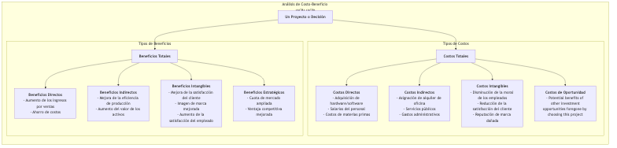

# Análisis Costo-Beneficio

En el mundo empresarial e incluso en políticas públicas, casi toda decisión esconde un intercambio fundamental: ¿cuánto **costo** estamos dispuestos a pagar para obtener un determinado **beneficio**? El **Análisis Costo-Beneficio (ACB)** es precisamente un marco sistemático de toma de decisiones, unificado bajo términos monetarios. Su objetivo fundamental es identificar, cuantificar y comparar de manera integral todos los costos y beneficios de un proyecto o decisión para determinar si el proyecto "vale la pena" y proporcionar una base económica racional para elegir entre múltiples alternativas.

La lógica del análisis costo-beneficio es sencilla: si los **beneficios totales de un proyecto superan sus costos totales**, entonces es económicamente factible y eficiente. Este análisis obliga a los tomadores de decisiones a ir más allá de descripciones cualitativas vagas y convertir todos los impactos positivos y negativos relevantes en valores monetarios comparables en la mayor medida posible. Desde la evaluación de un nuevo proyecto de infraestructura gubernamental hasta que una empresa decida invertir en un nuevo sistema informático, el análisis costo-beneficio es una herramienta racional indispensable para la asignación de recursos y decisiones de inversión.

## Componentes de los costos y beneficios

Realizar un análisis costo-beneficio completo requiere identificar todos los costos y beneficios relevantes, incluidos los explícitos y los implícitos.

## Cómo realizar un Análisis Costo-Beneficio

1.  **Paso Uno: Definir el Proyecto y las Alternativas**
    Defina claramente qué proyecto o decisión está evaluando. Si hay múltiples alternativas, cada una debe someterse a un análisis costo-beneficio independiente.

2.  **Paso Dos: Identificar de manera integral todos los costos y beneficios**
    Realice una lluvia de ideas con todos los interesados relevantes para listar todos los posibles impactos positivos y negativos del proyecto. En este paso, preste especial atención a los costos intangibles y a los beneficios indirectos que suelen pasarse por alto.

3.  **Paso Tres: Monetizar los costos y beneficios**
    Este es el paso más desafiante del ACB. Necesita asignar un valor monetario razonable a cada costo y beneficio de la lista. Para los costos y beneficios directos, esto es relativamente sencillo. Pero para los costos y beneficios intangibles (por ejemplo, "mejora en la satisfacción del cliente"), se requieren algunas técnicas de valoración, como estimar cuánto estarían dispuestos a pagar los clientes por un mejor servicio a través de investigaciones de mercado, o calcular las pérdidas recuperadas al reducir la rotación de clientes.

4.  **Paso Cuatro: Considerar el valor del dinero en el tiempo y aplicar descuentos**
    Dado que el dinero en el futuro vale menos que el dinero hoy, para un proyecto que abarque varios años, los costos y beneficios futuros deben actualizarse al **valor presente** utilizando una **tasa de descuento** predeterminada. Esto asegura que todos los costos y beneficios estén en una base comparable en términos temporales.

5.  **Paso Cinco: Calcular las métricas clave de decisión y comparar**
    Sume los valores presentes de todos los costos y beneficios, y calcule una o más de las siguientes métricas clave:
    *   **Valor Presente Neto (VPN)**: **Valor Presente de los Beneficios Totales - Valor Presente de los Costos Totales**. Si el VPN > 0, el proyecto es económicamente viable. Entre múltiples opciones, generalmente se elige la que tenga el mayor VPN.
    *   **Relación Beneficio-Costo (RBC)**: **Valor Presente de los Beneficios Totales / Valor Presente de los Costos Totales**. Si la RBC > 1, el proyecto es viable. Esta relación es útil cuando se comparan proyectos de diferentes magnitudes.
    *   **Retorno sobre la Inversión (ROI)**: **(Beneficios Totales - Costos Totales) / Costos Totales × 100%**. Muestra visualmente la rentabilidad de la inversión.
    *   **Período de Recuperación**: El tiempo necesario para que los beneficios acumulados del proyecto igualen la inversión inicial.

6.  **Paso Seis: Realizar un análisis de sensibilidad y hacer recomendaciones**
    Dado que muchas estimaciones (especialmente para ítems intangibles y la elección de la tasa de descuento) implican incertidumbre, se requiere un **análisis de sensibilidad**. Esto implica cambiar algunos supuestos clave (por ejemplo, "¿Y si el crecimiento de ventas es un 20% menor al esperado?") y observar su impacto en los resultados finales (por ejemplo, el VPN). Finalmente, basándose en todos los análisis, proporcione recomendaciones claras respaldadas por datos a los tomadores de decisiones.

## Casos de Aplicación

**Caso 1: Empresa que decide si actualizar su sistema ERP**

*   **Costos**:
    *   Costos Directos: Tarifas de adquisición del software, tarifas de actualización del hardware, tarifas externas de consultoría e implementación, tarifas de capacitación para empleados.
    *   Costos Intangibles: Disminución temporal de la productividad durante la migración del sistema, resistencia de los empleados al nuevo sistema.
*   **Beneficios**:
    *   Beneficios Directos: Ahorro en costos laborales mediante la automatización de procesos, reducción del capital inmovilizado en inventario mediante la optimización.
    *   Beneficios Indirectos: Mejora en la precisión de los datos, aumento en la eficiencia en la toma de decisiones.
    *   Beneficios Intangibles: Procesamiento más rápido de órdenes de clientes, mejora en la satisfacción del cliente.
*   **Análisis**: Al monetizar y descontar los ítems anteriores durante los próximos 5 años, se calcula el VPN del proyecto. Si el VPN es positivo, la inversión es justificable.

**Caso 2: Gobierno que evalúa si construir una nueva carretera**

*   **Costos**:
    *   Costos Directos: Tarifas de adquisición de terrenos, costos de construcción, costos de mantenimiento durante décadas.
    *   Costos Intangibles: Daño al medio ambiente natural a lo largo de la ruta, problemas sociales causados por reubicaciones, ruido y congestión durante la construcción.
*   **Beneficios**:
    *   Beneficios Directos: Ingresos por peajes.
    *   Beneficios Indirectos: Ahorro en tiempo y costos de transporte para residentes y empresas a lo largo de la ruta, impulso al desarrollo económico regional y crecimiento del empleo.
    *   Beneficios Intangibles: Valor de las vidas salvadas debido a la reducción de accidentes de tráfico.
*   **Análisis**: El ACB para proyectos públicos es especialmente complejo porque requiere estimaciones profesionales del "valor de la vida", "valor ambiental", etc., en el ámbito de las políticas públicas. La relación beneficio-costo final (RBC) es una base clave para decidir si proceder con el proyecto.

**Caso 3: Individuo que decide si cursar un MBA a tiempo completo**

*   **Costos**:
    *   Costos Directos: Altas tarifas de matrícula, tarifas por libros, gastos de manutención.
    *   Costos de Oportunidad: Todos los ingresos salariales que se dejan de percibir durante el período de estudio del MBA (generalmente dos años), que suele ser el costo más grande.
*   **Beneficios**:
    *   Beneficios Directos: Aumento significativo en el salario esperado tras la graduación.
    *   Beneficios Intangibles: Conocimientos y habilidades adquiridos, red de contactos de egresados fuerte, mejora de la marca personal.
*   **Análisis**: El candidato puede estimar el flujo de efectivo de toda su carrera profesional (con MBA vs. sin MBA) y calcular su valor presente neto para determinar si esta "inversión personal" es justificable.

## Ventajas y Desafíos del Análisis Costo-Beneficio

**Ventajas Principales**

*   **Racional y basado en datos**: Proporciona un marco claro y racional de comparación económica para la toma de decisiones, reduciendo el sesgo subjetivo.
*   **Integral**: Obliga a los tomadores de decisiones a considerar todos los impactos positivos y negativos de un proyecto, no solo los más evidentes.
*   **Optimización de recursos**: Ayuda a asignar recursos limitados a proyectos que generen los mayores beneficios netos.

**Desafíos Potenciales**

*   **Dificultad para monetizar**: El mayor desafío radica en asignar un valor monetario justo y creíble a ítems intangibles y no comerciales (por ejemplo, "reputación de marca", "protección ambiental", "valor de la vida"). Este proceso suele ser controversial.
*   **Precisión de las proyecciones**: Los resultados del análisis dependen en gran medida de las proyecciones de costos y beneficios futuros, y estas proyecciones en sí mismas están llenas de incertidumbre.
*   **Ignorar cuestiones de equidad**: El ACB se centra principalmente en la eficiencia económica general y puede pasar por alto en ocasiones si la distribución de costos y beneficios entre distintos grupos es justa.

## Extensiones y Conexiones

*   **Matriz de Decisión**: Cuando los criterios de decisión no pueden monetizarse completamente, una matriz de decisión ofrece una alternativa más flexible.
*   **Análisis Costo-Efectividad (ACE)**: Cuando los beneficios del proyecto son difíciles de monetizar (por ejemplo, en el sector sanitario), pero su efectividad puede medirse mediante una unidad no monetaria consistente (por ejemplo, "número de pacientes curados con éxito", "años de vida ganados"), puede utilizarse el ACE. Calcula "cuánto cuesta lograr una unidad de efecto".

---
*Referencia: El concepto de análisis costo-beneficio puede rastrearse hasta el ingeniero francés del siglo XIX Jules Dupuit, quien evaluaba proyectos de obras públicas. En el siglo XX, se aplicó ampliamente en la evaluación de políticas públicas en países como el Reino Unido y Estados Unidos, convirtiéndose en una herramienta clave en la gestión de proyectos y decisiones corporativas de inversión.*