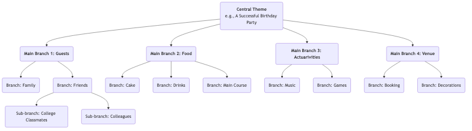

# Mapas Mentales

Nuestro cerebro, al pensar, no sigue un proceso lineal y directo, sino que está lleno de saltos, asociaciones y divergencias. **Mapas mentales** es precisamente una poderosa **herramienta de pensamiento visual** que se alinea profundamente con el modo natural de funcionamiento del cerebro. Inventado por el académico británico Tony Buzan en la década de 1970, su núcleo consiste en conectar palabras clave, ideas, imágenes y colores alrededor de un **tema central** en una estructura **radial y progresivamente estratificada**, organizando así un tema complejo o una colección dispersa de información en un mapa cerebral claro, ordenado, fácil de recordar y de comprender.

El atractivo de los mapas mentales radica en su característica **no lineal**. Nos anima a asociar ideas libremente, capturar inspiraciones fugaces y organizarlas de forma orgánica e interconectada. No es solo una herramienta para registrar información, sino un poderoso compañero de pensamiento que estimula la creatividad, clarifica la lógica y mejora la memoria. Desde la planificación y la toma de notas de lectura hasta la preparación de presentaciones y sesiones de lluvia de ideas, los mapas mentales pueden mejorar significativamente nuestra eficiencia y profundidad de pensamiento.

## Componentes principales de un mapa mental

Un mapa mental estándar sigue unas pocas reglas de dibujo sencillas pero cruciales.

1.  **Imagen/Tema Central**: En el centro del lienzo, utiliza una imagen llamativa o una palabra clave que represente tu tema principal. Este es el punto de partida de todo pensamiento.
2.  **Ramificaciones Principales**: Líneas gruesas y curvas que irradian directamente desde el tema central, representando las ramas o categorías principales del primer nivel. Cada rama principal debe tener una palabra clave.
3.  **Sub-ramificaciones**: Líneas más delgadas que se extienden desde las ramas principales, representando una mayor elaboración y desarrollo del contenido de la rama principal. Las ramas pueden extenderse indefinidamente, formando una estructura de árbol jerárquica.
4.  **Palabras clave**: En cada rama, usa solo una palabra clave o una frase corta que resuma la idea principal, en lugar de oraciones completas. Esto ayuda a estimular más asociaciones.
5.  **Colores**: Usa diferentes colores para las distintas ramas principales y sus sub-ramas. Los colores nos ayudan a categorizar y organizar, y estimulan significativamente la memoria visual.
6.  **Imágenes**: Utiliza iconos pequeños, símbolos y dibujos sencillos en varias partes del mapa. Como dice el refrán, "una imagen vale más que mil palabras"; las imágenes aumentan considerablemente el interés y la memorabilidad del mapa.

### Ejemplo de estructura de un mapa mental

## Cómo dibujar un mapa mental

1.  **Paso Uno: Comienza desde el centro**
    Toma una hoja de papel en blanco y colócala en posición horizontal. En el centro exacto, dibuja una imagen que represente tu tema principal o escribe la palabra clave.

2.  **Paso Dos: Dibuja las ramas principales**
    Dibuja varias líneas gruesas y curvas que irradian desde el tema central como ramas principales. Cada rama principal representa una categoría fundamental. Escribe la palabra clave correspondiente encima de la línea.

3.  **Paso Tres: Añade ramas y palabras clave**
    Continúa dibujando ramas más delgadas desde cada rama principal y escribe palabras clave más específicas encima de las líneas. Mantén la longitud de las líneas y el texto consistentes. Este proceso es similar a cómo un árbol grande genera nuevas ramitas.

4.  **Paso Cuatro: Usa colores e imágenes**
    Asigna diferentes colores a los distintos sistemas de ramas principales. Dibuja algunos iconos pequeños o símbolos sencillos donde consideres apropiado para hacer que tu mapa "cobrare vida".

5.  **Paso Cinco: Asociación libre, expansión continua**
    No te limites por el orden; deja que tus pensamientos salten libremente entre diferentes ramas. Cuando se te ocurra un nuevo punto, encuentra inmediatamente la categoría a la que pertenece y añade una nueva rama. Todo el proceso debe ser relajado y placentero.

## Casos de aplicación

**Caso 1: Tomar notas de lectura**

*   **Escenario**: Después de leer un libro sobre "hábitos eficientes", quieres organizar y recordar su contenido principal.
*   **Aplicación**:
    *   **Tema Central**: El título del libro "Hábitos Eficientes".
    *   **Ramificaciones Principales**: Pueden ser los títulos de cada capítulo del libro, tales como "El Poder de los Hábitos", "El Ciclo del Hábito", "Cómo Crear Buenos Hábitos", "Cómo Romper los Malos Hábitos".
    *   **Sub-ramificaciones**: Bajo cada rama principal, usa palabras clave para registrar los argumentos centrales, casos clave y métodos específicos de ese capítulo. Por ejemplo, bajo la rama principal "El Ciclo del Hábito", puedes ramificar en "Señal", "Rutina" y "Recompensa".
    *   De esta manera, el marco lógico y los puntos clave del libro se condensan en un diagrama claro, muy conveniente para repasar y memorizar.

**Caso 2: Preparar una presentación o informe**

*   **Escenario**: Necesitas dar un informe de 20 minutos a la dirección sobre el "Plan Anual de Marketing de la Empresa".
*   **Aplicación**:
    *   **Tema Central**: "Plan Anual de Marketing".
    *   **Ramificaciones Principales**: "Análisis de Mercado", "Público Objetivo", "Estrategias Clave", "Asignación del Presupuesto", "KPI Esperados".
    *   **Sub-ramificaciones**: Bajo cada rama principal, detalla los puntos a desarrollar. Por ejemplo, bajo "Estrategias Clave", puedes ramificar en "Marketing de Contenido", "Promoción en Redes Sociales", "Actividades Presenciales", etc.
    *   Este mapa mental forma el esquema completo de tu presentación. Durante la presentación, puedes consultar el mapa para asegurarte de que tu lógica es clara y no omites puntos clave.

**Caso 3: Organizar una sesión de lluvia de ideas en equipo**

*   **Escenario**: Un equipo necesita generar ideas creativas sobre "Cómo mejorar la experiencia del usuario del producto".
*   **Aplicación**:
    *   **Tema Central**: "Mejorar la Experiencia del Usuario".
    *   **Ramificaciones Principales**: Pueden establecerse previamente como aspectos de la experiencia del usuario, tales como "Rendimiento", "Usabilidad", "Diseño Visual", "Soporte al Cliente".
    *   **Proceso**: Los miembros del equipo proponen libremente ideas en torno a estas ramas principales, y el facilitador añade esas ideas en tiempo real al mapa mental como palabras clave en las ramas correspondientes. La visualización y la interconexión del mapa mental pueden estimular considerablemente a los miembros del equipo a "construir sobre" las ideas, generando más asociaciones y creatividad.

## Ventajas y desafíos de los mapas mentales

**Ventajas principales**

*   **Se alinea con el pensamiento cerebral**: La estructura radial imita las conexiones neuronales del cerebro, haciendo que el pensamiento y las asociaciones sean más naturales y fluidos.
*   **Estimula la creatividad**: Su naturaleza no lineal fomenta la asociación libre, ayudando a superar las limitaciones del pensamiento lineal y generar más ideas.
*   **Mejora la memoria**: Al combinar palabras clave, colores, imágenes y otros elementos, involucra ambos hemisferios cerebrales (izquierdo y derecho), mejorando considerablemente la retención memorística.
*   **Claridad a simple vista**: Puede presentar una gran cantidad de información compleja de manera altamente condensada y con una estructura clara, facilitando captar rápidamente la visión general.

**Desafíos potenciales**

*   **Altamente personalizado**: Los mapas mentales dibujados por individuos pueden tener una fuerte subjetividad en su lógica y selección de palabras clave, y otras personas pueden necesitar alguna explicación inicial para comprenderlos plenamente.
*   **No adecuado para documentos finales y formales**: Es una excelente herramienta para pensar y conceptualizar, pero su estilo dibujado a mano y no lineal generalmente no es adecuado para informes empresariales finales o artículos académicos que requieren un formato estricto.
*   **Limitaciones de herramientas**: Aunque existen muchas herramientas de software para mapas mentales, se considera que dibujarlos a mano es generalmente la forma más estimulante para la creatividad. Sin embargo, los mapas dibujados a mano son menos convenientes para modificarlos y compartirlos que las versiones electrónicas.

## Extensiones y conexiones

*   **Lluvia de ideas (Brainstorming)**: Los mapas mentales son una herramienta ideal para realizar y organizar los resultados de una lluvia de ideas. Las ideas dispersas generadas durante una lluvia de ideas pueden categorizarse y estructurarse en tiempo real mediante un mapa mental.
*   **Mapa conceptual**: Similar a un mapa mental, pero se enfoca más en expresar con precisión las **relaciones específicas** entre diferentes conceptos (por ejemplo, usando texto en las líneas de conexión para explicar "A causa B" o "B es parte de C"). Es más riguroso lógicamente, mientras que los mapas mentales se centran más en la asociación libre y la lluvia de ideas.

---
*Referencia: Tony Buzan es conocido como el "padre de los mapas mentales". Su libro "The Mind Map Book" es la biblia autoritativa de este método, detallando sus principios, reglas y amplias aplicaciones en diversos campos.*