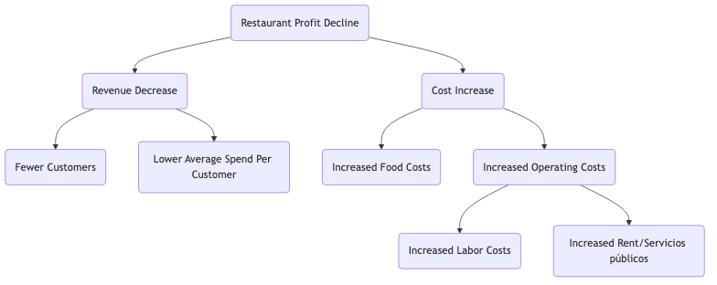

# Tutorial de Análisis con Árbol Lógico

## 1. ¿Qué es un Árbol Lógico?

**Árbol Lógico** es una herramienta analítica visual poderosa que se utiliza para descomponer sistemáticamente un problema complejo o cuestión difícil en partes más pequeñas y manejables. Su principio fundamental es **MECE (Mutuamente Excluyente, Colectivamente Exhaustivo)**, lo que significa que las partes desglosadas no se solapan y no se omiten aspectos importantes.

Un árbol lógico nos ayuda a construir un marco claro para el pensamiento, asegurando la rigurosidad y la amplitud del análisis.

## 2. Tipos Principales de Árboles Lógicos

Los árboles lógicos se dividen principalmente en dos tipos, utilizados para resolver problemas de diferente naturaleza:

### a. Árbol del Problema (Árbol Diagnóstico)

-   **Propósito**: Se usa para diagnosticar y explorar el "**por qué**" ocurre un problema.

-   **Estructura**: Comienza desde un problema central (la raíz) y se desglosa continuamente para encontrar causas potenciales que lleven al problema. Cada capa de ramas es una explicación más profunda del problema de la capa anterior.

-   **Escenarios Aplicables**: Análisis de causa raíz, diagnóstico de caída de rendimiento, solución de problemas, etc.

### b. Árbol del "Cómo" (Árbol de Soluciones)

-   **Propósito**: Se usa para conceptualizar y planificar el "**cómo**" alcanzar una meta o resolver un problema.
-   **Estructura**: Comienza desde una meta general (la raíz) y se desglosa en estrategias específicas y realizables o planes de acción.
-   **Escenarios Aplicables**: Planificación estratégica, establecimiento de metas, planificación de proyectos, búsqueda de soluciones, etc.

## 3. ¿Cómo Construir un Árbol Lógico?

### Paso Uno: Definir Claramente el Problema Central o la Meta

-   **Árbol del Problema**: Enunciar claramente el "problema" a analizar. Por ejemplo: "¿Por qué está aumentando la tasa de abandono de usuarios en nuestro sitio web?"
-   **Árbol del "Cómo"**: Definir claramente la "meta" a alcanzar. Por ejemplo: "¿Cómo podemos aumentar en un 20% los usuarios activos mensuales del sitio web?"
-   Usa este problema o meta como punto de partida (raíz) del árbol lógico.

### Paso Dos: Realizar el Primer Nivel de Desglose (Aplicar el Principio MECE)

-   **Lluvia de ideas**: Alrededor del problema/meta central, piensa en qué componentes principales puede desglosarse.
-   **Aplicar el Principio MECE**: Asegúrate de que las ramas del primer nivel sean mutuamente excluyentes (sin solapamientos) y colectivamente exhaustivas (sin omitir aspectos importantes).
    -   **Ejemplo (Árbol del Problema)**: El aumento de la tasa de abandono de usuarios puede desglosarse en: "Abandono de nuevos usuarios" y "Abandono de usuarios existentes".
    -   **Ejemplo (Árbol del "Cómo")**: El aumento de usuarios activos mensuales puede desglosarse en: "Atraer nuevos usuarios", "Incrementar la actividad de usuarios existentes" y "Recuperar usuarios que abandonaron".

### Paso Tres: Desglosar Capa por Capa

-   **Seguir formulando preguntas**: Para cada rama, sigue preguntando "¿Por qué está ocurriendo esto?" (Árbol del Problema) o "¿Cómo exactamente puede hacerse esto?" (Árbol del "Cómo"), para realizar desgloses más profundos.
-   **Mantener una estructura clara**: Continúa aplicando el principio MECE en cada nivel hasta que el problema se haya desglosado hasta un nivel suficientemente específico que pueda verificarse con datos o actuarse directamente.

### Paso Cuatro: Validar Hipótesis y Priorizar

-   **Validación con Datos**: En los árboles de problema, recopila datos para verificar qué ramas son las causas reales.
-   **Evaluar Soluciones**: En los árboles del "cómo", evalúa la viabilidad, costo y efecto esperado de cada plan de acción.
-   **Determinar la Ruta Crítica**: Identifica las causas clave o acciones clave que tienen mayor impacto en resolver el problema o alcanzar la meta, y priorízalas.

## 4. Casos Prácticos

### Caso 1: Árbol del Problema - Analizando "¿Por qué está disminuyendo la rentabilidad del restaurante?"

**Análisis**: A través de este diagrama de árbol, los gerentes pueden ver claramente los factores principales que provocan la caída de rentabilidad y pueden recopilar datos para cada rama (por ejemplo, "Menos Clientes") para un análisis más profundo.

### Caso 2: Árbol del "Cómo" - Planificando "¿Cómo mejorar la eficiencia personal en el trabajo?"

**Análisis**: Este diagrama de árbol desglosa una meta abstracta en una serie de pasos específicos y realizables, ayudando a las personas a crear planes claros de mejora.

Los árboles lógicos son una de las habilidades esenciales para consultores, gerentes de producto y planificadores estratégicos, ya que pueden mejorar significativamente la profundidad y amplitud del pensamiento.