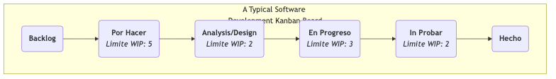

# Kanban

Al buscar flujos de trabajo eficientes y fluidos, a menudo nos encontramos con problemas tales como: acumulación de tareas, falta de claridad sobre en qué están ocupados los demás, cuellos de botella desconocidos e imposibilidad de predecir con precisión los tiempos de finalización. **Kanban**, término derivado de la palabra japonesa para "pizarra de señal", es un poderoso y **intuitivo método de gestión visual de flujos de trabajo** diseñado para resolver estos problemas. No es un marco rígido como Scrum que prescribe roles y eventos, sino una práctica ágil más flexible y una mentalidad enfocada en **optimizar la eficiencia del flujo de valor**.

El núcleo del método Kanban consiste en hacer claros y completamente transparentes los flujos de trabajo y las tareas previamente invisibles mediante un **Tablero Kanban**. Luego, al **limitar el Trabajo en Progreso (WIP)** y establecer un sistema de **"pull" (extracción) claro**, identifica y elimina sistemáticamente los cuellos de botella del proceso, permitiendo que el valor fluya más rápido, más suave y de manera más predecible desde "por hacer" hasta "hecho". Su objetivo es crear un ritmo de trabajo estable y sostenible, evitando que los equipos caigan en el caos y la ineficiencia debido a la sobrecarga de tareas.

## Las Seis Prácticas Fundamentales del Método Kanban

El éxito de Kanban depende de la aplicación continua de las siguientes seis prácticas fundamentales.

1.  **Visualizar el flujo de trabajo**: Este es el punto de partida de Kanban. Debes trabajar junto con tu equipo para mapear todos los pasos del trabajo desde el inicio hasta la finalización (por ejemplo, "Por hacer", "Diseño", "Desarrollo", "Pruebas", "Hecho") en una pizarra o tablero Kanban electrónico, y representar cada elemento de trabajo (por ejemplo, una historia de usuario, un error) como una tarjeta en el tablero.

2.  **Limitar el Trabajo en Progreso (WIP)**: Esta es el alma de Kanban. Para cada paso o algunos pasos del proceso, establece un límite **superior claro** sobre la cantidad de tareas que pueden estar en progreso simultáneamente. Por ejemplo, especifica que la columna "Desarrollo" puede tener como máximo 3 tarjetas. Cuando esta columna está llena, nadie puede "extraer" nuevo trabajo del paso anterior hasta que se complete y se mueva un elemento de trabajo actual. Limitar el WIP fundamentalmente **evita la acumulación de tareas, expone cuellos de botella en el proceso y crea un entorno de trabajo enfocado**.

3.  **Gestionar el flujo**: El objetivo de Kanban es maximizar la velocidad y fluidez del flujo de valor. Necesitas monitorear continuamente el flujo de elementos de trabajo en el tablero, identificar dónde se atascan más tiempo (es decir, cuellos de botella), y luego concentrar los esfuerzos del equipo en resolver estos cuellos de botella para que todo el sistema fluya suavemente.

4.  **Hacer explícitas las políticas del proceso**: Haz claras y transparentes las reglas de trabajo del equipo. Por ejemplo, define claramente qué constituye "Hecho" (Definición de Hecho). ¿Cuáles son los límites de WIP para cada carril? ¿Cómo se determina la prioridad de las tareas? Reglas claras son la base para que el equipo trabaje de forma autónoma y coordinada.

5.  **Implementar bucles de retroalimentación**: Kanban fomenta establecer bucles de retroalimentación con distintos ritmos. Por ejemplo, reuniones diarias de pie (para sincronizar el trabajo diario), reuniones periódicas de revisión Kanban (para revisar y optimizar los procesos) y reuniones de revisión de entregas al cliente.

6.  **Mejorar colaborativamente, evolucionar experimentalmente**: Kanban es un método que fomenta "empezar desde donde estás ahora y evolucionar continuamente". No requiere que realices cambios organizacionales disruptivos. El equipo debe realizar continuamente y de forma colaborativa pequeñas mejoras experimentales en su flujo de trabajo basadas en datos y comprensión compartida.

### Ejemplo de estructura de un tablero Kanban

<!--

<!--

*   **Flujo de trabajo**: Una tarjeta (que representa una tarea) se mueve de izquierda a derecha, pasando por cada etapa. Un miembro del equipo solo puede "extraer" una nueva tarjeta del carril izquierdo cuando hay espacio en el carril derecho (es decir, no se ha alcanzado el límite WIP de esa columna).

## Cómo Implementar el Método Kanban

1.  **Paso Uno: Visualiza Tu Flujo de Trabajo Actual**
    No intentes diseñar un proceso "perfecto". Comienza con la forma en que tú y tu equipo **actualmente** trabajáis. Dibuja tus pasos reales de trabajo en una pizarra y coloca en ella como tarjetas todas las tareas en curso. El objetivo de este paso es hacer transparente el estado actual.

2.  **Paso Dos: Establece Límites Iniciales de WIP**
    Trabaja con tu equipo para establecer un límite inicial de WIP para los pasos clave del proceso (generalmente aquellos propensos a cuellos de botella, como "En Progreso", "En Pruebas"). Un buen punto de partida puede ser "la mitad del número de miembros del equipo" o "ligeramente inferior al número actual de tareas en progreso". Los límites de WIP no son estáticos y pueden ajustarse más tarde según las condiciones reales.

3.  **Paso Tres: Comienza a "Extraer" Trabajo**
    Establece una regla sencilla: cuando un miembro del equipo termina su trabajo actual, debe mirar la columna más a la derecha del tablero y ofrecer ayuda donde sea necesario. Si no hay nada que hacer, puede "extraer" una nueva tarea de la columna más a la izquierda que permita hacerlo, que tenga la mayor prioridad.

4.  **Paso Cuatro: Establece Reuniones Diarias de Pie y Reuniones de Revisión**
    *   Celebra una breve reunión diaria de pie frente al tablero Kanban. El enfoque de la reunión no es lo que cada uno hizo, sino el **flujo de las tarjetas**: "¿Qué tarjetas se movieron ayer?", "¿Qué tarjetas están atascadas? ¿Cómo podemos ayudar a que fluyan?"
    *   Celebra reuniones periódicas (por ejemplo, quincenales) de revisión para analizar datos del tablero Kanban (por ejemplo, "tiempo promedio de ciclo") y discutir cómo mejorar los procesos y los límites de WIP.

## Casos de Aplicación

**Caso 1: Equipo de Operaciones de TI**

*   **Problema**: El equipo de operaciones está abrumado diariamente por diversas solicitudes urgentes provenientes de diferentes canales, lo que lleva a un trabajo caótico y retrasos en las respuestas.
*   **Aplicación de Kanban**: Establecieron un tablero Kanban sencillo con carriles como "Por Hacer", "En Progreso", "Esperando Retroalimentación Externa" y "Resuelto". Al limitar el WIP en el carril "En Progreso" al número de miembros del equipo, aseguraron que el equipo pudiera concentrarse en resolver rápidamente los problemas actuales en lugar de comenzar muchas tareas simultáneamente. Kanban también hizo transparentes todas las solicitudes, permitiendo a los gerentes comprender la carga real de trabajo del equipo.

**Caso 2: Gestión de Tareas Personales (Kanban Personal)**

*   **Problema**: Una persona está trabajando simultáneamente en múltiples proyectos, sintiéndose abrumada y con recursos limitados.
*   **Aplicación de Kanban**: Puede usar Trello o un cuaderno sencillo para crear un tablero Kanban personal con listas como "Metas de Esta Semana", "Tareas de Hoy", "En Curso (Límite WIP: 1)" y "Hecho". Al adherirse estrictamente a un límite WIP de 1 para "En Curso", se obliga a sí mismo a concentrarse en una sola tarea importante a la vez, mejorando considerablemente la concentración y la calidad de la finalización.

**Caso 3: Equipo de Creación de Contenido (por ejemplo, una editorial de revistas)**

*   **Proceso**: "Banco de Ideas" -> "Escritura" -> "Edición" -> "Diseño/Tipografía" -> "Publicado".
*   **Aplicación de Kanban**: Al establecer límites de WIP para cada etapa, pueden asegurar que los editores no sigan encargando artículos cuando hay un gran volumen de manuscritos pendientes. Esto hace que todo el proceso de producción de contenido sea más fluido y claramente expone los cuellos de botella (por ejemplo, si la columna "Edición" siempre está llena de manuscritos, indica que hay insuficientes recursos de edición).

## Ventajas y Desafíos del Método Kanban

**Ventajas Fundamentales**

*   **Flexibilidad y Adaptabilidad**: No requiere cambios disruptivos en los procesos y roles existentes; puedes "empezar desde donde estás ahora" y evolucionar gradualmente.
*   **Mejora de la Eficiencia y la Previsibilidad**: Al gestionar el flujo y limitar el WIP, reduce significativamente los tiempos de ciclo y hace más predecibles los tiempos de entrega.
*   **Reducción de la Presión del Equipo**: Los límites de WIP evitan que los equipos sufran una presión inmensa debido a la multitarea y al compromiso excesivo, creando un ritmo de trabajo sostenible.
*   **Exposición de Problemas Sistémicos**: Puede exponer intuitiva e indiscutiblemente los cuellos de botella y obstáculos en el proceso.

**Desafíos Potenciales**

*   **Facilidad de volverse "Formalista"**: Si el equipo solo implementa la "visualización" sin aplicar estrictamente la "limitación del WIP" y la "gestión del flujo", Kanban se convierte solo en un "tablero de tareas" bonito sin ejercer su verdadero poder.
*   **Requiere Autodisciplina del Equipo**: El sistema de extracción ("pull") y los límites de WIP requieren un alto grado de autodisciplina y espíritu colaborativo por parte de los miembros del equipo.
*   **Malentendido del "Sin Caja de Tiempo"**: Aunque Kanban en sí no tiene sprints fijos como Scrum, esto no significa que no haya planificación ni ritmo. Los equipos Kanban también necesitan priorizar, prever tiempos de entrega y realizar revisiones periódicas.

## Extensiones y Conexiones

*   **Scrum**: Kanban y Scrum son los dos métodos más predominantes en el mundo ágil. Scrum se basa en un ritmo iterativo de "caja de tiempo", mientras que Kanban se basa en un ritmo de "flujo continuo". Ambos tienen sus ventajas y desventajas y son adecuados para diferentes escenarios. **Scrumban** es un método híbrido que combina las ventajas de ambos.
*   **Pensamiento Lean**: El método Kanban es la aplicación más central y directa del pensamiento Lean en el trabajo de conocimiento. Encarna perfectamente principios Lean fundamentales como la "visualización", el "sistema de extracción", la "eliminación de desperdicios" y la "mejora continua".
*   **Teoría de las Restricciones (TOC)**: Al exponer cuellos de botella, el método Kanban se alinea altamente con la idea de TOC de "identificar y optimizar restricciones".

---
*Referencia: La aplicación del método Kanban en el desarrollo de software fue practicada y resumida por primera vez por David J. Anderson en su trabajo en Microsoft y Corbis. Su libro "Kanban: Successful Evolutionary Change for Your Technology Business" es una obra fundamental para este método. Las ideas de Kanban están profundamente arraigadas en el Sistema de Producción Toyota (TPS) y la Manufactura Lean.*