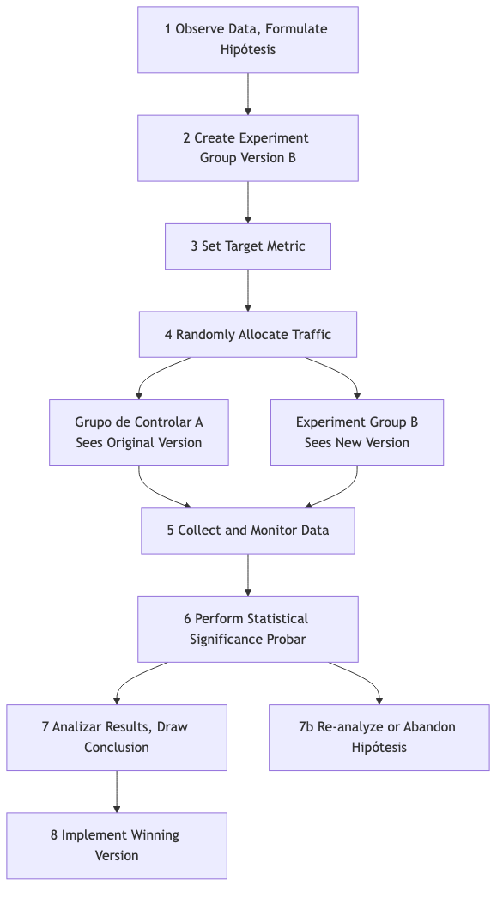

# Prueba A/B

En el diseño de productos y el marketing, a menudo nos enfrentamos a decisiones aparentemente subjetivas: ¿Un botón rojo es más atractivo o uno verde? ¿El texto "Comprar ahora" tiene mejor conversión que "Añadir al carrito"? En lugar de depender de la intuición o de debates interminables en salas de reuniones, es mejor dejar que los usuarios reales nos den la respuesta con sus datos. La **prueba A/B**, también conocida como **prueba dividida**, es un método riguroso, potente y basado en datos de **experimentación controlada en línea**. Su núcleo consiste en **dividir aleatoriamente** el tráfico de usuarios en dos o más grupos y mostrarles diferentes versiones de la misma página (Versión A y Versión B) para comparar y determinar cuál de ellas funciona mejor en el logro de objetivos específicos (como tasa de clics, tasa de conversión).

La esencia de la prueba A/B es aplicar la lógica de los experimentos científicos a las decisiones sobre productos y marketing. Introduce el elemento clave de la "**aleatoriedad**" para eliminar todos los demás factores potencialmente confusos (como la procedencia del usuario, el momento de acceso, etc.), asegurando así que las diferencias observadas en los efectos puedan atribuirse con alta confianza al único cambio que realizamos. Transforma suposiciones subjetivas como "creo que este diseño es mejor" en conclusiones objetivas como "los datos muestran que la Versión B tiene una tasa de conversión un 15% más alta que la Versión A, y es estadísticamente significativa", convirtiéndola en una herramienta fundamental e insustituible en la cultura moderna de crecimiento basado en datos.

## Componentes Clave de la Prueba A/B

Una prueba A/B estándar consta de las siguientes partes clave:

*   **Hipótesis**: Antes de comenzar la prueba, necesitas una hipótesis clara y comprobable. Por ejemplo, "creo que cambiar el botón de registro de azul a naranja (cambio) puede aumentar la tasa de conversión de registro de nuevos usuarios (resultado esperado) porque el naranja destaca más en la página (razón)."
*   **Grupo de Control (Versión A)**: La versión original que actualmente está activa en línea, sin cambios realizados. Sirve como línea de base para todas las comparaciones.
*   **Grupo de Variación (Versión B)**: La nueva versión en la que has aplicado un único cambio, con la esperanza de que conduzca a mejores resultados.
*   **Principio de Variable Única**: Una prueba A/B estándar solo debe probar una variable. Si cambias simultáneamente el color y el texto del botón, incluso si la Versión B gana, no podrás determinar cuál de los cambios fue decisivo.
*   **Asignación Aleatoria del Tráfico**: El tráfico de usuarios debe distribuirse aleatoria y equitativamente entre la Versión A y la Versión B. Este es el requisito científico para garantizar resultados de prueba imparciales y creíbles.
*   **Métrica Objetivo**: Necesitas una métrica clara y cuantificable para medir el éxito de la prueba. Esta métrica debe estar directamente relacionada con tu hipótesis, como "tasa de clics", "tasa de conversión", "tiempo promedio en la página", etc.

### Flujo de Trabajo de la Prueba A/B

## Cómo Realizar una Prueba A/B

1.  **Paso 1: Investigación e Hipótesis**
    Basado en el análisis de datos (por ejemplo, mapas de calor del comportamiento del usuario), comentarios de los usuarios o evaluación heurística, identifica áreas en el producto actual o en el proceso que puedan tener problemas, y propón una hipótesis específica y comprobable de mejora.

2.  **Paso 2: Crear Variaciones**
    Basado en tu hipótesis, diseña y desarrolla el grupo de experimento (Versión B). Asegúrate de que la única diferencia entre la Versión B y la Versión A sea la variable que deseas probar.

3.  **Paso 3: Determinar Objetivos y Tamaño de Muestra**
    *   Define claramente la métrica principal que utilizarás para medir el éxito.
    *   Antes de comenzar la prueba, necesitas usar un **calculador de tamaño de muestra** para estimar cuántos usuarios deben participar en la prueba para que tus resultados tengan suficiente **potencia estadística**. Una muestra demasiado pequeña puede impedirte detectar una diferencia que realmente existe.

4.  **Paso 4: Implementar la Prueba**
    Usa herramientas profesionales de prueba A/B (por ejemplo, Google Optimize, Optimizely, etc.) para configurar tu prueba. Establece la proporción de asignación del tráfico (generalmente 50/50) y lanza la prueba.

5.  **Paso 5: Monitorear y Analizar Resultados**
    Deja que la prueba se ejecute durante el tiempo suficiente hasta alcanzar el tamaño de muestra preestablecido o el nivel de significación estadística. Luego, analiza los resultados de la prueba. Debes prestar atención a dos conceptos estadísticos clave:
    *   **Diferencia en la Tasa de Conversión**: Mejora porcentual de la Versión B respecto a la Versión A.
    *   **Significación Estadística**: Generalmente representada por el **valor p**. El valor p representa la "probabilidad de que la diferencia observada se deba únicamente al azar". Normalmente, cuando el valor p es menor que 0.05 (es decir, nivel de confianza del 95%), consideramos que el resultado es estadísticamente significativo y confiable.

6.  **Paso 6: Sacar Conclusiones y Actuar**
    *   Si la Versión B gana claramente, entonces felicitaciones, tu hipótesis ha sido validada. El siguiente paso es desplegar completamente la Versión B a todos los usuarios.
    *   Si la Versión A gana, o no hay diferencia significativa entre ambas, también es una experiencia de aprendizaje valiosa. Esto indica que tu hipótesis inicial era incorrecta, y necesitas volver a analizar y proponer nuevas hipótesis para la próxima ronda de pruebas.

## Casos de Aplicación

**Caso 1: Optimización de la Página de Recaudación del Equipo de Campaña de Obama**

*   **Contexto**: En la elección presidencial de EE.UU. de 2008, el equipo de campaña de Obama quería optimizar la página de donaciones de su sitio web oficial para mejorar las tasas de registro y donación.
*   **Aplicación de la Prueba A/B**: Realizaron extensas pruebas A/B (estrictamente hablando, pruebas multivariantes) sobre la imagen principal de la página y el texto del botón. En una prueba famosa, descubrieron que cambiar la imagen principal de una foto individual de Obama a una foto familiar de Obama, y cambiar el texto del botón de "Inscribirse" a "Obtener más información", aumentó asombrosamente la tasa de conversión de registro de la página en un **40.6%**. Esta prueba generó decenas de millones de dólares adicionales en donaciones para el equipo de campaña.

**Caso 2: Cultura de Pruebas Continuas de Booking.com**

*   **Contexto**: Booking.com, la plataforma más grande del mundo para reservas de hoteles en línea, es famosa por su cultura extrema de pruebas A/B.
*   **Aplicación**: Se informa que, en cualquier momento dado, el sitio web de Booking.com ejecuta miles de pruebas A/B simultáneamente. Desde el método de ordenamiento de los resultados de búsqueda, hasta el tamaño de las imágenes de los hoteles, hasta frases como "Solo quedan X habitaciones", cada pequeño fragmento de texto debe someterse a rigurosas pruebas A/B. Es esta búsqueda extrema por la toma de decisiones basada en datos lo que les permite optimizar continuamente y de forma incremental la experiencia del usuario, y finalmente construir una barrera competitiva sólida.

**Caso 3: Prueba de Pared de Pago de un Sitio Web de Noticias**

*   **Contexto**: Un sitio web de noticias quería experimentar con un modelo de suscripción de pago, pero no estaba seguro de qué estrategia de pared de pago sería más beneficiosa para la conversión y retención de usuarios.
*   **Aplicación de la Prueba A/B**:
    *   **Versión A (Medido)**: Permite que todos los usuarios lean 5 artículos gratis cada mes, y luego solicita el pago tras superar ese límite.
    *   **Versión B (Freemium)**: Algunos artículos son gratuitos, pero "contenido premium" como informes en profundidad y comentarios exclusivos requieren una suscripción de pago para leerlos.
    *   Mediante una prueba prolongada durante varios meses, pueden comparar las tasas de conversión de pago, las tasas de abandono de usuarios y los ingresos totales por suscripción de ambos modelos, y así elegir el modelo de negocio más adecuado para ellos.

## Ventajas y Desafíos de la Prueba A/B

**Ventajas Clave**

*   **Objetiva y Basada en Datos**: Utiliza datos reales del comportamiento de los usuarios para reemplazar suposiciones y debates subjetivos, proporcionando la evidencia más sólida para la toma de decisiones.
*   **Innovación de Bajo Riesgo**: Te permite probar el efecto de un cambio con una pequeña porción del tráfico antes de implementarlo completamente, reduciendo considerablemente el riesgo de impactos negativos por decisiones erróneas.
*   **Motor de Optimización Continua**: Proporciona un marco cíclico científico y riguroso para la optimización continua e iterativa de productos y marketing.

**Desafíos Potenciales**

*   **Requiere Tráfico Suficiente**: Para sitios web o aplicaciones con poco tráfico, puede llevar mucho tiempo, o incluso ser imposible, alcanzar una significación estadística.
*   **Limitación de Variable Única**: A veces, una combinación de múltiples cambios puede producir efectos sinérgicos inesperados, que no pueden descubrirse en pruebas A/B estándar (requiere pruebas multivariantes más complejas).
*   **Trampa del "Óptimo Local"**: Realizar continuamente pequeñas pruebas A/B en páginas existentes puede llevarte a caer en la trampa del "óptimo local", ignorando oportunidades más grandes para rediseños disruptivos y revolucionarios.
*   **Ignora el Impacto a Largo Plazo**: Las pruebas A/B generalmente miden efectos a corto plazo (por ejemplo, tasa de clics). Algunos cambios pueden mejorar las métricas a corto plazo, pero pueden dañar la confianza del usuario o la imagen de marca a largo plazo.

## Extensiones y Conexiones

*   **Prueba Multivariante (MVT)**: Una extensión de la prueba A/B. Cuando deseas probar **múltiples** combinaciones de **múltiples** elementos en una página simultáneamente (por ejemplo, probar 3 tipos de titulares, 2 tipos de imágenes y 2 tipos de colores de botón), puedes usar MVT. Puede indicarte qué combinación de elementos funciona mejor, y la contribución relativa de cada elemento al resultado final.
*   **Prueba de Usabilidad**: Un método de investigación cualitativa. No puede indicarte "qué versión es mejor", pero sí puede indicarte "**por qué**" los usuarios tuvieron dificultades con una determinada versión. Normalmente, la prueba de usabilidad puede realizarse antes de la prueba A/B para obtener inspiración sobre "qué probar".

---
*Fuente de Referencia: El concepto de prueba A/B se basa en el diseño clásico de experimentos estadísticos. En el ámbito de internet, fue aplicado por primera vez ampliamente por grandes empresas tecnológicas como Google y Amazon en la optimización de sitios web y productos, y gradualmente se convirtió en una habilidad clave en marketing digital y growth hacking.*