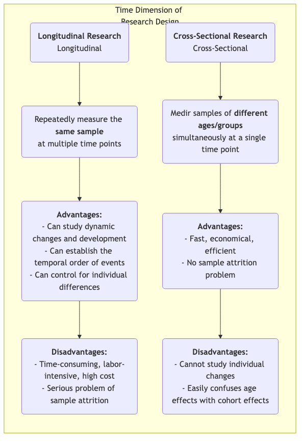

# Investigación Longitudinal

Al explorar la larga trama del desarrollo humano, el cambio social y la evolución de enfermedades, necesitamos un método de investigación capaz de capturar la dimensión crucial del "tiempo". La **investigación longitudinal** es precisamente esta "cámara", observando y midiendo repetida y continuamente la **misma muestra** durante un período prolongado. Su objetivo fundamental es revelar cómo los fenómenos **cambian, se desarrollan y evolucionan** con el tiempo, e investigar el impacto a largo plazo de eventos tempranos sobre resultados posteriores.

A diferencia de los estudios transversales, que ofrecen solo una "instantánea" en un único momento, la investigación longitudinal nos proporciona un "documental". Permite observar la trayectoria del crecimiento individual, el proceso de cambios conceptuales y todo el curso de una enfermedad desde su inicio hasta su pleno desarrollo. Esto nos permite establecer con mayor claridad la secuencia temporal de los eventos al explorar relaciones causales. Cuando deseas responder preguntas dinámicas sobre procesos y desarrollo, como "¿Cómo afectan los hábitos de lectura en la infancia a los niveles de ingreso en la edad adulta?" o "¿Qué impacto sostenido ha tenido una reforma política durante la próxima década?", la investigación longitudinal se convierte en una herramienta poderosa e indispensable.

## Características Principales y Tipos de Investigación Longitudinal

La característica común de todos los estudios longitudinales es que siguen la dimensión del "tiempo", pero pueden dividirse principalmente en tres tipos según la naturaleza de lo que se está rastreando:

*   **Estudio de Cohorte**: Es el tipo más común. Los investigadores seleccionan un grupo específico de personas (una "cohorte") que comparten una característica o experiencia común (por ejemplo, "todos los bebés nacidos en el año 2000" o "empleados que ingresaron a cierta empresa en 2010") y siguen continuamente a esta cohorte durante varias décadas.
*   **Estudio de Panel**: Similar al estudio de cohorte, pero sigue exactamente la misma muestra de **individuos**. Cada encuesta visita al mismo grupo de personas, lo que permite a los investigadores analizar con precisión la trayectoria de cambio de cada individuo.
*   **Estudio de Tendencia**: Este tipo de investigación se centra en los cambios en las características de una "población" con el tiempo, pero las muestras individuales seleccionadas para cada encuesta son diferentes. Por ejemplo, para estudiar los cambios en las actitudes públicas hacia los asuntos ambientales, una institución de investigación podría seleccionar aleatoriamente una nueva muestra de personas a nivel nacional cada cinco años para realizar una encuesta.

### Comparación entre Investigación Longitudinal y Transversal

## Cómo Realizar un Estudio Longitudinal

1.  **Establecer Objetivos de Investigación a Largo Plazo**
    Define claramente qué cambios o desarrollos deseas rastrear y qué factores potencialmente influyentes te interesan. La investigación longitudinal es una inversión a largo plazo y debe estar respaldada por objetivos claros y significativos.

2.  **Definir y Seleccionar tu Muestra de Cohorte o Panel**
    Define con precisión tu población de estudio y utiliza métodos adecuados de muestreo para seleccionar la muestra inicial. La calidad y representatividad de la muestra inicial son cruciales.

3.  **Realizar una Encuesta Inicial (Baseline)**
    Al inicio del estudio, realiza la primera recopilación integral de datos (encuesta basal) para medir el estado inicial de todas las variables de interés.

4.  **Diseñar y Ejecutar Encuestas de Seguimiento Subsiguientes**
    Determina los intervalos de tiempo para las encuestas posteriores de seguimiento (por ejemplo, anualmente, cada cinco años) y diseña herramientas de medición consistentes. Mantener el contacto con la muestra y reducir las tasas de pérdida son algunos de los mayores desafíos durante un período prolongado de investigación.

5.  **Gestión y Análisis de Datos**
    Las estructuras de datos longitudinales son complejas y requieren bases de datos profesionales para su gestión. En el análisis, los investigadores utilizan modelos estadísticos avanzados (como modelos de curva de crecimiento, análisis de supervivencia) para analizar las trayectorias de cambio de las variables a lo largo del tiempo y sus factores influyentes.

## Casos Clásicos de Aplicación

**Caso 1: El Estudio de Desarrollo Adulto de Harvard**

*   **Contexto**: Uno de los estudios longitudinales más largos en la historia, comenzó en 1938 y siguió a 724 hombres durante casi 80 años.
*   **Aplicación**: Los investigadores recopilaron regularmente datos sobre su trabajo, familia, salud y otros aspectos mediante cuestionarios, entrevistas, registros médicos, etc. La conclusión más famosa de este estudio es que las buenas y cálidas relaciones interpersonales son el factor más importante para predecir la felicidad y la salud a largo plazo, incluso más que la riqueza, la fama y los genes. Esta conclusión solo pudo obtenerse mediante un seguimiento vitalicio.

**Caso 2: Estudio de Cohorte del Milenio del Reino Unido**

*   **Contexto**: Un estudio nacional de cohorte de nacimientos que sigue a aproximadamente 19,000 niños británicos nacidos entre 2000 y 2002.
*   **Aplicación**: El estudio realizó recopilaciones integrales de datos a múltiples edades (por ejemplo, 9 meses, 3, 5, 7, 11, 14, 17 años), cubriendo todos los aspectos desde la salud, cognición y comportamiento hasta el entorno familiar. Este estudio proporcionó evidencia masiva y extremadamente valiosa para que el gobierno formulase políticas sobre niños y familias; por ejemplo, reveló el impacto negativo a largo plazo de la pobreza en el desarrollo temprano de la infancia.

**Caso 3: Análisis de Cohorte de Pérdida de Usuarios del Producto**

*   **Contexto**: Una empresa SaaS (Software como Servicio) quiere entender la retención de nuevos usuarios.
*   **Aplicación**: Adoptaron el método de **análisis de cohorte**. Trataron a "los nuevos usuarios registrados cada mes" como una cohorte (por ejemplo, "cohorte de enero", "cohorte de febrero"). Luego, rastrearon la tasa de retención de cada cohorte en el primer mes, segundo mes, tercer mes... después del registro. Al comparar las curvas de retención de diferentes cohortes, pudieron evaluar si las mejoras del producto y las actividades de marketing tuvieron un impacto positivo en la retención a largo plazo de nuevos usuarios.

## Ventajas y Desafíos de la Investigación Longitudinal

**Ventajas Principales**

*   **Capacidad para Estudiar Procesos Dinámicos**: Es el método más efectivo para estudiar directamente el "desarrollo" y el "cambio".
*   **Establecer el Orden Temporal**: Puede determinar claramente la secuencia temporal de los eventos, un prerequisito importante para inferir causalidad (aunque aún hay que estar atentos a las variables de confusión).
*   **Controlar Diferencias Individuales**: Dado que se siguen a los mismos individuos, se pueden excluir del análisis diferencias individuales inherentes que no cambian con el tiempo (por ejemplo, coeficiente intelectual, personalidad).

**Desafíos Potenciales**

*   **Alto Costo**: Requiere apoyo financiero prolongado, un equipo de investigación estable y costos de gestión elevados.
*   **Inversión de Tiempo**: El ciclo de obtención de resultados es muy largo, posiblemente años o incluso décadas.
*   **Pérdida de Muestra**: Es el mayor "enemigo" de la investigación longitudinal. Con el tiempo, algunos participantes pueden abandonar el estudio debido a mudanzas, pérdida de contacto, fallecimiento o pérdida de interés, lo que puede generar sesgo en la muestra final.
*   **Efecto de las Mediciones Repetidas**: Someter repetidamente a los mismos tests o cuestionarios puede afectar el comportamiento o las respuestas de los participantes, conocido como el "efecto práctica".

## Extensiones y Conexiones

*   **Investigación Transversal**: Suele servir como alternativa económica y rápida a la investigación longitudinal. Sin embargo, es importante tener en cuenta su incapacidad para distinguir entre efectos de edad y efectos de cohorte.
*   **Análisis de Supervivencia**: Un método estadístico comúnmente utilizado en investigación longitudinal, específicamente para analizar la duración hasta que ocurre un evento (por ejemplo, recuperación, pérdida, fallecimiento) y sus factores influyentes.

---
*Referencia: El concepto de diseño de investigación longitudinal tiene una larga historia en epidemiología y ciencias sociales. La teoría del curso vital de Glen H. Elder Jr. proporciona un marco teórico importante para la investigación longitudinal moderna.*