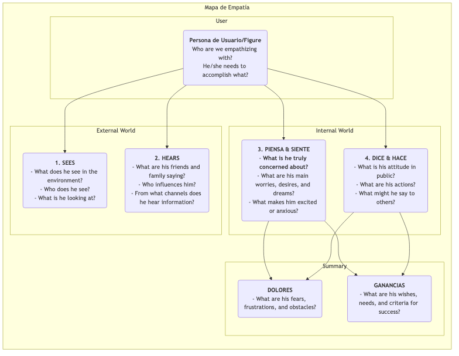

# Mapa de Empatía

En el diseño de productos y la investigación de usuarios, la "empatía" es una cualidad fundamental que se menciona con frecuencia, pero que es extremadamente difícil de lograr realmente. ¿Cómo podemos verdaderamente "caminar en los zapatos del usuario" y experimentar su mundo de primera mano? El **Mapa de Empatía** es una herramienta colaborativa de empatía simple, intuitiva, pero extremadamente poderosa diseñada específicamente para este propósito. Su objetivo es ayudar a los equipos a ir más allá de la superficie del comportamiento del usuario y explorar su mundo más profundo de **sentidos, pensamientos y emociones**, formando así una comprensión más completa y multidimensional del usuario.

El núcleo del Mapa de Empatía radica en organizar sistemáticamente todas las observaciones dispersas y cualitativas, así como los datos de entrevistas sobre los usuarios, en un marco visual. Este marco generalmente se divide en cuatro cuadrantes principales: **Ve, Escucha, Piensa y Siente, y Dice y Hace**. Al completar conjuntamente este mapa, los miembros del equipo se ven obligados a adoptar la perspectiva del usuario, construyendo colectivamente una comprensión compartida de su mundo interior y entorno externo. Es como un espejo que refleja claramente la situación real del usuario y un catalizador para cultivar una empatía colectiva del equipo.

## Componentes del Mapa de Empatía

Un Mapa de Empatía clásico está centrado en el usuario y se organiza en torno a cuatro cuadrantes fundamentales de la experiencia externa e interna.

<!--

*   **Ve**: Describe lo que el usuario ve con sus ojos en su entorno. Por ejemplo, ¿qué hacen las personas que lo rodean? ¿Qué información del mercado encuentra diariamente?
*   **Escucha**: Describe la información que el usuario recibe del mundo exterior. ¿Qué dicen sus amigos, familiares y colegas? ¿Qué líderes de opinión o canales de medios lo influyen?
*   **Piensa & Siente**: Este es el núcleo del mapa, que intenta explorar el mundo interior del usuario. ¿Qué es realmente importante para él (aunque nunca lo diga en voz alta)? ¿Qué preocupaciones, ansiedades, esperanzas y sueños tiene?
*   **Dice & Hace**: Describe las palabras y acciones del usuario en público. ¿Qué nos dijo en una entrevista? ¿Cuáles son sus comportamientos reales al usar el producto? Aquí, se debe prestar especial atención a posibles contradicciones entre lo que "dice" y lo que "piensa".
*   **Dolor** y **Beneficios**: Tras analizar los cuatro cuadrantes anteriores, se resume el sufrimiento y los deseos internos del usuario. El "Dolor" representa los obstáculos y emociones negativas que enfrenta, mientras que los "Beneficios" representan los objetivos y deseos que realmente quiere alcanzar.

## Cómo Usar un Mapa de Empatía

Un Mapa de Empatía se utiliza mejor en un formato de taller grupal.

1.  **Paso 1: Definir el Alcance y los Objetivos**
    *   **Elegir al Usuario**: Define claramente para qué persona o figura específica está hecho este Mapa de Empatía. Lo ideal es darle un nombre y un trasfondo básico.
    *   **Aclarar los Objetivos**: Define los objetivos que esperas alcanzar con este ejercicio. ¿Es para comprender mejor a los usuarios existentes, o para explorar posibles usuarios para un nuevo producto?

2.  **Paso 2: Recopilar Materiales de Investigación**
    Un Mapa de Empatía debe basarse en investigaciones reales, no en ficción. Prepara todos los materiales relevantes de investigación de usuarios, como: grabaciones y transcripciones de entrevistas a usuarios, videos de pruebas de usabilidad, respuestas abiertas de encuestas, fotos de usuarios, etc.

3.  **Paso 3: Llenar el Mapa de Forma Colaborativa**
    *   Dibuja una plantilla grande del Mapa de Empatía en una pizarra, o usa una herramienta de colaboración en línea.
    *   Los miembros del equipo escriben conjuntamente hallazgos de los materiales de investigación en notas adhesivas, una por una, y las colocan en los cuadrantes correspondientes del mapa. Por ejemplo, al escuchar una grabación de entrevista, un miembro podría escribir "El usuario dice que trabaja horas extras cada semana (Dice)", mientras que otro podría escribir "Siento que suena cansado y ha perdido la pasión por su trabajo (Siente)."
    *   Anima a los miembros del equipo a leer en voz alta el contenido de las notas adhesivas y explicar por qué las colocaron en ese cuadrante.

4.  **Paso 4: Profundizar y Sintetizar**
    Cuando toda la información esté en la pizarra, guía al equipo en una discusión más profunda.
    *   "¿Qué contradicciones vemos? Por ejemplo, ¿las palabras y acciones de los usuarios son inconsistentes?"
    *   "Detrás de todos estos detalles, ¿qué le preocupa realmente pero no ha expresado?"
    *   "¿Qué cosas inesperadas hemos aprendido?"
    *   Finalmente, resume colectivamente los **Dolores** y **Beneficios** más centrales del usuario.

5.  **Paso 5: Compartir y Aplicar**
    Organiza y comparte el Mapa de Empatía completado, y úsalo como insumo importante para el diseño y la toma de decisiones posteriores.

## Casos de Aplicación

**Caso 1: Diseñar un Smartphone para Adultos Mayores**

*   **Usuario**: El abuelo Wang, 70 años, acaba de recibir un smartphone de sus hijos.
*   **Ve**: Los iconos en la pantalla del teléfono son pequeños y numerosos, difíciles de ver; los jóvenes usan pagos móviles y mensajería.
*   **Escucha**: Sus hijos dicen: "Es muy sencillo, lo aprenderás rápido"; sus amigos mayores dicen: "Esa cosa es demasiado complicada, no puedo aprenderla".
*   **Piensa & Siente**: Se siente muy **frustrado**, teme quedarse atrás tecnológicamente; pero **ansía** aprender a hacer videollamadas con sus nietos por teléfono.
*   **Dice & Hace**: Dice: "No necesito esto", pero en secreto intenta desbloquear la pantalla una y otra vez.
*   **Dolor**: Miedo a equivocarse y causar pérdidas; sensación de ser abandonado por la tecnología.
*   **Beneficios**: Espera mantener un contacto más cercano con su familia; espera poder completar de forma independiente algunas tareas cotidianas (por ejemplo, consultar rutas de autobús).
*   **Inspiración de Diseño**: El principio fundamental de diseño para este teléfono no debería ser "funciones potentes", sino "sin frustraciones". Debe ofrecer funciones como "modo de letra extra grande", "asistencia remota familiar", entre otras.

**Caso 2: Diseñar una Aplicación de Búsqueda de Empleo para Estudiantes Universitarios**

*   **Usuario**: Li Xue, 22 años, estudiante universitario en su último año.
*   **Ve**: Los sitios web de búsqueda de empleo están llenos de información confusa y difícil de distinguir entre verdadera y falsa; sus compañeros ya han recibido múltiples ofertas.
*   **Escucha**: Sus seniors dicen: "El primer trabajo es muy importante"; sus padres dicen: "Lo más importante es encontrar un trabajo estable".
*   **Piensa & Siente**: Se siente muy **confundida y ansiosa** respecto al futuro; no está segura de qué tipo de trabajo le conviene; **teme** desempeñarse mal en las entrevistas.
*   **Dice & Hace**: Ha enviado cientos de currículums; ha revisado repetidamente su currículum.
*   **Dolor**: Falta de dirección en la búsqueda de empleo; asimetría informativa; falta de confianza.
*   **Beneficios**: Espera encontrar un trabajo que le interese realmente y tenga buenas perspectivas; espera recibir orientación y consejos profesionales.
*   **Inspiración de Diseño**: La función principal de la aplicación no debería limitarse a mostrar ofertas de empleo, sino incluir módulos como "test de personalidad profesional", "consultas en línea con mentores de la industria", "práctica de simulación de entrevistas", entre otros.

**Caso 3: Diseñar una Herramienta de Escritura para Creadores de Contenido**

*   **Usuario**: Zhang Wei, bloguero ocasional.
*   **Ve**: Otros blogueros publican artículos de alta calidad todos los días; sus propias vistas de artículos se estancan.
*   **Escucha**: Los lectores comentan: "Está bien escrito, espero las actualizaciones"; sus amigos dicen: "Es difícil ganarse la vida como bloguero".
*   **Piensa & Siente**: Se siente muy dolorido cuando se le **agota la inspiración**; **anhela** el reconocimiento y la conexión con sus lectores; **lucha** entre perseguir sus ideales y obtener ingresos reales.
*   **Dice & Hace**: Dedica mucho tiempo a recopilar material y organizar el contenido; a menudo escribe hasta tarde en la noche.
*   **Dolor**: Proceso de escritura interrumpido, baja eficiencia; falta de motivación para crear continuamente.
*   **Beneficios**: Espera contar con una herramienta que le ayude a organizar sus ideas y generar inspiración; espera construir conexiones más profundas con sus lectores.
*   **Inspiración de Diseño**: Además de las funciones básicas de edición, la herramienta de escritura también debe ofrecer características especiales como "colección de tarjetas de inspiración", "modo de mapa mental", "análisis de datos de interacción con lectores", entre otras.

## Ventajas y Desafíos del Mapa de Empatía

**Ventajas Principales**

*   **Rápido y Eficiente**: Un método efectivo para construir rápidamente empatía en el equipo (generalmente en menos de 60 minutos).
*   **Fomenta la Colaboración en Equipo**: Su naturaleza colaborativa puede romper las barreras entre departamentos, logrando una comprensión unificada y profunda del usuario por parte de todo el equipo.
*   **Descubre Necesidades Ocultas**: Al centrarse en el mundo interior del usuario, ayuda a descubrir necesidades y puntos de dolor potenciales que los usuarios mismos quizás no hayan expresado claramente.

**Desafíos Potenciales**

*   **No Sustituye a las Personas de Usuario**: Un Mapa de Empatía generalmente se enfoca en el estado de un usuario en una situación específica, mientras que una persona de usuario describe un modelo de carácter más completo y duradero. Un Mapa de Empatía es un excelente insumo para crear personas de usuario, pero no puede reemplazarlas por completo.
*   **Requiere Apoyo de Datos Reales**: Como todas las herramientas de investigación de usuarios, sin datos reales de investigación, un Mapa de Empatía puede convertirse en una "sesión de historias ficticias" basada en suposiciones subjetivas de los miembros del equipo.

## Extensiones y Conexiones

*   **Persona de Usuario**: El Mapa de Empatía es un **paso fundamental y previo** para construir una persona de usuario con vida y riqueza emocional. A través del análisis del Mapa de Empatía, puede proporcionar material extremadamente vívido para los módulos de "Dolor", "Metas" y otros de una persona de usuario.
*   **Mapa del Viaje del Usuario**: En cada etapa del mapa del viaje, se puede usar un mini Mapa de Empatía para analizar profundamente los pensamientos, sentimientos y acciones del usuario en esa etapa, identificando así con mayor precisión los puntos de dolor en cada paso.

---
*Fuente de Referencia: El Mapa de Empatía fue originalmente propuesto por Dave Gray, fundador de XPLANE (actualmente parte de Deloitte), y ha sido ampliamente aplicado en las prácticas de Pensamiento de Diseño y desarrollo ágil. Es una herramienta fundamental y central de empatía en los procesos de diseño centrado en el usuario.*