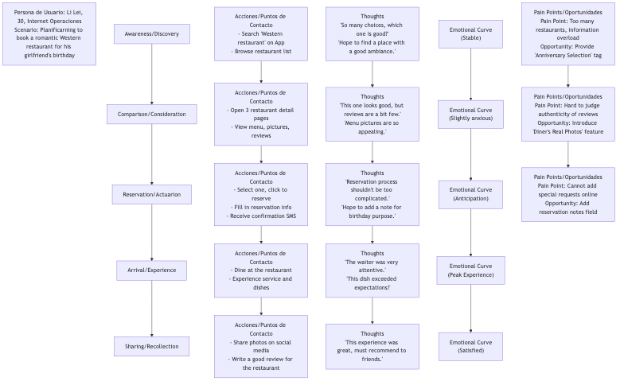

# Mapa de Viaje del Usuario

Cuando diseñamos un producto o servicio, es fácil quedar atrapado en un pensamiento aislado sobre características o interfaces individuales, ignorando la experiencia completa y de principio a fin que tienen los usuarios al interactuar con nosotros. El **Mapa de Viaje del Usuario** es una herramienta poderosa de visualización creada para romper esta "visión de túnel". Depicta sistemáticamente, de manera narrativa, el **proceso completo** por el que pasa un **Persona de Usuario** específica al interactuar con tu producto, servicio o marca para alcanzar un **objetivo específico**. No solo registra los **pasos de comportamiento** del usuario en cada etapa, sino que, más importante aún, revela profundamente los **pensamientos, sentimientos y puntos de dolor** del usuario durante todo el proceso.

El valor fundamental de un mapa de viaje del usuario radica en obligarnos a examinar y experimentar los servicios que ofrecemos desde la **perspectiva del usuario**. Transforma una experiencia fragmentada e invisible originalmente en un mapa visual claro, intuitivo y empático. A través de este mapa, el equipo puede identificar fácilmente los altibajos de la experiencia, encontrar los obstáculos clave que conducen a la pérdida de usuarios y descubrir oportunidades innovadoras para mejorar la satisfacción y fidelidad del usuario. Es un puente que conecta el producto con el mundo emocional real del usuario.

## Componentes Clave de un Mapa de Viaje del Usuario

Un mapa de viaje del usuario típico suele parecerse a un diagrama de carriles horizontales y contiene los siguientes componentes clave:

1.  **Persona del Usuario**: ¿Quién es el protagonista de este mapa de viaje? Al inicio del mapa, debe definirse claramente a qué **persona de usuario clave** se refiere este mapa. Diferentes usuarios pueden tener viajes muy distintos.
2.  **Escenario y Objetivos**: ¿En qué escenario específico se encuentra este usuario? ¿Qué objetivo espera alcanzar mediante este viaje? Por ejemplo, "Un trabajador de oficina ocupado (Persona) espera reservar una cena romántica en un restaurante occidental para el cumpleaños de su novia (Objetivo) durante su trayecto en metro de vuelta a casa (Escenario)."
3.  **Fases del Viaje / Etapas**: Divide el viaje completo de principio a fin en varias etapas principales y lógicamente continuas. Por ejemplo, para un viaje de compra en comercio electrónico, las etapas podrían incluir: **Conciencia -> Consideración -> Compra -> Espera -> Recepción -> Uso/Postventa**.
4.  **Acciones / Puntos de Contacto**: ¿Qué hace exactamente el usuario en cada etapa? ¿A través de qué canales o puntos de contacto (por ejemplo, redes sociales, aplicación, teléfono de atención al cliente, tienda física) interactúa contigo?
5.  **Pensamientos**: ¿Qué pasa por la mente del usuario mientras hace estas cosas? ¿Qué preguntas, expectativas o monólogos internos tiene?
6.  **Sentimientos / Emociones**: Este es el alma del mapa de viaje. Usa una curva emocional para representar las fluctuaciones emocionales del usuario en cada etapa: ¿se siente satisfecho, confundido, ansioso o frustrado? Esto nos ayuda a identificar rápidamente los "puntos de dolor" y los "puntos de deleite" en la experiencia.
7.  **Puntos de Dolor y Oportunidades**: Basándose en el análisis anterior, identifica claramente los obstáculos clave que causan emociones negativas en el usuario (puntos de dolor) en cada etapa, y genera ideas sobre oportunidades de mejora correspondientes.

### Plantilla del Mapa de Viaje del Usuario

## Cómo Crear un Mapa de Viaje del Usuario

1.  **Paso Uno: Definir Objetivos y Alcance**
    Primero, clarifica por qué estás creando este mapa de viaje. ¿Qué problema esperas resolver? Luego, determina la **persona del usuario** y el **escenario específico** que este mapa representará.

2.  **Paso Dos: Recopilar Datos del Usuario**
    El mapa de viaje debe basarse en una investigación real del usuario, no en la imaginación del equipo. Las fuentes de datos pueden incluir: entrevistas con usuarios, pruebas de usabilidad, encuestas, registros de atención al cliente, datos analíticos del sitio web, comentarios en redes sociales, etc.

3.  **Paso Tres: Organizar un Taller, Co-crear el Mapa de Viaje**
    Reúne a un equipo multidisciplinario (incluyendo producto, diseño, desarrollo, marketing, servicio al cliente, etc.) y lleva todas las ideas recopiladas sobre el usuario (que pueden estar en forma de notas adhesivas) a la sala de reuniones. Juntos, el equipo colaborará para definir y organizar cada etapa del viaje, así como los comportamientos, pensamientos y sentimientos del usuario en cada etapa, de manera narrativa.

4.  **Paso Cuatro: Dibujar la Curva Emocional, Identificar Momentos Clave**
    Dibujen conjuntamente la curva emocional del usuario, identificando los **Momentos de la Verdad** que determinan el éxito o fracaso de la experiencia del usuario, especialmente los puntos más bajos emocionalmente (puntos de dolor) y los picos más altos (momentos de deleite).

5.  **Paso Cinco: Descubrir Oportunidades y Determinar el Plan de Acción**
    Para cada punto de dolor identificado, genera ideas y propone oportunidades concretas y factibles de mejora. Finalmente, prioriza estas oportunidades y transfiérelas a elementos concretos en la lista de tareas del producto o a planes de acción.

## Casos de Aplicación

**Caso 1: Mejorar la Experiencia del Pasajero en un Aeropuerto**

*   **Escenario**: Una empresa de gestión aeroportuaria espera mejorar la satisfacción general de los pasajeros.
*   **Aplicación**: Mapearon el viaje del usuario de "viajeros internacionales primerizos que salen desde este aeropuerto". A través del análisis, descubrieron que los puntos de dolor más grandes ocurrían durante las etapas de "control de seguridad" y "búsqueda de la puerta de embarque", donde los pasajeros generalmente se sentían ansiosos y confundidos. Con base en esto, el aeropuerto añadió señales direccionales más claras, introdujo carriles inteligentes de seguridad para reducir el tiempo de espera y agregó navegación en tiempo real para localizar la puerta de embarque en la aplicación, mejorando significativamente la experiencia del pasajero.

**Caso 2: Optimizar las Tasas de Finalización de Cursos Online**

*   **Escenario**: Una plataforma de educación en línea descubrió que muchos usuarios compraban cursos pero abandonaban el aprendizaje a mitad de camino.
*   **Aplicación**: Al mapear el viaje de "un estudiante trabajador que cursa un curso de programación", descubrieron que las emociones de los estudiantes llegaban a su punto más bajo alrededor de la tercera semana del curso, ya que en ese momento aumentaba la dificultad del curso y los estudiantes tendían a interrumpir su ritmo de estudio debido a la carga laboral. Para abordar este punto de dolor, la plataforma diseñó medidas de intervención como "servicio de supervisión de profesores", "grupos de estudio" y "notificaciones de insignias motivacionales en la tercera semana", lo que mejoró significativamente la tasa de finalización del curso.

**Caso 3: Mejorar el Proceso de Apertura de Cuentas en un Banco**

*   **Escenario**: Un banco tradicional espera optimizar su proceso de apertura de cuentas para nuevos usuarios en línea.
*   **Aplicación**: El mapa de viaje mostró que los usuarios se sentían muy impacientes y desconfiados durante los pasos de "carga de documentos de identidad" y "lectura de acuerdos de usuario extensos", lo que provocaba una gran cantidad de abandonos. Para resolver esto, el banco simplificó el contenido del acuerdo y desarrolló una función conveniente para leer directamente la información del documento de identidad mediante NFC, lo que mejoró considerablemente la fluidez y la tasa de conversión del proceso completo de apertura de cuenta.

## Ventajas y Desafíos de los Mapas de Viaje del Usuario

**Ventajas Clave**

*   **Establecer una Perspectiva Global**: Ayuda al equipo a romper las barreras departamentales y el aislamiento funcional, examinando la experiencia del usuario desde una perspectiva integral y coherente.
*   **Herramienta de Empatía Poderosa**: Permite a los miembros del equipo, especialmente a ingenieros y gerentes, sentir intuitivamente las emociones y puntos de dolor reales del usuario.
*   **Identificar Efectivamente Problemas y Oportunidades**: Expone claramente las interrupciones y obstáculos en los procesos existentes y proporciona un enfoque claro para la innovación.
*   **Promover la Colaboración y el Consenso del Equipo**: El proceso de co-crear un mapa de viaje es en sí mismo una excelente actividad de equipo que permite a todos los involucrados alinear su comprensión del usuario y llegar a un consenso.

**Desafíos Potenciales**

*   **Problemas de Representatividad**: Un único mapa de viaje generalmente representa solo a una persona de usuario y un escenario, requiriendo múltiples mapas para cubrir una gama más amplia de grupos de usuarios.
*   **Basado en Investigación Real**: Si no hay una investigación profunda y real del usuario como base, el mapa de viaje puede convertirse en un "mapa de fantasía" deseado.
*   **Requiere Actualizaciones Continuas**: A medida que los productos y servicios evolucionan, también lo hacen los viajes del usuario, y los mapas de viaje deben tratarse como "documentos vivos" que se actualizan regularmente.

## Extensiones y Conexiones

*   **Persona del Usuario**: Es el **prerrequisito** para crear un mapa de viaje del usuario. Sin una persona clara, el mapa de viaje pierde a su protagonista.
*   **Plano del Servicio**: Puede verse como la "vista trasera" del mapa de viaje del usuario. Mientras que el mapa de viaje muestra la experiencia del usuario en primera línea, el plano del servicio se extiende hacia abajo, detallando cómo operan e interactúan el personal, los sistemas y los procesos del backend para apoyar estas experiencias en primera línea.
*   **Mapa de Empatía**: Es una herramienta más enfocada en explorar profundamente el mundo interior de un solo usuario, a menudo utilizada para recopilar material y ejercicios de empatía en las etapas iniciales de creación de personas y mapas de viaje del usuario.

---
*Referencia: El mapa de viaje del usuario, como herramienta clave en el campo del diseño de experiencia del usuario (UX), sus conceptos y prácticas están en constante evolución. Jesse James Garrett, cofundador de Adaptive Path, sentó las bases teóricas en su libro "The Elements of User Experience". Organizaciones autoritativas como el Grupo Nielsen Norman (NN/g) tienen guías prácticas y artículos extensos sobre cómo crear y usar mapas de viaje del usuario.*