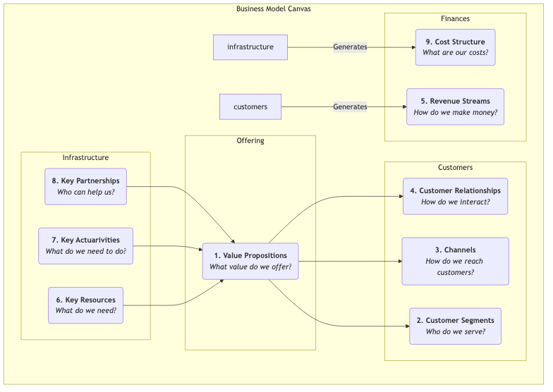

# Lienzo del Modelo de Negocio

Una idea de negocio, por emocionante que sea, si no puede transformarse en un sistema viable y sosteniblemente rentable, seguirá siendo un castillo en el aire. El **Lienzo del Modelo de Negocio** es una herramienta revolucionaria de gestión estratégica y emprendimiento propuesta por Alexander Osterwalder y Yves Pigneur. Proporciona un lenguaje común conciso e intuitivo que permite a los equipos describir, diseñar, evaluar e iterar claramente todos los elementos clave de un modelo de negocio en un solo gráfico.

El atractivo del Lienzo del Modelo de Negocio radica en su capacidad para descomponer un sistema empresarial complejo y dinámico en nueve bloques constructivos interconectados y lógicamente claros. Estos nueve bloques cubren cuatro áreas principales del negocio: **clientes, producto/servicio, infraestructura y viabilidad financiera**. Al presentar sistemáticamente estos bloques constructivos en un solo lienzo, emprendedores y gerentes pueden obtener una visión general del modelo de negocio completo, identificar sus impulsores clave, posibles riesgos y oportunidades de innovación, facilitando así un diálogo estratégico más profundo y una toma de decisiones más ágil.

## Los Nueve Bloques Constructivos del Lienzo

El núcleo del Lienzo del Modelo de Negocio es una plantilla con nueve casillas, cada una representando un aspecto clave del modelo de negocio.

1.  **Propuesta de Valor**: Este es el núcleo del lienzo. Describe el valor que creas para segmentos específicos de clientes, qué puntos de dolor resuelves para ellos o qué necesidades satisfaces. Debe ser única y distintiva.
2.  **Segmentos de Clientes**: ¿Para quién estás creando valor? ¿Quiénes son tus clientes más importantes? Aquí se pueden definir uno o más grupos objetivo de clientes.
3.  **Canales**: ¿A través de qué puntos de contacto comunicas y entregas tu propuesta de valor a tus clientes? Esto incluye canales para concienciación, evaluación, compra, entrega y servicio posventa.
4.  **Relaciones con Clientes**: ¿Qué tipo de relación quieres establecer y mantener con cada segmento de clientes? ¿Es automatizada, personalizada o basada en comunidad?
5.  **Fuentes de Ingreso**: ¿Cómo generas ingresos de los clientes tras entregar exitosamente valor? ¿Es mediante ventas puntuales, tarifas de suscripción, tarifas de arrendamiento o tarifas publicitarias?
6.  **Recursos Clave**: Los activos más importantes que debes poseer para entregar tu propuesta de valor, llegar a los clientes y mantener relaciones. Pueden ser activos físicos, propiedad intelectual, recursos humanos o financieros.
7.  **Actividades Clave**: Las actividades más importantes que debes realizar para que tu modelo de negocio opere eficazmente. Por ejemplo, para una empresa de software, es "desarrollo de software"; para una consultora, es "resolución de problemas".
8.  **Alianzas Clave**: La red de proveedores y socios con los que necesitas colaborar para optimizar tu modelo de negocio, reducir riesgos o adquirir recursos.
9.  **Estructura de Costos**: Todos los costos incurridos para operar un modelo de negocio, incluyendo costos fijos y variables.

## Cómo Usar el Lienzo del Modelo de Negocio

1.  **Imprime un Lienzo Grande**
    Imprime el lienzo en un póster grande y prepara muchas notas adhesivas y marcadores. La naturaleza física del lienzo es crucial para la colaboración y discusión en equipo.

2.  **De Derecha a Izquierda, Primero los Clientes, Luego la Infraestructura**
    Un orden recomendado para completarlo es comenzar desde el lado derecho del lienzo (lado del cliente), luego pasar a la propuesta de valor en el centro y finalmente al lado de la infraestructura. Es decir: **Segmentos de Clientes -> Propuesta de Valor -> Canales -> Relaciones con Clientes -> Fuentes de Ingreso**. Esto asegura que tu modelo de negocio siempre esté centrado en el cliente.

3.  **Lluvia de Ideas con Notas Adhesivas**
    Para cada bloque constructivo, los miembros del equipo escriben sus ideas en notas adhesivas y las colocan en la caja correspondiente. La ventaja de usar notas adhesivas es que las ideas pueden moverse, modificarse y reemplazarse fácilmente.

4.  **Conecta y Cuenta una Historia**
    Cuando el lienzo esté completo, intenta contar la "historia" de tu modelo de negocio. Comienza con tus clientes objetivo (CS), describe cómo los atiendes a través de tu propuesta de valor (VP) y canales (CH), y finalmente cómo generas ingresos (R). Luego explica qué recursos (KR), actividades (KA) y socios (KP) necesitas para lograr todo esto y qué costos (C) incurrirán. Verifica si la lógica de la historia es coherente y si los distintos módulos coinciden.

5.  **Evalúa e Itera**
    Evalúa el modelo de negocio en el lienzo. ¿Cuáles son sus fortalezas? ¿Cuáles son sus debilidades y riesgos? Luego, moviendo o reemplazando notas adhesivas, explora diferentes posibilidades y diseña un mejor modelo de negocio.

## Casos de Aplicación

**Caso 1: Máquina de Café de Cápsulas Nespresso**

*   **Segmentos de Clientes**: Usuarios domésticos y de oficina que buscan calidad y conveniencia.
*   **Propuesta de Valor**: Preparar fácil y rápidamente un espresso de calidad de café en casa.
*   **Canales**: Ventas directas a través del sitio web oficial, mostradores en grandes almacenes de lujo y sus propias boutiques.
*   **Relaciones con Clientes**: Se establece el Club Nespresso, proporcionando servicios exclusivos y experiencias personalizadas a los miembros.
*   **Fuentes de Ingreso**: Adopta el modelo de "rasuradora y hojillas". La máquina de café (rasuradora) tiene un margen de beneficio bajo, ganando principalmente ingresos al vender continuamente cápsulas de café patentadas y de alto margen (hojillas).
*   **Recursos Clave**: Marca fuerte, tecnología patentada (sistema de cápsulas), instalaciones de producción.
*   **Actividades Clave**: Marketing, gestión de la cadena de suministro, I+D de productos.
*   **Alianzas Clave**: Fabricantes de máquinas de café, agricultores de café.
*   **Estructura de Costos**: Altos costos de marketing y construcción de marca, costos de producción.

**Caso 2: Airbnb**

*   **Segmentos de Clientes**: Plataforma de dos lados, con **anfitriones** que tienen habitaciones libres por un lado, y **viajeros** que buscan experiencias de alojamiento únicas y locales por otro.
*   **Propuesta de Valor**: Proporciona a los anfitriones una forma fácil de ganar dinero; ofrece a los viajeros opciones de alojamiento más económicas y auténticas que los hoteles.
*   **Canales**: Sitio web y aplicación móvil.
*   **Relaciones con Clientes**: Construye una comunidad basada en la confianza, manteniendo relaciones a través de sistemas de reseñas y soporte al usuario.
*   **Fuentes de Ingreso**: Cobra una comisión porcentual tanto a anfitriones como a huéspedes.
*   **Recursos Clave**: La plataforma en sí misma, una vasta red de usuarios y listados, marca.
*   **Actividades Clave**: Desarrollo y mantenimiento de la plataforma, operaciones de la comunidad, marketing.
*   **Alianzas Clave**: Fotógrafos (para fotos de listados), plataformas de pago, compañías de seguros.
*   **Estructura de Costos**: Costos de mantenimiento de la plataforma, costos de marketing, costos de servicio al cliente.

**Caso 3: Juegos Móviles Gratuitos (por ejemplo, Honor of Kings)**

*   **Segmentos de Clientes**: Base amplia de jugadores (usuarios gratuitos) y un pequeño número de **jugadores de pago** dispuestos a pagar por servicios de valor añadido.
*   **Propuesta de Valor**: Proporciona una experiencia competitiva y de calidad totalmente gratuita.
*   **Canales**: Tiendas de aplicaciones (App Store, Google Play).
*   **Relaciones con Clientes**: Mantiene la actividad comunitaria a través de sistemas sociales dentro del juego, eventos y torneos de esports.
*   **Fuentes de Ingreso**: Genera principalmente ingresos vendiendo artículos virtuales que no afectan el equilibrio del juego (por ejemplo, skins para héroes, decoraciones) a los jugadores de pago (modelo freemium).
*   **Recursos Clave**: IP del juego, equipo de desarrollo, gran base de usuarios.
*   **Actividades Clave**: Desarrollo y actualizaciones del juego, operaciones comunitarias, organización de eventos de esports.
*   **Alianzas Clave**: Canales de tiendas de aplicaciones, clubes de esports, plataformas de streaming en vivo.
*   **Estructura de Costos**: Altos costos de investigación y desarrollo y de servidores, gastos de marketing.

## Valor y Limitaciones del Lienzo del Modelo de Negocio

**Valor Principal**

*   **Intuitivo y Holístico**: Visualiza la lógica empresarial compleja, ayudando a los equipos a obtener una visión integral.
*   **Fomenta la Comunicación y el Consenso**: Proporciona un lenguaje común, facilitando enormemente el diálogo estratégico dentro del equipo.
*   **Ágil e Iterativo**: Muy adecuado para explorar e iterar nuevos modelos de negocio, especialmente en las etapas iniciales inciertas.

**Limitaciones Potenciales**

*   **Ignora la Competencia**: El lienzo en sí no tiene un módulo dedicado al análisis del entorno competitivo.
*   **Instantánea Estática**: Muestra la estructura del modelo de negocio pero no refleja completamente su evolución dinámica.
*   **Necesita Combinarse con Otras Herramientas**: Para tomar decisiones más sólidas, generalmente necesita combinarse con otras herramientas como el Lienzo de la Propuesta de Valor y el análisis DAFO (SWOT).

## Extensiones y Conexiones

*   **Lean Canvas**: Una variación del Lienzo del Modelo de Negocio, más adecuada para proyectos de startups en etapas iniciales con alta incertidumbre. Reemplaza "Alianzas Clave", "Actividades Clave", "Recursos Clave" y "Relaciones con Clientes" con módulos que se centran más en problemas y soluciones.
*   **Lienzo de la Propuesta de Valor**: Puede verse como una ampliación y profundización de los módulos "Propuesta de Valor" y "Segmentos de Clientes" del Lienzo del Modelo de Negocio, ayudándote a afinar con mayor precisión el ajuste producto-mercado.
*   **Blue Ocean Strategy**: Tras concebir una nueva curva de valor utilizando el Marco de las Cuatro Acciones de Blue Ocean Strategy, el Lienzo del Modelo de Negocio puede utilizarse para diseñar sistemáticamente el modelo de negocio que respalda esta nueva estrategia.

---
*Referencia: El libro "Business Model Generation" de Alexander Osterwalder y Yves Pigneur es la guía autoritativa sobre esta herramienta, que contiene numerosos estudios de caso y detalladas instrucciones de uso.*