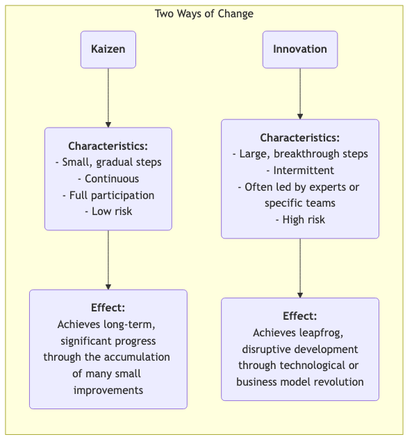

# Kaizen

En muchas organizaciones, la "mejora" suele verse como un importante "proyecto" que requiere una inversión significativa, liderado por expertos y ejecutado desde arriba hacia abajo. Sin embargo, existe una filosofía de gestión que cree que el progreso verdadero, poderoso y duradero proviene de **mejoras pequeñas y continuas**, aparentemente insignificantes, realizadas cada día por cada empleado. Esta es la esencia del **Kaizen**. Kaizen es una palabra japonesa que significa "cambio para mejor", y es a la vez una filosofía cultural que busca la perfección y un método práctico que fomenta la participación total y la mejora continua desde abajo.

La idea central del Kaizen es **no buscar avances revolucionarios de la noche a la mañana, sino perseguir una optimización gradual sin fin**. Cree que los empleados de primera línea son los expertos que mejor conocen la situación real de sus puestos, y que poseen una sabiduría y creatividad infinitas. Al establecer una cultura que incentive la resolución de problemas, recompense las pequeñas innovaciones y tolere el fracaso, las organizaciones pueden aprovechar el poder de cada persona, formando un impulso incontenible y continuamente ascendente. No es una herramienta de gestión compleja, sino una forma de trabajar y pensar sencilla, discreta, pero profundamente efectiva.

## Principios fundamentales del Kaizen

*   **Continuo**: Kaizen no es una actividad puntual, sino un proceso inacabable y acumulativo.
*   **Todos**: Desde el director ejecutivo hasta el limpiador de primera línea, se espera y se anima a todos los miembros de la organización a participar en actividades de mejora.
*   **Bajo costo, alta sabiduría**: Kaizen no depende de grandes inversiones de capital, sino que destaca el uso de la sabiduría y la creatividad de los empleados para resolver problemas y eliminar desperdicios con bajo costo.
*   **Enfoque en procesos**: El enfoque de Kaizen es optimizar los procesos de trabajo, no culpar a individuos.
*   **Gestión visual**: Destaca la importancia de hacer "visibles" los problemas, estándares y procesos, para que las anomalías sean evidentes a simple vista.
*   **"Ir al Gemba"**: Los gerentes deben ir al lugar real de trabajo (Gemba) para observar situaciones reales y hablar con los empleados, en lugar de imaginar las cosas desde la oficina.

### Kaizen vs. Innovación

*   **Relación**: Kaizen y la innovación no son mutuamente excluyentes; más bien, son dos capacidades que una organización excelente debe poseer simultáneamente. Kaizen se encarga de optimizar y consolidar continuamente los sistemas existentes, mientras que la innovación se encarga de crear sistemas completamente nuevos.

## Cómo practicar Kaizen en una organización

La clave para practicar Kaizen es crear una cultura y un mecanismo que incentiven la mejora continua.

1.  **Establecer un sistema de sugerencias Kaizen**
    Configurar un canal sencillo y cómodo (por ejemplo, buzón de sugerencias, formulario en línea) para que cualquier empleado pueda presentar problemas o sugerencias de mejora en cualquier momento. Es importante responder y seguir cada sugerencia, y brindar reconocimiento oportuno y público a las sugerencias excelentes que se adopten (las recompensas no tienen que ser materiales; elogios públicos, certificados, etc., suelen ser incentivos espirituales más efectivos).

2.  **Realizar "semanas Kaizen" o "Kaizen Blitz"**
    Organizar regularmente equipos multifuncionales para enfocarse en un proceso o área de trabajo específica durante un período concentrado (generalmente de 3 a 5 días), utilizando herramientas de calidad y producción ajustada (por ejemplo, mapeo de la cadena de valor, 5S) para realizar una tormenta de mejora rápida e intensa e implementar inmediatamente las soluciones.

3.  **Promover el ciclo PDCA como herramienta de pensamiento**
    Convertir el **ciclo PDCA (Planificar-Hacer-Verificar-Actuar)** en el marco estándar de pensamiento para que todos los empleados resuelvan problemas. Animar a los empleados a seguir este ciclo científico:
    *   **P**lanificar: Identificar el problema, analizar la causa y desarrollar un pequeño plan de mejora.
    *   **H**acer: Intentar ejecutar el plan.
    *   **V**erificar: Comprobar si los resultados del experimento cumplieron las expectativas.
    *   **A**ctuar: Si tiene éxito, estandarizarlo como un nuevo proceso; si no, aprender de ello y comenzar un nuevo ciclo PDCA.

4.  **Cambio en el rol del gerente**
    En una cultura Kaizen, el rol del gerente cambia de "comandante" y "supervisor" a "**entrenador**" y "**apoyo**". Sus principales tareas son: inspirar y motivar a los empleados para que identifiquen problemas, proporcionar recursos y apoyo para las actividades de mejora de los empleados y ayudarles a eliminar obstáculos.

## Casos de aplicación

**Caso 1: La "mejora de un centímetro" de Toyota**

*   **Escenario**: En la línea de producción de Toyota, Kaizen forma parte de su ADN.
*   **Aplicación**: Un trabajador de la línea de producción notó que cada vez que cogía un tornillo del recipiente de piezas, tenía que hacer un pequeño giro de muñeca que resultaba algo antinatural. Sugirió inclinar el recipiente de piezas 15 grados. Esta mejora aparentemente insignificante le ahorró unos segundos cada día y redujo el riesgo de lesiones en la muñeca. Cuando esta "mejora de un centímetro" se extendió a miles de puestos de trabajo en toda la empresa, los ahorros acumulados de tiempo y la mejora en seguridad fueron asombrosos.

**Caso 2: La estación de enfermería de un hospital**

*   **Problema**: Las enfermeras se quejaban de perder mucho tiempo cada día buscando suministros médicos comunes (por ejemplo, gasas, cinta adhesiva).
*   **Aplicación Kaizen**: La enfermera jefe organizó una pequeña actividad Kaizen. Los miembros del equipo utilizaron la **metodología 5S** para organizar completamente los armarios de la estación de enfermería: **Separar** (desechar artículos innecesarios), **Ordenar** (colocar los artículos más usados en lugares fácilmente accesibles y etiquetarlos claramente), **Limpiar**, **Estandarizar** y **Mantener**. Esta actividad duró solo una tarde, pero redujo significativamente el tiempo que las enfermeras pasaban buscando cosas, permitiéndoles dedicar más energía a la atención directa a los pacientes.

**Caso 3: Aplicación en la vida personal**

*   **Problema**: Una persona siempre olvidaba llevar sus llaves al salir de casa.
*   **Aplicación Kaizen**: En lugar de culparse a sí misma por tener una "mala memoria", pensó en cómo **mejorar el proceso**. Decidió colocar todas las cosas que necesitaba al día siguiente (llaves, cartera, identificación de trabajo) sobre el mueble de los zapatos junto a la puerta la noche anterior. Este pequeño cambio de hábito es un típico ejemplo de Kaizen personal, que resuelve el problema fundamentalmente optimizando el proceso.

## Ventajas y desafíos del Kaizen

**Ventajas principales**

*   **Bajo costo y bajo riesgo**: La mayoría de las mejoras provienen de la sabiduría de los empleados de primera línea, requiriendo casi ninguna inversión adicional, y el costo de prueba y error es extremadamente bajo.
*   **Mejora el compromiso y sentido de pertenencia de los empleados**: Cuando las sugerencias de los empleados son escuchadas y adoptadas, estos se sienten respetados y pasan de ser "ejecutores pasivos" a "pensadores activos".
*   **Fomenta el trabajo en equipo**: Muchas actividades Kaizen requieren colaboración entre funciones y departamentos, ayudando a romper las barreras entre departamentos.
*   **Crea una fuerte inercia cultural**: Una vez establecida una cultura de mejora continua, la organización adquiere un poderoso impulso interno para la autoevolución y el desarrollo continuo.

**Desafíos potenciales**

*   **Resultados lentos, poco visibles**: Comparado con la "innovación" radical, los efectos del Kaizen son graduales y acumulativos, y pueden no ser evidentes a corto plazo, lo que requiere que los gerentes tengan suficiente paciencia y visión a largo plazo.
*   **Requiere una participación genuina y total**: Si se queda solo en un lema, o si solo participan unas pocas personas, las actividades Kaizen no pueden mantenerse.
*   **Puede caer en el "óptimo local"**: Enfocarse demasiado en pequeñas mejoras de los procesos existentes puede hacer que a veces se pasen por alto oportunidades más grandes para innovaciones disruptivas y revolucionarias.

## Extensiones y conexiones

*   **Operaciones ajustadas (Lean Operations)**: Kaizen es uno de los pilares fundamentales del pensamiento Lean y la forma básica de lograr el principio de "búsqueda de la perfección".
*   **Gestión Total de la Calidad (TQM)**: Kaizen es la encarnación más directa y viva del principio de "mejora continua" en TQM.
*   **Ciclo PDCA**: Es el marco de pensamiento y acción científico más utilizado y fundamental al practicar Kaizen.

---
*Fuente de referencia: Kaizen, como filosofía de gestión, está profundamente arraigado en la cultura y las prácticas de gestión japonesas, especialmente popularizado en el Sistema de Producción Toyota (TPS). El libro de Masaaki Imai "Kaizen: La clave del éxito competitivo de Japón" introdujo por primera vez de forma sistemática este concepto al mundo occidental, con una influencia profunda.*