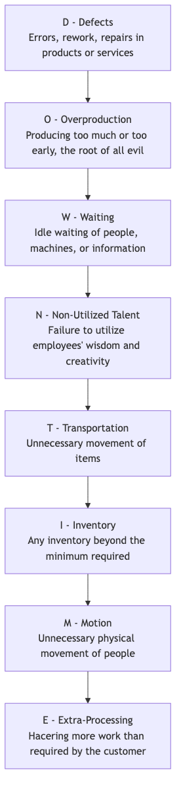

# Operaciones Lean

Imagina un río suave y sin obstáculos que fluye con facilidad, entregando directamente al cliente la fuente de valor, con un consumo mínimo y una velocidad máxima. Este es el estado ideal al que aspiran las **Operaciones Lean**. Las Operaciones Lean, a menudo denominadas **Producción Lean** o **Pensamiento Lean**, es a la vez una poderosa metodología de gestión operativa y una profunda cultura organizacional y filosofía de gestión. Su objetivo fundamental es maximizar el valor para el cliente y lograr una alta calidad, bajo costo y eficiencia operativa a alta velocidad mediante la **identificación sistemática y eliminación de todas las actividades que no agregan valor (es decir, "desperdicio", Muda) en los procesos operativos**.

El pensamiento Lean se originó en el "Sistema de Producción Toyota (TPS)" de Toyota Motor Corporation, el cual revolucionó por completo los modelos tradicionales de producción a gran escala basados en empuje. Las Operaciones Lean sostienen que cualquier actividad que consuma recursos pero no agregue valor por el cual el cliente final esté dispuesto a pagar, es un desperdicio. Al examinar continuamente la cadena de valor y eliminando el desperdicio, las organizaciones pueden crear productos y servicios de mayor calidad con menos recursos y en menos tiempo, obteniendo así una ventaja fundamental en la feroz competencia del mercado.

## Cinco Principios Fundamentales del Pensamiento Lean

La práctica del pensamiento Lean gira en torno a cinco principios fundamentales estrechamente conectados y cíclicos.

1.  **Especificar el Valor**: El punto de partida de todas las actividades debe ser definir con precisión el valor desde la perspectiva del **cliente final**. No se trata de lo que nosotros consideramos valioso, sino de lo que el cliente considera valioso.
2.  **Mapear la Cadena de Valor**: Para cada producto o servicio, traza su **proceso completo de extremo a extremo**, desde la concepción hasta la entrega al cliente (es decir, la "cadena de valor"). En este proceso, identifica claramente qué pasos realmente agregan valor, cuáles no agregan valor pero actualmente son inevitables, y cuáles son pura pérdida que debe eliminarse.
3.  **Crear Flujo**: Rompe los compartimentos departamentales y los modelos de producción por lotes aislados, y reorganiza los procesos para que los productos o servicios puedan "fluir" a través de la cadena de valor lo más suavemente, sin interrupciones ni esperas posibles.
4.  **Establecer Tirón (Pull)**: A diferencia de la producción tradicional basada en empuje ("push", es decir, producir según un plan independientemente de las necesidades posteriores), Lean busca un sistema basado en **tirón (pull)**. Es decir, los procesos upstream (hacia adelante) solo inician la producción o prestan servicios cuando el cliente (o el proceso downstream) envía una señal clara de demanda. Esto elimina fundamentalmente la sobreproducción y el inventario innecesario.
5.  **Buscar la Perfección**: Lean es un proceso sin fin de mejora continua. Al repetir constantemente los cuatro pasos anteriores, las organizaciones pueden descubrir y eliminar continuamente niveles más profundos de desperdicio, acercándose infinitamente al estado ideal de "cero desperdicio".

## Los Ocho Tipos de Desperdicio en Lean (DOWNTIME)

El pensamiento Lean clasifica sistemáticamente el desperdicio en los procesos en ocho tipos, comúnmente recordados por el acrónimo **DOWNTIME**.

## Cómo Implementar Operaciones Lean

La transformación Lean es un cambio profundo cultural y operativo que depende de una serie de herramientas y métodos poderosos.

1.  **Mapeo de la Cadena de Valor (VSM)**: Este es el punto de partida para implementar Lean. Al mapear la cadena de valor actual, identifica los tiempos de ciclo, los tiempos de valor agregado y el desperdicio en cada etapa. Luego, diseña un mapa ideal de la cadena de valor futuro como objetivo de mejora.

2.  **Metodología 5S**: Se utiliza para crear un entorno de trabajo limpio, organizado y eficiente. Incluye cinco pasos: Seiri (Seleccionar), Seiton (Ordenar), Seiso (Limpiar), Seiketsu (Estandarizar) y Shitsuke (Disciplinarse).

3.  **Kanban**: Una poderosa herramienta de gestión visual utilizada para implementar la producción basada en tirón. Las señales de demanda se transmiten mediante tarjetas Kanban, controlando así con precisión la cantidad de trabajo en proceso y evitando la sobreproducción.

4.  **Kaizen**: Que significa "mejora continua". Las organizaciones deben establecer una cultura que incentive a todos los empleados a reflexionar diariamente sobre sus procesos de trabajo y proponer sugerencias pequeñas pero continuas de mejora.

5.  **Análisis de la Causa Raíz**: Cuando surgen problemas, se utilizan herramientas como los **5 Porqués** o el **Diagrama de Ishikawa** para profundizar en la causa raíz del problema, asegurando que el problema se resuelva permanentemente, no solo sus síntomas superficiales.

## Casos de Aplicación

**Caso 1: La "Mejora de un Centímetro" de Toyota**

*   **Situación**: En la línea de producción de Toyota, Kaizen forma parte de su ADN.
*   **Aplicación**: Un trabajador de la línea de producción notó que cada vez que recogía un tornillo del contenedor de piezas, tenía que hacer un pequeño pero antinatural movimiento de giro de muñeca. Sugirió inclinar el contenedor de piezas 15 grados. Esta mejora aparentemente insignificante le ahorró unos segundos cada día y redujo el riesgo de lesiones en la muñeca. Cuando esta "mejora de un centímetro" se extendió a miles de puestos de trabajo en toda la empresa, el ahorro acumulado de tiempo y la mejora en seguridad fueron asombrosos.

**Caso 2: La Estación de Enfermería de un Hospital**

*   **Problema**: Las enfermeras se quejaban de pasar mucho tiempo cada día buscando suministros médicos comunes (por ejemplo, gasas, cinta adhesiva).
*   **Aplicación Lean**: La enfermera jefa organizó una pequeña actividad Kaizen. Los miembros del equipo utilizaron la metodología **5S** para **Seleccionar** (desechar artículos innecesarios), **Ordenar** (colocar los artículos más utilizados en lugares fácilmente accesibles y etiquetarlos claramente), **Limpiar**, **Estandarizar** y **Disciplinarse** en los armarios de la estación de enfermería. Esta actividad duró solo una tarde, pero redujo significativamente el tiempo que las enfermeras pasaban buscando, permitiéndoles dedicar más energía a la atención directa a los pacientes.

**Caso 3: Métodos Ágiles y Kanban en el Desarrollo de Software**

*   **Situación**: Los modelos tradicionales de desarrollo de software en cascada tienen ciclos largos y mucho desperdicio.
*   **Aplicación Lean**: El desarrollo ágil y los métodos Kanban son en gran medida la aplicación del pensamiento Lean al trabajo intelectual.
    *   **Eliminación de Desperdicio**: Mediante lotes pequeños e iteraciones de alta frecuencia, se reduce el inventario de "trabajo en proceso" (código incompleto). A través de integración continua, se reducen las esperas y los desperdicios por defectos.
    *   **Sistema de Tirón (Pull)**: Los equipos de desarrollo "tiran" tareas de la lista de "pendientes" para desarrollarlas según las prioridades en el tablero Kanban, en lugar de que los gerentes de proyecto "empujen" las tareas.
    *   **Mejora Continua**: Las reuniones periódicas de "retrospectiva" institucionalizan las actividades de "Kaizen".

## Ventajas y Desafíos de las Operaciones Lean

**Ventajas Fundamentales**

*   **Mejora significativa de la eficiencia y reducción de costos**: Al eliminar el desperdicio, se mejora directamente la eficiencia de producción y se reducen los costos operativos.
*   **Mayor calidad y satisfacción del cliente**: Centrarse en el valor y los procesos garantiza la calidad inherente de los productos y servicios.
*   **Mayor flexibilidad y capacidad de respuesta**: Los modelos de producción por lotes pequeños y basados en tirón permiten a las organizaciones responder más rápidamente a los cambios en la demanda del cliente.
*   **Empoderamiento de los empleados y aumento de la moral**: Se respeta y se apoya la sabiduría y creatividad de los empleados de primera línea para impulsar la mejora continua.

**Desafíos Potenciales**

*   **Altas exigencias sobre la cadena de suministro**: Justo a Tiempo (JIT) requiere que los proveedores entreguen mercancías con puntualidad extrema y alta calidad, lo que impone exigencias muy altas sobre la estabilidad de la cadena de suministro.
*   **No es adecuado para todos los entornos**: En industrias con demanda extremadamente inestable y volátil, implementar un sistema puramente basado en tirón puede ser muy difícil.
*   **Resistencia al cambio cultural**: La transformación Lean requiere un cambio profundo en la mentalidad, lo que puede encontrar resistencia por parte de empleados y gerentes acostumbrados a métodos tradicionales de trabajo.

## Extensiones y Conexiones

*   **Six Sigma**: Lean se centra en **velocidad y eficiencia (eliminación de desperdicio)**, mientras que Six Sigma se centra en **calidad y consistencia (reducción de variación)**. En la práctica, ambos suelen combinarse en **Lean Six Sigma**, formando una metodología más completa de mejora operativa que puede eliminar desperdicio y reducir variación simultáneamente.
*   **Gestión Total de la Calidad (TQM)**: Altamente consistente con Lean en aspectos filosóficos como el enfoque en el cliente, la participación total, la mejora continua, entre otros. Lean proporciona una perspectiva y conjunto de herramientas único más centrado en la "eliminación de desperdicio".
*   **Teoría de las Restricciones (TOC)**: Se centra en identificar y gestionar "cuellos de botella" en un sistema para mejorar la producción del sistema completo. Puede combinarse con métodos Lean para guiar el enfoque de las actividades de mejora.

---
*Fuente de Referencia: Las raíces del pensamiento Lean están en el Sistema de Producción Toyota (TPS) de Toyota Motor Corporation, con Taiichi Ohno como figura clave. El libro "Lean Thinking" de James P. Womack y Daniel T. Jones fue el primero en sintetizar sistemáticamente las prácticas de Toyota en cinco principios comprensibles para gerentes occidentales, promoviendo enormemente la difusión mundial del pensamiento Lean.*