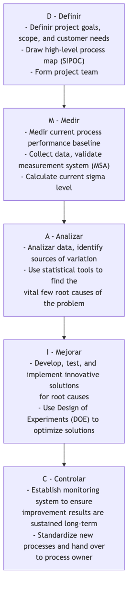

# Seis Sigma

En el camino hacia la calidad y eficiencia operativa óptimas, ¿cómo pueden las empresas reducir los defectos y las variaciones en los procesos a un nivel casi perfecto? **Seis Sigma (6σ)** es una metodología de mejora de la calidad y una filosofía de gestión disciplinada, basada en datos y centrada en el cliente, diseñada específicamente para este objetivo. Su objetivo fundamental es identificar y eliminar sistemáticamente las causas raíz de la variación en los procesos, reduciendo así la tasa de defectos de productos o servicios a un nivel excepcional de **solo 3.4 defectos por millón de oportunidades**.

"Sigma (σ)" es una medida estadística de dispersión de datos, que representa la desviación estándar. Un nivel sigma más alto en un proceso significa que es más estable y consistente, con menos fluctuaciones respecto al promedio y menos defectos. El nombre "Seis Sigma" representa en sí mismo una búsqueda extrema de calidad perfecta. No es solo un conjunto de herramientas estadísticas, sino una forma sistemática de pensar que resuelve problemas complejos y logra mejoras revolucionarias en el desempeño a través de la ruta estructurada de proyectos **DMAIC** (Definir-Medir-Analizar-Mejorar-Controlar).

## Principios fundamentales de Seis Sigma

*   **Enfoque en el cliente**: El punto de partida y de llegada de todas las mejoras debe ser las necesidades del cliente y sus requisitos Críticos para la Calidad (CTQ, por sus siglas en inglés).
*   **Toma de decisiones basada en datos**: Todas las decisiones y conclusiones deben basarse en la recopilación de datos objetivos y en un análisis estadístico riguroso, en lugar de en la intuición o la experiencia.
*   **Mejora de procesos**: Se cree firmemente que cualquier defecto o problema es causado por un proceso defectuoso. Por lo tanto, el enfoque de la mejora está en el proceso, no en culpar a individuos.
*   **Reducción de la variación**: Seis Sigma considera que las fluctuaciones e inconsistencias en los procesos son el principal enemigo de la calidad. Su tarea fundamental es comprender y eliminar las causas raíz de la variación.
*   **Mejora revolucionaria**: Busca lograr mejoras significativas y cuantificables en el desempeño y en los beneficios financieros, no solo pequeñas mejoras incrementales.

## DMAIC: La ruta crítica de los proyectos Seis Sigma

Los proyectos de mejora Seis Sigma siguen estrictamente una ruta de cinco fases llamada **DMAIC**. Cada fase tiene objetivos claros y herramientas clave que deben utilizarse.

## Cómo implementar un proyecto Seis Sigma

1.  **Fase de Definir (Define)**: Indicar claramente el problema empresarial que se quiere resolver y su impacto en la empresa, definir el alcance y los objetivos del proyecto, así como la línea de tiempo, e identificar a todas las partes interesadas.

2.  **Fase de Medir (Measure)**: Cuantificar la gravedad del problema con datos. Debe determinar qué métricas clave medir, diseñar un plan de recolección de datos y asegurarse de que su sistema de medición sea preciso y confiable. La salida de esta fase es un conjunto de datos de línea de base creíbles sobre el desempeño actual del proceso.

3.  **Fase de Analizar (Analyze)**: Esta es la fase central de DMAIC. Debe utilizar varias herramientas de análisis estadístico (como diagramas de Pareto, diagramas de causa-efecto, pruebas de hipótesis, análisis de regresión, etc.) para extraer meticulosamente de los datos recopilados las **causas raíz** del problema, validadas con datos.

4.  **Fase de Mejorar (Improve)**: Una vez identificadas las causas raíz, debe generar soluciones específicas mediante lluvia de ideas y desarrollar y probar posibles soluciones. **Diseño de Experimentos (Design of Experiments, DOE)** es una herramienta poderosa comúnmente utilizada en esta fase, que le ayuda a encontrar la combinación óptima de parámetros para la optimización del proceso.

5.  **Fase de Controlar (Control)**: Tras implementar la solución y lograr las mejoras esperadas, lo más importante es cómo mantener los resultados. Debe establecer un sistema de control del proceso (por ejemplo, **gráficos de control estadístico del proceso, SPC Chart**), desarrollar nuevos procedimientos operativos estándar y capacitar al personal relevante para evitar que el problema vuelva a ocurrir.

## Sistema de roles en Seis Sigma

La implementación exitosa de Seis Sigma depende de un sistema claro de roles y responsabilidades, análogo a los grados en artes marciales que utilizan diferentes colores de "cinturones".

*   **Champions (Patrocinadores)**: Generalmente son gerentes de alto rango responsables de identificar y aprobar proyectos Seis Sigma, y de proporcionar recursos y apoyo para los proyectos.
*   **Master Black Belts (Cinturones Negros Maestros)**: Expertos internos en Seis Sigma y mentores responsables de entrenar y guiar a los Cinturones Negros y Cinturones Verdes, y de promover la cultura Seis Sigma dentro de la organización.
*   **Black Belts (Cinturones Negros)**: Generalmente son gestores de proyectos Seis Sigma a tiempo completo, responsables de liderar proyectos complejos de mejora transversales.
*   **Green Belts (Cinturones Verdes)**: Participan o lideran proyectos menores de mejora mientras realizan sus funciones habituales. Son la fuerza principal para la difusión y aplicación de Seis Sigma en la organización.

## Casos de aplicación

**Caso 1: General Electric (GE)**

*   **Contexto**: Bajo el liderazgo de Jack Welch, GE fue una de las primeras y más exitosas empresas del mundo en elevar Seis Sigma desde una herramienta de calidad hasta una estrategia empresarial fundamental.
*   **Aplicación**: GE aplicó Seis Sigma a todas las áreas de negocio, desde la fabricación de motores de avión hasta los servicios financieros. Por ejemplo, en un caso, su división de salud, mediante un proyecto DMAIC, analizó el proceso de inspección de escáneres CT y logró reducir en un 30% el tiempo promedio de inspección por paciente, mejorando considerablemente la utilización del equipo y la satisfacción del paciente. Se informa que Seis Sigma ahorró a GE miles de millones de dólares en sus primeros años.

**Caso 2: Optimización del proceso de solicitud de tarjetas de crédito en un banco**

*   **Problema**: El tiempo promedio desde que el cliente presentaba la solicitud de una tarjeta de crédito hasta que recibía la tarjeta era demasiado largo, lo que generaba baja satisfacción del cliente.
*   **Aplicación de DMAIC**:
    *   **D**: Se definió el objetivo del proyecto como "reducir el ciclo de solicitud de un promedio de 15 días a 7 días en 6 meses".
    *   **M**: Se midió el tiempo invertido en cada etapa (por ejemplo, "ingreso de datos", "revisión crediticia", "producción de tarjetas", "envío postal") para cientos de solicitudes durante los últimos tres meses.
    *   **A**: El análisis de datos reveló que la etapa de "revisión crediticia" tomaba más tiempo y tenía la mayor variabilidad, convirtiéndose en el principal cuello de botella del proceso.
    *   **I**: El equipo rediseñó el proceso de revisión crediticia, introdujo un sistema automatizado de revisión preliminar y capacitó al personal encargado de la revisión.
    *   **C**: Se estableció un nuevo panel de control para monitorear el proceso y se actualizaron los manuales operativos. Finalmente, el ciclo promedio se redujo con éxito a 6.5 días.

**Caso 3: Reducción de la tasa de defectos en una planta de fabricación**

*   **Problema**: La tasa de defectos de piezas producidas en una línea de producción, donde las dimensiones excedían los estándares, era tan alta como el 5%.
*   **Aplicación de DMAIC**: El equipo del proyecto, mediante diagramas de causa-efecto y pruebas de hipótesis, analizó todas las causas potenciales (mano de obra, máquina, material, método, entorno) que podrían provocar desviaciones dimensionales. Finalmente, mediante Diseño de Experimentos (DOE), descubrieron que la interacción entre los parámetros de "temperatura de enfriamiento" y "velocidad de corte" de la máquina era la causa raíz más crítica de la variación dimensional. Al establecer una nueva combinación optimizada de parámetros, el equipo logró reducir la tasa de defectos por debajo del 0.1%.

## Ventajas y desafíos de Seis Sigma

**Ventajas fundamentales**

*   **Orientación a resultados, beneficios financieros significativos**: Cada proyecto está vinculado a objetivos financieros claros y cuantificables.
*   **Disciplinado, lógica clara**: El marco DMAIC proporciona una ruta estructurada y repetible para resolver problemas complejos.
*   **Basado en datos, alta objetividad**: Destaca la importancia de hablar con datos, reduciendo la subjetividad y arbitrariedad en la toma de decisiones.
*   **Desarrolla habilidades para resolver problemas**: Forma a un grupo de profesionales (Cinturones Negros, Cinturones Verdes) dentro de la organización que comprenden el negocio, los datos y saben usar herramientas científicas para resolver problemas.

**Desafíos potenciales**

*   **Puede inhibir la innovación**: Un énfasis excesivo en el control y la optimización de procesos existentes puede entrar en conflicto, en ocasiones, con la innovación disruptiva que requiere exploración y prueba y error.
*   **Riesgo de burocratización**: Si se implementa incorrectamente, puede convertirse en un proceso burocrático lleno de herramientas estadísticas complejas y reportes, realizando proyectos "por hacer proyectos".
*   **Requiere una inversión significativa**: La implementación exitosa de Seis Sigma requiere una inversión inicial considerable por parte de la empresa en formación, recursos para proyectos y personal.

## Extensiones y conexiones

*   **Lean Manufacturing**: El núcleo de Seis Sigma es **reducir la variación y mejorar la calidad**; el núcleo de Lean es **eliminar desperdicio y mejorar la velocidad**. Ambos tienen enfoques diferentes pero se complementan muy bien. En la práctica, suelen combinarse para formar el aún más potente **Lean Seis Sigma**, con el objetivo de lograr alta calidad, alta eficiencia y bajo costo simultáneamente.
*   **Gestión Total de Calidad (TQM)**: TQM proporciona una filosofía de gestión macro, centrada en el cliente e involucrando a todos los empleados, mientras que Seis Sigma ofrece métodos micro-operativos más específicos, basados en proyectos y en datos para alcanzar los objetivos de TQM.

---
*Fuente de referencia: Seis Sigma fue propuesto por primera vez por el ingeniero de Motorola Bill Smith en la década de 1980 y se hizo famoso por su exitosa implementación en empresas como General Electric (GE) y AlliedSignal. El libro de Mikel Harry y Richard Schroeder "Six Sigma: The Breakthrough Management Strategy Revolutionizing the World's Top Corporations" es un texto clásico en este campo.*