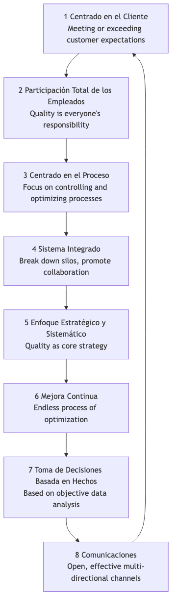

# Gestión Total de la Calidad

En los modelos tradicionales de producción, la "calidad" solía verse como un paso de inspección separado al final de la línea de producción, gestionado por un departamento especializado de control de calidad. Sin embargo, este enfoque de "remedio posterior a los hechos" es costoso e ineficiente. **La Gestión Total de la Calidad (TQM, por sus siglas en inglés)** propone una filosofía de gestión revolucionaria y claramente diferente. Defiende que **la calidad es responsabilidad de todos, debe impregnar cada rincón y cada eslabón de las operaciones organizacionales, y su criterio definitivo es la satisfacción del cliente**.

TQM no es un método o herramienta específica, sino una filosofía de gestión y una cultura organizacional centrada en **la calidad, la participación total de los empleados y la mejora continua**. Su objetivo es mejorar continuamente la calidad de productos, servicios y procesos mediante el establecimiento de un sistema sistemático y preventivo de aseguramiento de la calidad, logrando así una ventaja competitiva sostenible en el feroz entorno del mercado. Destaca que la alta calidad no solo no incrementa los costos, sino que en realidad **reduce significativamente los costos totales** y mejora la rentabilidad al disminuir el desperdicio, el retrabajo y las quejas de los clientes.

## Principios Fundamentales de TQM

La Gestión Total de la Calidad se basa en una serie de principios fundamentales interconectados que colectivamente forman la base cultural de TQM.

1.  **Enfoque en el Cliente**: El comienzo y el fin de TQM son los clientes. La supervivencia y desarrollo de una organización dependen finalmente de su capacidad para satisfacer o incluso superar las expectativas del cliente. Por lo tanto, todos los aspectos, desde el diseño del producto hasta el servicio postventa, deben estar guiados por las necesidades y satisfacción del cliente.

2.  **Participación Total de los Empleados**: La calidad no es exclusiva de un departamento, sino responsabilidad de todos, desde el director ejecutivo hasta los empleados de primera línea. TQM destaca la importancia de empoderar, capacitar y motivar a todos los empleados para que participen activamente en actividades de mejora de la calidad.

3.  **Enfoque en los Procesos**: TQM considera que la calidad del producto o servicio final está determinada por el proceso que lo genera. Por lo tanto, el enfoque de la gestión debe desplazarse de "inspeccionar resultados" a "controlar y optimizar procesos".

4.  **Sistema Integrado**: La organización se percibe como un sistema complejo compuesto por diversos procesos horizontales y verticales. TQM busca romper las barreras entre departamentos y promover la colaboración transversal, asegurando que todas las partes de la organización trabajen armónicamente hacia objetivos comunes de calidad.

5.  **Enfoque Estratégico y Sistemático**: La calidad debe considerarse una de las estrategias fundamentales de la organización. Esta necesita desarrollar una visión clara y a largo plazo sobre la calidad e integrarla sistemáticamente en todos los planes y decisiones.

6.  **Mejora Continua**: TQM no busca el "cumplimiento único", sino un proceso interminable y espiralado de mejora. Incentiva a las organizaciones a buscar constantemente oportunidades para pequeñas pero continuas optimizaciones de productos, servicios y procesos (es decir, "Kaizen").

7.  **Toma de Decisiones Basada en Hechos**: Todas las decisiones y mejoras deben basarse en la recopilación y análisis de datos objetivos, no en la intuición o la experiencia. Esto requiere que la organización establezca sistemas efectivos de medición y análisis de datos.

8.  **Comunicación**: Dentro de la organización, deben establecerse canales de comunicación abiertos, efectivos y multidireccionales para asegurar que estrategias, objetivos, procesos y retroalimentación se transmitan y comprendan oportunamente.

## Cómo Implementar TQM

Implementar TQM es un proceso de cambio cultural a largo plazo, que generalmente puede seguir la lógica del ciclo PDCA.

1.  **Fase 1: Planificar - Sentar las Bases**
    *   **Compromiso de la Alta Dirección**: Obtener el apoyo y compromiso inquebrantables de la alta dirección es el primer requisito para el éxito de TQM.
    *   **Establecer un Comité de Calidad**: Formar un equipo de liderazgo multidisciplinario encargado de planificar y guiar toda la implementación de TQM.
    *   **Desarrollar una Visión y Estrategia de Calidad**: Definir claramente la política de calidad y los objetivos a largo plazo de la organización.
    *   **Capacitación Total de Empleados**: Proporcionar formación sobre conceptos y herramientas básicas de TQM a todos los empleados.

2.  **Fase 2: Hacer - Despliegue Integral**
    *   **Identificar Necesidades del Cliente**: Recopilar y analizar sistemáticamente las necesidades y expectativas del cliente.
    *   **Análisis y Estandarización de Procesos**: Mapear y analizar los procesos clave del negocio, identificar cuellos de botella y desperdicio, y establecer procedimientos operativos estandarizados.
    *   **Formar Equipos de Mejora de Calidad**: Incentivar a los empleados (especialmente de diferentes departamentos) a formar espontáneamente "Círculos de Calidad" u otros grupos para mejorar problemas específicos.
    *   **Empoderar a los Empleados**: Otorgar a los empleados de primera línea la autoridad y responsabilidad para detener la línea de producción o proceso cuando se detecten problemas de calidad.

3.  **Fase 3: Verificar - Medición y Evaluación**
    *   **Recolección y Análisis de Datos**: Utilizar herramientas de calidad como el control estadístico de procesos (SPC), gráficos de Pareto, diagramas de causa-efecto, etc., para monitorear y medir continuamente los procesos y resultados.
    *   **Evaluación del Desempeño**: Evaluar regularmente el progreso y efectividad de la implementación de TQM y compararla con los objetivos predefinidos.

4.  **Fase 4: Actuar - Mejora e Institucionalización**
    *   **Análisis de Causa Raíz**: Realizar análisis profundos de causa raíz para los problemas de calidad identificados.
    *   **Implementar Medidas de Mejora**: Tomar acciones correctivas y preventivas basadas en los resultados del análisis.
    *   **Compartir y Estandarizar**: Compartir experiencias exitosas de mejora y estandarizarlas en nuevos procesos, incorporándolas a la base de conocimiento organizacional.
    *   **Ciclo Continuo**: Tras completar un ciclo de mejora, iniciar inmediatamente el siguiente ciclo PDCA.

## Casos de Aplicación

**Caso 1: Toyota Motor Corporation**

*   **Contexto**: El Sistema de Producción Toyota (TPS) se considera el ejemplo práctico más exitoso y completo de TQM.
*   **Aplicación**:
    *   **Participación Total de los Empleados**: El sistema "Andon" permite que cualquier trabajador de la línea de producción tire de una cuerda y detenga toda la línea cuando detecta un problema de calidad, lo que refleja un alto grado de confianza y empoderamiento hacia los empleados de primera línea.
    *   **Mejora Continua**: La cultura de "Kaizen" de Toyota incentiva a todos los empleados a proponer sugerencias de mejora pequeñas pero continuas para sus procesos de trabajo cada día.
    *   **Enfoque en los Procesos**: Principios fundamentales como "Justo a Tiempo (JIT)" y "Jidoka" buscan eliminar el desperdicio y garantizar la calidad optimizando los procesos.

**Caso 2: El Hotel Ritz-Carlton**

*   **Contexto**: Como marca líder de hoteles de lujo, su excelente calidad de servicio es una ventaja competitiva fundamental.
*   **Aplicación**:
    *   **Enfoque en el Cliente**: Su famoso lema es "Somos damas y caballeros sirviendo a damas y caballeros".
    *   **Participación Total y Empoderamiento de los Empleados**: La empresa autoriza a cada empleado, sin necesidad de aprobación de sus superiores, a decidir usar hasta $2000 para resolver cualquier problema del cliente. Esto asegura que los problemas de los clientes puedan resolverse inmediata y creativamente.
    *   **Toma de Decisiones Basada en Hechos**: El hotel utiliza una base de datos detallada de preferencias de clientes para registrar las necesidades personalizadas de cada huésped frecuente, proporcionando un servicio preciso que supere las expectativas.

**Caso 3: Una Empresa de Desarrollo de Software**

*   **Contexto**: La empresa desea mejorar la calidad del código y la velocidad de entrega de sus productos de software.
*   **Aplicación**:
    *   **Enfoque en los Procesos**: Implementaron procesos de "Integración Continua/Despliegue Continuo (CI/CD)", asegurando la calidad de cada commit de código mediante pruebas automatizadas.
    *   **Participación Total de los Empleados**: Establecieron un sistema de "Revisión de Código", exigiendo que todo código sea revisado por al menos un compañero antes de ser fusionado, distribuyendo la responsabilidad de la calidad a cada desarrollador.
    *   **Mejora Continua**: Organizan regularmente "días de pago de deuda técnica" y "reuniones de análisis posterior" para incentivar a los equipos a identificar y resolver activamente problemas en los procesos.

## Ventajas y Desafíos de TQM

**Ventajas Fundamentales**

*   **Mejora de la satisfacción y fidelidad del cliente**: Enfoca a toda la organización en satisfacer las necesidades del cliente.
*   **Reducción de costos y aumento de eficiencia**: Al "hacer las cosas bien desde la primera vez", reduce significativamente los costos asociados al retrabajo, el desperdicio y las quejas del cliente.
*   **Fortalecimiento del sentido de pertenencia y responsabilidad de los empleados**: Empodera a los empleados, haciéndolos sentir una parte importante del éxito de la organización.
*   **Establecimiento de una ventaja competitiva sostenible**: La alta calidad en sí misma es una ventaja competitiva poderosa y difícil de imitar.

**Desafíos Potenciales**

*   **Requiere un cambio cultural a largo plazo**: TQM no es un "proyecto" que dé resultados rápidos, sino un cambio cultural profundo y desde la cúpula que tarda varios años en arraigarse realmente.
*   **Continuidad del compromiso de la alta dirección**: Si el apoyo de la alta dirección disminuye, la implementación de TQM pronto se convertirá solo en una formalidad.
*   **Posibilidad de burocracia**: Si se exagera en procesos y documentación, podría surgir nueva burocracia, sofocando la flexibilidad y la innovación.

## Extensiones y Conexiones

*   **Six Sigma**: Puede verse como una metodología más específica, basada en datos y orientada a proyectos, para los principios de "toma de decisiones basada en hechos" y "mejora continua" dentro de TQM. TQM proporciona la filosofía y cultura, mientras que Six Sigma ofrece las herramientas estadísticas y la ruta del proyecto.
*   **Operaciones Lean**: Comparte fundamentos filosóficos comunes con TQM en cuanto a la eliminación de desperdicio, el enfoque en procesos y la mejora continua. Ambos suelen combinarse para formar "Lean Six Sigma".
*   **Sistema de Gestión de la Calidad ISO 9000**: Un marco estandarizado y certificable internacionalmente para los principios de TQM. Una organización puede demostrar que ha establecido un sistema de gestión de calidad conforme a los principios de TQM obteniendo la certificación ISO 9001.

---
*Referencia Fuente: Los orígenes intelectuales de la Gestión Total de la Calidad pueden rastrearse hasta varios gurús de la gestión de la calidad del siglo XX, incluyendo las "14 Puntos para la Gestión" de W. Edwards Deming, la "Trilogía de la Calidad" de Joseph M. Juran y los conceptos de Philip B. Crosby sobre "La Calidad es Gratis". Estas ideas se desarrollaron ampliamente durante la reconstrucción posterior a la guerra en Japón y finalmente formaron el sistema completo de TQM.*