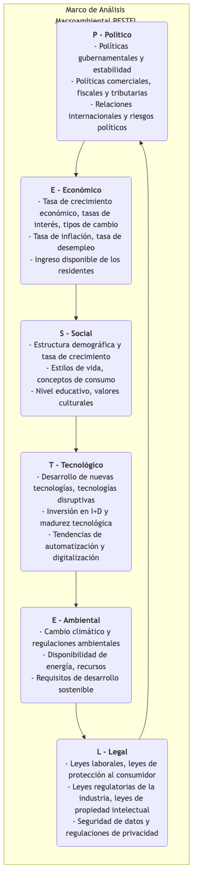

# Análisis PESTEL

Cuando se formula cualquier estrategia a largo plazo, si una organización se centra únicamente en sus fortalezas internas y en la competencia dentro de su industria, ignorando el entorno macroeconómico más amplio, es como navegar en un mar turbulento sin consultar el pronóstico del tiempo, lo cual es extremadamente peligroso. **El Análisis PESTEL**, a menudo denominado Análisis PEST, es un marco poderoso para escanear y monitorear sistemáticamente el entorno externo macroeconómico de una organización. Su objetivo es ayudar a los tomadores de decisiones a identificar los impulsores clave y los riesgos externos que podrían tener un profundo impacto en la organización ahora o en el futuro.

PESTEL es un acrónimo que representa seis dimensiones, proporcionando una lista de verificación integral para asegurar que no se pasen por alto aspectos importantes al realizar un escaneo ambiental:

*   **P - Político**
*   **E - Económico**
*   **S - Social**
*   **T - Tecnológico**
*   **E - Ambiental**
*   **L - Legal**

Al analizar sistemáticamente estas seis dimensiones, las organizaciones pueden predecir mejor las oportunidades, evitar amenazas y formular estrategias más adaptativas y orientadas al futuro.

## Explicación Detallada de las Seis Dimensiones del Análisis PESTEL

Cada letra de PESTEL representa una serie de fuerzas externas que deben examinarse.

-->

## Cómo Realizar un Análisis PESTEL

1.  **Lluvia de ideas: Identificar Factores Clave**
    Reúna un equipo multifuncional para realizar una lluvia de ideas abierta a través de las seis dimensiones del análisis PESTEL. Enumere tantos factores externos como sea posible bajo cada dimensión que puedan ser relevantes para su organización, industria o mercado.
    *   Por ejemplo, para una empresa de vehículos eléctricos, en la dimensión "Político", podría incluir "políticas gubernamentales de subsidios para vehículos de nueva energía", "planes de construcción de infraestructura de puntos de carga", etc.

2.  **Recopilar Información y Evidencia**
    Para los factores clave inicialmente identificados, realice una recopilación y investigación más profunda de información. Los datos pueden provenir de informes gubernamentales, análisis de la industria, medios de comunicación, investigaciones académicas, etc., para garantizar que el análisis se base en hechos y no en especulaciones.

3.  **Analizar el Impacto: Identificar Oportunidades y Amenazas**
    Evalúe si el impacto potencial de cada factor clave en la organización es positivo (oportunidad) o negativo (amenaza). Analice además la **probabilidad** y la **gravedad** de dicho impacto.
    *   Por ejemplo, "aumento de subsidios gubernamentales" es una **oportunidad** de alta probabilidad e impacto.
    *   "Introducción de una nueva regulación sobre reciclaje de baterías" podría ser una **amenaza** de alta probabilidad e impacto medio.

4.  **Formular Respuestas Estratégicas**
    Este es el propósito final del análisis PESTEL. Desarrolle acciones estratégicas específicas para las oportunidades y amenazas clave identificadas.
    *   **Para Oportunidades**: ¿Cómo debemos ajustar nuestra estrategia para maximizar su aprovechamiento?
    *   **Para Amenazas**: ¿Cómo debemos actuar para evitar o mitigar su impacto negativo?

5.  **Monitoreo Continuo**
    El entorno macroeconómico está en constante cambio, por lo tanto, el análisis PESTEL no debe ser una tarea puntual, sino un proceso dinámico de monitoreo continuo y actualización periódica.

## Casos de Aplicación

**Caso 1: Una Cadena Multinacional de Comida Rápida que Ingresa al Mercado Indio**

*   **Político**: Necesita lidiar con las complejas regulaciones indias sobre seguridad alimentaria y las relaciones con los gobiernos locales.
*   **Económico**: El crecimiento de la clase media india y el aumento del ingreso disponible representan una gran oportunidad, pero también debe considerar su alta sensibilidad a los precios.
*   **Social**: India tiene una gran cantidad de personas vegetarianas, y las vacas son sagradas en el hinduismo. Este es un gran desafío y oportunidad cultural. Por ello, la empresa desarrolló específicamente hamburguesas sin carne de res (como la McAloo Tikki) y un completo menú vegetariano.
*   **Tecnológico**: La popularidad de los pagos móviles y las plataformas de entrega de alimentos proporciona nuevos canales para llegar a más consumidores.
*   **Ambiental**: Las restricciones sobre el uso de envases de plástico se están volviendo más estrictas, lo que exige alternativas ecológicas.
*   **Legal**: Debe cumplir con leyes laborales estrictas y regulaciones relacionadas con franquicias.

**Caso 2: Los Desafíos que Afronta la Prensa Escrita Tradicional**

*   **Político**: Cambios en las regulaciones de censura y publicación de noticias.
*   **Económico**: La recesión económica conduce a una reducción en los presupuestos publicitarios corporativos, afectando gravemente los ingresos de los periódicos.
*   **Social**: Los hábitos de lectura de los lectores han cambiado completamente hacia plataformas en línea y móviles, y la nueva generación ya no tiene el hábito de leer periódicos impresos.
*   **Tecnológico**: El auge de internet, las redes sociales y las aplicaciones de agregación de noticias ha revolucionado completamente la forma en que se producen y distribuyen las noticias, representando la amenaza más grave.
*   **Ambiental**: Aumentan las exigencias sobre el consumo de papel y la impresión ecológica.
*   **Legal**: Se incrementan los conflictos legales relacionados con derechos de autor y reproducción de contenido digital.

**Caso 3: Oportunidades para una Empresa Tecnológica de Educación en Línea**

*   **Político**: La promoción gubernamental de la informatización de la educación y las políticas de "suspensión de clases sin suspender el aprendizaje" representan grandes oportunidades de desarrollo.
*   **Económico**: El gasto familiar en educación sigue creciendo.
*   **Social**: Aumenta la demanda social por aprendizaje continuo y mejora de habilidades, y la pandemia aceleró la popularización y aceptación del aprendizaje en línea.
*   **Tecnológico**: El desarrollo de tecnologías como 5G, inteligencia artificial y big data hace posible experiencias personalizadas e inmersivas en el aprendizaje en línea.
*   **Ambiental**: La educación en línea reduce el desplazamiento y el consumo de papel, teniendo ventajas ambientales naturales.
*   **Legal**: Debe estar atenta a nuevas regulaciones sobre protección en línea de menores y privacidad de datos educativos.

## Ventajas y Limitaciones del Análisis PESTEL

**Ventajas Principales**

*   **Amplitud**: Proporciona un marco sistemático y completo, asegurando la amplitud del análisis del entorno macroeconómico.
*   **Visión Prospectiva**: Incita a las organizaciones a mirar más allá de las operaciones inmediatas y considerar tendencias y cambios a largo plazo.
*   **Fomenta el Pensamiento Estratégico**: Es una entrada importante para identificar oportunidades y amenazas y formular estrategias sólidas.

**Limitaciones Potenciales**

*   **Sobrecarga de Información**: Puede identificar demasiados factores externos, requiriendo una selección posterior y enfocarse en los más críticos.
*   **Simplificación de la Complejidad**: En el mundo real, los factores en las seis dimensiones suelen estar interconectados e influenciarse mutuamente, y el análisis PESTEL no refleja plenamente esta complejidad.
*   **Dinamismo Insuficiente**: Los resultados del análisis son solo una instantánea en un momento dado y deben actualizarse continuamente para hacer frente a los rápidos cambios ambientales.

## Extensiones y Conexiones

*   **Análisis FODA**: El análisis PESTEL es un excelente punto de partida para el análisis FODA. Los resultados del análisis PESTEL pueden servir directamente como entrada para las secciones de **Oportunidades** y **Amenazas** del FODA.
*   **Modelo de las Cinco Fuerzas de Porter**: El análisis PESTEL se centra en el entorno macroeconómico más amplio que afecta a todo el ecosistema empresarial, mientras que el modelo de las cinco fuerzas de Porter se enfoca más en el entorno competitivo "micro" dentro de la industria específica en la que opera la organización. Combinar ambos puede formar una visión completa del entorno externo.

---
*Fuente de Referencia: El marco PESTEL fue propuesto por primera vez por el profesor de la Universidad de Harvard Francis Aguilar en 1967 en forma de ETPS. Después de décadas de evolución y expansión, gradualmente se convirtió en el modelo PEST o PESTEL ampliamente conocido hoy en día. Es una de las herramientas analíticas básicas y centrales en gestión estratégica y marketing.*