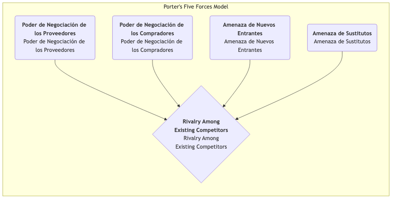

# Modelo de las Cinco Fuerzas de Porter

En una competencia empresarial feroz, la atractividad y la rentabilidad a largo plazo de una industria no están determinadas por un solo competidor, sino que están moldeadas por un ecosistema competitivo más amplio. **El Modelo de las Cinco Fuerzas de Porter** es un marco revolucionario propuesto por Michael E. Porter, experto en gestión estratégica de la Harvard Business School. Este modelo proporciona una poderosa herramienta analítica que ayuda a examinar sistemáticamente la estructura competitiva de cualquier industria y comprender las cinco fuerzas competitivas fundamentales que determinan el nivel promedio de beneficios en dicha industria.

La idea central de este modelo es que los estrategas corporativos deben mirar más allá de los competidores directos inmediatos y examinar el escenario competitivo más amplio. Estas cinco fuerzas interactúan para determinar la intensidad de la competencia dentro de la industria y cómo se crea y distribuye el valor en la cadena de la industria. Al comprender la fuerza de cada una de estas fuerzas, las empresas pueden encontrar su posición óptima dentro de la industria y formular estrategias que permitan evitar riesgos, aprovechar ventajas y, en última instancia, obtener una ventaja competitiva sostenible.

## Análisis de las Cinco Fuerzas Competitivas

El Modelo de las Cinco Fuerzas de Porter desglosa la competencia industrial en cinco dimensiones distintas, que conjuntamente determinan las "reglas del juego" en la industria.

1.  **Rivalidad entre competidores existentes**
    Esta es la base del Modelo de las Cinco Fuerzas, e indica la confrontación directa y la intensidad de la competencia entre las empresas ya establecidas en la industria. Cuando la competencia en la industria es intensa, las empresas suelen verse envueltas en guerras de precios, campañas publicitarias agresivas y carreras de innovación de productos, lo cual reduce el nivel general de beneficios de la industria.
    *   **Indicadores de una competencia intensa**: Muchos competidores de fuerza similar en la industria; crecimiento lento de la industria, lo que genera un "juego de suma cero"; productos muy similares y falta de diferenciación; altas barreras de salida que dificultan que las empresas con pérdidas abandonen el mercado.

2.  **Amenaza de nuevos competidores**
    Se refiere a la probabilidad de que nuevos competidores entren en una industria. Si una industria es rentable y tiene bajas barreras de entrada, actuará como un imán que atraerá a nuevos participantes, los cuales aportarán nueva capacidad y estarán ansiosos por capturar cuota de mercado, intensificando así la competencia.
    *   La **altura de las barreras de entrada** determina la intensidad de esta amenaza. Las barreras comunes incluyen: economías de escala, fuerte lealtad a la marca, altos costos de cambio para los clientes, grandes inversiones de capital, control sobre canales de distribución, políticas gubernamentales y restricciones regulatorias, y patentes de tecnología clave.

3.  **Amenaza de productos o servicios sustitutos**
    Se refiere a la amenaza proveniente de productos o servicios de **otras industrias** que pueden satisfacer las mismas necesidades del cliente. La existencia de sustitutos establece un "techo" para los precios generales en la industria.
    *   **Distinción importante**: Para una aerolínea, otra aerolínea es un **competidor**, mientras que el tren de alta velocidad y las conferencias por video son **sustitutos**. Cuanto mayor sea la relación costo-beneficio del sustituto y más bajos sean los costos para que los clientes cambien a él, mayor será la amenaza.

4.  **Poder de negociación de los proveedores**
    Se refiere a la capacidad de los proveedores (por ejemplo, proveedores de materias primas, componentes, mano de obra o servicios) para trasladar sus presiones de costos a las empresas dentro de la industria. Los proveedores poderosos pueden aumentar los precios, reducir la calidad o limitar el suministro, erosionando así los beneficios de la industria.
    *   **Indicadores de un fuerte poder de negociación de los proveedores**: La industria proveedora está altamente concentrada, controlada por unos pocos gigantes; los productos de los proveedores son únicos o diferenciados y difíciles de reemplazar; los costos de cambio para los compradores son extremadamente altos; para los proveedores, su industria no es su principal cliente.

5.  **Poder de negociación de los compradores**
    Se refiere a la capacidad de los clientes (compradores) para reducir precios, exigir mayor calidad o más servicios. Los compradores poderosos pueden obligar a las empresas dentro de la industria a competir entre sí, transfiriendo así valor de los productores a ellos mismos.
    *   **Indicadores de un fuerte poder de negociación de los compradores**: Los compradores están concentrados y realizan compras de gran volumen; los productos de la industria son estandarizados y no diferenciados; los compradores tienen bajos costos de cambio entre proveedores; los compradores pueden realizar una "integración hacia atrás" (es decir, producir ellos mismos los productos necesarios).

## Cómo aplicar el Modelo de las Cinco Fuerzas

1.  **Definir claramente los límites de la industria**
    En primer lugar, defina claramente qué industria está analizando. La definición de la industria no debe ser demasiado amplia ni demasiado estrecha.

2.  **Identificar los actores clave en las cinco fuerzas**
    Identifique específicamente quiénes son los principales actores en cada dimensión de fuerza. Por ejemplo, ¿quiénes son los principales proveedores, compradores, competidores, posibles nuevos entrantes y sustitutos?

3.  **Evaluar la intensidad potencial de cada fuerza**
    Analice y determine las causas raíz que llevan al fortalecimiento o debilitamiento de cada fuerza. Finalmente, realice una evaluación integral de la intensidad de cada fuerza (por ejemplo, fuerte, moderada, débil).

4.  **Análisis integral de la estructura de la industria**
    Combine los resultados de evaluación de las cinco fuerzas para determinar el panorama competitivo general y el potencial de beneficios a largo plazo de la industria. ¿Cuál o cuáles fuerzas son clave para determinar la rentabilidad de la industria?

5.  **Formular estrategias para mejorar la posición**
    Basándose en el análisis, considere qué acciones estratégicas puede tomar la empresa para "mejorar" su posición en la industria. Por ejemplo, ¿puede reducir el poder de negociación de los compradores construyendo una marca? ¿Puede construir barreras de entrada mediante innovación tecnológica? ¿Puede reducir el poder de negociación de los proveedores asegurando relaciones exclusivas con ellos?

## Casos de aplicación

**Caso 1: Industria mundial de bebidas gaseosas (por ejemplo, Coca-Cola y PepsiCo)**

*   **Rivalidad entre competidores existentes**: **Intensa**. La competencia entre los dos gigantes se refleja en múltiples aspectos como la marca, la distribución y la publicidad, pero evitan inteligentemente guerras de precios destructivas.
*   **Amenaza de nuevos entrantes**: **Débil**. La lealtad a la marca extremadamente alta, las vastas redes de distribución globales y las enormes inversiones en publicidad constituyen barreras insalvables para nuevos competidores.
*   **Amenaza de sustitutos**: **Moderada a fuerte**. El agua, los jugos, el té, el café, etc., son todos sustitutos, y los consumidores tienen muchas opciones.
*   **Poder de negociación de los proveedores**: **Débil**. Materias primas como el azúcar, el agua y los envases son productos básicos, y los proveedores están dispersos y no tienen poder de negociación.
*   **Poder de negociación de los compradores**: **Moderado**. Para los consumidores individuales finales, el poder de negociación es nulo. Pero para grandes minoristas (por ejemplo, Walmart, Carrefour) y canales de hostelería, tienen un fuerte poder de negociación.
*   **Conclusión**: La estructura de la industria es muy atractiva, y los dos gigantes han resistido eficazmente la presión de nuevos entrantes y proveedores construyendo barreras sólidas de marca y distribución, logrando así beneficios sostenidos y altos.

**Caso 2: Industria de computadoras personales (PC)**

*   **Rivalidad entre competidores existentes**: **Extremadamente intensa**. Los productos de múltiples marcas (Lenovo, HP, Dell, etc.) son altamente homogéneos, lo que lleva a continuas guerras de precios.
*   **Amenaza de nuevos entrantes**: **Moderada**. Aunque la marca y los canales requieren acumulación, los componentes clave pueden adquirirse, y las barreras de entrada no son insalvables.
*   **Amenaza de sustitutos**: **Fuerte**. Los teléfonos inteligentes y las tabletas están reemplazando muchas funciones de las computadoras personales.
*   **Poder de negociación de los proveedores**: **Fuerte**. Los componentes clave (por ejemplo, CPU y sistema operativo) están altamente concentrados en pocas empresas como Intel y Microsoft, las cuales controlan la mayor parte de los beneficios de la industria de PC.
*   **Poder de negociación de los compradores**: **Fuerte**. Tanto los consumidores individuales como los clientes corporativos tienen muchas opciones debido a la estandarización de los productos y son sensibles al precio.
*   **Conclusión**: Casi todas las cinco fuerzas en la industria de PC son desfavorables para los fabricantes, lo que lleva a un estado de bajos beneficios a largo plazo.

**Caso 3: Industria de restaurantes de alta gama en China**

*   **Rivalidad entre competidores existentes**: **Intensa**. Numerosos restaurantes, imitación grave y efecto de moda.
*   **Amenaza de nuevos entrantes**: **Fuerte**. Barreras de entrada relativamente bajas; cualquier persona con capital y chefs puede abrir un restaurante.
*   **Amenaza de sustitutos**: **Fuerte**. Restaurantes de gama media, comida para llevar, chefs privados, etc., son todas opciones alternativas.
*   **Poder de negociación de los proveedores**: **Moderado**. Para ingredientes comunes, hay muchos proveedores. Pero para ingredientes especiales de alta calidad y escasos, algunos proveedores pueden tener un fuerte poder de negociación.
*   **Poder de negociación de los compradores**: **Fuerte**. Los consumidores tienen muchas opciones, y los costos de cambio son cero.
*   **Conclusión**: La estructura competitiva de la industria de restaurantes de alta gama es deficiente, y la rentabilidad es muy difícil. La clave del éxito radica en construir marcas, platos y experiencias únicas para reducir el poder de negociación de los compradores y la competencia intra-industrial.

## Valor y limitaciones del Modelo de las Cinco Fuerzas

**Valor fundamental**

*   **Más allá de la competencia directa**: Proporciona una perspectiva más amplia para comprender la competencia, no centrándose únicamente en los rivales.
*   **Revela los impulsores de beneficios**: Ayuda a identificar los factores estructurales clave que determinan la rentabilidad a largo plazo de una industria.
*   **Orienta la posición estratégica**: Ofrece una hoja de ruta clara para que las empresas encuentren posiciones estratégicas favorables y moldeen estructuras industriales que les beneficien.

**Limitaciones potenciales**

*   **Visión estática**: El modelo en sí es estático y puede no capturar completamente la evolución dinámica de la estructura industrial (por ejemplo, cambios estructurales causados por la disrupción tecnológica).
*   **Ignora la "sexta fuerza"**: Algunos académicos argumentan que el modelo ignora el papel de los **complementarios**. Por ejemplo, el software y el hardware son complementarios; juntos crean valor.
*   **Límites industriales difusos**: En el ecosistema empresarial integrado de hoy, definir claramente los límites de la industria se está volviendo cada vez más difícil.

## Extensiones y conexiones

*   **Análisis PESTEL**: Puede usarse para analizar factores ambientales macro más amplios que influyen en las cinco fuerzas.
*   **Análisis de la cadena de valor**: Después de que el Modelo de las Cinco Fuerzas analice cómo se divide la "tarta" industrial, el análisis de la cadena de valor ayuda a las empresas a pensar cómo crear más "tarta" dentro de sus propias actividades.
*   **Análisis de grupos estratégicos**: Al analizar la competencia intra-industrial, las empresas dentro de la industria pueden dividirse en diferentes grupos estratégicos basados en similitudes estratégicas para un análisis más refinado.

---
*Fuente de referencia: Michael Porter elaboró sistemáticamente el Modelo de las Cinco Fuerzas en su artículo clásico "How Competitive Forces Shape Strategy", publicado en Harvard Business Review en 1979, y en su posterior libro "Competitive Strategy". El modelo sigue siendo un pilar inquebrantable en el campo de la gestión estratégica hoy en día.*