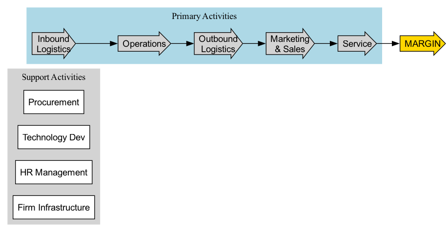

# Análisis de la Cadena de Valor

La razón fundamental por la cual una empresa puede obtener beneficios es que el **valor** que crea para sus clientes excede su **costo** en el proceso de creación de dicho valor. El **Análisis de la Cadena de Valor** es una poderosa herramienta analítica propuesta por Michael Porter, maestro en gestión estratégica. Esta herramienta considera a la empresa como una "cadena" compuesta por una serie de actividades que generan valor, con el objetivo de examinar y desglosar sistemáticamente dichas actividades para identificar de dónde proviene la ventaja competitiva de la empresa y en qué eslabones se pueden optimizar costos o crear diferenciación.

A diferencia del análisis tradicional que se centra únicamente en el producto final, el análisis de la cadena de valor proporciona un "microscopio" para examinar en profundidad las operaciones internas de la empresa. Divide todas las actividades empresariales en dos grandes categorías: **Actividades Primarias** y **Actividades de Apoyo**. Al analizar una por una estas actividades y sus interconexiones, los gerentes pueden ver claramente cómo fluye y aumenta el valor dentro de la empresa, encontrando así la clave para construir y mantener una ventaja competitiva sostenible.

## Componentes de la Cadena de Valor

Michael Porter divide sistemáticamente las actividades que generan valor en una empresa en nueve categorías interconectadas, formando un modelo universal de la cadena de valor.

1.  **Actividades Primarias**
    Estas son actividades directamente involucradas en la creación física del producto, su venta, entrega al comprador y servicio posventa.
    *   **Logística de Entrada**: Actividades relacionadas con la recepción, almacenamiento y distribución de insumos necesarios para la producción, como manejo de materiales, control de inventario.
    *   **Operaciones**: Actividades que transforman los insumos en productos finales, como mecanizado, ensamblaje, pruebas.
    *   **Logística de Salida**: Actividades involucradas en la recolección, almacenamiento y distribución de productos finales a los clientes, como almacenamiento de productos terminados, procesamiento de pedidos, transporte.
    *   **Mercadotecnia y Ventas**: Actividades que inducen y persuaden a los clientes a comprar el producto, como publicidad, promoción, fijación de precios, selección de canales.
    *   **Servicio**: Actividades que brindan apoyo para mantener o incrementar el valor del producto, como instalación, reparación, entrenamiento al cliente, manejo de quejas.

2.  **Actividades de Apoyo**
    Estas actividades no crean directamente el producto, pero agregan valor y mejoran la eficiencia al apoyar las actividades primarias.
    *   **Infraestructura Empresarial**: Incluye gestión general, planificación, finanzas, contabilidad, asuntos legales, etc., que apoyan toda la cadena de valor.
    *   **Gestión de Recursos Humanos**: Incluye reclutamiento, contratación, capacitación, desarrollo y compensación de empleados.
    *   **Desarrollo Tecnológico**: Actividades relacionadas con la mejora de productos y procesos, como investigación y desarrollo, diseño de productos, automatización de procesos.
    *   **Adquisiciones (Procurement)**: Se refiere a las actividades de compra de insumos utilizados a lo largo de la cadena de valor de la empresa, no solo materias primas.

## Cómo Realizar un Análisis de la Cadena de Valor

El objetivo de realizar un análisis de la cadena de valor suele ser lograr dos ventajas competitivas fundamentales: **ventaja de costos** o **ventaja de diferenciación**.

1.  **Paso 1: Descomponer las Actividades de la Cadena de Valor de la Empresa**
    Utilizando el marco mencionado anteriormente, identifique específicamente las actividades clave que realiza su empresa dentro de cada categoría. En diferentes industrias, ciertas actividades serán mucho más importantes que otras.

2.  **Paso 2: Identificar los Conductores de Costo y Buscar Ventaja de Costo**
    *   **Asignar Costos**: Asigne los costos totales de la empresa a cada actividad de valor tan precisamente como sea posible.
    *   **Identificar Conductores de Costo**: Analice qué factores impulsan el costo de cada actividad. ¿Es la economía de escala, la curva de aprendizaje, la utilización de la capacidad o la ubicación geográfica?
    *   **Buscar Oportunidades de Optimización**: Considere en qué puntos se pueden reducir costos mediante mejoras tecnológicas, optimización de procesos, fortalecimiento de relaciones con proveedores, etc., sin comprometer el valor.

3.  **Paso 3: Identificar los Conductores de Valor y Buscar Ventaja de Diferenciación**
    *   **Analizar el Valor para el Cliente**: Para cada actividad, considere cómo creamos valor único para los clientes. ¿Qué valor están dispuestos a pagar los clientes?
    *   **Identificar Conductores de Diferenciación**: Analice en qué actividades podemos crear diferenciación ofreciendo características únicas del producto, servicio superior, una imagen de marca fuerte o tiempos de respuesta más rápidos.
    *   **Buscar Oportunidades de Mejora**: Considere cómo construir y fortalecer la ventaja diferencial de la empresa mejorando ciertas actividades de valor (por ejemplo, I+D, marketing de marca, servicio al cliente).

4.  **Paso 4: Analizar las Conexiones en la Cadena de Valor**
    La fortaleza de la cadena de valor no solo radica en enfocarse en actividades individuales, sino también en las **conexiones** entre las actividades. Una optimización en un eslabón puede tener un profundo impacto en otro. Por ejemplo, invertir más en adquisiciones para comprar materias primas de mayor calidad podría reducir significativamente las tasas de defectos en las operaciones y los costos de reparación en el servicio posventa. Identificar y optimizar estas conexiones es clave para obtener ventaja competitiva.

## Casos de Aplicación

**Caso 1: Ventaja de Costo en la Cadena de Valor de IKEA**

*   **Estrategia Central**: Liderazgo en costos.
*   **Análisis de la Cadena de Valor**:
    *   **Desarrollo Tecnológico/Diseño del Producto**: Diseño modular y listo para ensamblar que facilita enormemente el transporte y el almacenamiento.
    *   **Adquisiciones (Procurement)**: Adquisiciones a gran escala a nivel global para obtener los costos más bajos de materias primas.
    *   **Logística de Salida/Servicio**: "Externaliza" de manera ingeniosa las actividades costosas de transporte y ensamblaje hacia los mismos clientes. Los clientes ahorran a IKEA costos enormes al recoger y ensamblar por sí mismos, obteniendo a cambio beneficios de precio.
    *   **Mercadotecnia y Ventas**: Atrae a los clientes mediante experiencias bien diseñadas en las tiendas y catálogos de productos, en lugar de anuncios costosos en televisión.

**Caso 2: Ventaja de Diferenciación en la Cadena de Valor de Starbucks**

*   **Estrategia Central**: Diferenciación.
*   **Análisis de la Cadena de Valor**:
    *   **Adquisiciones (Procurement)**: Insiste en adquirir globalmente granos de café arábica de la más alta calidad y establecer relaciones éticas con proveedores, lo cual es la base de su alta calidad.
    *   **Gestión de Recursos Humanos**: Invierte fuertemente en la capacitación de empleados ("socios") para garantizar que cada barista brinde un servicio estándar y profesional.
    *   **Operaciones/Mercadotecnia y Ventas**: Transforma las tiendas en un "tercer lugar" más allá del hogar y la oficina, ofreciendo un ambiente cómodo, acceso a Wi-Fi y una atmósfera comunitaria única, que forma parte de su producto central.
    *   **Servicio**: Ofrece bebidas personalizadas e interacción amigable con los clientes, creando una experiencia única de "Starbucks".

**Caso 3: Cadena de Valor Basada en Tecnología en Amazon**

*   **Estrategia Central**: Liderazgo en costos y diferenciación.
*   **Análisis de la Cadena de Valor**:
    *   **Desarrollo Tecnológico**: La inversión masiva en tecnología y análisis de datos es la base de todas sus ventajas. Algoritmos poderosos de recomendación, robots eficientes en almacenes, servicios en la nube AWS, todo proviene de aquí.
    *   **Logística de Entrada/Salida**: Construyó la red de almacenes y distribución más avanzada y eficiente del mundo (FBA), clave para lograr entregas rápidas y confiables (diferenciación) y bajos costos operativos (ventaja de costo).
    *   **Adquisiciones (Procurement)**: Posee un poder de negociación extremadamente fuerte frente a proveedores debido a la escala masiva de su plataforma.
    *   **Infraestructura Empresarial**: Cultura extremadamente eficiente basada en decisiones respaldadas por datos.

## Valor y Limitaciones del Análisis de la Cadena de Valor

**Valor Fundamental**

*   **Perspectiva Sistemática**: Proporciona un marco sistemático y completo para examinar las operaciones internas de una empresa, no solo sus estados financieros.
*   **Identifica el Origen de la Ventaja**: Puede ayudar a las empresas a identificar claramente dónde se construye su ventaja competitiva.
*   **Orienta la Asignación de Recursos**: Al identificar las actividades clave de valor, puede guiar a las empresas a invertir recursos más eficazmente donde puedan generar mayor valor.

**Limitaciones Potenciales**

*   **Dificultad en la Adquisición de Datos**: Asignar con precisión costos y activos a cada actividad de valor puede ser muy difícil en la práctica.
*   **Sesgo Interno**: El modelo se centra más en analizar las operaciones internas de la empresa, prestando relativamente menos atención al rol de los clientes en la co-creación de valor.
*   **Problemas de Aplicabilidad**: Para algunas industrias modernas de servicios o empresas basadas en plataformas que dependen fuertemente de efectos de red y el intercambio de conocimiento, el modelo tradicional lineal de la cadena de valor puede requerir ajustes y complementos.

## Extensiones y Conexiones

*   **Modelo de las Cinco Fuerzas de Porter**: Tras analizar con el Modelo de las Cinco Fuerzas el potencial de beneficio general de una industria, el análisis de la cadena de valor explora más profundamente cómo una empresa puede obtener beneficios dentro de esa industria a través de actividades únicas.
*   **Análisis FODA (SWOT)**: El análisis de la cadena de valor es la herramienta más poderosa para identificar **Fortalezas** y **Debilidades** internas al realizar un análisis FODA.
*   **Sistema de Valor**: La cadena de valor de una empresa no existe de forma aislada; está integrada en un sistema de valor más amplio que también incluye las cadenas de valor de proveedores upstream, canales downstream y, en última instancia, clientes. Analizar todo el sistema de valor puede revelar oportunidades más amplias de cooperación y optimización.

---
*Referencia Fuente: Michael Porter elaboró por primera vez el marco completo del análisis de la cadena de valor en su obra fundamental de 1985 "Competitive Advantage: Creating and Sustaining Superior Performance" (Ventaja Competitiva: Creación y Sostenimiento del Desempeño Superior). El modelo sigue siendo una herramienta central para el análisis estratégico y la gestión operativa.*