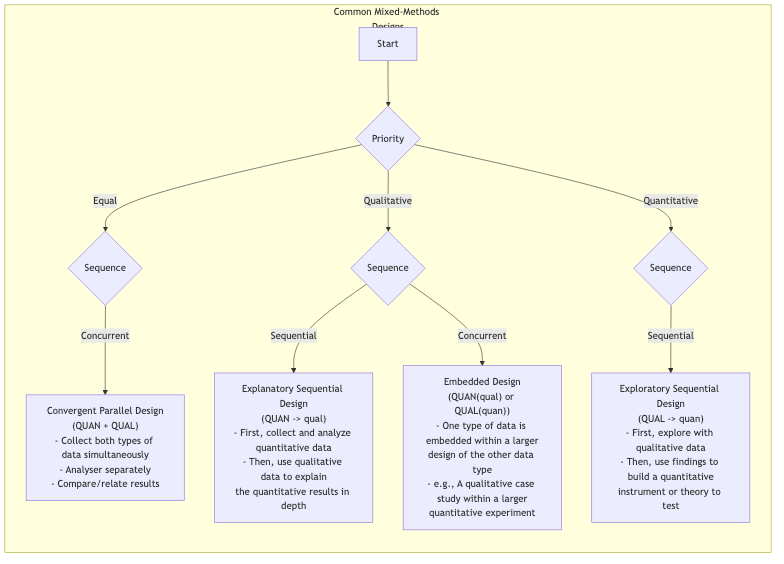

# Recherche Mixte

Dans le domaine de la recherche, il y a longtemps eu deux paradigmes dominants : **la recherche quantitative**, qui utilise les chiffres et les statistiques comme outils, visant une mesure objective et systématique des phénomènes sociaux et naturels ; et **la recherche qualitative**, qui se concentre sur le langage et le contexte, explorant les significations profondes de l'expérience humaine. Le premier poursuit l'objectivité et l'universalité, tandis que le second cherche la profondeur et le sens. Cependant, de plus en plus de chercheurs constatent qu'une méthode unique ressemble à un aveugle touchant un éléphant, n'atteignant qu'une partie de la réalité. **La Recherche Mixte** n'est pas apparue comme une simple addition des deux méthodes, mais comme une philosophie de recherche plus mature et sage.

Son idée centrale est d'intégrer stratégiquement et systématiquement à la fois les données quantitatives et qualitatives ainsi que leurs méthodes d'analyse au sein d'un même projet de recherche, afin d'obtenir une compréhension plus complète, approfondie et multidimensionnelle que ce que pourrait offrir une méthode isolée. Elle considère que les chiffres peuvent révéler l'étendue des phénomènes, tandis que les récits peuvent révéler la profondeur derrière ces phénomènes. La combinaison des deux rend les conclusions de la recherche plus solides et éclairantes.

## Pourquoi combiner ? L'effet synergique de la recherche

Le charme de la recherche mixte réside dans sa capacité à produire un effet synergique de type « 1+1>2 ». Selon l'objectif de l'intégration, sa valeur centrale se manifeste principalement dans les aspects suivants :

*   **Triangulation** : C'est l'objectif le plus courant. Elle consiste à utiliser les données d'une méthode pour vérifier ou corroborer les conclusions tirées d'une autre méthode. Si les résultats d'une enquête quantitative et les découvertes d'entretiens qualitatifs se corroborent mutuellement, la fiabilité des conclusions de la recherche sera considérablement renforcée.

*   **Complémentarité** : Utiliser les forces d'une méthode pour compenser les faiblesses d'une autre. Par exemple, utiliser des entretiens qualitatifs pour expliquer en profondeur une relation statistique inattendue découverte dans une enquête quantitative, nous permettant ainsi de savoir non seulement « quoi », mais aussi « pourquoi ».
*   **Développement** : Utiliser les résultats d'une méthode pour guider la mise en œuvre d'une autre. Par exemple, réaliser d'abord des entretiens qualitatifs exploratoires pour identifier les thèmes et variables clés, puis concevoir un questionnaire d'enquête à grande échelle plus ciblé basé sur ces résultats.
*   **Déclenchement** : Lorsque la recherche quantitative et qualitative produisent des résultats contradictoires ou paradoxaux, cela constitue en soi une découverte précieuse et significative. Cela peut remettre en question les théories existantes et inspirer une nouvelle réflexion et des recherches plus approfondies.

### Types principaux de conception mixte

La recherche mixte comporte divers modèles de conception, parmi lesquels les trois principaux sont :

## Comment réaliser une recherche mixte

1.  **Déterminer la nécessité de la recherche**
    Tout d'abord, clarifiez pourquoi une seule méthode est insuffisante pour répondre à votre question de recherche. Quel est l'objectif du mélange ? Est-ce pour la vérification, la complémentarité, le développement ou le déclenchement ? Une justification claire est un préalable au succès.

2.  **Choisir le bon modèle mixte**
    En fonction de votre objectif et de vos questions de recherche, sélectionnez le modèle d'intégration le plus approprié. Est-ce simultané (modèle convergent) ou séquentiel (modèle séquentiel) ? Quelle méthode doit précéder l'autre ?

3.  **Collecter et analyser les données par étapes**
    Selon le modèle choisi, exécutez systématiquement la collecte et l'analyse des données à chaque étape. Cela exige des chercheurs une maîtrise des compétences en recherche quantitative et qualitative.

4.  **Phase clé d'intégration**
    C'est le cœur et la partie la plus difficile de la recherche mixte. Vous devez relier de manière significative les deux types de données au « point d'intégration ». Cela peut impliquer de les comparer dans la discussion des résultats, d'utiliser des données qualitatives pour expliquer des groupes spécifiques dans les données quantitatives, ou de concevoir des items d'enquête quantitative à partir des résultats qualitatifs.

5.  **Tirer des conclusions intégrées**
    Les conclusions finales ne devraient pas être une simple liste des résultats quantitatifs et qualitatifs, mais plutôt des aperçus intégrés qui sont plus profonds et multidimensionnels, issus de la confrontation et de la fusion des deux approches.

## Cas d'application

**Cas 1 : Évaluation d'un nouveau programme d'avantages sociaux pour les employés**

* **Contexte** : Une entreprise a lancé un nouveau programme de travail flexible et souhaite évaluer son efficacité de manière globale.
* **Application (Modèle séquentiel explicatif : QUAN → qual)** :

    1. **Phase quantitative** : L'entreprise a d'abord distribué un questionnaire anonyme à tous les employés, recueillant des données quantitatives sur la fréquence d'utilisation du nouveau bénéfice, la satisfaction au travail, le stress professionnel, etc. Les données ont montré que la satisfaction globale a augmenté de manière significative, mais que l'augmentation chez les ingénieurs n'était pas évidente.

    2. **Phase qualitative** : Afin d'expliquer cette découverte « inattendue », les chercheurs ont mené des entretiens approfondis avec 10 ingénieurs. Les entretiens ont révélé que, en raison de la spécificité des cycles de projet, les ingénieurs avaient du mal à bénéficier réellement du travail flexible, et que les coûts de communication avaient même augmenté en raison de la nécessité de collaborer avec des collègues dont les horaires n'étaient pas flexibles.

    3. **Conclusion intégrée** : Le nouveau bénéfice a été globalement un succès, mais des mesures de soutien plus ciblées doivent être conçues pour des postes spécifiques (par exemple, les ingénieurs).

---

**Cas 2 : Développement d'une application sociale pour la Génération Z**

* **Contexte** : Une équipe de démarrage souhaite développer un produit social qui plaise vraiment à la Génération Z.
* **Application (Modèle séquentiel exploratoire : QUAL → quan)** :

    1. **Phase qualitative** : L'équipe a d'abord mené pendant un mois une étude de « ethnographie numérique » auprès de 20 utilisateurs de la Génération Z, observant et interviewant en profondeur leurs comportements sociaux en ligne, leur système d'argot et leurs besoins sociaux fondamentaux. L'étude a révélé que « les interactions sociales sans pression » et « l'identité de cercle » étaient deux besoins fondamentaux.

    2. **Phase quantitative** : À partir de ces observations qualitatives, l'équipe a conçu un questionnaire d'enquête à grande échelle pour vérifier l'universalité de ces besoins et tester l'attractivité de plusieurs concepts de produit développés à partir de ces derniers (par exemple, « messagerie éphémère », « correspondance par centres d'intérêt »). Les résultats de l'enquête ont montré que la fonctionnalité « correspondance par centres d'intérêt » a reçu le plus haut niveau d'attente.

    3. **Conclusion intégrée** : Le cœur du produit devrait être construit autour de la « correspondance par centres d'intérêt » et intégrer une philosophie de conception « sans pression ».

---

**Cas 3 : Étude de l'impact du changement climatique sur les moyens de subsistance des agriculteurs**

* **Contexte** : Une organisation internationale de développement souhaite comprendre l'impact spécifique du changement climatique sur les petits agriculteurs d'une certaine région.
* **Application (Modèle convergent : QUAN + QUAL)** :

    * L'équipe de recherche a **simultanément** mené deux tâches : d'une part, elle a collecté et analysé des données météorologiques et des rendements agricoles de la région sur les 20 dernières années (quantitatif) ; d'autre part, elle s'est rendue dans les villages et a mené des entretiens approfondis avec des agriculteurs âgés, écoutant leurs expériences liées aux changements climatiques, leurs stratégies d'adaptation et leurs préoccupations concernant l'avenir (qualitatif).

    * **Intégration** : Dans le rapport final, les courbes de déclin des rendements (quantitatif) ont été présentées aux côtés des récits émouvants et riches en sagesse de vie des agriculteurs âgés (qualitatif), révélant puissamment la gravité du changement climatique et fournissant des preuves solides aux décideurs politiques.

## Avantages et défis de la recherche mixte

**Avantages principaux**

*   **Complète et approfondie** : Permet de voir simultanément la « vue d'ensemble » et le « gros plan » d'un problème, conduisant à des conclusions plus convaincantes.
*   **Crédibilité accrue** : La vérification mutuelle entre différentes méthodes (triangulation) peut considérablement améliorer la fiabilité des conclusions de la recherche.
*   **Répond à des questions plus complexes** : Peut traiter des questions de recherche multi-niveaux et complexes que les méthodes individuelles ne peuvent pas aborder.

**Défis possibles**

*   **Conception complexe** : Nécessite une conception minutieuse des points d'intégration et des calendriers des deux méthodes.
*   **Exige beaucoup de temps et de main-d'œuvre** : Requiert généralement plus de temps, de ressources et de budget que la recherche par méthode unique.
*   **Exigences élevées en compétences** : Nécessite que les chercheurs ou les équipes de recherche maîtrisent à la fois les paradigmes de recherche quantitative et qualitative.
*   **Résultats potentiellement contradictoires** : Lorsque les deux méthodes produisent des conclusions incohérentes, expliquer et intégrer ces résultats devient un défi important (bien que cela puisse aussi être une opportunité de grandes découvertes).

## Extensions et connexions

*   **Recherche quantitative** et **Recherche qualitative** : Sont les deux modules constitutifs de base de la recherche mixte. Comprendre les fondements philosophiques et les détails techniques des deux est un préalable à la réalisation d'une recherche mixte.

---
*Référence : John W. Creswell est l'un des chercheurs les plus importants et prolifiques dans le domaine de la recherche mixte. Ses ouvrages, tels que « Research Design: Qualitative, Quantitative, and Mixed Methods Approaches », sont des lectures essentielles, à la fois introductives et avancées, dans ce domaine.*