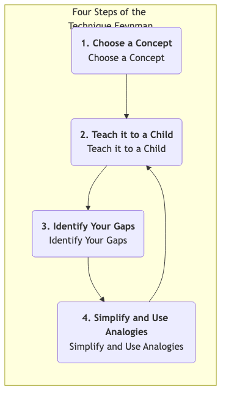

# La Technique de Feynman

Nous tombons souvent dans l'illusion de la "connaissance" : nous sommes capables de reconnaître un concept, d'en parler vaguement, voire de le souligner dans un livre, croyant à tort que nous le maîtrisons réellement. Cependant, lorsque nous devons expliquer clairement ce concept, à notre façon, à d'autres personnes, nous réalisons à quel point notre compréhension est fragmentée et imparfaite. La **technique de Feynman** est un modèle mental puissant et une stratégie d'apprentissage conçue pour briser cette illusion d'apprentissage et viser une **compréhension véritablement profonde**.

Cette méthode porte le nom du physicien lauréat du prix Nobel Richard Feynman, célèbre pour sa capacité à expliquer des concepts physiques extrêmement complexes à l'aide d'un langage incroyablement simple et intuitif. L'idée centrale de la technique de Feynman est que **le seul critère permettant de juger qu'une connaissance est véritablement comprise est la capacité de l'enseigner à quelqu'un n'ayant aucune connaissance du domaine, en utilisant le langage le plus simple et le plus clair possible**. Il ne s'agit pas d'une méthode passive d'apprentissage, mais d'un traitement profond actif, un "apprentissage par l'enseignement" qui nous force à confronter toutes les ambiguïtés et lacunes logiques de notre système de connaissances.

## Les Quatre Étapes Clés de la Technique de Feynman

La technique de Feynman est extrêmement simple dans son déroulement, mais chaque étape recèle des principes profonds de psychologie cognitive.

1.  **Étape Un : Choisir un Concept à Apprendre (Choisir un Concept)**
    *   Prenez une feuille blanche ou ouvrez un document vierge, et écrivez en haut, en gros caractères, le nom du concept que vous souhaitez comprendre en profondeur. Par exemple, "Blockchain", "Utilité Marginale", ou encore "Théorème de Bayes".

2.  **Étape Deux : Imaginez que vous l'expliquez à un Enfant (L'expliquer à un Enfant)**
    *   C'est ici l'essence même de la technique de Feynman. Sur la feuille, faites comme si vous expliquiez ce concept à un enfant intelligent de 12 ans, sans connaissance préalable du sujet. **Utilisez votre propre langage, le plus simple et le plus clair possible**, pour rédiger votre compréhension du concept.
    *   **Point clé** : Durant ce processus, **interdiction absolue** d'utiliser des termes complexes ou du jargon tirés du matériel d'origine. Si vous trouvez nécessaire d'utiliser un terme technique, cela signifie que votre compréhension de ce terme n'est pas suffisamment approfondie, et vous devez d'abord l'expliquer clairement.

3.  **Étape Trois : Réviser et Identifier ses Lacunes (Identifier ses Lacunes)**
    *   Une fois votre explication terminée, relisez attentivement et honnêtement ce que vous avez écrit. Durant ce processus, vous découvrirez inévitablement certains points où :
        *   Vous butez et n'êtes pas fluide.
        *   Vous vous rendez compte que vous répétez simplement des définitions sans pouvoir fournir d'exemple concret.
        *   Vous ne parvenez pas à expliquer clairement les liens logiques entre les concepts.
        *   Vous utilisez inconsciemment beaucoup de jargon technique.
    *   Tous ces endroits où vous "buttez" sont les **véritables points faibles et lacunes dans votre système de connaissances et votre compréhension**. Soulignez-les tous.

4.  **Étape Quatre : Retourner à la Source, Simplifier et Utiliser des Analogies (Retourner à la Source, Simplifier et Utiliser des Analogies)**
    *   Pour toutes les lacunes de compréhension identifiées à l'étape précédente, **retournez à** vos supports d'apprentissage (livres, articles, cours, etc.) et étudiez de manière plus ciblée et approfondie jusqu'à pleinement comprendre ces points problématiques.
    *   Ensuite, essayez à nouveau de réorganiser et simplifier votre explication en utilisant un langage encore plus simple, des **analogies** ou métaphores plus vivantes. Une bonne analogie est un pont reliant des concepts abstraits au monde connu.
    *   **Répétez ce processus** jusqu'à ce que vous soyez finalement capable d'expliquer parfaitement le concept sur une seule feuille, en utilisant un langage simple, fluide et logiquement cohérent.

## Cas d'Application

**Cas Un : Apprendre "Qu'est-ce qu'une API (Application Programming Interface) ?"**

1. **Étape Un** : Écrivez "API" sur la feuille.
2. **Étape Deux (Première tentative d'explication)** : "Une API est un intermédiaire logiciel permettant à deux applications de communiquer entre elles. Il s'agit d'un ensemble de routines, de protocoles et d'outils utilisés pour construire des logiciels applicatifs..." (vous réalisez que vous récitez simplement une définition de Wikipédia, très rigide).
3. **Étape Trois (Identifier les lacunes)** : Vous ne parvenez pas à expliquer ce qu'étaient "intermédiaire" et "routines", et cette explication était trop abstraite pour un enfant.
4. **Étape Quatre (Simplifier et utiliser des analogies)** : Vous avez besoin d'une bonne analogie. **Le processus de commande au restaurant !**
    *   **(Deuxième tentative d'explication)** : "Imaginez que vous allez au restaurant. Vous (une application) ne pouvez pas aller directement dans la cuisine (le système backend d'une autre application) pour dire au chef ce que vous souhaitez manger. Vous avez besoin d'un **serveur (API)**. Vous regardez la **carte (documentation de l'API)**, qui liste tous les plats disponibles (les fonctions offertes par l'API). Vous dites au serveur que vous voulez du Poulet Kung Pao (vous envoyez une requête API). Le serveur transmet votre commande au chef dans un langage que la cuisine comprend. Enfin, le serveur vous apporte le plat préparé (les données renvoyées par le système). Dans ce processus, vous n'avez pas besoin de savoir comment fonctionne la cuisine en interne ; le serveur constitue l'interface de communication standardisée qui vous relie à la cuisine."
    *   Cette explication est claire, simple et facile à comprendre.

**Cas Deux : Comprendre un Événement Historique Complexe, comme la "Rébellion d'An Lushan"**

1. **Étape Un** : Écrivez "Rébellion d'An Lushan".
2. **Étape Deux** : Essayez d'expliquer cet événement à un élève du primaire qui sait seulement que la dynastie Tang était très puissante.
3. **Étape Trois (Identifier les lacunes)** : Vous pourriez découvrir que vous savez seulement qu'An Lushan et Shi Siming se sont rebellés, mais que vous ne pouvez pas expliquer "pourquoi" ils l'ont fait ? Qu'entend-on exactement par "séparatisme des fanzhen" ? Pourquoi l'armée Tang n'a-t-elle pas réussi à les battre au départ ?
4. **Étape Quatre** : Avec ces questions, retournez aux sources et clarifiez les causes profondes, telles que "l'effondrement du système Fubing", la "montée du système de recrutement", et le "pouvoir excessif des jiedushi" à la mi-fin de la dynastie Tang. Ensuite, vous pouvez utiliser une analogie plus vivante, par exemple : "C'est comme si le PDG d'une grande entreprise (l'empereur) donnait trop de pouvoir (pouvoir militaire, financier, humain) à plusieurs filiales (fanzhen), et en conséquence, les directeurs généraux de ces filiales (jiedushi) devenaient leurs propres patrons et n'écoutaient plus le siège social."

**Cas Trois : Préparer une Démonstration Importante d'un Produit**

1. **Étape Un** : Choisissez les fonctionnalités clés de votre produit.
2. **Étape Deux** : Faites semblant d'expliquer à votre grand-mère ce que fait votre produit et quel problème il résout dans sa vie.
3. **Étape Trois (Identifier les lacunes)** : Vous réaliserez immédiatement à quel point les mots à la mode que vous utilisez habituellement sont vides et difficiles à comprendre, comme "valorisation", "boucle fermée", et "dépassement".
4. **Étape Quatre** : Ce processus vous obligera à affiner votre présentation du produit en utilisant un langage aussi simple que possible, en vous concentrant sur la valeur utilisateur. En fin de compte, votre démonstration sera extrêmement claire et persuasive.

## Avantages et Défis de la Technique de Feynman

**Avantages Principaux**

1. **Construit une compréhension profonde et durable** : Grâce à un apprentissage actif basé sur la production, la reconnaissance superficielle se transforme en compréhension profonde.
2. **Identifie précisément les lacunes en connaissances** : Le processus d'"expliquer à un enfant" agit comme une "machine à rayons X" des connaissances, révélant toutes vos zones mal comprises.
3. **Améliore les compétences d'expression claire et de communication** : C'est l'entraînement ultime pour la capacité à simplifier, à utiliser des analogies et à communiquer clairement.

**Défis Potentiels**

1. **Temps et efforts requis** : Comparé à la simple lecture surlignée ou à la prise de notes passive, la technique de Feynman demande plus de temps et d'efforts mentaux.
2. **Nécessite une grande honnêteté** : Vous devez être suffisamment honnête envers vous-même pour reconnaître bravement et affronter les lacunes de votre système de connaissances, plutôt que de vous mentir à vous-même.

## Extensions et Liens

1. **Apprentissage par la Pratique/l'Enseignement** : La technique de Feynman est l'une des méthodes pratiques les plus classiques et efficaces du concept d'"apprentissage par la pratique/l'enseignement".
2. **Pensée en Premiers Principes** : La technique de Feynman illustre également, dans une certaine mesure, la pensée en premiers principes. Elle exige de ne pas se contenter de termes superficiels et complexes, mais de revenir à la logique et aux faits les plus fondamentaux et simples d'un concept.

---
*Référence : Bien que cette méthode d'apprentissage porte le nom de Richard Feynman et incarne profondément sa manière de penser, elle n'a pas été formellement proposée par lui-même. Elle a été élaborée par des apprenants et des éducateurs ultérieurs, résumant le style d'enseignement et de réflexion unique de Feynman. Des blogueurs spécialisés dans le domaine de l'apprentissage, tels que Scott H. Young, ont joué un rôle important dans la diffusion de cette méthode.*