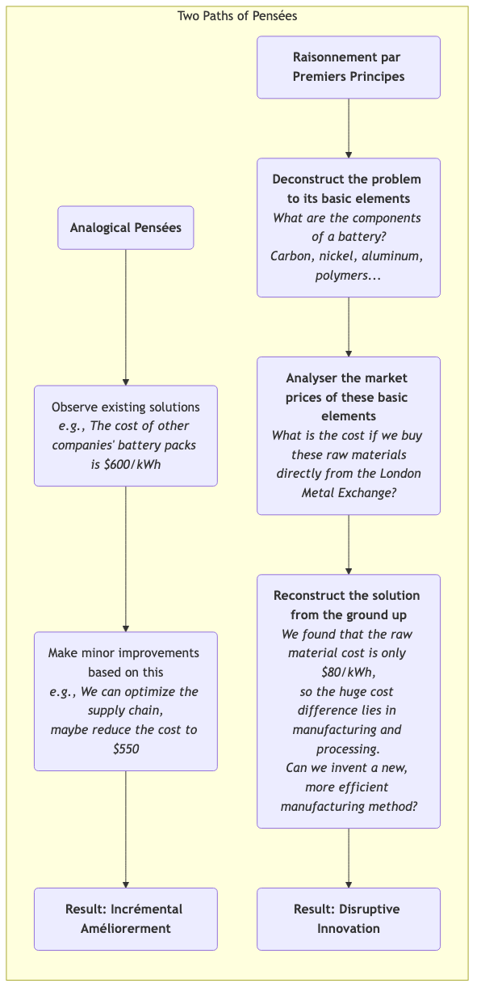

# Pensée par les Premiers Principes

Face à des problèmes complexes ou lorsqu'on recherche des innovations révolutionnaires, la plupart d'entre nous ont tendance à penser par **analogie**. Nous observons ce que les autres font ou comment nous avons fait les choses dans le passé, puis nous apportons de petites améliorations incrémentales à partir de cela. Bien que cette approche soit souvent efficace, elle peut aussi agir comme une cage invisible, enfermant notre réflexion dans des cadres existants et éprouvés, rendant difficile une véritable innovation disruptive. La **pensée par les premiers principes** propose une voie contrastante et plus profonde.

Les premiers principes, un concept issu de la physique et de la philosophie, reposent sur **le retour aux axiomes ou faits les plus fondamentaux et évidents d'eux-mêmes concernant une situation, puis sur une déduction logique ascendante, couche après couche, jusqu'à trouver une solution nouvelle et fondamentale**. Il ne s'agit pas d'ajouter quelques épices à une recette existante, mais plutôt, comme un chef, de déconstruire un plat en ses molécules et éléments de base (comme les protéines, les graisses, l'acidité, la douceur), puis, à partir de ces éléments fondamentaux, de créer un plat inédit. Elon Musk est le plus célèbre défenseur et praticien de la pensée par les premiers principes dans le monde des affaires moderne, l'ayant utilisée pour bouleverser des industries traditionnelles comme l'aérospatiale et l'automobile.

## Premiers principes vs. Pensée analogique

La meilleure façon de comprendre les premiers principes est de les comparer à la pensée analogique, à laquelle nous sommes plus habitués.

*   **Pensée analogique** :
    *   **Logique** : « Puisque tout le monde le fait ainsi, ou que nous l'avons toujours fait ainsi, nous devrions aussi le faire ainsi, avec quelques améliorations mineures. »
    *   **Caractéristiques** : Rapide, simple, faible risque, mais sujette à une rigidité mentale, entraînant une « dépendance au chemin » et rendant les percées fondamentales difficiles.
    *   **Exemple** : Avant l'arrivée des smartphones, les fabricants de téléphones mobiles innovaient généralement en ajoutant des pixels à l'appareil photo, en changeant la couleur du boîtier ou en ajoutant quelques fonctionnalités logicielles aux téléphones à clavier existants.

*   **Pensée par les premiers principes** :
    *   **Logique** : « Oublions temporairement la façon dont les autres s'y prennent. Quels sont les faits fondamentaux dont nous sommes certains concernant ce problème ? Que pouvons-nous en déduire ? À quoi ressemblerait une solution idéale, sans être limitée par les conditions existantes ? »
    *   **Caractéristiques** : Longue, laborieuse, nécessite une profonde compréhension et un fort raisonnement logique, mais permet de percer la complexité superficielle pour atteindre l'essence du problème, menant à une innovation disruptive.
    *   **Exemple** : Lorsque Apple a conçu le premier iPhone, elle n'a pas cherché à améliorer le clavier. Au contraire, elle est revenue au premier principe de « l'interaction homme-machine » — la méthode d'interaction la plus directe et intuitive est le doigt. À partir de cela, elle a créé un nouveau paradigme d'interaction basé sur un grand écran tactile multipoint.

### Différences entre les styles de pensée

## Comment pratiquer la pensée par les premiers principes

La pratique des premiers principes peut généralement suivre un processus de questionnement « socratique » en trois étapes :

1.  **Étape un : Identifier et déconstruire vos croyances ou problèmes actuels**
    *   **Question** : « Pour cette croyance que nous tenons pour acquise (par exemple, "les batteries sont chères"), quelles sont les hypothèses sous-jacentes ? Pourquoi pensons-nous ainsi ? »
    *   **Action** : Comme en épluchant un oignon, décomposez les couches du problème, en divisant continuellement un problème complexe jusqu'à atteindre les éléments ou faits les plus fondamentaux qui ne peuvent plus être décomposés. Ce processus vous demande de poser constamment la question « pourquoi », comme un enfant curieux mais persévérant.

2.  **Étape deux : Mettre en cause les hypothèses fondamentales, rechercher la vérité**
    *   **Question** : « Ces éléments fondamentaux que nous considérons comme des "faits" sont-ils vraiment des faits ? S'agit-il de vérités basées sur des lois physiques, ou simplement de pratiques industrielles anciennes ou d'opinions d'autrui ? »
    *   **Action** : Examinez et vérifiez de manière indépendante et critique chacun des éléments fondamentaux que vous avez décomposés. Cherchez des données et preuves directes provenant de domaines variés, et séparez complètement les faits des opinions.

3.  **Étape trois : Reconstruire à partir d'une base solide**
    *   **Question** : « Maintenant que nous disposons d'un ensemble de faits fondamentaux vérifiés, si nous oublions toutes les méthodes passées et que nous démarrons uniquement à partir de ces faits fondamentaux, quel type de nouvelle solution, meilleure, pouvons-nous construire ? »
    *   **Action** : Il s'agit d'un processus créatif et logiquement cohérent de reconstruction. Vous concevrez votre produit, votre processus ou votre stratégie à partir d'un point de départ nouveau, plus simple et plus fondamental.

## Cas d'application

**Cas un : SpaceX d'Elon Musk**

*   **Croyance traditionnelle (pensée analogique)** : Le coût de fabrication des fusées est extrêmement élevé, parce que historiquement, les fusées de tous les pays et entreprises l'ont été.
*   **Analyse par les premiers principes** :
    1.  **Déconstruction** : Musk a posé la question : « De quels matériaux sont faites les fusées ? » Réponse : alliage d'aluminium aéronautique, titane, cuivre, fibre de carbone, etc.
    2.  **Mise en cause et vérité** : Il a ensuite analysé les prix du marché de ces matières premières et découvert que le coût des matières premières d'une fusée ne représentait que environ 2 % de son coût total.
    3.  **Reconstruction** : Il est arrivé à une conclusion surprenante : la majeure partie du coût d'une fusée provient de la fabrication, du traitement et des maillons de la chaîne d'approvisionnement encombrants, ainsi que du modèle « usage unique ». Ainsi, l'innovation centrale de SpaceX a consisté à **rechercher et fabriquer indépendamment la plupart des composants de la fusée**, et finalement à réussi à **récupérer et réutiliser les fusées**, réduisant les coûts de lancement d'un ordre de grandeur.

**Cas deux : La pensée en investissement de Charlie Munger**

*   **Contexte** : En tant que partenaire de longue date de Warren Buffett, Charlie Munger est un fervent pratiquant des premiers principes.
*   **Application** : Lorsqu'il analyse une entreprise, il n'écoute pas les notes des analystes ou les sujets à la mode sur le marché. Il revient aux questions fondamentales : « Quelle est l'essence du modèle économique de cette entreprise ? La valeur qu'elle crée pour ses clients est-elle durable ? À quel point est profonde sa barrière de protection (moat) ? » Il construit un « modèle mental multidisciplinaire » composé de principes fondamentaux provenant de différentes disciplines (psychologie, économie, histoire, etc.) afin d'émettre des jugements fondamentaux et interdisciplinaires sur une opportunité d'investissement.

**Cas trois : Repenser l'« éducation »**

*   **Croyance traditionnelle (pensée analogique)** : L'éducation est simplement « des enseignants qui font cours devant, des élèves qui écoutent en dessous », puis tester les résultats d'apprentissage par des examens.
*   **Analyse par les premiers principes** :
    1.  **Déconstruction** : Quel est le but essentiel de l'éducation ? Permettre aux apprenants d'acquérir des connaissances, développer des compétences et cultiver une pensée critique.
    2.  **Mise en cause et vérité** : L'endoctrinement unidirectionnel est-il la manière la plus efficace d'apprendre ? Pas nécessairement. Les neurosciences nous disent qu'un apprentissage actif, basé sur la résolution de problèmes et intégrant la pratique, est plus efficace. Les tests standardisés mesurent-ils vraiment les compétences réelles ? Pas nécessairement.
    3.  **Reconstruction** : À partir de ces premiers principes, nous pouvons imaginer de nouveaux modèles éducatifs, tels que : l'apprentissage par projet (PBL), les classes inversées, et des systèmes d'évaluation qui se concentrent davantage sur l'évaluation du processus et la certification des compétences.

## Avantages et défis de la pensée par les premiers principes

**Avantages principaux**

*   **Génère une innovation disruptive** : C'est l'outil de réflexion le plus puissant pour sortir des améliorations incrémentales et atteindre des percées fondamentales.
*   **Atteint l'essence du problème** : Vous aide à percer la superficialité et le brouillard traditionnel des choses, pour voir l'essence du problème et ses facteurs moteurs centraux.
*   **Construit une compréhension véritable** : Grâce à une déduction personnelle, vous construirez une compréhension bien plus profonde et véritablement vôtre d'un domaine, plutôt que de simplement « mémoriser des conclusions ».

**Défis potentiels**

*   **Coût cognitif extrêmement élevé** : Nécessite un investissement important de temps et d'intellect pour une recherche approfondie et un raisonnement logique, ce qui est très « contre-intuitif ».
*   **Nécessite une large connaissance** : Décomposer un problème en ses éléments les plus fondamentaux nécessite souvent des connaissances interdisciplinaires.
*   **Résistance au défi des traditions** : Les conclusions tirées des premiers principes remettent souvent en question les pratiques existantes dans l'industrie et les points de vue autoritatifs, ce qui peut rencontrer une résistance importante dans le monde réel.

## Extension et lien

*   **5 Whys** : Un outil simple mais efficace pour pratiquer les premiers principes. En posant continuellement la question « pourquoi », il peut nous aider à creuser plus profondément et à approcher la cause fondamentale d'un problème.
*   **Pensée systémique** : Les premiers principes se concentrent sur la « déconstruction » d'un système en ses éléments les plus fondamentaux ; la pensée systémique, quant à elle, se concentre davantage sur la façon dont ces éléments « s'interconnectent et interagissent ». Combiner les deux peut mener à une compréhension plus complète.

---
*Référence source : Le concept des premiers principes provient du philosophe grec antique Aristote, qui les définissait comme « le premier fondement à partir duquel une chose est connue ». De nos jours, le physicien Richard Feynman a également fortement défendu cette manière de penser qui « fait appel à des principes fondamentaux plutôt qu'à des formules empiriques ». Et les brillantes explications d'Elon Musk dans de nombreuses interviews ont grandement contribué à la diffusion de cette pensée dans les domaines de la technologie et des affaires.*