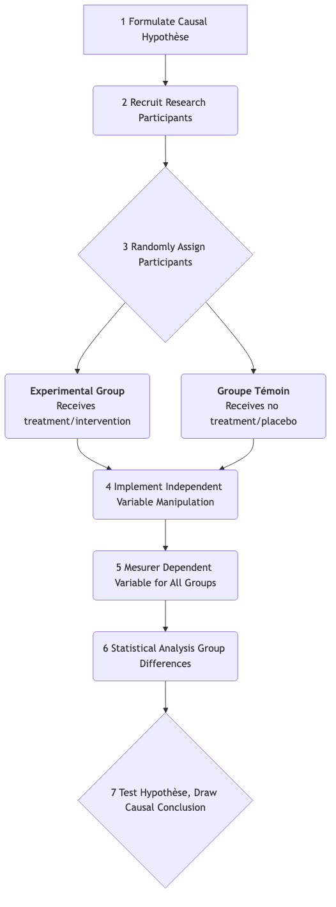

# Recherche Expérimentale

Parmi toutes les méthodes d'investigation scientifique, la **recherche expérimentale** est la norme dorée la plus proche pour révéler la **causalité** des phénomènes. Elle ne se contente pas d'observer le monde, mais intervient activement et systématiquement dans le monde réel pour vérifier si un changement dans un facteur "provoque" un changement dans un autre. Lorsque vous souhaitez répondre de manière définitive à des questions telles que "Est-ce à cause de A que B s'est produit ?", la recherche expérimentale fournit le cadre logique le plus rigoureux et le plus puissant.

Son idée centrale repose sur le **contrôle**. Les chercheurs manipulent précisément une ou plusieurs **variables indépendantes** dans un environnement hautement contrôlé et observent les effets mesurables de cette manipulation sur les **variables dépendantes**, tout en contrôlant strictement ou en randomisant toutes les autres variables potentiellement influentes. C'est précisément ce contrôle et cette manipulation rigoureux des variables qui permettent à la recherche expérimentale d'aller au-delà de la "corrélation" pour établir des conclusions "causales".

## Éléments Clés de la Recherche Expérimentale

Une étude expérimentale standardisée doit inclure les composantes fondamentales suivantes, qui ensemble forment sa chaîne logique rigoureuse.

*   **Hypothèse** : Une déclaration testable concernant la relation causale entre les variables indépendantes et dépendantes. Par exemple, "La consommation de caféine (variable indépendante) peut améliorer les résultats des participants (variable dépendante) dans un test de mémoire."
*   **Manipulation** : Les chercheurs doivent activer le changement du niveau de la variable indépendante. Par exemple, donner des pilules de caféine à un groupe de participants et un placebo sans caféine à un autre groupe.
*   **Contrôle** : C'est l'essence de l'expérience. Les chercheurs doivent éliminer ou maintenir constants tous les autres facteurs susceptibles d'affecter la variable dépendante (c'est-à-dire les **variables parasites**) autant que possible. La méthode de contrôle la plus cruciale est **l'assignation aléatoire** des participants aux différents groupes expérimentaux.
*   **Groupe Expérimental vs. Groupe Témoin** :
    *   **Groupe Expérimental** : Le groupe qui reçoit la manipulation de la variable indépendante (c'est-à-dire le "traitement" ou "intervention").
    *   **Groupe Témoin** : Le groupe qui ne reçoit pas le traitement, ou qui reçoit un "traitement nul" (par exemple, un placebo). La présence d'un groupe témoin fournit une référence de base pour la comparaison ; sans lui, nous ne pourrions pas déterminer si les changements observés sont réellement causés par la variable indépendante.

### Schéma de Conception Expérimentale Réelle

## Comment Concevoir et Réaliser une Expérience

1.  **Formuler une Hypothèse Causale**
    Sur la base de théories ou d'observations, définir clairement la relation causale que vous souhaitez tester. Par exemple, "L'apprentissage avec une nouvelle application pédagogique (variable indépendante) améliore-t-il plus efficacement les résultats des étudiants à des tests (variable dépendante) que les méthodes pédagogiques traditionnelles ?"

2.  **Opérationnaliser les Variables**
    Transformer les variables abstraites en opérations concrètes et mesurables. Par exemple, "utiliser la nouvelle application pédagogique" est spécifiquement défini comme "une utilisation quotidienne de l'application pendant 30 minutes d'apprentissage interactif" ; les "résultats aux tests" sont définis comme "les notes à un examen final standardisé."

3.  **Recruter et Affecter Aléatoirement les Participants**
    Recruter un groupe de participants éligibles (par exemple, "étudiants d'un certain niveau"), puis les affecter aléatoirement au groupe expérimental et au groupe témoin à l'aide de méthodes comme le lancer d'une pièce ou des tables de nombres aléatoires.

4.  **Mettre en Œuvre l'Intervention**
    Les étudiants du groupe expérimental apprennent en utilisant la nouvelle application pédagogique conformément aux prescriptions. Ceux du groupe témoin continuent à utiliser les méthodes traditionnelles (par exemple, lire des manuels). Veiller à ce que les deux groupes soient aussi homogènes que possible sur les autres conditions (par exemple, temps total d'étude, enseignants, etc.).

5.  **Mesurer les Résultats**
    À l'issue de la période expérimentale (par exemple, un semestre), administrer un test standardisé à tous les participants et enregistrer leurs résultats.

6.  **Analyser les Données**
    Utiliser des outils statistiques (par exemple, test t ou ANOVA) pour comparer s'il existe une différence statistiquement significative entre les moyennes des résultats des groupes expérimental et témoin. Si la moyenne du groupe expérimental est significativement plus élevée que celle du groupe témoin, on peut conclure avec un certain niveau de confiance que la nouvelle application pédagogique a "causé" l'amélioration des résultats.

## Cas d'Application

**Cas 1 : Tester l'Expérience Utilisateur d'une Conception Web**

*   **Scénario** : Un designer web pense que déplacer le bouton d'inscription du haut vers le bas de la page peut réduire la distraction des utilisateurs, augmentant ainsi le taux de lecture complète des articles.
*   **Expérience** : Diviser aléatoirement 10 000 nouveaux visiteurs en deux groupes. Le groupe A voit l'ancienne page web avec le bouton en haut, tandis que le groupe B voit la nouvelle page avec le bouton en bas. En analysant les données du backend, le designer a constaté que les utilisateurs du groupe B avaient une profondeur de défilement moyenne et un taux de lecture complète significativement plus élevés que ceux du groupe A. Cela a confirmé son hypothèse causale.

**Cas 2 : Tester l'Efficacité d'un Engrais en Agriculture**

*   **Scénario** : Un agronome a développé un nouvel engrais écologique, affirmant qu'il peut augmenter le rendement du blé.
*   **Expérience** : Il a sélectionné un champ expérimental homogène et l'a divisé en 20 parcelles. Dix parcelles ont été choisies aléatoirement pour recevoir le nouvel engrais (groupe expérimental), tandis que les 10 autres ont reçu une quantité égale d'engrais traditionnel (groupe témoin). À la récolte, il a mesuré le rendement en blé de chaque parcelle. En comparant les rendements moyens des deux groupes, il a pu déterminer scientifiquement l'effet du nouvel engrais.

**Cas 3 : L'Expérience du "Guimauve" en Psychologie**

*   **Scénario** : Le psychologue Walter Mischel souhaitait étudier l'effet de la capacité des enfants à reporter une gratification (variable indépendante) sur leur succès futur (variable dépendante).
*   **Expérience** : Il a proposé aux enfants un choix : manger une guimauve immédiatement, ou attendre 15 minutes et en obtenir deux. Il s'agit d'une conception quasi-expérimentale classique. Il a suivi ces enfants pendant des décennies et a constaté que ceux qui avaient attendu plus longtemps réussissaient généralement mieux dans leurs études, leur carrière et d'autres domaines. Cette expérience a révélé un lien causal profond entre le contrôle de soi et le succès à long terme.

## Avantages et Limites de la Recherche Expérimentale

**Avantages Principaux**

*   **Capacité de Déduction Causale Forte** : Parmi toutes les méthodes de recherche, c'est celle qui est la plus efficace pour établir des relations causales entre les variables.
*   **Reproductibilité Élevée** : Les procédures standardisées et le contrôle précis des variables rendent les expériences faciles à reproduire et à vérifier par d'autres chercheurs.
*   **Précision** : Permet de mesurer précisément l'ampleur de l'effet de la variable indépendante sur la variable dépendante.

**Limites Potentielles**

*   **Problèmes de Validité Externe** : L'environnement hautement contrôlé en laboratoire peut s'éloigner considérablement du monde réel complexe et dynamique, rendant difficile la généralisation des conclusions expérimentales à des situations réelles (c'est-à-dire une faible "validité écologique").
*   **Contraintes Éthiques** : De nombreuses questions de recherche (par exemple, étudier l'impact des mauvais traitements sur le développement de l'enfant) sont absolument interdites d'utilisation de méthodes expérimentales pour des raisons éthiques.
*   **Difficulté de Mise en Œuvre et Coût Élevé** : Concevoir et réaliser une recherche expérimentale rigoureuse nécessite généralement des ressources, du temps et une expertise significatives.
*   **Effet Hawthorne** : Les participants peuvent modifier leurs comportements naturels parce qu'ils savent qu'ils sont étudiés, affectant ainsi les résultats expérimentaux.

## Extensions et Liens

*   **Recherche Quasi-Expérimentale** : Lorsque l'assignation aléatoire complète n'est pas possible (par exemple, étudier les différences entre les élèves de deux classes différentes), les chercheurs utilisent des conceptions quasi-expérimentales. Elle implique toujours manipulation et contrôle, mais la force de l'inférence causale est plus faible que dans les vraies expériences.
*   **Recherche Corrélationnelle** : Lorsque les expériences ne peuvent pas être réalisées, la recherche corrélationnelle peut être une alternative pour identifier des associations entre les variables, mais elle ne peut pas établir de conclusions causales.

---
*Référence Source : Les fondements philosophiques des méthodes expérimentales ont été posés par des philosophes tels que David Hume et John Stuart Mill. L'ouvrage "Experimental and Quasi-Experimental Designs for Research" de Donald T. Campbell et Julian C. Stanley est une œuvre majeure dans ce domaine.*