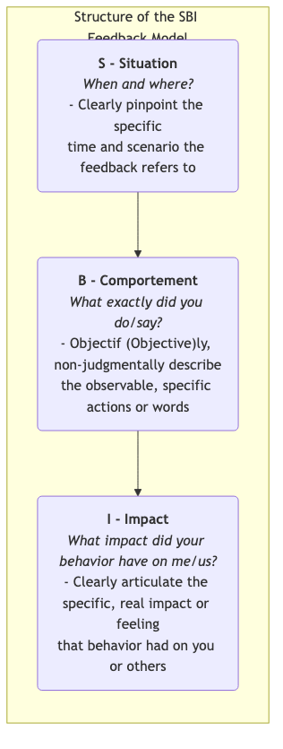

# Modèle de retour d'information SBI

Dans la collaboration d'équipe et le développement personnel, le **retour d'information** (feedback) est une source essentielle de motivation. Cependant, des méthodes inappropriées de retour d'information peuvent avoir l'effet inverse. Un retour vague (par exemple, « Tu as bien fait ») ne fournit aucune indication concrète, tandis qu'un retour trop subjectif ou critique (par exemple, « Tu es trop négligent ») déclenche facilement une attitude défensive et une résistance chez le destinataire, transformant ce qui devrait être une conversation constructive en un débat stérile. Le **modèle de retour d'information SBI (Situation-Comportement-Impact)** est un outil de communication structuré, simple, clair et non-jugeant, conçu pour résoudre ce problème.

Le modèle SBI, développé par le **Center for Creative Leadership (CCL)**, une institution mondiale de développement du leadership, se concentre sur une décomposition claire du retour d'information en trois parties logiques et séquentielles, afin de garantir que votre retour soit **spécifique, objectif, centré sur le comportement et son impact**, plutôt que sur des jugements abstraits concernant le caractère personnel.

*   **S - Situation** : L'instant et le lieu précis auxquels le retour d'information se réfère.
*   **B - Comportement** : Les actions ou paroles observables et spécifiques de la personne dans cette situation.
*   **I - Impact** : Les conséquences spécifiques et réelles de ce comportement sur vous, l'équipe ou le projet.

En suivant cette structure « S-B-I », vous pouvez transformer un retour d'information fondé sur des jugements vagues « sur la personne » en une description claire « de l'action », augmentant ainsi considérablement la probabilité que le destinataire comprenne et accepte ce retour, et posant ainsi les bases objectives et respectueuses d'une discussion et d'améliorations futures.

## Les trois composantes du modèle SBI

Les trois parties du modèle SBI forment ensemble une déclaration complète et persuasive de retour d'information.

1.  **S - Situation**
    *   **Objectif** : Fournir un contexte clair pour le retour d'information, aidant le destinataire à se rappeler rapidement l'événement spécifique auquel vous faites référence. Cela évite les généralisations vagues et le fait de « ressortir de vieux dossiers ».
    *   **Point clé** : Soyez précis, pas vague. Ne dites pas « Tu fais toujours... » mais plutôt « Lors de notre réunion de projet hebdomadaire hier matin... ».

2.  **B - Comportement**
    *   **Objectif** : Concentrer fermement le retour d'information sur les **actions et paroles spécifiques, objectives et observables** du destinataire.
    *   **Point clé** : Décrivez uniquement ce que vous avez vu ou entendu personnellement. **Évitez absolument les mots qui impliquent des suppositions subjectives, des spéculations sur les motivations ou des jugements de caractère**. Ne dites pas « Tu semblais mal préparé à ce moment-là », mais plutôt « Lorsque tu as présenté le plan, tu as fait trois pauses pour chercher des données ». Ne dites pas « Tu m'as interrompu », mais plutôt « Tu as commencé à parler alors que j'étais en plein milieu de ma phrase ».

3.  **I - Impact**
    *   **Objectif** : Il s'agit du cœur du retour d'information. Il vise à aider le destinataire à comprendre pourquoi son comportement est important et quels sont les effets concrets qu'il a eus sur les autres ou sur le travail. C'est essentiel pour motiver le destinataire à changer.
    *   **Point clé** : Exprimez clairement l'impact ou le ressenti réel de ce comportement sur « **moi** » ou « **nous** ». Commencer par des déclarations en « Je » peut efficacement réduire l'attitude défensive du destinataire. Par exemple : « Cela m'a fait sentir que mon opinion n'était pas pleinement respectée », ou « Cela a fait douter notre client de notre professionnalisme ».

## Comment utiliser le modèle SBI pour donner un retour d'information

Utiliser le modèle SBI ne consiste pas seulement à appliquer une formule ; c'est adopter une posture de communication respectueuse et ouverte.

1.  **Étape 1 : Préparer le retour d'information (S-B-I)**
    Avant d'entamer une conversation de retour d'information, organisez clairement votre contenu SBI mentalement ou par écrit. Assurez-vous que votre description est spécifique, objective et non-jugeante.

2.  **Étape 2 : Entamer la conversation**
    Choisissez un moment et un lieu appropriés et privés. Au début de la conversation, exprimez clairement votre intention positive, par exemple : « J'aimerais partager quelques observations avec toi, dans l'espoir que cela nous aide à collaborer plus efficacement à l'avenir. »

3.  **Étape 3 : Exprimer clairement le SBI**
    Suivez strictement l'ordre « S-B-I » et exprimez votre retour d'information clairement et calmement.
    *   « **(S)** Lors de notre réunion hebdomadaire d'équipe avec le client lundi matin, **(B)** quand le client a posé une question pointue sur le budget, tu as immédiatement listé trois de nos cas réussis passés en détail pour défendre notre valeur. **(I)** Cela m'a rassuré et donné confiance, et j'ai vu que l'expression du client se détendait visiblement, ce qui a beaucoup renforcé sa confiance en nous. » (Cet exemple illustre un retour d'information positif.)

4.  **Étape 4 : Faire une pause et écouter la perspective de l'autre**
    Après avoir exprimé votre SBI, l'étape la plus importante est de **faire une pause** et de laisser la parole à l'autre personne. Utilisez une question ouverte pour l'inviter à partager sa perspective, par exemple : « Quelles sont tes réflexions sur ce que je viens de dire ? » ou « J'aimerais savoir ce que tu pensais à ce moment-là ? »

5.  **Étape 5 : Discuter ensemble et regarder vers l'avenir**
    Une fois que les deux parties ont échangé pleinement leurs points de vue, recentrez la conversation sur le futur. Discutez ensemble de « Ce que nous pouvons faire à l'avenir pour maintenir les aspects positifs / améliorer les points faibles ? »

## Cas d'application

**Cas 1 : Donner un retour d'information à un collègue qui parle trop en réunion**

*   **Retour inapproprié** : « Tu parles trop en réunion ; tu manques toujours le sujet. » (Jugeant, vague)
*   **Retour SBI** :
    *   **S** : « Aujourd'hui, lors de la réunion hebdomadaire d'équipe, lorsque nous discutions du troisième point à l'ordre du jour, “Plan marketing du prochain trimestre”, »
    *   **B** : « J'ai remarqué que lorsque tu as présenté ton plan, tu as expliqué en détail le contexte de toutes les activités similaires passées, ce qui a pris environ 15 minutes. »
    *   **I** : « Cela m'a un peu stressé car j'avais peur qu'il ne reste pas assez de temps pour discuter des plans des deux autres collègues. De plus, j'ai trouvé un peu difficile de saisir les points clés de ton plan. »
    *   **(Ouvrir le dialogue)** : « J'aimerais comprendre, cherchais-tu à t'assurer que nous comprenions tous bien le contexte à ce moment-là ? »

**Cas 2 : Féliciter un nouveau employé qui aide activement les autres**

*   **Retour inapproprié** : « Xiao Wang, tu es formidable, continue comme ça ! » (Vague, manque de précision)
*   **Retour SBI** :
    *   **S** : « Xiao Wang, j'ai remarqué hier après-midi, alors que l'équipe support était occupée à répondre aux appels, »
    *   **B** : « Tu es allé(e) volontairement les aider à traiter 5 tickets en attente. »
    *   **I** : « Ton action a non seulement grandement soulagé la pression sur l'équipe support, mais m'a aussi montré ton fort esprit d'équipe et ton sens des responsabilités, ce qui a amélioré l'atmosphère de toute l'équipe. Merci beaucoup ! »

**Cas 3 : Donner un retour d'information à son supérieur (feedback ascendant)**

*   **Contexte** : Votre supérieur vous assigne souvent des tâches urgentes à la volée pendant les réunions d'équipe.
*   **Retour SBI** :
    *   **S** : « Patron, lors de notre réunion de planification de projet mercredi, »
    *   **B** : « À la fin de la réunion, vous m'avez assigné deux nouvelles tâches urgentes devant être terminées avant vendredi. »
    *   **I** : « Cela m'a un peu pris au dépourvu car cela signifiait que je devais mettre de côté mes tâches principales à haute priorité initialement prévues pour les réaliser. Je crains que cela ne nuise au chemin critique de notre projet. »
    *   **(Ouvrir le dialogue)** : « J'aimerais confirmer avec vous si la priorité de ces deux nouvelles tâches est effectivement plus élevée que celle des tâches principales sur lesquelles je travaille actuellement ? Ou comment pourrions-nous ajuster l'emploi du temps ? »

## Avantages et défis du modèle SBI

**Avantages principaux**

*   **Spécifique, objectif et basé sur des faits** : Le retour d'information s'appuie sur des faits observables, évitant les éloges vagues et les accusations infondées.
*   **Réduit les attitudes défensives** : En se concentrant sur le « comportement » et son « impact », plutôt que sur la personne, cela réduit considérablement la résistance du destinataire, facilitant ainsi la conversation.
*   **Indique clairement la direction** : La section « impact » explique clairement au destinataire pourquoi son comportement doit être maintenu ou modifié, ce qui facilite sa compréhension et son action.
*   **Simple et facile à apprendre** : La structure du modèle est simple, facile à mémoriser et peut être pratiquée intentionnellement dans le travail quotidien.

**Défis potentiels**

*   **Nécessite une pratique délibérée** : Pour utiliser habilement et naturellement le modèle SBI, surtout face à des conflits ou pour donner un retour négatif, il faut beaucoup de pratique délibérée pour surmonter nos habitudes de communication jugeantes.
*   **Exige une observation attentive du comportement** : Nécessite d'être attentif dans la vie quotidienne, capable de capturer et de décrire précisément les détails comportementaux spécifiques.

## Extensions et connexions

*   **Communication non violente (CNV)** : Le modèle SBI s'aligne étroitement avec la philosophie de la communication non violente. Les quatre composantes de la CNV sont : « Observation, Sentiment, Besoin, Demande ». La « Situation-Comportement » dans SBI correspond à l'« Observation », et l'« Impact » est étroitement lié à nos « Sentiments » et « Besoins ».
*   **Variation BI-C du retour d'information** : Dans certains scénarios où il est nécessaire d'exprimer plus clairement ses attentes (en particulier après avoir donné un retour négatif), on peut ajouter un composant supplémentaire **C - Conséquence/Choix** au modèle SBI, informant clairement le destinataire des conséquences potentielles si le comportement ne change pas, ou des choix qu'il peut faire.

---
*Référence : Le modèle de retour d'information SBI a été développé et popularisé par le Center for Creative Leadership (CCL) et fait partie des outils de communication clés de leurs programmes de formation au leadership, largement appliqués dans le développement des compétences de communication des cadres et des équipes à travers le monde.*