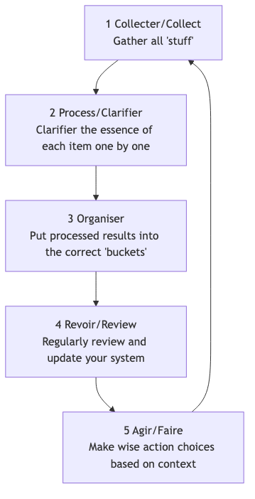

# GTD (Getting Things Done)

Notre cerveau est de nature un "CPU" excellent pour **générer des idées**, mais c'est un "disque dur" extrêmement mauvais pour **stocker des informations**. Lorsque nous essayons d'utiliser notre cerveau pour nous souvenir de toutes nos tâches à faire, rendez-vous, idées et engagements, il est encombré par ces "sujets inachevés", ce qui entraîne du stress, de l'anxiété et un encombrement mental, rendant impossible la concentration sur la tâche en cours. **GTD (Getting Things Done)**, créé par l'expert en productivité David Allen, est un système de productivité personnelle et une méthode de gestion de flux de travail mondialement reconnus.

La philosophie centrale du GTD consiste à atteindre un état de travail sans stress, hautement concentré et efficace, appelé **"Mind Like Water"**, en transférant toutes les tâches en suspens de votre esprit vers un **système externe et fiable**, puis en suivant un processus clair et rigoureux pour les **organiser et les traiter**. Ce n'est pas un simple truc de gestion du temps, mais un système complet conçu pour libérer votre esprit et vous permettre de gérer calmement des travaux et une vie complexes.

## Les Cinq Étapes Clés du GTD

1.  **Capture** : Retirez immédiatement de votre esprit tout ce qui attire votre attention — qu'il s'agisse d'une tâche professionnelle, d'une corvée personnelle, d'une inspiration soudaine ou d'un rendez-vous futur — et placez-le dans votre "**boîte de réception**". La boîte de réception peut être physique (comme un classeur, un carnet) ou numérique (comme une boîte de réception e-mail, une application de to-do list). L'essentiel est de limiter le nombre de vos boîtes de réception et de pouvoir les vider complètement avec une totale fiabilité.

2.  **Process** : Videz régulièrement (au moins une fois par jour) votre boîte de réception. Suivez strictement le principe de **traiter un élément à la fois**, prenez chaque élément un par un et posez-vous la question essentielle : "**Qu'est-ce que c'est ? Cela nécessite-t-il une action ?**"
    *   Si **aucune action n'est nécessaire** : Il s'agit soit de **déchets** (à supprimer directement), soit d'**informations utiles à conserver** (à archiver dans un dossier de référence), soit d'une **idée en incubation** (à placer dans une liste "Someday/Maybe").
    *   Si **une action est nécessaire** : Passez à l'étape suivante d'organisation.

3.  **Organize** : Pour les éléments nécessitant une action, placez-les dans différentes catégories en fonction de leur nature.
    *   **Règle des deux minutes** : Si l'action peut être accomplie **en moins de deux minutes**, alors **faites-la immédiatement**, sans organisation supplémentaire.
    *   **Déléguez** : Si la tâche doit être effectuée par quelqu'un d'autre, **déléguez-la** immédiatement et ajoutez-la à une liste "**Waiting For**" pour suivi.
    *   **Calendrier** : Pour les actions ayant une **date ou un horaire spécifique** (ex. réunions, rendez-vous), inscrivez-les dans votre **calendrier**.
    *   **Liste des prochaines actions** : Pour les actions nécessitant votre attention personnelle, plusieurs étapes et sans date spécifique, décomposez-les en la **première action concrète, visible et physique**, puis placez-les dans différentes listes de "prochaines actions" selon le **contexte**. Les contextes peuvent être "@ordinateur", "@bureau", "@téléphone", "@supermarché", etc.
    *   **Liste des projets** : Tout objectif nécessitant **plus d'une action** pour être accompli doit être défini comme un "**Projet**" et ajouté à la "Liste des Projets". Cette liste ne contient que le nom du projet ; ses prochaines actions spécifiques sont stockées dans la liste correspondante des prochaines actions.

4.  **Reflect** : Pour maintenir la fiabilité du système, vous devez effectuer des **révisions régulières**.
    *   **Révision quotidienne** : Parcourez rapidement votre calendrier et votre liste des prochaines actions quotidiennement pour planifier votre journée.
    *   **Révision hebdomadaire** : C'est une **étape cruciale du GTD**. Une fois par semaine (généralement le week-end), consacrez 1 à 2 heures à une révision complète, approfondie et un nettoyage du système entier, afin de vous assurer que tous les projets sont sous contrôle et que toutes les listes sont à jour.

5.  **Engage** : À tout moment, lorsque vous devez décider "Que dois-je faire maintenant ?", vous pouvez faire un choix sage et calme à partir de votre liste d'actions en fonction des critères suivants :
    *   **Contexte** : Où êtes-vous ? Quels outils avez-vous ? (ex. si vous êtes au bureau, consultez la liste "@bureau")
    *   **Temps disponible** : Combien de temps libre avez-vous ? (ex. si vous avez seulement 10 minutes, choisissez une tâche rapide)
    *   **Énergie disponible** : Quel est votre niveau d'énergie actuel ? (ex. si vous êtes énergique, attaquez une tâche exigeant une grande concentration)
    *   **Priorité** : Dans ces conditions, quelle tâche est la plus importante ?

### Diagramme de traitement du flux de travail GTD

## Cas d'application

**Cas 1 : Un responsable de département occupé**

*   **Capture** : Sa boîte de réception peut inclure : sa boîte e-mail, des messages WeChat, des notes prises pendant les réunions, et des idées soudaines.
*   **Process et Organize** :
    *   Un e-mail intitulé "notification du budget du prochain trimestre" -> Aucune action requise -> **Archivé** dans le dossier de référence "Finance de l'entreprise".
    *   Une idée "rappeler à mon subordonné Xiao Zhang de soumettre son rapport hebdomadaire" -> Peut être fait en 2 minutes -> **Envoyer immédiatement** un message à Xiao Zhang.
    *   Une tâche "préparer la journée d'équipe annuelle" -> Nécessite plusieurs étapes -> Ajouter "Journée d'équipe" à la "**Liste des Projets**" ; placer la première action "Contacter les RH pour obtenir une liste des lieux possibles" dans la liste des "**prochaines actions @bureau**".
    *   Un rendez-vous "réunion avec un client mercredi prochain à 15h" -> **Ajouté au calendrier**.
*   **Engage** : Lorsqu'il est au bureau, dispose d'une heure libre et se sent énergique, il peut ouvrir la liste "@bureau" et choisir de travailler sur "Contacter les RH".

**Cas 2 : Gestion de projets par un freelance**

*   **Liste des Projets** : Peut inclure "Projet de site web pour le client A", "Refonte du blog personnel", "Apprendre un nouveau langage de programmation", etc.
*   **Liste des Prochaines Actions** :
    *   **@Téléphone** : Appeler le client A pour confirmer ses retours sur les maquettes.
    *   **@Ordinateur-Design** : Réviser la conception de la page d'accueil du site web en fonction des retours.
    *   **@Ordinateur-Rédaction** : Rédiger un article de blog sur le "design responsive".
    *   **@Lecture/Apprentissage** : Regarder le troisième chapitre du cours de programmation.
*   **Révision hebdomadaire** : Le vendredi après-midi, il vérifie l'avancement de tous les projets, s'assure que chaque projet a au moins une "prochaine action", et planifie les priorités pour la semaine suivante.

**Cas 3 : Un étudiant gérant ses études et sa vie quotidienne**

*   **Boîte de réception** : Notifications des groupes WeChat des cours, devoirs assignés par les professeurs, idées concernant les activités du club, liste de courses pour les produits du quotidien.
*   **Liste des Projets** : "Rédiger le mémoire d'histoire", "Se préparer aux examens finaux", "Organiser la fête d'accueil des nouveaux étudiants".
*   **Liste des Prochaines Actions** :
    *   **@Bibliothèque** : Emprunter trois livres de référence sur le sujet du mémoire.
    *   **@Chambre** : Organiser les notes du cours de mathématiques.
    *   **@Supermarché** : Acheter du dentifrice et du shampooing.
*   Le **système GTD** l'aide à séparer clairement les tâches académiques des corvées quotidiennes et à s'assurer que les bonnes choses sont faites au bon moment et au bon endroit.

## Avantages et défis du GTD

**Avantages principaux**

*   **Réduit le stress mental et libère la capacité cognitive** : En externalisant tous les "sujets inachevés", cela réduit considérablement la charge mentale liée à la mémoire et l'anxiété constante causée par la peur d'oublier.
*   **Améliore le sentiment de contrôle et de calme** : Un système fiable vous assure que tout est sous contrôle, vous permettant d'aborder les tâches actuelles avec plus de calme et de concentration.
*   **Assure que les "choses importantes" ne sont pas oubliées** : La "révision hebdomadaire" cruciale garantit une attention continue et des progrès constants sur tous les projets importants et objectifs à long terme.
*   **Adaptable et flexible** : Le GTD lui-même ne définit pas à l'avance les priorités, mais fournit un cadre qui vous permet de choisir dynamiquement et de manière flexible l'action la plus appropriée en fonction du contexte actuel.

**Défis potentiels**

*   **Coût initial élevé pour mettre en place le système** : La première fois que vous "capturez" et configurez le système complet de listes, cela peut prendre plusieurs heures, voire une journée entière.
*   **Nécessite une forte discipline personnelle et la formation d'habitudes** : La réussite du GTD dépend fortement de votre capacité à développer les habitudes clés de **capture continue** et de **révision régulière**. Dès que le système n'est plus fiable ou mis à jour, il s'effondre rapidement.
*   **Dilemme du choix des outils** : Il existe de nombreux logiciels et outils GTD sur le marché, et les débutants peuvent facilement tomber dans le piège de rechercher excessivement l'"outil parfait" tout en négligeant la méthode elle-même.

## Extensions et connexions

*   **Matrice d'Eisenhower** : Peut être utilisée dans l'étape "Engage" du GTD comme un modèle de réflexion efficace pour juger des "**priorités**".
*   **Technique Pomodoro** : Constitue une excellente tactique spécifique pour exécuter des tâches issues de la "Liste des Prochaines Actions" du GTD nécessitant une forte concentration.

---
*Référence : Le best-seller mondial de David Allen, "Getting Things Done : The Art of Stress-Free Productivity", est la seule et plus autoritaire source pour comprendre complètement la philosophie, le processus et les meilleures pratiques derrière la méthode GTD.*