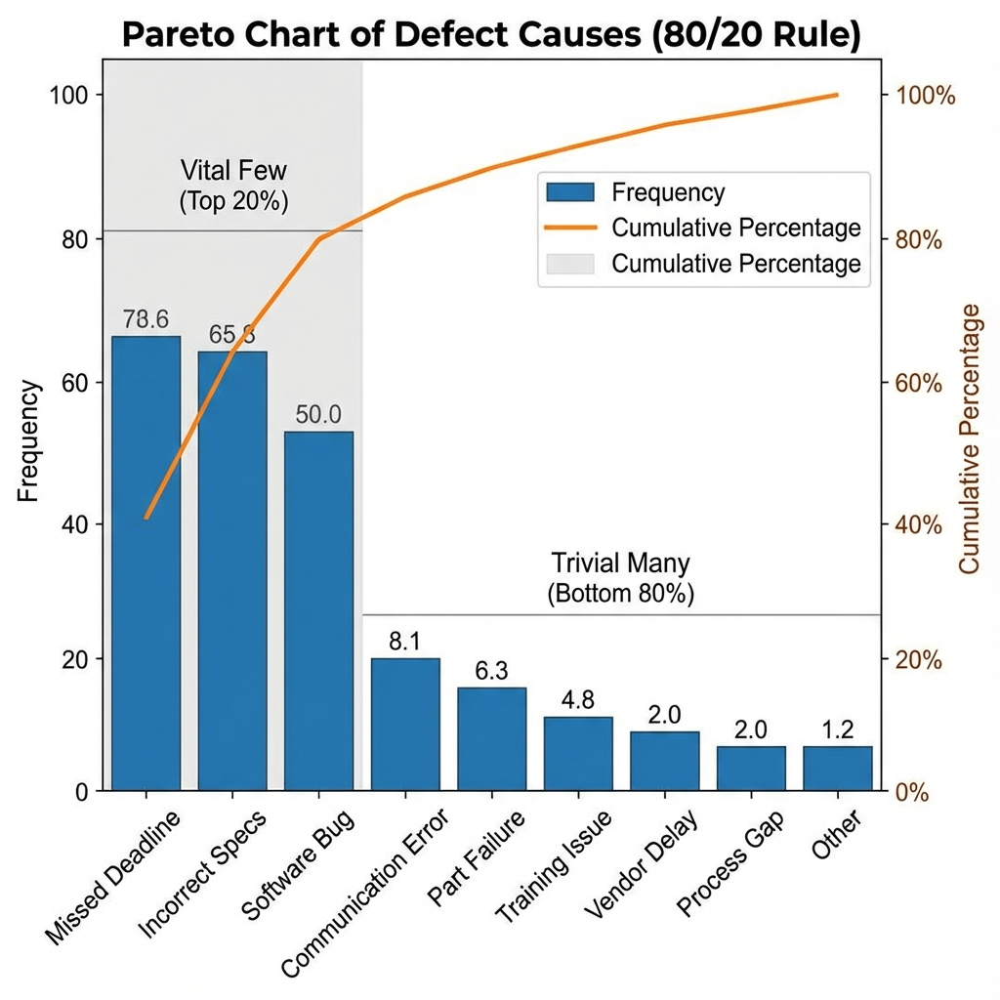

# Analyse de Pareto

Dans notre travail et notre vie quotidienne, nous rencontrons souvent un schéma commun et profond : **quelques causes clés entraînent la majeure partie des résultats**. Par exemple, 80 % des bénéfices d'une entreprise pourraient provenir de 20 % de ses clients ; 80 % des plantages logiciels sont causés par 20 % des bogues ; et 80 % de nos soucis proviennent de 20 % des causes. **L'analyse de Pareto**, basée sur cette **"règle 80/20"**, vise à nous aider à identifier les **"quelques causes essentielles"** parmi de nombreux facteurs influents qui jouent un rôle déterminant, permettant ainsi de concentrer notre temps, notre énergie et nos ressources limités sur les domaines qui génèrent les plus grands bénéfices.

L'analyse de Pareto n'est pas seulement une technique d'analyse de données, mais aussi une philosophie efficace de prise de décision et de gestion. Elle a été proposée par le gourou du management Joseph Juran et porte le nom de l'économiste italien Vilfredo Pareto, qui a découvert au XIXe siècle que 80 % des terres en Italie appartenaient à 20 % de la population. L'outil central de l'analyse de Pareto est le **diagramme de Pareto**, qui, grâce à une combinaison unique de graphiques en barres et en courbes, classe les différentes causes d'un problème par ordre d'importance (généralement fréquence ou coût), du plus élevé au plus bas, nous permettant ainsi d'identifier facilement les problèmes principaux d'un simple coup d'œil.

## Composants du diagramme de Pareto

Le diagramme de Pareto est un type particulier de graphique qui combine ingénieusement deux éléments graphiques pour transmettre des informations riches.

*   **Graphique en barres** :
    *   L'axe des X représente différentes **catégories de causes** menant au problème (par exemple, différents types de réclamations clients).
    *   Les barres sont disposées de gauche à droite par **ordre décroissant** d'impact (par exemple, fréquence d'occurrence, coût engendré).
    *   L'axe Y de gauche représente la valeur spécifique pour chaque catégorie de cause (par exemple, fréquence).

*   **Graphique en courbe** :
    *   Cette courbe est appelée **courbe des pourcentages cumulés**.
    *   Elle montre le pourcentage cumulé de l'impact total représenté par les catégories de causes de gauche à droite.
    *   L'axe Y de droite représente le pourcentage cumulé, de 0 % à 100 %.

En observant ce graphique, nous pouvons rapidement repérer la zone où la courbe des pourcentages cumulés monte le plus abruptement, et les barres correspondantes sont les **"quelques causes essentielles"** auxquelles nous devons prioritairement nous attaquer.

### Exemple de diagramme de Pareto

Supposons qu'un restaurant ait analysé toutes les réclamations clients du mois dernier :

*   **Analyse** : À partir de ce (fictif) graphique, le gérant du restaurant peut clairement voir que "service lent" et "goût de la nourriture" pourraient représenter 75 % de toutes les réclamations. Par conséquent, plutôt que de disperser ses efforts pour résoudre tous les problèmes, il devrait concentrer ses ressources sur l'optimisation prioritaire des processus de service en cuisine et du développement des plats.

## Comment réaliser une analyse de Pareto

1.  **Étape 1 : Définir le problème à analyser et les catégories de causes**
    Définir clairement le problème central à résoudre (par exemple, "réduire les défauts de produit") et déterminer les catégories de causes pour le classer (par exemple, types de défauts : rayures, pannes fonctionnelles, pièces manquantes, etc.).

2.  **Étape 2 : Collecter les données et déterminer l'unité de mesure**
    Collecter systématiquement des données sur l'occurrence de chaque catégorie de cause sur une période donnée. Vous devez déterminer une unité de mesure cohérente. La plus courante est la **fréquence** (nombre d'occurrences), mais dans certains cas, le **coût** (perte économique causée par chaque raison) peut être une unité plus pertinente.

3.  **Étape 3 : Organiser et trier les données**
    Trier toutes les catégories de causes par ordre décroissant selon l'unité de mesure choisie (par exemple, fréquence). Ensuite, calculez le pourcentage pour chaque catégorie ainsi que le pourcentage cumulé du plus élevé au plus bas.

4.  **Étape 4 : Tracer le diagramme de Pareto**
    *   Créer un graphique combiné.
    *   Dessiner le graphique en barres, avec l'axe des X représentant les catégories de causes et l'axe Y gauche représentant la fréquence, en dessinant les barres dans l'ordre trié.
    *   Dessiner le graphique en courbe, en marquant le pourcentage cumulé au centre supérieur de chaque barre, puis en reliant ces points pour former la courbe cumulative. L'axe Y droit indique de 0 % à 100 %.

5.  **Étape 5 : Analyser le diagramme et déterminer les priorités d'action**
    Analyser le diagramme de Pareto pour identifier les causes "essentielles" qui représentent environ 80 % des problèmes. Ce sont les domaines clés sur lesquels vous devez concentrer votre analyse des causes profondes (par exemple, en utilisant la méthode des "5 pourquoi" ou le "diagramme en arête de poisson") et trouver des solutions.

## Cas d'application

**Cas 1 : Gestion des bogues en développement logiciel**

*   **Problème** : Un produit logiciel a reçu un grand nombre de rapports d'utilisateurs concernant des bogues après son lancement.
*   **Application** : L'équipe de développement a classé tous les bogues par module (par exemple, "module de connexion utilisateur", "module de paiement", "module de rapport de données", etc.) et compté le nombre de bogues dans chaque module. En traçant un diagramme de Pareto, ils ont constaté que plus de 70 % des bogues se concentraient dans le "module de rapport de données". Cette découverte a permis à l'équipe de concentrer ses ressources de test et de développement sur la refonte prioritaire et la correction de ce module très instable, améliorant ainsi efficacement la qualité globale du produit.

**Cas 2 : Gestion du temps personnel**

*   **Problème** : Une personne se sent occupée chaque jour mais inefficace et ne sait pas où passe son temps.
*   **Application** : Elle a passé une semaine à enregistrer toutes ses dépenses de temps quotidiennes et à les classer (par exemple, "programmation", "réunions", "navigation sur les réseaux sociaux", "traitement des e-mails", etc.). Après avoir tracé un diagramme de Pareto, elle a été surprise de constater que près de 60 % de son temps de travail était occupé par des "réunions inefficaces" et des "vérifications fréquentes des réseaux sociaux". Cette analyse l'a incitée à assister sélectivement aux réunions et à utiliser la technique Pomodoro pour réduire les distractions, investissant ainsi plus de temps dans des tâches vraiment importantes.

**Cas 3 : Optimisation de la gestion des stocks**

*   **Problème** : Un détaillant souhaite réduire ses coûts de gestion des stocks.
*   **Application** : Ils ont analysé les ventes annuelles de tous les produits stockés et tracé un diagramme de Pareto. Cela s'appelle la **classification ABC**. Ils ont constaté que les produits de la classe A (environ 20 % de tous les types de produits) représentaient environ 80 % des ventes. Sur cette base, ils ont mis en place des stratégies différenciées de gestion des stocks : pour les produits de la classe A, ils ont appliqué un suivi des stocks très strict et des prévisions de demande pour éviter les ruptures ; pour les produits de la classe C, dont les ventes sont très faibles, ils ont adopté une gestion plus souple, voire envisagé leur suppression.

## Avantages et défis de l'analyse de Pareto

**Avantages principaux**

*   **Se concentrer sur les problèmes clés** : L'avantage le plus important est qu'elle nous aide à identifier rapidement les facteurs moteurs les plus importants parmi une multitude de problèmes complexes, évitant ainsi une dispersion et un gaspillage des ressources.
*   **Base solide pour la prise de décision** : Fournit des preuves de données claires et visuelles pour appuyer les décisions sur "ce à quoi nous devons prioritairement nous attaquer", facilitant ainsi le consensus au sein de l'équipe.
*   **Très polyvalente** : Peut être appliquée dans presque tous les domaines, notamment la gestion de la qualité, la gestion de projet, la gestion du temps et l'analyse des ventes.

**Défis potentiels**

*   **Se base sur le passé, pas sur le futur** : L'analyse de Pareto est basée sur des données historiques ; elle ne peut pas prédire de nouveaux problèmes qui pourraient survenir à l'avenir.
*   **Néglige les facteurs qualitatifs** : Elle se concentre principalement sur des facteurs quantifiables (par exemple, fréquence, coût). Pour des problèmes rares mais à impact extrêmement grave (par exemple, un accident de sécurité rare mais mortel), l'analyse de Pareto pourrait sous-estimer leur importance.
*   **Absence d'analyse des causes** : L'analyse de Pareto ne peut que vous indiquer "quoi" sont les principaux problèmes, mais pas "pourquoi" ces problèmes surviennent. C'est un outil pour identifier les problèmes, pas pour les résoudre.

## Extensions et liens

*   **Analyse des causes profondes** : Après avoir identifié les "quelques causes essentielles" via l'analyse de Pareto, l'étape suivante consiste généralement à utiliser des outils comme le **diagramme en arête de poisson** ou les **5 pourquoi** pour effectuer une analyse approfondie des causes de ces problèmes clés.
*   **Gestion de la qualité** : L'analyse de Pareto est un outil fondamental et central dans les systèmes de gestion de la qualité tels que la gestion totale de la qualité (TQM) et Six Sigma.

---
*Référence : L'analyse de Pareto, en tant qu'un des sept outils de base de la gestion de la qualité, ses idées et applications sont largement développées dans le Guide des bonnes pratiques en gestion de projet (PMBOK) ainsi que dans divers manuels de gestion de la qualité et de gestion des opérations. Le "Manuel de contrôle de la qualité" de Joseph Juran a apporté des contributions pionnières à l'application de ce principe dans la gestion.*