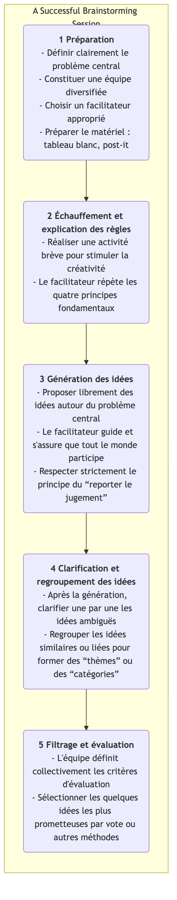

# Brainstorming

Lorsque l'on recherche l'innovation et la résolution de problèmes complexes, notre plus grand ennemi est souvent représenté par les modèles mentaux profondément ancrés et restrictifs qui existent dans notre propre esprit. Le **brainstorming** est une technique classique, puissante et très populaire de **génération d'idées en groupe**, conçue pour briser ces chaînes mentales. Elle a été proposée par l'exécutif en publicité Alex F. Osborn dans les années 1940, et son objectif principal est d'encourager les participants à générer un maximum d'idées novatrices, variées, voire même apparemment irréalistes, en un court laps de temps, en créant une atmosphère de discussion totalement ouverte, libre et non-jugeante.

L'essence du brainstorming réside dans le principe **"la quantité avant la qualité"**. Il repose sur l'idée que la qualité des idées peut émerger grâce à l'accumulation de la quantité. En reportant le jugement et en encourageant les idées audacieuses, le brainstorming permet efficacement de passer l'esprit créatif d'une équipe d'un mode « critique » à un mode « générateur », explorant ainsi diverses possibilités inconnues dans un environnement sûr et fournissant une riche matière première pour le filtrage et l'approfondissement ultérieurs.

## Quatre principes fondamentaux du brainstorming

Afin de garantir que le brainstorming atteigne les résultats escomptés, les quatre principes fondamentaux suivants, proposés par Osborn, doivent être strictement respectés. Ils constituent la base essentielle pour créer un environnement sûr et libre.

1.  **Reporter le jugement** : Il s'agit du principe le plus central et incontournable. Pendant le brainstorming, **aucune** critique, question ou jugement de quelque nature que ce soit n'est autorisé concernant une idée proposée, peu importe à quel point elle puisse sembler absurde ou irréaliste. Le jugement interviendra lors de l'étape ultérieure de filtrage.

2.  **Encourager les idées audacieuses** : Encouragez les participants à sortir des sentiers battus. Des idées qui semblent folles ou illogiques peuvent souvent briser la rigidité mentale et inspirer les autres à générer des idées encore plus novatrices.

3.  **Viser la quantité** : Fixez un objectif quantitatif clair et ambitieux (par exemple, « Générer 100 idées en 20 minutes »). Plus il y a d'idées, plus la probabilité d'obtenir des idées de haute qualité est grande.

4.  **S'appuyer sur les idées des autres** : C'est aussi appelé « piggybacking » ou « effet boule de neige ». Encouragez les participants à écouter attentivement les idées des autres et à réfléchir à la manière de les combiner, de les améliorer ou de les étendre, afin de générer de nouvelles idées plus élaborées. Cela illustre l'effet synergique du « 1+1>2 ».

### Processus du brainstorming

<!-- mermaid 源文件：Brainstorming-Tutorial-fr-mermaid-live-1.mmd -->

## Comment organiser une séance de brainstorming efficace

1.  **Une préparation minutieuse**
    *   **Définir un problème central clair** : Le problème ne doit être ni trop large ni trop restreint. Par exemple, reformulez la question trop générale « Comment augmenter les profits de l'entreprise ? » en « Comment augmenter de 20 % le taux de réachat des clients existants ? »
    *   **Constituer une équipe diversifiée** : Invitez 5 à 10 personnes issues de domaines et de fonctions variés. Des perspectives diverses peuvent mener à des idées plus riches.
    *   **Choisir un excellent facilitateur** : Le facilitateur ne propose pas directement d'idées ; son rôle est de guider le processus, de gérer le temps, d'encourager la participation et d'interrompre fermement tout comportement critique.

2.  **Créer une atmosphère adaptée**
    *   Choisissez un environnement détendu et confortable, et préparez des outils tels qu'un tableau blanc, des post-it et des marqueurs.
    *   Avant le début officiel, vous pouvez utiliser de courts jeux d'échauffement créatifs (par exemple, « 100 utilisations d’un trombone ») pour aider les participants à se détendre et à entrer dans un mode de réflexion créative.

3.  **Générer et enregistrer les idées**
    *   Le facilitateur annonce le début de la séance et fixe une limite de temps claire (généralement 15 à 30 minutes).
    *   Encouragez les participants à exprimer à haute voix les idées qui leur viennent à l'esprit, ou à les noter sur des post-it et à les afficher sur le mur. Le facilitateur ou un responsable désigné doit enregistrer toutes les idées rapidement, sans modification ni suppression.

4.  **Converger et évaluer**
    *   Après la phase de génération, passez à la phase de convergence. Tout d'abord, le facilitateur guide l'équipe pour passer rapidement en revue toutes les idées et clarifier celles qui sont ambiguës.
    *   Ensuite, classez et fusionnez les idées similaires pour former quelques grandes directions thématiques.
    *   Enfin, l'équipe définit collectivement quelques critères d'évaluation (par exemple, « faisabilité », « caractère innovant », « valeur pour l'utilisateur ») et, par le biais d'un vote (par exemple, chaque personne dispose de quelques autocollants circulaires), sélectionne 2 à 3 idées les plus reconnues et les plus prometteuses pour une étude approfondie.

## Cas d'application

**Cas 1 : Nommer une nouvelle application**

*   **Problème central** : « Trouver un nom percutant et facile à retenir pour notre application sociale axée sur le « partage alimentaire ». »
*   **Application** : L'équipe marketing a organisé une séance de brainstorming de 30 minutes. Plus de 80 noms candidats ont été proposés, notamment « Foodie Notes », « Taste Buddies » et « Snap & Eat ». Lors du filtrage ultérieur, ils ont finalement choisi un nom reflétant à la fois les caractéristiques du produit et ses attributs sociaux.

**Cas 2 : Résoudre les plaintes des clients**

*   **Problème central** : « Comment réduire de 50 % les plaintes des clients concernant la « lenteur de la livraison logistique » ? »
*   **Application** : Une équipe pluridisciplinaire composée de membres du service client, des opérations et de la logistique a mené une séance de brainstorming. Les idées proposées comprenaient : « Collaborer avec des entreprises de livraison plus rapides », « Créer des entrepôts en amont », « Optimiser les processus d'emballage » et « Offrir des coupons de réduction pour les commandes en retard ». Ces idées ont fourni une base riche pour élaborer des solutions concrètes.

**Cas 3 : Concevoir une campagne marketing**

*   **Problème central** : « Comment planifier une campagne marketing en ligne originale pour notre marque de jus en prévision de l'été à venir ? »
*   **Application** : Les membres de l'équipe ont laissé libre cours à leur imagination, proposant diverses idées telles que : « Organiser un concours UGC spécial été », « Collaborer avec des influenceurs de voyages sur les îles pour des diffusions en direct », « Lancer un emballage transformable en glace », et « Lancer un défi sur les réseaux sociaux autour du goût de l'été ». Ces idées, après combinaison et affinage, ont finalement formé un plan marketing complet.

## Avantages et défis du brainstorming

**Avantages principaux**

*   **Génération efficace d'idées** : Permet de générer rapidement un grand nombre d'idées variées en peu de temps.
*   **Promotion de la collaboration et de la cohésion d'équipe** : Crée un environnement égalitaire et sans pression, favorisant ainsi la cohésion d'équipe et la créativité collective.
*   **Dépassement des rigidités mentales** : En encourageant les idées audacieuses et en reportant le jugement, il aide efficacement les équipes à sortir des schémas de pensée traditionnels.

**Défis potentiels**

*   **Risque de « pensée de groupe » (groupthink)** : Si la séance n'est pas correctement animée, les opinions de quelques individus peuvent dominer la discussion, ou les participants peuvent tendre à proposer des idées « plus sûres ».
*   **Phénomène de « passager clandestin » (free-riding)** : Dans une équipe, certains individus peuvent être moins actifs et simplement « profiter » du travail des autres, produisant peu d'idées.
*   **Difficulté de mise en œuvre** : Appliquer rigoureusement le principe du « reporter le jugement » nécessite une grande compétence de la part du facilitateur et une culture d'équipe mature.
*   **Absence de suivi** : Le brainstorming n'a pour objectif que la génération d'idées. Sans mécanismes systématiques de filtrage, d'évaluation et d'exécution ultérieurs, même les meilleures idées restent des châteaux en l'air.

## Extensions et connexions

*   **Brainstorming inversé** : Une variante intéressante. Au lieu de poser la question « Comment réussir ? », on se demande « Comment complètement rater cela ? ». En identifiant tous les facteurs pouvant mener à l'échec, l'équipe peut ensuite réfléchir à l'envers pour élaborer des mesures préventives.
*   **Brainwriting** : Pour éviter que les personnes les plus éloquentes dominent la discussion, on peut utiliser des formes écrites. Par exemple, la méthode 6-3-5, où 6 participants écrivent chacun 3 idées en 5 minutes, puis passent la feuille au suivant pour inspiration et extension.
*   **Six Thinking Hats** : Peut servir d'outil structuré pour la phase ultérieure d'« évaluation » du brainstorming, guidant l'équipe à examiner de manière globale les idées filtrées sous différents angles.
*   **Mind Mapping** : Un excellent outil visuel pour organiser et structurer les résultats du brainstorming.

---
*Référence : Alex F. Osborn a exposé systématiquement les principes et méthodes du brainstorming dans son livre « Applied Imagination » publié en 1953. Il reste aujourd'hui l'une des techniques de génération d'idées les plus largement utilisées dans le monde entier.*