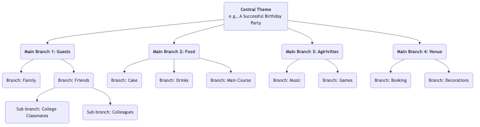

# Carte Mentale

Lorsque nous réfléchissons, nos cerveaux ne fonctionnent pas de manière linéaire et directe ; au contraire, ils sont remplis de sauts, d'associations et de divergences. **La carte mentale** est précisément un puissant **outil de pensée visuelle** qui correspond étroitement au mode naturel de fonctionnement de notre cerveau. Inventée par le chercheur britannique Tony Buzan dans les années 1970, elle consiste à relier des mots-clés, des idées, des images et des couleurs autour d'un **thème central**, selon une **structure radiale et progressivement hiérarchisée**, permettant ainsi d'organiser un sujet complexe ou un ensemble d'informations dispersées en une carte mentale claire, ordonnée, facile à mémoriser et à comprendre.

Le charme de la carte mentale réside dans sa caractéristique **non linéaire**. Elle nous encourage à faire librement des associations, à capturer des inspirations fugaces et à les organiser de manière organique et interconnectée. Ce n'est pas seulement un outil pour enregistrer des informations, mais un puissant partenaire de réflexion qui stimule la créativité, clarifie la logique et améliore la mémoire. Qu'il s'agisse de planifier, de prendre des notes de lecture, de préparer une présentation ou de faire un brainstorming, les cartes mentales peuvent considérablement accroître l'efficacité et la profondeur de notre pensée.

## Composants essentiels d'une carte mentale

Une carte mentale standard suit quelques règles simples mais essentielles de dessin.

1.  **Image/Thème central** : Placez au centre de la feuille une image frappante ou un mot-clé représentant votre thème principal. C'est le point de départ de toute réflexion.
2.  **Branches principales** : Dessinez des lignes épaisses et courbées rayonnant directement depuis le thème central, représentant les branches ou catégories principales du thème. Chaque branche principale doit porter un mot-clé.
3.  **Sous-branches** : Dessinez des lignes plus fines s'étendant à partir des branches principales, représentant un approfondissement et un développement supplémentaire du contenu de la branche principale. Les branches peuvent s'étendre indéfiniment, formant une structure arborescente hiérarchique.
4.  **Mots-clés** : Sur chaque branche, utilisez uniquement un mot-clé ou une courte phrase concise résumant l'idée principale, plutôt qu'une phrase complète. Cela aide à stimuler davantage d'associations.
5.  **Couleurs** : Utilisez différentes couleurs pour les différentes branches principales et leurs sous-branches. Les couleurs nous aident à catégoriser et organiser les informations, et stimulent fortement la mémoire visuelle.
6.  **Images** : Utilisez autant que possible des petits icônes, symboles et dessins simples à différents endroits de la carte. Comme le dit l'adage, "une image vaut mille mots" ; les images renforcent considérablement l'intérêt et la mémorisation de la carte.

### Exemple de structure d'une carte mentale

## Comment dessiner une carte mentale

1.  **Étape 1 : Commencer par le centre**
    Prenez une feuille blanche et placez-la horizontalement. Dessinez au centre une image représentant votre thème principal, ou inscrivez-y le mot-clé.

2.  **Étape 2 : Dessiner les branches principales**
    Dessinez plusieurs lignes épaisses et courbées rayonnant depuis le thème central en tant que branches principales. Chaque branche principale représente une catégorie clé. Inscrivez le mot-clé correspondant au-dessus de la ligne.

3.  **Étape 3 : Ajouter des branches et des mots-clés**
    Continuez à dessiner des branches plus fines à partir de chaque branche principale, et inscrivez des mots-clés plus spécifiques au-dessus des lignes. Maintenez la longueur des lignes et du texte cohérente. Ce processus ressemble à un grand arbre qui pousse de nouvelles branches.

4.  **Étape 4 : Utiliser les couleurs et les images**
    Attribuez des couleurs différentes à chaque système de branches principales. Dessinez quelques petits icônes ou symboles simples là où vous le jugez approprié pour rendre votre carte "vivante".

5.  **Étape 5 : Association libre, expansion continue**
    Ne vous laissez pas enfermer par l'ordre ; laissez libre cours à vos pensées entre les différentes branches. Lorsque vous avez une nouvelle idée, trouvez immédiatement la catégorie à laquelle elle appartient et ajoutez une nouvelle branche. Tout ce processus doit être détendu et agréable.

## Cas d'application

**Cas 1 : Prendre des notes de lecture**

*   **Contexte** : Après avoir lu un livre sur les "habitudes efficaces", vous souhaitez organiser et mémoriser le contenu principal.
*   **Application** :
    *   **Thème central** : Le titre du livre "Habitudes efficaces".
    *   **Branches principales** : Peuvent être les titres de chaque chapitre du livre, tels que "La puissance des habitudes", "La boucle des habitudes", "Comment développer de bonnes habitudes", "Comment rompre avec les mauvaises habitudes".
    *   **Sous-branches** : Sous chaque branche principale, utilisez des mots-clés pour noter les arguments principaux, les exemples clés et les méthodes spécifiques de ce chapitre. Par exemple, sous la branche principale "La boucle des habitudes", vous pouvez créer des sous-branches intitulées "Déclencheur", "Routine" et "Récompense".
    *   Ainsi, le cadre logique et les points clés du livre sont condensés en un schéma clair, très pratique pour réviser et mémoriser.

**Cas 2 : Préparer une présentation ou un rapport**

*   **Contexte** : Vous devez faire un exposé de 20 minutes aux dirigeants sur le "Plan marketing annuel de l'entreprise".
*   **Application** :
    *   **Thème central** : "Plan marketing annuel".
    *   **Branches principales** : "Analyse du marché", "Public cible", "Stratégies principales", "Allocation budgétaire", "KPI attendus".
    *   **Sous-branches** : Sous chaque branche principale, précisez davantage les points à développer. Par exemple, sous "Stratégies principales", vous pouvez créer des sous-branches telles que "Marketing de contenu", "Promotion sur les réseaux sociaux", "Activités en présentiel", etc.
    *   Cette carte mentale constitue le plan complet de votre présentation. Pendant celle-ci, vous pouvez vous référer à la carte pour vous assurer que votre raisonnement est clair et que vous ne manquez aucun point essentiel.

**Cas 3 : Organiser une séance de brainstorming en équipe**

*   **Contexte** : Une équipe doit générer des idées créatives sur "Comment améliorer l'expérience utilisateur du produit".
*   **Application** :
    *   **Thème central** : "Améliorer l'expérience utilisateur".
    *   **Branches principales** : Peuvent être définies à l'avance comme les aspects de l'expérience utilisateur, tels que "Performance", "Utilisabilité", "Design visuel", "Support client".
    *   **Processus** : Les membres de l'équipe proposent librement des idées autour de ces branches principales, et l'animateur ajoute ces idées en temps réel sous forme de mots-clés sur les branches correspondantes de la carte mentale. La visualisation et l'interconnexion de la carte mentale stimulent fortement les membres de l'équipe à "emboîter le pas" aux idées, générant davantage d'associations et de créativité.

## Avantages et défis de la carte mentale

**Avantages principaux**

*   **Correspond au fonctionnement de la pensée** : La structure radiale imite les connexions des neurones cérébraux, rendant la réflexion et l'association plus naturelles et fluides.
*   **Stimule la créativité** : La nature non linéaire encourage les associations libres, aidant à dépasser les limites de la pensée linéaire et à générer davantage d'idées.
*   **Améliore la mémoire** : En combinant des mots-clés, des couleurs, des images et d'autres éléments, elle mobilise à la fois les hémisphères gauche et droit du cerveau, améliorant considérablement la mémorisation.
*   **Clarté immédiate** : Permet de présenter une grande quantité d'informations complexes de manière très condensée et structurée, facilitant ainsi une compréhension rapide de l'ensemble.

**Défis potentiels**

*   **Très personnalisée** : Les cartes mentales dessinées par des individus peuvent avoir une forte subjectivité dans leur logique et le choix des mots-clés, et d'autres personnes peuvent avoir besoin d'explications pour les comprendre pleinement au départ.
*   **Pas adaptée à la présentation de documents formels et définitifs** : C'est un excellent outil pour la réflexion et la conceptualisation, mais son style manuel et non linéaire n'est généralement pas adapté aux rapports commerciaux ou aux articles académiques définitifs nécessitant un format strict.
*   **Limitations des outils** : Bien qu'il existe de nombreux logiciels de cartes mentales, le dessin manuel est généralement considéré comme la méthode la plus stimulante pour la créativité. Cependant, les cartes dessinées à la main sont moins pratiques à modifier et à partager que les versions électroniques.

## Extensions et connexions

*   **Brainstorming** : La carte mentale est un outil idéal pour réaliser et organiser les résultats d'un brainstorming. Les idées dispersées générées pendant un brainstorming peuvent être catégorisées et structurées en temps réel à l'aide d'une carte mentale.
*   **Carte conceptuelle** : Similaire à la carte mentale, mais met davantage l'accent sur l'expression précise des **relations spécifiques** entre différents concepts (par exemple, en utilisant du texte sur les lignes de connexion pour expliquer "A cause B" ou "B est une partie de C"). Elle est plus rigoureuse sur le plan logique, tandis que les cartes mentales se concentrent davantage sur l'association libre et le brainstorming.

---
*Référence : Tony Buzan est connu comme le "père de la carte mentale". Son livre "The Mind Map Book" est la bible autoritative de cette méthode, détaillant ses principes, ses règles et ses nombreuses applications dans divers domaines.*