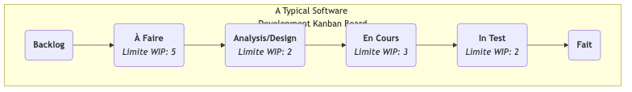

# Kanban

Lorsqu'on cherche à obtenir des flux de travail efficaces et fluides, on rencontre souvent des problèmes tels que l'accumulation des tâches, une compréhension incertaine de ce à quoi chacun est occupé, l'absence de connaissance des goulots d'étranglement et l'impossibilité de prédire précisément les délais de livraison. **Kanban**, terme dérivé du mot japonais signifiant « tableau de signalisation », est une méthode puissante et intuitive de **gestion visuelle des flux de travail** conçue pour résoudre ces problèmes. Ce n'est pas un cadre rigide comme Scrum qui définit des rôles et des événements, mais une pratique Agile plus flexible, associée à un état d'esprit axé sur **l'optimisation de l'efficacité du flux de valeur**.

Le cœur de la méthode Kanban consiste à rendre visibles et entièrement transparents les flux de travail et les tâches auparavant invisibles à l'aide d'un **tableau Kanban**. Ensuite, en **limitant les travaux en cours (WIP)** et en établissant un **système de tirage (Pull System)** clair, elle identifie et élimine systématiquement les goulots d'étranglement du processus, permettant ainsi à la valeur de circuler plus rapidement, plus facilement et de manière plus prévisible, du « à faire » au « fait ». L'objectif est de créer un rythme de travail stable et durable, empêchant les équipes de sombrer dans le chaos et l'inefficacité dus à la surcharge de tâches.

## Les Six Pratiques Fondamentales de la Méthode Kanban

Le succès de Kanban repose sur l'application continue des six pratiques fondamentales suivantes.

1.  **Visualiser le flux de travail** : C'est le point de départ de Kanban. Vous devez travailler avec votre équipe pour cartographier toutes les étapes du travail, de début à fin (par exemple, « À faire », « Conception », « Développement », « Tests », « Terminé ») sur un tableau blanc ou un tableau Kanban électronique, et représenter chaque élément de travail (par exemple, une user story, un bug) sous forme d'une carte sur le tableau.

2.  **Limiter les travaux en cours (WIP)** : C'est l'essence même de Kanban. Pour chaque étape ou certaines étapes du processus, définissez une **limite supérieure claire** du nombre de tâches pouvant être en cours simultanément. Par exemple, spécifiez que la colonne « Développement » peut contenir au maximum 3 cartes. Lorsque cette colonne est pleine, personne ne peut « tirer » de nouvelle tâche depuis l'étape précédente tant qu'une tâche en cours n'est pas terminée et déplacée. La limitation des travaux en cours **empêche fondamentalement l'accumulation de tâches, met en évidence les goulots d'étranglement du processus et crée un environnement de travail concentré**.

3.  **Gérer le flux** : L'objectif de Kanban est de maximiser la rapidité et la fluidité du flux de valeur. Vous devez surveiller en permanence le mouvement des éléments de travail sur le tableau, identifier les endroits où ils restent bloqués le plus longtemps (c'est-à-dire les goulots d'étranglement), puis concentrer les efforts de l'équipe sur la résolution de ces goulots afin de rendre l'ensemble du système fluide.

4.  **Rendre explicites les politiques de processus** : Rendez claires et transparentes les règles de travail de l'équipe. Par exemple, définissez clairement ce qui constitue le « Terminé » (Définition of Done) ? Quelles sont les limites de travaux en cours (WIP) pour chaque ligne ? Comment la priorité des tâches est-elle déterminée ? Des règles claires constituent la base permettant à l'équipe de travailler de manière autonome et coordonnée.

5.  **Mettre en place des boucles de retour (feedback loops)** : Kanban encourage la mise en place de boucles de retour à différents rythmes. Par exemple, des réunions quotidiennes (pour synchroniser le travail quotidien), des réunions régulières de revue Kanban (pour revoir et optimiser les processus) et des réunions de revue des livraisons clients.

6.  **Améliorer collectivement, évoluer expérimentalement** : Kanban est une méthode qui encourage à « commencer à partir de là où vous êtes et évoluer continuellement ». Elle ne vous demande pas d'apporter des changements organisationnels perturbateurs. L'équipe doit continuellement et collectivement apporter de petites améliorations expérimentales à son flux de travail, sur la base de données et d'une compréhension partagée.

### Exemple de structure d’un tableau Kanban

<!--

<!--

*   **Flux de travail** : Une carte (représentant une tâche) se déplace de gauche à droite, traversant chaque étape. Un membre de l'équipe ne peut « tirer » une nouvelle carte depuis la colonne de gauche que s'il y a de la place dans la colonne de droite (c'est-à-dire que la limite WIP pour cette colonne n'est pas atteinte).

## Comment mettre en œuvre la méthode Kanban

1.  **Étape 1 : Visualiser votre flux de travail actuel**
    Ne cherchez pas à concevoir un processus « parfait ». Commencez par la manière dont vous et votre équipe travaillez **actuellement**. Dessinez vos étapes de travail réelles sur un tableau blanc et placez-y toutes les tâches en cours sous forme de cartes. L'objectif de cette étape est de rendre l'état actuel transparent.

2.  **Étape 2 : Fixer des limites initiales de travaux en cours (WIP)**
    Travaillez avec votre équipe pour définir une limite initiale de travaux en cours (WIP) pour les étapes clés du processus (généralement celles sujettes à des goulots d'étranglement, comme « En cours », « En test »). Un bon point de départ peut être « la moitié du nombre de membres de l'équipe » ou « légèrement inférieur au nombre actuel de tâches en cours ». Les limites WIP ne sont pas statiques et peuvent être ajustées ultérieurement en fonction des conditions réelles.

3.  **Étape 3 : Commencer à « tirer » les tâches**
    Établissez une règle simple : lorsqu'un membre de l'équipe termine sa tâche actuelle, il doit regarder la colonne la plus à droite du tableau et proposer son aide là où c'est nécessaire. S'il n'y a rien à faire, il peut alors « tirer » une nouvelle tâche prioritaire depuis la colonne la plus à gauche qui permet le tirage.

4.  **Étape 4 : Mettre en place des réunions quotidiennes et des réunions de revue**
    *   Organisez une courte réunion quotidienne devant le tableau Kanban. L'accent n'est pas mis sur ce que chacun a fait, mais sur le **mouvement des cartes** : « Quelles cartes ont avancé hier ? » « Quelles cartes sont bloquées ? Comment pouvons-nous les débloquer ? »
    *   Organisez régulièrement (par exemple, toutes les deux semaines) des réunions de revue pour analyser les données du tableau Kanban (par exemple, le « délai moyen de traitement ») et discuter des moyens d'améliorer vos processus et vos limites WIP.

## Cas d'application

**Cas 1 : Équipe d'exploitation informatique**

*   **Problème** : L'équipe d'exploitation est submergée quotidiennement par diverses demandes urgentes provenant de différentes sources, ce qui entraîne un travail chaotique et des retards dans les réponses.
*   **Application de Kanban** : Ils ont mis en place un tableau Kanban simple avec des lignes telles que « À faire », « En cours », « En attente d'un retour externe » et « Résolu ». En limitant le nombre de tâches en cours dans la ligne « En cours » au nombre de membres de l'équipe, ils ont assuré que l'équipe se concentre sur la résolution rapide des problèmes actuels au lieu de commencer simultanément de nombreuses tâches. Kanban a également rendu toutes les demandes transparentes, permettant aux gestionnaires de comprendre la charge de travail réelle de l'équipe.

**Cas 2 : Gestion des tâches personnelles (Kanban personnel)**

*   **Problème** : Une personne travaille simultanément sur plusieurs projets, se sent submergée et étirée à l'extrême.
*   **Application de Kanban** : Elle peut utiliser Trello ou un simple carnet pour créer un tableau Kanban personnel avec des listes telles que « Objectifs de la semaine », « À faire aujourd'hui », « En cours (WIP Limit: 1) » et « Terminé ». En respectant strictement une limite WIP de 1 pour « En cours », elle se force à se concentrer sur une seule tâche importante à la fois, améliorant considérablement sa concentration et la qualité de l'exécution.

**Cas 3 : Équipe de création de contenu (par exemple, un éditeur de magazine)**

*   **Processus** : « Banque d'idées » → « Rédaction » → « Révision » → « Mise en page/Design » → « Publié ».
*   **Application de Kanban** : En définissant des limites WIP pour chaque étape, ils peuvent s'assurer que les rédacteurs n'acceptent pas continuellement de nouveaux articles lorsque des manuscrits s'accumulent. Cela permet de rendre l'ensemble du processus de production de contenu plus fluide et de mettre clairement en évidence les goulots d'étranglement (par exemple, si la colonne « Révision » est toujours encombrée de manuscrits, cela indique un manque de ressources en révision).

## Avantages et défis de la méthode Kanban

**Avantages principaux**

*   **Flexibilité et adaptabilité** : Elle ne nécessite pas de bouleversements des processus et rôles existants ; vous pouvez « commencer à partir de là où vous êtes » et évoluer progressivement.
*   **Amélioration de l'efficacité et de la prévisibilité** : En gérant le flux et en limitant les travaux en cours, elle réduit considérablement les délais de traitement et rend les dates de livraison plus prévisibles.
*   **Réduction du stress de l'équipe** : Les limites WIP empêchent l'équipe de subir une pression énorme due au multitâche et aux engagements excessifs, créant un rythme de travail durable.
*   **Mise en lumière des problèmes systémiques** : Elle permet de manière très intuitive et indéniable de révéler les goulots d'étranglement et obstacles dans le processus.

**Défis possibles**

*   **Risque de formalisme** : Si l'équipe ne met en œuvre que la « visualisation » sans appliquer strictement la « limitation des travaux en cours » et la « gestion du flux », Kanban devient simplement un tableau de tâches attrayant mais ne délivre pas son plein potentiel.
*   **Nécessite une grande discipline d'équipe** : Le système de tirage et les limites WIP exigent un haut niveau de discipline et d'esprit collaboratif de la part des membres de l'équipe.
*   **Malentendu sur l'absence de « time-box »** : Bien que Kanban n'impose pas de sprints fixes comme Scrum, cela ne signifie pas qu'il n'y a pas de planification ni de rythme. Les équipes Kanban doivent également prioriser, prévoir les dates de livraison et organiser des revues régulières.

## Extensions et connexions

*   **Scrum** : Kanban et Scrum sont les deux méthodes principales du monde Agile. Scrum repose sur un rythme itératif « time-boxé », tandis que Kanban repose sur un rythme de tirage « flux continu ». Chacune a ses avantages et inconvénients et convient à des scénarios différents. **Scrumban** est une méthode hybride qui combine les avantages des deux.
*   **Pensée Lean** : La méthode Kanban est l'application la plus centrale et directe de la pensée Lean dans le travail intellectuel. Elle incarne parfaitement les principes Lean fondamentaux tels que la « visualisation », le « système de tirage », « l'élimination des gaspillages » et l'« amélioration continue ».
*   **Théorie des Contraintes (TOC)** : En révélant les goulots d'étranglement, la méthode Kanban s'aligne étroitement sur l'idée de la TOC selon laquelle il faut « identifier et optimiser les contraintes ».

---
*Référence : L'application de la méthode Kanban au développement logiciel a été initialement pratiquée et synthétisée par David J. Anderson dans son travail chez Microsoft et Corbis. Son livre « Kanban: Successful Evolutionary Change for Your Technology Business » est une œuvre fondatrice de cette méthode. Les idées de Kanban s'appuient profondément sur le système de production Toyota (TPS) et la production Lean.*