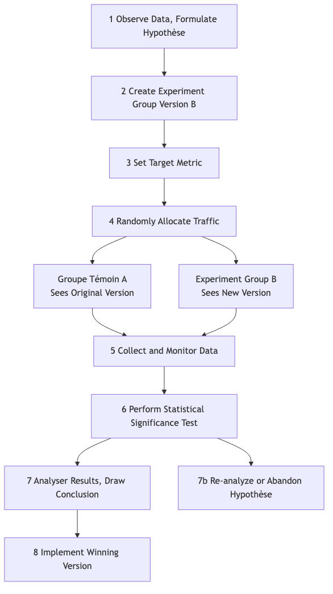

# Test A/B

En conception de produit et en marketing, nous sommes souvent confrontés à des choix apparemment subjectifs : Un bouton rouge est-il plus attrayant qu'un vert ? Le texte « Acheter maintenant » convertit-il mieux que « Ajouter au panier » ? Plutôt que de se fier à l'intuition ou à des débats sans fin en réunion, il est préférable de laisser les utilisateurs réels nous répondre grâce à leurs données. Le **test A/B**, aussi appelé **split testing**, est une méthode rigoureuse, puissante et basée sur les données consistant à réaliser des **expériences contrôlées en ligne**. Son principe fondamental est de **diviser aléatoirement** le trafic utilisateur en deux groupes ou plus et de leur présenter différentes versions de la même page (Version A et Version B) afin de comparer et déterminer laquelle atteint le mieux des objectifs spécifiques (taux de clic, taux de conversion, etc.).

L'essence du test A/B est d'appliquer la logique des expériences scientifiques aux décisions en matière de produit et de marketing. Il introduit l'élément clé de l'**aléatoire** pour éliminer toutes autres variables pouvant fausser les résultats (comme la provenance des utilisateurs, l'heure d'accès, etc.), garantissant ainsi que les différences observées peuvent être attribuées avec une grande confiance à la seule modification apportée. Il transforme des hypothèses subjectives telles que « Je pense que ce design est meilleur » en conclusions objectives comme « les données montrent que la Version B a un taux de conversion 15 % plus élevé que la Version A, et cette différence est statistiquement significative », ce qui en fait un outil central indispensable dans la culture moderne de croissance basée sur les données.

## Composants clés du test A/B

Un test A/B standard se compose des éléments suivants :

*   **Hypothèse** : Avant de commencer le test, vous devez formuler une hypothèse claire et testable. Par exemple : « Je crois que changer la couleur du bouton d'inscription du bleu à l'orange (modification) peut augmenter le taux de conversion des nouveaux utilisateurs (résultat attendu), car l'orange ressort davantage sur la page (raison). »
*   **Groupe témoin (Version A)** : La version originale actuellement en ligne, sans modification. Elle sert de référence pour toutes les comparaisons.
*   **Groupe test (Version B)** : La nouvelle version à laquelle vous avez apporté une modification unique, espérant obtenir de meilleurs résultats.
*   **Principe de la variable unique** : Un test A/B standard ne doit tester qu'une seule variable. Si vous modifiez simultanément la couleur du bouton et le texte, alors même si la Version B gagne, vous ne pourrez pas déterminer quelle modification a été déterminante.
*   **Répartition aléatoire du trafic** : Le trafic utilisateur doit être réparti aléatoirement et équitablement entre la Version A et la Version B. C'est la condition scientifique essentielle pour garantir des résultats impartiaux et fiables.
*   **Indicateur cible** : Vous avez besoin d'un indicateur clair et quantifiable pour mesurer le succès du test. Cet indicateur doit être directement lié à votre hypothèse, par exemple : « taux de clic », « taux de conversion », « temps moyen passé sur la page », etc.

### Flux de travail du test A/B

## Comment réaliser un test A/B

1.  **Étape 1 : Recherche et formulation d'hypothèse**
    À partir de l'analyse des données (par exemple, cartes de chaleur du comportement utilisateur), des retours des utilisateurs ou d'une évaluation heuristique, identifiez les points du produit ou du processus actuel qui pourraient poser problème, et proposez une hypothèse d'amélioration spécifique et testable.

2.  **Étape 2 : Créer les variantes**
    Sur la base de votre hypothèse, concevez et développez le groupe test (Version B). Assurez-vous que la seule différence entre la Version B et la Version A est la variable que vous souhaitez tester.

3.  **Étape 3 : Définir les objectifs et la taille de l'échantillon**
    *   Définissez clairement l'indicateur principal que vous utiliserez pour mesurer le succès.
    *   Avant de démarrer le test, utilisez un **calculateur de taille d'échantillon** pour estimer combien d'utilisateurs doivent participer au test afin que vos résultats aient une **puissance statistique** suffisante. Une taille d'échantillon trop petite pourrait vous empêcher de détecter une différence réelle.

4.  **Étape 4 : Mettre en œuvre le test**
    Utilisez des outils professionnels de test A/B (par exemple, Google Optimize, Optimizely, etc.) pour configurer votre test. Définissez le ratio de répartition du trafic (généralement 50/50) et lancez le test.

5.  **Étape 5 : Surveiller et analyser les résultats**
    Laissez le test se dérouler suffisamment longtemps jusqu'à atteindre la taille d'échantillon prévue ou le niveau de significativité statistique. Ensuite, analysez les résultats. Deux concepts statistiques clés doivent être pris en compte :
    *   **Différence de taux de conversion** : L'amélioration en pourcentage de la Version B par rapport à la Version A.
    *   **Significativité statistique** : Généralement représentée par la **valeur p (p-value)**. La valeur p correspond à la « probabilité que la différence observée soit due au hasard ». En général, lorsque la valeur p est inférieure à 0,05 (c'est-à-dire un niveau de confiance de 95 %), on considère que le résultat est statistiquement significatif et fiable.

6.  **Étape 6 : Tirer des conclusions et agir**
    *   Si la Version B remporte clairement le test, félicitations, votre hypothèse est validée. La prochaine étape est de déployer entièrement la Version B à tous les utilisateurs.
    *   Si la Version A gagne, ou qu'il n'y a pas de différence significative entre les deux versions, cela reste une expérience précieuse. Cela signifie que votre hypothèse initiale était incorrecte, et vous devez réanalyser les données pour formuler de nouvelles hypothèses et préparer un nouveau cycle de tests.

## Cas d'application

**Cas 1 : Optimisation de la page de collecte de fonds de l'équipe de campagne d'Obama**

*   **Contexte** : Pendant l'élection présidentielle américaine de 2008, l'équipe de campagne d'Obama souhaitait optimiser la page de dons de leur site officiel pour améliorer les taux d'inscription et de don.
*   **Utilisation du test A/B** : Ils ont mené de nombreux tests A/B (plus précisément, des tests multivariés) sur l'image principale et le texte du bouton. Dans un test célèbre, ils ont constaté que remplacer l'image principale montrant uniquement Obama par une photo de sa famille, et changer le texte du bouton de « S'inscrire » à « En savoir plus », a augmenté de manière spectaculaire le taux d'inscription de la page de **40,6 %**. Ce test a généré des dizaines de millions de dollars supplémentaires en dons pour l'équipe de campagne.

**Cas 2 : La culture du test continu chez Booking.com**

*   **Contexte** : Booking.com, la plus grande plateforme mondiale de réservation d'hôtels en ligne, est célèbre pour sa culture extrême du test A/B.
*   **Application** : On rapporte que, à tout moment, des milliers de tests A/B sont en cours simultanément sur le site de Booking.com. Que ce soit la méthode de tri des résultats de recherche, la taille des images des hôtels, ou encore des mentions comme « Il ne reste que X chambres disponibles ! », chaque modification subit des tests A/B rigoureux. C'est cette quête extrême de décisions basées sur les données qui leur permet d'optimiser continuellement et progressivement l'expérience utilisateur, et de construire ainsi une barrière compétitive solide.

**Cas 3 : Test de mur payant sur un site d'information**

*   **Contexte** : Un site d'information souhaitait tester un modèle d'abonnement payant, mais ignorait quelle stratégie de mur payant serait la plus bénéfique en termes de conversion et de fidélisation des utilisateurs.
*   **Application du test A/B** :
    *   **Version A (accès limité)** : Permet à tous les utilisateurs de lire 5 articles gratuitement chaque mois, puis demande un paiement au-delà de cette limite.
    *   **Version B (freemium)** : Certains articles sont gratuits, mais du « contenu premium » comme les analyses approfondies et les commentaires exclusifs nécessitent un abonnement payant.
    *   Grâce à un test sur plusieurs mois, ils ont pu comparer les taux de conversion, le taux de désabonnement et les revenus totaux des deux modèles, et ainsi choisir le modèle économique le plus adapté à leurs besoins.

## Avantages et défis du test A/B

**Avantages principaux**

*   **Objectif et basé sur les données** : Utilise les données réelles du comportement des utilisateurs pour remplacer les suppositions subjectives et les débats, fournissant ainsi la preuve la plus solide pour la prise de décision.
*   **Innovation à faible risque** : Vous permet de tester l'effet d'une modification sur une petite portion du trafic avant de la déployer pleinement, réduisant ainsi considérablement les risques d'effets négatifs dus à de mauvaises décisions.
*   **Moteur d'optimisation continue** : Propose un cadre scientifique et rigoureux pour une optimisation continue et itérative des produits et du marketing.

**Défis potentiels**

*   **Nécessite un trafic suffisant** : Pour les sites web ou applications à faible trafic, il peut falloir beaucoup de temps, voire être impossible, d'atteindre une significativité statistique.
*   **Limitation de la variable unique** : Parfois, une combinaison de plusieurs modifications peut produire des effets synergiques inattendus, que les tests A/B standards ne peuvent pas détecter (nécessite des tests multivariés plus complexes).
*   **Piège de l'optimum local** : Effectuer continuellement de petits tests A/B sur des pages existantes peut vous enfermer dans le piège de l'« optimum local », en passant à côté d'opportunités plus importantes liées à une refonte radicale et innovante.
*   **Néglige l'impact à long terme** : Les tests A/B mesurent généralement des effets à court terme (par exemple, le taux de clic). Certaines modifications peuvent améliorer les indicateurs à court terme, mais nuire à la confiance des utilisateurs ou à l'image de marque à long terme.

## Extensions et connexions

*   **Test multivarié (MVT)** : Extension du test A/B. Lorsque vous souhaitez tester simultanément **plusieurs** combinaisons de **plusieurs** éléments d'une page (par exemple, tester 3 types de titres, 2 types d'images et 2 couleurs de boutons), vous pouvez utiliser le test MVT. Il permet d'identifier quelle combinaison d'éléments fonctionne le mieux, ainsi que la contribution relative de chaque élément au résultat final.
*   **Test d'utilisabilité** : Méthode de recherche qualitative. Elle ne peut pas vous dire « quelle version est meilleure », mais elle peut vous expliquer « **pourquoi** » les utilisateurs rencontrent des difficultés avec une version donnée. En général, le test d'utilisabilité peut être réalisé avant un test A/B pour obtenir des idées sur « quoi tester ».

---
*Référence : Le concept du test A/B s'appuie sur la conception expérimentale statistique classique. Dans le domaine internet, il a été initialement largement appliqué par des géants technologiques comme Google et Amazon pour l'optimisation de leurs sites et produits, et est progressivement devenu une compétence centrale en marketing numérique et en growth hacking.*