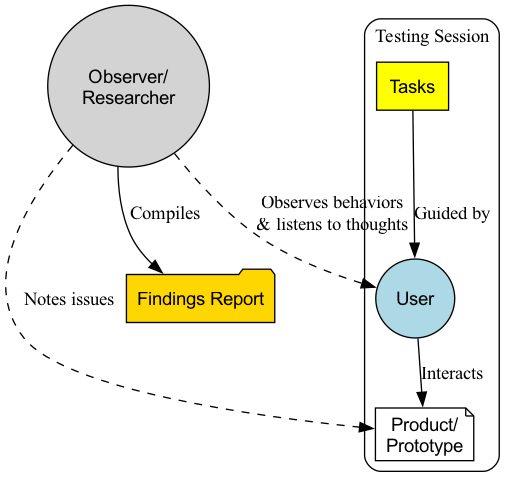

# Test d'utilisabilité

Nous concevons méticuleusement une interface produit que nous pensons parfaite, mais lorsque des utilisateurs réels la découvrent pour la première fois, ils peuvent complètement échouer à trouver ce bouton qui semblait pourtant évident. Le **test d'utilisabilité** est une méthode d'évaluation qualitative fondamentale centrée sur l'utilisateur, dont l'objectif principal est d'identifier les problèmes d'utilisabilité dans la conception et de recueillir des informations approfondies sur le comportement et les impressions subjectives des utilisateurs en **observant des utilisateurs réels tentant de réaliser des tâches typiques à l'aide d'un produit (ou d'un prototype)**.

L'essence du test d'utilisabilité ne réside pas à « tester les utilisateurs », mais plutôt à « **laisser les utilisateurs tester notre conception** ». Il ne s'agit pas d'évaluer l'intelligence des utilisateurs, mais plutôt d'évaluer à quel point notre conception est intuitive, facile à utiliser et efficace. Ce test ne répond pas à la question « Combien d'utilisateurs ont cliqué sur ce bouton ? », mais plutôt à « **Pourquoi** les utilisateurs n'ont-ils pas cliqué sur ce bouton ? Quelles difficultés ont-ils rencontrées ? Qu'ont-ils ressenti à ce moment-là ? ». C'est un miroir qui révèle clairement les défauts de conception et constitue une étape essentielle vers une expérience utilisateur fluide et agréable.

## Éléments clés du test d'utilisabilité

Un test d'utilisabilité standard comprend généralement les composantes suivantes :

*   **Animateur** : Un animateur formé, chargé de guider le processus de test, de présenter les tâches aux utilisateurs, d'observer leur comportement et de poser des questions complémentaires.
*   **Utilisateurs représentatifs** : Recruter 5 à 8 utilisateurs réels représentatifs de votre groupe cible principal. Des recherches montrent que 5 utilisateurs suffisent généralement pour identifier environ 85 % des problèmes d'utilisabilité clés.
*   **Tâches de test** : Une série de tâches spécifiques et représentatives que les utilisateurs exécuteraient réellement lors de l'utilisation du produit. Les tâches doivent être ouvertes, indiquant aux utilisateurs « ce qu'ils doivent faire » plutôt que « comment le faire ». Par exemple : « Veuillez trouver et réserver un restaurant italien à Shanghai pour le week-end prochain, avec un coût moyen d'environ 300 yuans par personne. »
*   **Objet du test (produit/prototype)** : Peut être un produit fonctionnel ou un prototype interactif haute fidélité ou basse fidélité.
*   **Observation et enregistrement** : Pendant que l'utilisateur accomplit les tâches, l'animateur et les autres observateurs doivent observer attentivement chacun de ses gestes, expressions faciales et paroles, et les enregistrer généralement via un enregistrement d'écran et audio.
*   **Protocole de la pensée à haute voix** : Cette technique est la plus utilisée et la plus efficace dans les tests d'utilisabilité. L'animateur encourage les utilisateurs à **verbaliser toutes leurs pensées, leurs doutes et leurs impressions** pendant l'exécution des tâches. Cela ouvre une fenêtre sur le monde intérieur de l'utilisateur.

### Processus du test d'utilisabilité

## Comment réaliser un test d'utilisabilité

1.  **Étape 1 : Planifier le test**
    *   **Clarifier les objectifs** : Qu'est-ce que vous souhaitez apprendre lors de ce test ? S'agit-il de valider un nouveau processus de conception ou d'identifier des problèmes dans un produit existant ?
    *   **Définir les utilisateurs** : Qui sont vos utilisateurs principaux pour ce test ? Quelles sont leurs caractéristiques ?
    *   **Rédiger les scénarios de test** : Concevoir 4 à 6 tâches principales et réalistes pour le test.

2.  **Étape 2 : Recruter des utilisateurs**
    Sur la base de votre persona utilisateur défini, recrutez 5 à 8 participants qualifiés par divers canaux (par exemple, bases de données utilisateurs, réseaux sociaux, agences de recrutement professionnelles). Il est généralement nécessaire d'offrir une compensation en remerciement.

3.  **Étape 3 : Préparer et répéter**
    Préparez tout ce dont vous avez besoin pour le test : un prototype stable, un logiciel d'enregistrement d'écran, une salle de test calme (ou un logiciel de visioconférence), ainsi que les scénarios de test. Avant le début officiel, il est fortement recommandé de réaliser un **test pilote** interne pour s'assurer que l'ensemble du processus se déroule sans accroc.

4.  **Étape 4 : Animer le test**
    *   **Accueil et introduction** : Mettez les utilisateurs à l'aise et insistez sur le fait que « Nous testons le produit, pas vous. Il n'y a pas de bonne ou de mauvaise réponse, et tout retour d'information que vous fournirez nous sera utile. »
    *   **Guider les tâches** : Présentez les tâches une par une aux utilisateurs et encouragez-les à utiliser le **protocole de la pensée à haute voix**.
    *   **Maintenir une attitude neutre** : Pendant que l'utilisateur manipule, l'animateur doit rester neutre et **ne jamais offrir d'aide ou de conseils**. Lorsqu'un utilisateur demande : « Devrais-je cliquer ici ? », vous devriez répondre par une question : « Où pensez-vous que vous devriez cliquer ? »
    *   **Observer et questionner** : Observez attentivement le comportement de l'utilisateur et ses indices non verbaux. Lorsque l'utilisateur termine une tâche ou bloque, vous pouvez poser des questions comme : « J'ai remarqué que vous avez hésité ici tout à l'heure. Pouvez-vous me dire ce que vous pensiez à ce moment-là ? »

5.  **Étape 5 : Analyser et rapporter**
    Après le test, réunissez tous les observateurs (chef de produit, designers, ingénieurs, etc.) pour rapidement passer en revue et synthétiser les résultats. Notez tous les problèmes d'utilisabilité observés sous la forme : « Lorsque l'utilisateur a tenté de [faire quelque chose], il a rencontré [tel problème], ce qui a conduit à [telle conséquence]. » Enfin, hiérarchisez ces problèmes selon leur gravité et proposez des suggestions précises d'amélioration.

## Cas d'application

**Cas 1 : Optimisation du processus de paiement sur un site e-commerce**

*   **Tâche** : « Veuillez ajouter ce T-shirt (taille L, rouge) à votre panier et finaliser l'achat jusqu'à voir la page de confirmation de paiement réussi. »
*   **Observation** : Pendant le test, 3 utilisateurs sur 5 ont eu des difficultés à l'étape de saisie de l'adresse, car ils n'avaient pas remarqué le petit bouton peu visible permettant de remplir automatiquement le code postal. Certains utilisateurs ont également exprimé leur mécontentement face à l'obligation de s'inscrire, qu'ils jugeaient pénible.
*   **Amélioration** : L'équipe de conception a agrandi le bouton de remplissage automatique du code postal et ajouté une option permettant de « payer en tant qu'invité ».

**Cas 2 : Test d'un prototype d'un nouveau logiciel de gestion de projet**

*   **Tâche** : « Veuillez créer un nouveau projet pour votre équipe intitulé "Plan marketing du troisième trimestre", inviter deux collègues, puis attribuer une tâche "design d'affiche" au designer Xiao Wang. »
*   **Observation** : Les utilisateurs ont généralement indiqué que les points d'entrée des fonctions « créer un projet » et « inviter des membres » étaient trop cachés et difficiles à trouver. De plus, lors de l'attribution des tâches, il n'était pas pratique de définir des échéances.
*   **Amélioration** : Dans les itérations suivantes, l'équipe a placé les points d'entrée de ces deux fonctions principales directement en position évidente sur l'interface principale et ajouté un contrôle calendrier à l'interface d'attribution des tâches.

**Cas 3 : Évaluation de l'utilisabilité d'un produit physique (par exemple, une nouvelle machine à café)**

*   **Tâche** : « Veuillez utiliser cette machine à café pour vous préparer un café latte. »
*   **Observation** : À la première utilisation, les utilisateurs ne savaient généralement pas jusqu'où remplir le réservoir d'eau. De plus, lors de l'installation du mousseur à lait, plusieurs utilisateurs l'ont installé dans le mauvais sens, ce qui a entraîné des projections de lait.
*   **Amélioration** : Le fabricant a ajouté des indicateurs clairs du niveau d'eau maximum et minimum sur le réservoir et redessiné l'interface du mousseur à lait pour qu'elle soit « incassable », ne permettant qu'une seule orientation correcte d'installation.

## Avantages et défis du test d'utilisabilité

**Avantages principaux**

*   **Compréhension intuitive et empathique** : Rien n'est plus efficace pour générer de l'empathie et une motivation au changement au sein d'une équipe (notamment chez les ingénieurs) que de voir un utilisateur réel lutter et se sentir perdu face à votre produit.
*   **Détection efficace des problèmes** : Un excellent retour sur investissement ; un petit nombre d'utilisateurs permet d'identifier la plupart des problèmes d'utilisabilité majeurs.
*   **Détection précoce des problèmes** : Le test peut être réalisé dès que le produit est encore un prototype papier peu coûteux, évitant ainsi des modifications coûteuses ultérieures à moindre frais.

**Défis possibles**

*   **Qualitatif, pas quantitatif** : Il ne peut pas vous dire « combien » d'utilisateurs ont rencontré ce problème, ni « quelle conception est meilleure ». Ses conclusions ne sont pas statistiquement significatives.
*   **Effet de « l'environnement artificiel »** : Dans un laboratoire ou un environnement observé, le comportement de l'utilisateur peut légèrement différer de conditions complètement naturelles.
*   **Exigences élevées pour l'animateur** : Un bon animateur doit posséder de bonnes compétences en communication, une attitude neutre et une observation attentive pour mener un test de qualité.

## Extensions et connexions

*   **Test A/B** : Le test d'utilisabilité et le test A/B forment un duo idéal. Le test d'utilisabilité répond à la question du **pourquoi**, vous aidant à formuler des **hypothèses** d'amélioration ; tandis que le test A/B répond à la question du **quel est le meilleur**, en utilisant des données **quantitatives** pour vérifier l'efficacité de ces hypothèses.
*   **Évaluation heuristique** : Méthode dans laquelle des experts en utilisabilité évaluent une interface à partir d'un ensemble de principes de conception reconnus (« heuristiques »). Elle est plus rapide et moins coûteuse que le test d'utilisabilité, mais son inconvénient est de ne pas bénéficier d'un retour direct des utilisateurs réels.
*   **Persona utilisateur** et **Carte du parcours utilisateur** : Un persona utilisateur clair est une condition préalable pour recruter des « utilisateurs représentatifs ». Les points douloureux identifiés lors des tests d'utilisabilité constituent des éléments clés pour enrichir et valider la carte du parcours utilisateur.

---
*Référence : Jakob Nielsen, surnommé le « roi de l'utilisabilité », est un pionnier du test d'utilisabilité. Son livre « Usability Engineering » est une œuvre fondatrice dans ce domaine. Un autre expert, Steve Krug, a vulgarisé les idées clés du test d'utilisabilité d'une manière plus décontractée et pratique dans son ouvrage « Ne me faites pas réfléchir ». (« Don't Make Me Think » en anglais)*