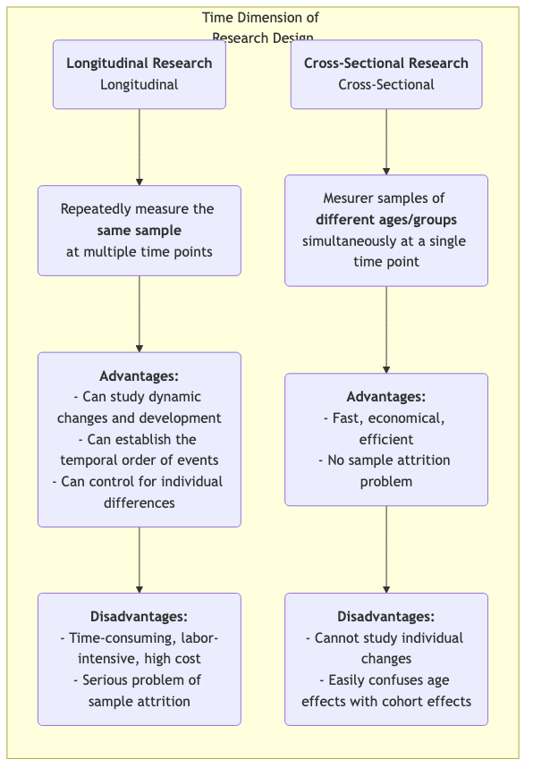

# Recherche longitudinale

Lorsque l'on explore la longue trame du développement humain, du changement social et de l'évolution des maladies, nous avons besoin d'une méthode de recherche capable de capturer la dimension cruciale du « temps ». La **recherche longitudinale** est précisément cet outil, observant et mesurant de manière répétée et continue **le même échantillon** sur une période prolongée. Son objectif fondamental est de révéler comment les phénomènes **changent, se développent et évoluent** dans le temps, et d'étudier l'impact à long terme d'événements précoces sur des résultats ultérieurs.

Contrairement aux études transversales, qui offrent seulement un « cliché » à un moment donné, la recherche longitudinale nous fournit un « documentaire ». Elle permet d'observer la trajectoire de la croissance individuelle, le processus d'évolution des concepts, et l'ensemble du parcours d'une maladie depuis son apparition jusqu'à son développement complet. Cela nous permet d'établir plus clairement la séquence temporelle des événements lors de l'exploration de relations causales. Lorsque vous souhaitez répondre à des questions dynamiques sur les processus et le développement, telles que « Comment les habitudes de lecture durant l'enfance influencent-elles les niveaux de revenus à l'âge adulte ? » ou « Quel impact durable une réforme politique a-t-elle eu au cours de la décennie suivante ? », la recherche longitudinale devient un outil puissant et indispensable.

## Caractéristiques essentielles et types de recherche longitudinale

La caractéristique commune à toutes les études longitudinales est leur suivi du « temps », mais elles peuvent être divisées principalement en trois types selon la nature de ce qui est suivi :

*   **Étude de cohorte** : Il s'agit du type le plus courant. Les chercheurs sélectionnent un groupe spécifique de personnes (une « cohorte ») partageant une caractéristique ou une expérience commune (par exemple, « tous les nourrissons nés en 2000 » ou « les employés ayant rejoint une entreprise donnée en 2010 ») et suivent continuellement cette cohorte sur plusieurs décennies.
*   **Étude de panel** : Similaire à l'étude de cohorte, mais elle suit exactement le même échantillon d'**individus**. Chaque enquête interroge les mêmes personnes, permettant aux chercheurs d'analyser précisément la trajectoire de changement de chaque individu.
*   **Étude de tendance** : Ce type de recherche se concentre sur les changements des caractéristiques d'une « population » au fil du temps, mais les échantillons individuels sélectionnés pour chaque enquête sont différents. Par exemple, pour étudier l'évolution des attitudes publiques face aux questions environnementales, un organisme de recherche pourrait tirer au sort un nouvel échantillon représentatif au niveau national tous les cinq ans.

### Comparaison entre recherche longitudinale et recherche transversale

## Comment mener une étude longitudinale

1.  **Établir des objectifs de recherche à long terme**
    Définir clairement quels changements ou développements vous souhaitez suivre et quels facteurs influençant potentiels vous intéressez. La recherche longitudinale est un investissement à long terme et doit être soutenue par des objectifs de recherche clairs et importants.

2.  **Définir et sélectionner votre échantillon de cohorte ou de panel**
    Définir précisément votre population d'étude et utiliser des méthodes d'échantillonnage appropriées pour sélectionner l'échantillon initial. La qualité et la représentativité de l'échantillon initial sont cruciales.

3.  **Mener une enquête initiale (baseline survey)**
    Au début de l'étude, effectuer la première collecte complète de données (enquête initiale) afin de mesurer l'état initial de toutes les variables d'intérêt.

4.  **Concevoir et réaliser des enquêtes de suivi ultérieures**
    Déterminer les intervalles de temps pour les enquêtes de suivi ultérieures (par exemple, annuellement, tous les cinq ans) et concevoir des outils de mesure cohérents. Maintenir le contact avec l'échantillon et réduire les taux de perte constituent l'un des plus grands défis sur la durée de l'étude.

5.  **Gestion et analyse des données**
    Les structures de données longitudinales sont complexes et nécessitent des bases de données professionnelles pour leur gestion. Pour l'analyse, les chercheurs utilisent des modèles statistiques avancés (tels que les modèles de courbes de croissance, l'analyse de survie) pour analyser les trajectoires des variables au fil du temps et leurs facteurs explicatifs.

## Cas d'application classiques

**Cas 1 : L'étude Harvard sur le développement adulte**

*   **Contexte** : L'une des études longitudinales les plus longues de l'histoire, elle a commencé en 1938 et a suivi 724 hommes pendant près de 80 ans.
*   **Application** : Les chercheurs ont régulièrement collecté des données sur leur travail, leur famille, leur santé et d'autres aspects via des questionnaires, des entretiens, des dossiers médicaux, etc. La conclusion la plus célèbre de cette étude est que de bonnes relations interpersonnelles chaleureuses sont le facteur le plus important pour prédire le bonheur et la santé à long terme, même plus que la richesse, la célébrité et les gènes. Cette conclusion n'aurait pu être tirée que grâce à un suivi sur toute une vie.

**Cas 2 : L'étude britannique de la cohorte du millénaire**

*   **Contexte** : Une étude nationale de cohorte de naissance suivant environ 19 000 enfants britanniques nés entre 2000 et 2002.
*   **Application** : L'étude a effectué des collectes de données complètes à plusieurs âges (par exemple, 9 mois, 3, 5, 7, 11, 14, 17 ans), couvrant tous les aspects allant de la santé, la cognition et le comportement à l'environnement familial. Cette étude a fourni des données massives et extrêmement précieuses pour aider le gouvernement à formuler des politiques relatives aux enfants et aux familles. Par exemple, elle a mis en évidence l'impact négatif à long terme de la pauvreté sur le développement précoce de l'enfant.

**Cas 3 : Analyse de cohorte de la désaffection des utilisateurs d'un produit**

*   **Contexte** : Une entreprise SaaS (Software as a Service) souhaite comprendre la rétention des nouveaux utilisateurs.
*   **Application** : Elle a adopté la méthode d'**analyse de cohorte**. Elle a considéré les « nouveaux utilisateurs inscrits chaque mois » comme une cohorte (par exemple, « cohorte de janvier », « cohorte de février »). Ensuite, elle a suivi le taux de rétention de chaque cohorte au premier mois, deuxième mois, troisième mois... suivant l'inscription. En comparant les courbes de rétention des différentes cohortes, elle a pu évaluer si ses améliorations de produit et ses actions marketing avaient un impact positif sur la rétention à long terme des nouveaux utilisateurs.

## Avantages et défis de la recherche longitudinale

**Avantages essentiels**

*   **Capacité à étudier des processus dynamiques** : C'est la méthode la plus efficace pour étudier le « développement » et le « changement » eux-mêmes.
*   **Établir l'ordre temporel** : Permet de déterminer clairement la séquence temporelle des événements, ce qui est un prérequis important pour inférer une causalité (mais il faut tout de même rester vigilant face aux variables de confusion).
*   **Contrôler les différences individuelles** : Puisque les mêmes individus sont suivis, les différences individuelles intrinsèques qui ne changent pas dans le temps (par exemple, le QI, la personnalité) peuvent être exclues de l'analyse.

**Défis possibles**

*   **Coût élevé** : Nécessite un soutien financier sur le long terme, une équipe de recherche stable et des coûts de gestion importants.
*   **Temps consommé** : Le cycle de publication des résultats de recherche est très long, pouvant durer des années, voire des décennies.
*   **Perte d'échantillon** : C'est le plus grand « ennemi » naturel de la recherche longitudinale. Avec le temps, certains participants peuvent quitter l'étude en raison d'un déménagement, d'une perte de contact, de décès ou d'une perte d'intérêt, ce qui peut entraîner un biais dans l'échantillon final.
*   **Impact des mesures répétées** : Subir à plusieurs reprises les mêmes tests ou questionnaires peut influencer le comportement ou les réponses des participants, phénomène connu sous le nom d'« effet d'entraînement ».

## Extensions et connexions

*   **Recherche transversale** : Souvent utilisée comme alternative économique et rapide à la recherche longitudinale. Toutefois, il est important d'être conscient de son incapacité à distinguer les effets d'âge des effets de cohorte.
*   **Analyse de survie** : Méthode statistique couramment utilisée dans la recherche longitudinale, spécifiquement conçue pour analyser la durée jusqu'à survenue d'un événement (par exemple, rétablissement, désaffection, décès) et ses facteurs explicatifs.

---
*Référence : Le concept de conception de la recherche longitudinale a une longue histoire dans l'épidémiologie et les sciences sociales. La théorie du cours de vie (Life Course Theory) de Glen H. Elder Jr. fournit un cadre théorique important pour la recherche longitudinale moderne.*