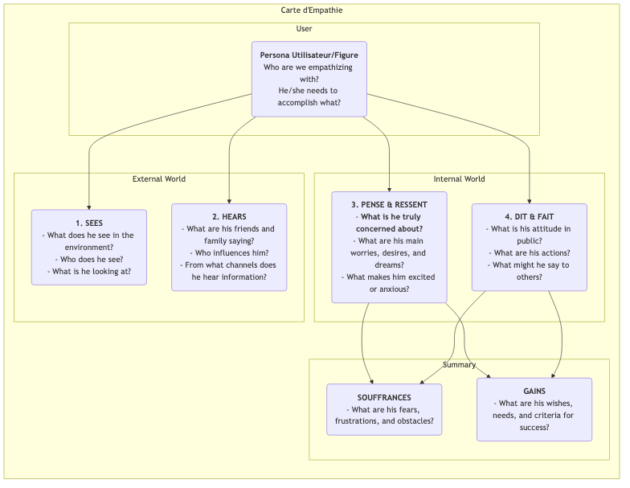

# Carte d'Empathie

En conception de produit et en recherche utilisateur, l'« empathie » est une qualité fondamentale souvent mentionnée mais extrêmement difficile à atteindre réellement. Comment pouvons-nous véritablement « marcher dans les chaussures de l'utilisateur » et vivre leur monde de première main ? La **Carte d'Empathie** est un outil collaboratif d'empathie simple, intuitif, mais extrêmement puissant, conçu précisément pour cette finalité. Elle vise à aider les équipes à aller au-delà de l'apparence du comportement utilisateur pour explorer leur univers plus profond de **sensations, pensées et émotions**, formant ainsi une compréhension plus complète et multidimensionnelle de l'utilisateur.

Le cœur de la Carte d'Empathie réside dans l'organisation systématique de toutes les observations dispersées et les données qualitatives recueillies sur les utilisateurs au sein d'un cadre visuel. Ce cadre est généralement divisé en quatre quadrants principaux : **Voit, Entend, Pense & Ressent, et Dit & Fait**. En remplissant collectivement cette carte, les membres de l'équipe sont contraints d'adopter le point de vue de l'utilisateur, construisant ensemble une compréhension partagée de son monde intérieur et de son environnement extérieur. C'est un miroir qui reflète clairement la situation réelle de l'utilisateur et un catalyseur pour développer une empathie collective au sein de l'équipe.

## Composants d'une Carte d'Empathie

Une Carte d'Empathie classique est centrée sur l'utilisateur et se structure autour de quatre quadrants fondamentaux représentant l'expérience externe et interne.

<!--

*   **Voit** : Décrit ce que l'utilisateur perçoit visuellement dans son environnement. Par exemple, que font les personnes autour de lui ? Quelles informations du marché rencontre-t-il quotidiennement ?
*   **Entend** : Décrit les informations que l'utilisateur reçoit du monde extérieur. Que disent ses amis, sa famille et ses collègues ? Quels leaders d'opinion ou quels canaux médiatiques l'influencent ?
*   **Pense & Ressent** : C'est le cœur de la carte, cherchant à explorer l'univers intérieur de l'utilisateur. Qu'est-ce qui est vraiment important pour lui (même s'il ne le dit jamais à haute voix) ? Quelles sont ses inquiétudes, ses angoisses, ses espoirs et ses rêves ?
*   **Dit & Fait** : Décrit les paroles et les actes de l'utilisateur en public. Que nous a-t-il dit pendant un entretien ? Quels sont ses comportements réels lorsqu'il utilise le produit ? Ici, il faut particulièrement prêter attention aux éventuelles contradictions entre ce que l'utilisateur « dit » et ce qu'il « pense ».
*   **Pains** (douleurs) et **Gains** (bénéfices) : Après avoir analysé les quatre quadrants ci-dessus, synthétisez les luttes internes et les désirs de l'utilisateur. Les « Pains » représentent les obstacles et les émotions négatives qu'il rencontre, tandis que les « Gains » représentent les objectifs et les souhaits qu'il désire vraiment atteindre.

## Comment utiliser une Carte d'Empathie

Une Carte d'Empathie est idéalement utilisée dans un format d'atelier en équipe.

1.  **Étape 1 : Définir le périmètre et les objectifs**
    *   **Choisissez votre utilisateur** : Définissez clairement pour quelle personne ou figure spécifique cette Carte d'Empathie est conçue. Il est préférable de lui donner un nom et un contexte de base.
    *   **Clarifiez les objectifs** : Définissez les objectifs que vous espérez atteindre grâce à cet exercice. S'agit-il de mieux comprendre les utilisateurs existants, ou d'explorer les utilisateurs potentiels d'un nouveau produit ?

2.  **Étape 2 : Rassembler les matériaux de recherche**
    Une Carte d'Empathie doit reposer sur des recherches réelles, et non sur de la fiction. Préparez tous les documents de recherche utilisateur pertinents, tels que : les enregistrements et transcriptions des entretiens utilisateur, les vidéos de tests d'utilisabilité, les réponses ouvertes aux enquêtes, des photos de l'utilisateur, etc.

3.  **Étape 3 : Remplir la carte en collaboration**
    *   Dessinez un grand modèle de Carte d'Empathie sur un tableau blanc, ou utilisez un outil collaboratif en ligne.
    *   Les membres de l'équipe collaborent pour noter les observations issues des documents de recherche sur des post-it, un par un, et les placent dans les quadrants correspondants de la carte. Par exemple, en écoutant un enregistrement d'entretien, un participant peut écrire « L'utilisateur dit qu'il fait des heures supplémentaires chaque semaine (Dit) », tandis qu'un autre peut écrire « J'ai l'impression qu'il semble fatigué et a perdu sa passion pour le travail (Ressent) ».
    *   Encouragez les membres de l'équipe à lire à haute voix le contenu des post-it et à expliquer pourquoi ils les ont placés dans ce quadrant.

4.  **Étape 4 : Approfondir et synthétiser**
    Lorsque toutes les informations sont sur le tableau, guidez l'équipe vers une discussion plus approfondie.
    *   « Quelles contradictions voyons-nous ? Par exemple, les paroles et les actes des utilisateurs sont-ils incohérents ? »
    *   « Derrière tous ces détails, qu'est-ce qu'il redoute vraiment mais n'a pas exprimé ? »
    *   « Qu'avons-nous appris de surprenant ? »
    *   Enfin, résumez collectivement les **Pains** et **Gains** les plus essentiels de l'utilisateur.

5.  **Étape 5 : Partager et appliquer**
    Organisez et partagez la Carte d'Empathie terminée, et utilisez-la comme une entrée importante pour les étapes ultérieures de conception et de prise de décision.

## Cas d'application

**Cas 1 : Conception d'un smartphone pour les personnes âgées**

*   **Utilisateur** : Grand-père Wang, 70 ans, vient de recevoir un smartphone de ses enfants.
*   **Voit** : Les icônes sur l'écran du téléphone sont petites et nombreuses, difficiles à voir ; les jeunes utilisent tous les paiements mobiles et discutent en ligne.
*   **Entend** : Ses enfants disent : « C'est très simple, tu vas vite apprendre » ; ses vieux amis disent : « Ce truc est trop compliqué, je n'arrive pas à l'apprendre. »
*   **Pense & Ressent** : Il se sent très **frustré**, craint d'être dépassé par la technologie ; mais il est **désireux** d'apprendre à faire des appels vidéo avec ses petits-enfants.
*   **Dit & Fait** : Il dit : « Je n'en ai pas besoin », mais essaie secrètement de déverrouiller l'écran encore et encore.
*   **Pains** : Peur de faire des erreurs et de causer des pertes ; sentiment d'être abandonné par la technologie.
*   **Gains** : Espère maintenir un contact plus étroit avec sa famille ; espère pouvoir accomplir seul certaines tâches quotidiennes (par exemple, consulter les horaires des bus).
*   **Inspiration de conception** : Le principe central de conception de ce téléphone ne devrait pas être « des fonctionnalités puissantes », mais « aucune frustration ». Il faut proposer des fonctions comme le « mode de très grands caractères », l'« assistance à distance familiale », etc.

**Cas 2 : Conception d'une application de recherche d'emploi pour les étudiants universitaires**

*   **Utilisateur** : Li Xue, 22 ans, étudiant universitaire en fin de cycle.
*   **Voit** : Les sites de recherche d'emploi sont encombrés d'informations, difficiles à distinguer entre le vrai et le faux ; ses camarades autour d'elle ont reçu plusieurs offres.
*   **Entend** : Les anciens disent : « Le premier emploi est très important » ; ses parents disent : « Trouver un emploi stable est ce qu'il y a de plus important. »
*   **Pense & Ressent** : Elle se sent très **confuse et anxieuse** face à l'avenir ; elle ne sait pas quel type d'emploi lui conviendrait ; elle a **peur** de mal se comporter lors des entretiens.
*   **Dit & Fait** : Elle a envoyé des centaines de CV ; elle a révisé plusieurs fois son CV.
*   **Pains** : Manque de direction dans la recherche d'emploi ; asymétrie d'information ; manque de confiance en soi.
*   **Gains** : Elle espère trouver un emploi qui l'intéresse vraiment et qui ait de bonnes perspectives ; elle espère recevoir des conseils et un accompagnement professionnels.
*   **Inspiration de conception** : La fonction principale de l'application ne devrait pas se limiter à la publication d'offres d'emploi, mais devrait inclure des modules comme le « test de personnalité professionnelle », la « consultation en ligne avec des mentors du secteur », la « simulation d'entretien », etc.

**Cas 3 : Conception d'un outil d'écriture pour les créateurs de contenus**

*   **Utilisateur** : Zhang Wei, blogueur à temps partiel.
*   **Voit** : D'autres blogueurs publient des articles de qualité quotidiennement ; ses propres articles reçoivent peu de vues.
*   **Entend** : Les lecteurs commentent : « Bien écrit, j'attends les mises à jour » ; ses amis disent : « C'est difficile de gagner sa vie en tant que blogueur. »
*   **Pense & Ressent** : Il ressent une grande douleur quand l'**inspiration tarit** ; il **désire** la reconnaissance et la résonance des lecteurs ; il **lutte** entre la poursuite de ses idéaux et les revenus réels.
*   **Dit & Fait** : Il passe beaucoup de temps à collecter des documents et à organiser ses contenus ; il écrit souvent tard dans la nuit.
*   **Pains** : Processus d'écriture interrompu, faible efficacité ; manque de motivation pour créer régulièrement.
*   **Gains** : Il espère disposer d'un outil qui l'aide à organiser ses idées et à susciter l'inspiration ; il souhaite établir des connexions plus profondes avec ses lecteurs.
*   **Inspiration de conception** : En plus des fonctions d'édition de base, l'outil d'écriture devrait également proposer des fonctionnalités spéciales telles que la « collection de cartes d'inspiration », le « mode carte mentale », l'« analyse des interactions avec les lecteurs », etc.

## Avantages et défis de la Carte d'Empathie

**Avantages principaux**

*   **Rapide et efficace** : Méthode efficace pour développer rapidement l'empathie au sein d'une équipe (généralement en 60 minutes).
*   **Promotion de la collaboration en équipe** : Sa nature collaborative peut briser les silos inter-départementaux, permettant à toute l'équipe d'acquérir une compréhension unifiée et approfondie de l'utilisateur.
*   **Découverte de besoins cachés** : En se concentrant sur l'univers intérieur de l'utilisateur, elle aide à identifier des besoins et des points douloureux potentiels que l'utilisateur lui-même n'aurait peut-être pas clairement exprimés.

**Défis possibles**

*   **Ne remplace pas les personas utilisateurs** : Une Carte d'Empathie se concentre généralement sur l'état d'un utilisateur dans un scénario spécifique, tandis qu'un persona utilisateur décrit un modèle de personnage plus complet et durable. Une Carte d'Empathie est une excellente source d'information pour créer des personas utilisateurs, mais ne peut pas les remplacer entièrement.
*   **Nécessite des données réelles** : Comme tous les outils de recherche utilisateur, sans données réelles, une Carte d'Empathie peut devenir une « séance de création fictive » basée sur les hypothèses subjectives des membres de l'équipe.

## Extensions et liens

*   **Persona utilisateur** : La Carte d'Empathie est une **étape essentielle et préalable** à la création d'un persona utilisateur vivant et riche en émotions. Grâce à l'analyse de la Carte d'Empathie, elle peut fournir des matières extrêmement vivantes pour les modules tels que les « Pains », les « Objectifs », etc., d'un persona utilisateur.
*   **Carte du parcours utilisateur** : À chaque étape du parcours utilisateur, une mini Carte d'Empathie peut être utilisée pour analyser en profondeur les pensées, les émotions et les actions de l'utilisateur à cette étape, permettant ainsi d'identifier plus précisément les points douloureux à chaque étape.

---
*Référence : La Carte d'Empathie a été initialement proposée par Dave Gray, fondateur de XPLANE (aujourd'hui intégré à Deloitte), et est largement utilisée dans les pratiques de Design Thinking et de développement Agile. C'est un outil fondamental et central dans les processus de conception centrés sur l'utilisateur.*