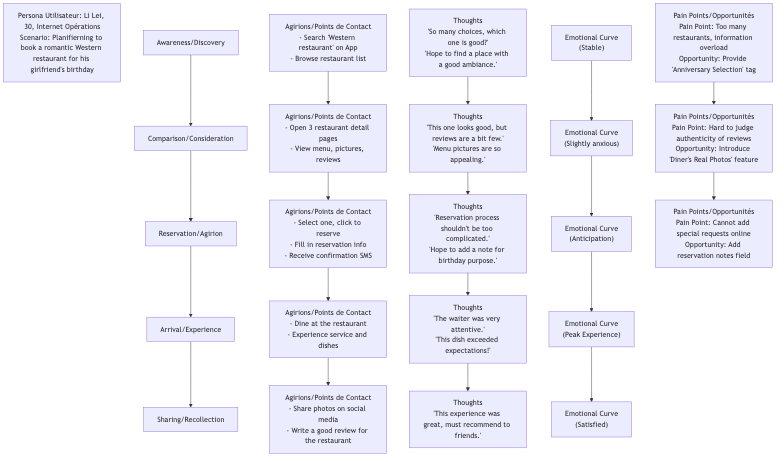

# Cartographie du Parcours Utilisateur

Lorsque nous concevons un produit ou un service, il est facile de se concentrer uniquement sur des fonctionnalités ou des interfaces isolées, en négligeant l'expérience complète et de bout en bout que les utilisateurs vivent avec nous. La **Carte du Parcours Utilisateur** est un outil de visualisation puissant conçu pour briser cette « vision tunnel ». Elle représente de manière systématique, sous forme de récit, le **processus complet** par lequel une **Personne Utilisateur** spécifique interagit avec votre produit, service ou marque pour atteindre un **objectif précis**. Elle ne se contente pas d'enregistrer les **étapes comportementales** de l'utilisateur à chaque stade, mais révèle surtout en profondeur ses **pensées, émotions et points douloureux** tout au long du processus.

La valeur fondamentale d'une carte du parcours utilisateur réside dans l'obligation qu'elle nous impose d'examiner et de vivre les services que nous fournissons depuis la **perspective de l'utilisateur**. Elle transforme une expérience initialement fragmentée et invisible en une carte visuelle claire, intuitive et empathique. Grâce à cette carte, l'équipe peut facilement identifier les hauts et les bas de l'expérience, repérer les obstacles clés qui conduisent à la désaffection des utilisateurs, et découvrir des opportunités innovantes pour améliorer la satisfaction et la fidélité des utilisateurs. C'est un pont reliant le produit au monde émotionnel réel de l'utilisateur.

## Composants Clés d'une Carte du Parcours Utilisateur

Une carte du parcours utilisateur standard ressemble généralement à un diagramme à bandes horizontales et comprend les composants fondamentaux suivants :

1.  **Personne Utilisateur** : Qui est le protagoniste de cette carte ? Au début de la carte, il faut impérativement définir clairement quelle personne utilisateur centrale cette carte représente. Différents utilisateurs peuvent avoir des parcours très différents.
2.  **Scénario & Objectifs** : Dans quel scénario spécifique l'utilisateur se trouve-t-il ? Quel objectif espère-t-il atteindre grâce à ce parcours ? Par exemple, « Un employé de bureau occupé (Personne) souhaite réserver un dîner romantique dans un restaurant occidental pour l'anniversaire de sa petite amie (Objectif) pendant son trajet en métro vers chez lui (Scénario). »
3.  **Étapes du Parcours / Phases** : Décomposez l'ensemble du parcours de bout en bout en plusieurs étapes principales logiquement continues. Par exemple, pour un parcours d'achat en ligne, les étapes pourraient être : **Découverte -> Réflexion -> Achat -> Attente -> Réception -> Utilisation/Service après-vente**.
4.  **Actions / Points de Contact** : Que fait exactement l'utilisateur à chaque étape ? Par quels canaux ou points de contact (par exemple, réseaux sociaux, application mobile, service client téléphonique, magasin physique) interagit-il avec vous ?
5.  **Pensées** : À quoi l'utilisateur pense-t-il pendant ces actions ? Quelles questions, attentes ou monologues intérieurs a-t-il ?
6.  **Émotions / Sentiments** : C'est l'âme de la carte du parcours. Utilisez une courbe émotionnelle pour illustrer les fluctuations émotionnelles de l'utilisateur à chaque étape – ressent-il de la satisfaction, de la confusion, de l'anxiété ou de la frustration ? Cela nous aide à identifier rapidement les « points douloureux » et les « points de plaisir » dans l'expérience.
7.  **Points douloureux & Opportunités** : Sur la base de l'analyse ci-dessus, identifiez clairement les obstacles clés qui provoquent des émotions négatives chez l'utilisateur (points douloureux) à chaque étape, et imaginez des opportunités d'amélioration correspondantes.

### Modèle de Carte du Parcours Utilisateur

## Comment Créer une Carte du Parcours Utilisateur

1.  **Étape 1 : Définir les Objectifs et la Portée**
    Tout d'abord, clarifiez pourquoi vous créez cette carte du parcours. Quel problème espérez-vous résoudre ? Ensuite, déterminez la **personne utilisateur** et le **scénario spécifique** que cette carte représentera.

2.  **Étape 2 : Collecter des Données Utilisateurs**
    La carte du parcours doit reposer sur des recherches réelles sur les utilisateurs, et non sur l'imagination de l'équipe. Les sources de données peuvent inclure : des entretiens avec des utilisateurs, des tests d'utilisabilité, des enquêtes, des enregistrements du service client, des données analytiques du site web, des commentaires sur les réseaux sociaux, etc.

3.  **Étape 3 : Organiser un Atelier et Co-créer la Carte du Parcours**
    Rassemblez une équipe pluridisciplinaire (incluant produit, design, R&D, marketing, service client, etc.), et apportez toutes les informations recueillies (qui peuvent prendre la forme de notes autocollantes) dans la salle de réunion. Ensemble, l'équipe va collaborativement organiser et définir chaque étape du parcours, ainsi que les comportements, pensées et émotions de l'utilisateur à chaque étape, sous forme de récit.

4.  **Étape 4 : Tracer la Courbe Émotionnelle et Identifier les Moments Clés**
    Tracez ensemble la courbe émotionnelle de l'utilisateur, en identifiant les **Moments de Vérité** qui déterminent le succès ou l'échec de l'expérience utilisateur, en particulier les points les plus bas (points douloureux) et les pics les plus hauts (moments de plaisir).

5.  **Étape 5 : Découvrir des Opportunités et Définir un Plan d'Action**
    Pour chaque point douloureux identifié, imaginez et proposez des opportunités concrètes et réalisables d'amélioration. Enfin, priorisez ces opportunités et transformez-les en éléments concrets à ajouter à la liste de tâches du produit ou en plans d'action.

## Cas d'Application

**Cas 1 : Améliorer l'Expérience des Passagers dans un Aéroport**

*   **Scénario** : Une entreprise de gestion d'aéroport souhaite améliorer la satisfaction globale des passagers.
*   **Application** : Ils ont cartographié le parcours utilisateur de « voyageurs internationaux effectuant leur premier voyage au départ de cet aéroport ». L'analyse a révélé que les points douloureux les plus importants survenaient pendant les étapes « contrôle de sécurité » et « recherche de la porte d'embarquement », où les passagers ressentaient généralement de l'anxiété et de la confusion. Sur la base de cela, l'aéroport a ajouté des panneaux directionnels plus clairs, introduit des files de sécurité intelligentes pour réduire les temps d'attente, et mis en place une navigation en temps réel vers les portes d'embarquement dans l'application, améliorant considérablement l'expérience des passagers.

**Cas 2 : Optimiser le Taux de Réussite des Cours en Ligne**

*   **Scénario** : Une plateforme d'éducation en ligne constate que de nombreux utilisateurs achètent des cours mais abandonnent en cours de route.
*   **Application** : En cartographiant le parcours de « l'étudiant en activité suivant un cours de programmation », ils ont constaté que les émotions des étudiants atteignaient leur plus bas vers la troisième semaine du cours, car la difficulté augmentait à ce moment-là, et les étudiants avaient tendance à interrompre leur rythme d'étude en raison de leur travail chargé. Pour résoudre ce problème, la plateforme a mis en place des mesures d'intervention telles que « un service de supervision par un tuteur », « des groupes d'étude », et « l'envoi de badges encourageants en semaine 3 », ce qui a considérablement amélioré le taux de réussite des cours.

**Cas 3 : Améliorer le Processus d'Ouverture de Compte dans une Banque**

*   **Scénario** : Une banque traditionnelle souhaite optimiser le processus d'ouverture de compte en ligne pour les nouveaux utilisateurs.
*   **Application** : La carte du parcours a montré que les utilisateurs ressentaient de l'impatience et de la méfiance pendant les étapes « téléchargement des justificatifs d'identité » et « lecture des conditions générales longues », ce qui entraînait un grand nombre d'abandons. À cet effet, la banque a simplifié le contenu des conditions générales et développé une fonction pratique permettant de lire directement les informations de la carte d'identité via la technologie NFC, ce qui a considérablement amélioré la fluidité et le taux de conversion du processus d'ouverture de compte.

## Avantages et Défis des Cartes du Parcours Utilisateur

**Avantages Principaux**

*   **Créer une Perspective Globale** : Aide l'équipe à dépasser les silos organisationnels et les isolations fonctionnelles, en examinant l'expérience utilisateur de manière holistique et cohérente.
*   **Outil d'Empathie Puissant** : Permet aux membres de l'équipe, en particulier aux ingénieurs et aux gestionnaires, de ressentir intuitivement les émotions et les points douloureux réels des utilisateurs.
*   **Identifier Efficacement les Problèmes et les Opportunités** : Met clairement en évidence les ruptures et les obstacles dans les processus existants et offre un focus clair pour l'innovation.
*   **Promouvoir la Collaboration et le Consensus au sein de l'Équipe** : Le processus de co-création d'une carte du parcours est en soi une excellente activité d'équipe, permettant à toutes les parties prenantes de partager une même compréhension de l'utilisateur et d'atteindre un consensus.

**Défis Potentiels**

*   **Problèmes de Représentativité** : Une carte du parcours représente généralement une seule personne utilisateur et un seul scénario, nécessitant plusieurs cartes pour couvrir un éventail plus large de groupes d'utilisateurs.
*   **Basée sur des Recherches Réelles** : En l'absence de recherches utilisateurs réelles et approfondies, la carte du parcours peut devenir une carte de « fantasme ».
*   **Nécessite des Mises à Jour Continues** : À mesure que les produits et services évoluent, les parcours utilisateurs changent également, et les cartes du parcours doivent être traitées comme des documents « vivants » et régulièrement mis à jour.

## Extensions et Liens

*   **Personne Utilisateur** : Constitue la **condition préalable** à la création d'une carte du parcours utilisateur. Sans personne utilisateur claire, la carte du parcours perd son protagoniste.
*   **Blueprint du Service** : Peut être vu comme la « vue backstage » de la carte du parcours utilisateur. Alors que la carte du parcours illustre l'expérience utilisateur en avant-scène, le blueprint du service s'étend davantage vers le bas, détaillant comment le personnel, les systèmes et les processus en coulisses fonctionnent et interagissent pour soutenir ces expériences en avant-scène.
*   **Carte d'Empathie** : Cet outil se concentre davantage sur l'exploration approfondie du monde intérieur d'un utilisateur unique, souvent utilisé pour la collecte de données et des exercices d'empathie lors des premières étapes de création des personnes utilisateurs et des cartes du parcours.

---
*Référence : La carte du parcours utilisateur, en tant qu'outil clé dans le domaine de la conception d'expérience utilisateur (UX), ses concepts et pratiques évoluent constamment. Jesse James Garrett, cofondateur d'Adaptive Path, a posé les bases théoriques dans son livre « The Elements of User Experience ». Des organisations autoritatives telles que le Nielsen Norman Group (NN/g) proposent de nombreux guides pratiques et articles sur la création et l'utilisation des cartes du parcours utilisateur.*