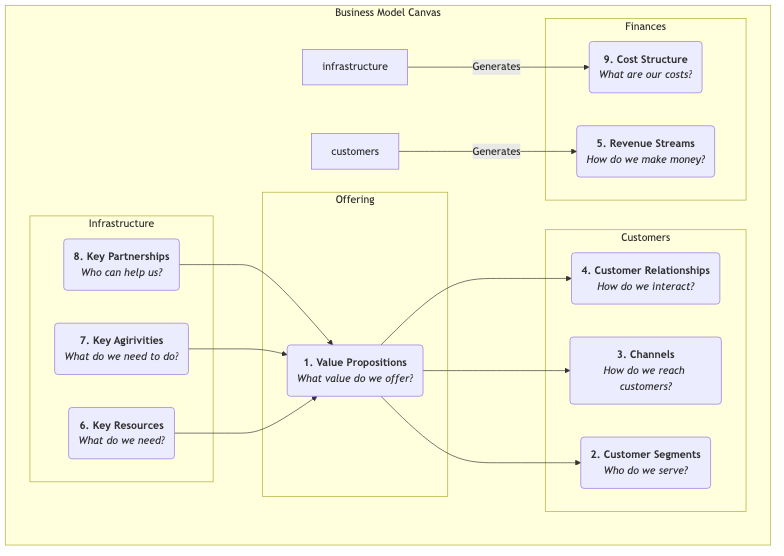

# Modèle de Modèle Économique (Business Model Canvas)

Une idée d'entreprise, aussi passionnante soit-elle, restera une chimère si elle ne peut pas être transformée en un système viable et durablement rentable. Le **Business Model Canvas** (ou Modèle de Modèle Économique) est un outil stratégique et entrepreneurial révolutionnaire proposé par Alexander Osterwalder et Yves Pigneur. Il propose un langage commun concis et intuitif permettant aux équipes de décrire clairement, concevoir, évaluer et itérer tous les éléments essentiels d’un modèle économique sur un seul tableau.

Le charme du Business Model Canvas réside dans sa capacité à décomposer un système d'entreprise complexe et dynamique en neuf blocs élémentaires interconnectés et logiques. Ces neuf blocs couvrent quatre domaines principaux de l'entreprise : **les clients, les produits/services, l'infrastructure et la viabilité financière**. En présentant systématiquement ces blocs sur une même feuille, les entrepreneurs et les gestionnaires peuvent obtenir une vue d'ensemble du modèle économique, identifier ses moteurs clés, ses risques potentiels et ses opportunités d'innovation, facilitant ainsi des discussions stratégiques plus approfondies et des prises de décision plus agiles.

## Les Neuf Blocs du Modèle

Le cœur du Business Model Canvas est un modèle comprenant neuf cases, chacune représentant un aspect essentiel du modèle économique.

1.  **Proposition de valeur** : C'est le cœur du modèle. Cela décrit la valeur que vous créez pour des segments de clients spécifiques, les problèmes que vous résolvez pour eux, ou les besoins que vous satisfaites. Elle doit être unique et distinctive.
2.  **Segments de clients** : Pour qui créez-vous de la valeur ? Qui sont vos clients les plus importants ? Ici, un ou plusieurs groupes cibles peuvent être définis.
3.  **Canaux** : Par quels points de contact communiquez-vous avec vos clients et leur livrez-vous votre proposition de valeur ? Cela inclut les canaux de sensibilisation, d'évaluation, d'achat, de livraison et de service après-vente.
4.  **Relations avec les clients** : Quel type de relation souhaitez-vous établir et maintenir avec chaque segment de clients ? Est-ce automatisée, personnalisée ou basée sur une communauté ?
5.  **Sources de revenus** : Comment générez-vous des revenus auprès des clients après avoir correctement délivré la valeur ? S'agit-il de ventes ponctuelles, d'abonnements, de frais de location ou de publicité ?
6.  **Ressources clés** : Les actifs les plus importants que vous devez posséder pour délivrer votre proposition de valeur, atteindre vos clients et maintenir les relations. Ils peuvent être physiques, des propriété intellectuelles, humains ou financiers.
7.  **Activités clés** : Les activités les plus importantes que vous devez réaliser pour que votre modèle économique fonctionne efficacement. Par exemple, pour une entreprise de logiciels, il s'agit du « développement logiciel » ; pour un cabinet de conseil, il s'agit de la « résolution de problèmes ».
8.  **Partenariats clés** : Le réseau de fournisseurs et partenaires avec lesquels vous devez collaborer pour optimiser votre modèle économique, réduire les risques ou acquérir des ressources.
9.  **Structure des coûts** : Tous les coûts nécessaires pour faire fonctionner le modèle économique, y compris les coûts fixes et variables.

## Comment Utiliser le Business Model Canvas

1.  **Imprimez un Grand Modèle**
    Imprimez le modèle sur un grand poster et préparez beaucoup de post-it et de marqueurs. La nature physique du modèle est cruciale pour la collaboration et la discussion en équipe.

2.  **De Droite à Gauche, Commencez par les Clients, Puis l'Infrastructure**
    Un ordre de remplissage recommandé consiste à commencer par le côté droit du modèle (côté client), puis passer à la proposition de valeur au milieu, et enfin à l'infrastructure. C'est-à-dire : **Segments de clients -> Proposition de valeur -> Canaux -> Relations avec les clients -> Sources de revenus**. Cela garantit que votre modèle économique reste centré sur le client.

3.  **Brainstorming avec des Post-it**
    Pour chaque bloc, les membres de l'équipe écrivent leurs idées sur des post-it et les placent dans la case correspondante. L'avantage des post-it est que les idées peuvent être facilement déplacées, modifiées et remplacées.

4.  **Relier et Raconter une Histoire**
    Une fois le modèle rempli, essayez de raconter l'histoire de votre modèle économique. Commencez par vos clients cibles (CS), décrivez comment vous les servez via votre proposition de valeur (VP) et vos canaux (CH), et générez finalement des revenus (R). Ensuite, expliquez quelles ressources (KR), activités (KA) et partenaires (KP) vous avez besoin pour tout cela, ainsi que les coûts (C) associés. Vérifiez si l'histoire est logique et si les différents modules s'accordent bien.

5.  **Évaluer et Itérer**
    Évaluez le modèle économique sur le modèle. Quels sont ses points forts ? Quels sont ses points faibles et ses risques ? Ensuite, en déplaçant ou remplaçant les post-it, explorez différentes possibilités et concevez un meilleur modèle économique.

## Cas d'Application

**Cas 1 : Machine à café Nespresso avec capsules**

*   **Segments de clients** : Utilisateurs domestiques et professionnels recherchant qualité et commodité.
*   **Proposition de valeur** : Préparer facilement et rapidement un espresso de qualité café à la maison.
*   **Canaux** : Vente directe via le site officiel, comptoirs dans les grands magasins haut de gamme, et propres boutiques.
*   **Relations avec les clients** : Création du Nespresso Club, offrant des services aux membres et des expériences exclusives.
*   **Sources de revenus** : Adopte le modèle du « rasoir et lame ». La machine à café (le rasoir) a une faible marge bénéficiaire, le revenu provient principalement de la vente continue de capsules de café à forte marge, protégées par brevet (les lames).
*   **Ressources clés** : Marque forte, technologie brevetée (système de capsules), installations de production.
*   **Activités clés** : Marketing, gestion de la chaîne d'approvisionnement, R&D produit.
*   **Partenariats clés** : Fabricants de machines à café, producteurs de café.
*   **Structure des coûts** : Coûts élevés en marketing et construction de la marque, coûts de production.

**Cas 2 : Airbnb**

*   **Segments de clients** : Plateforme à double face, avec d’un côté les **propriétaires** disposant de chambres disponibles, et de l’autre côté les **voyageurs** cherchant des expériences d’hébergement uniques et locales.
*   **Proposition de valeur** : Propose aux propriétaires un moyen facile de gagner de l’argent ; offre aux voyageurs des options d’hébergement moins chères et plus locales que les hôtels.
*   **Canaux** : Site web et application mobile.
*   **Relations avec les clients** : Construit une communauté basée sur la confiance, en maintenant les relations via les systèmes d’avis et le support utilisateur.
*   **Sources de revenus** : Prélève une commission en pourcentage à la fois sur les propriétaires et les voyageurs.
*   **Ressources clés** : La plateforme elle-même, un vaste réseau d'utilisateurs et d'annonces, la marque.
*   **Activités clés** : Développement et maintenance de la plateforme, opérations communautaires, marketing.
*   **Partenariats clés** : Photographes (pour les photos des annonces), plateformes de paiement, compagnies d'assurance.
*   **Structure des coûts** : Coûts liés à la maintenance de la plateforme, au marketing, au service client.

**Cas 3 : Jeux Mobiles Gratuits (ex. Honor of Kings)**

*   **Segments de clients** : Grande base de joueurs (utilisateurs gratuits) et un petit nombre de **joueurs payants** prêts à payer pour des services premium.
*   **Proposition de valeur** : Propose une expérience de divertissement compétitive, de haute qualité et gratuite.
*   **Canaux** : Magasins d'applications (App Store, Google Play).
*   **Relations avec les clients** : Maintient l'activité communautaire via des systèmes sociaux dans le jeu, des événements et des tournois esports.
*   **Sources de revenus** : Génère principalement des revenus par la vente d'objets virtuels n'affectant pas l'équilibre du jeu (ex. skins de héros, décorations) aux joueurs payants (modèle freemium).
*   **Ressources clés** : Propriété intellectuelle du jeu, équipe de développement, grande base d'utilisateurs.
*   **Activités clés** : Développement et mises à jour du jeu, opérations communautaires, organisation d'événements esports.
*   **Partenariats clés** : Canaux des magasins d'applications, clubs esports, plateformes de streaming en direct.
*   **Structure des coûts** : Coûts élevés en R&D et serveurs, dépenses marketing.

## Valeur et Limites du Business Model Canvas

**Valeur Principale**

*   **Intuitif et Global** : Visualise une logique métier complexe, aidant les équipes à avoir une vue globale.
*   **Facilite la Communication et le Consensus** : Fournit un langage commun, facilitant grandement le dialogue stratégique au sein de l'équipe.
*   **Agile et Itératif** : Très adapté à l'exploration et à l'itération de nouveaux modèles économiques, en particulier lors des premières étapes incertaines.

**Limites Potentielles**

*   **Ignore la Concurrence** : Le modèle ne possède pas de module dédié à l'analyse de l'environnement concurrentiel.
*   **Photo Statique** : Il représente la structure du modèle économique mais ne montre pas pleinement son évolution dynamique.
*   **Nécessite d’être Complété par d’autres Outils** : Pour prendre des décisions plus solides, il doit généralement être combiné à d'autres outils comme le Value Proposition Canvas et l'analyse SWOT.

## Extensions et Liens

*   **Lean Canvas** : Une variante du Business Model Canvas, plus adaptée aux projets de startups en phase initiale et à forte incertitude. Il remplace les blocs « Partenariats clés », « Activités clés », « Ressources clés » et « Relations avec les clients » par des modules se concentrant davantage sur les problèmes et les solutions.
*   **Value Proposition Canvas** : Peut être vu comme une extension et un approfondissement des blocs « Proposition de valeur » et « Segments de clients » du Business Model Canvas, vous aidant à affiner plus précisément l'adéquation produit-marché.
*   **Blue Ocean Strategy** : Après avoir conçu une nouvelle courbe de valeur à l’aide du Cadre des Quatre Actions de la stratégie Blue Ocean, le Business Model Canvas peut être utilisé pour concevoir systématiquement le modèle économique soutenant cette nouvelle stratégie.

---
*Référence : Le livre d'Alexander Osterwalder et Yves Pigneur, "Business Model Generation", est le guide autoritatif sur cet outil, contenant de nombreuses études de cas et des instructions détaillées.*