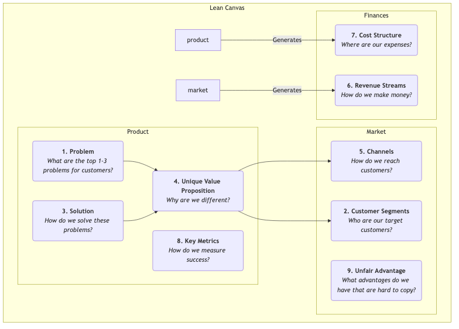

# Lean Canvas

Dans les premières étapes d'une startup, le plus grand risque n'est souvent pas « pouvons-nous construire le produit ? » mais « quelqu'un voudra-t-il vraiment le produit que nous construisons ? » Les plans d'affaires traditionnels et les canevas du modèle économique sont d'excellents outils pour les entreprises matures, mais pour les startups évoluant dans un environnement d'incertitude élevé, ils peuvent être excessivement complexes et pas suffisamment axés sur les risques les plus critiques. **Lean Canvas** a été créé pour résoudre ce problème ; c'est une adaptation brillante du Business Model Canvas, spécialement conçue pour les **entrepreneurs en phase précoce**.

Lean Canvas, proposé par Ash Maurya dans son livre *Running Lean*, hérite de la simplicité et de l'intuitivité du Business Model Canvas, mais déplace l'accent d'une « description complète du modèle économique » vers **« l'identification et la validation systématiques des hypothèses les plus risquées pour la startup. »** Il se concentre sur le **problème-solution** et ajoute une attention particulière aux indicateurs clés et aux avantages concurrentiels, incarnant plus profondément le cycle « construire-mesurer-apprendre » du Lean Startup. C'est une carte stratégique axée sur les risques, guidant les entrepreneurs à travers le brouillard.

## Les neuf blocs de Lean Canvas

Lean Canvas conserve les neuf blocs du Business Model Canvas mais en remplace quatre pour le rendre plus opérationnel et orienté risques.

**Différences avec le Business Model Canvas :**

*   **Problème** remplace « Partenaires clés » : C'est la modification la plus importante. Elle oblige les entrepreneurs à définir clairement les 1 à 3 principaux problèmes que leurs clients cibles ont besoin de résoudre en urgence.
*   **Solution** remplace « Activités clés » : Après avoir défini le problème, vous proposez ensuite votre solution (généralement les fonctionnalités principales du produit) spécifiquement pour ce problème.
*   **Indicateurs clés** remplace « Ressources clés » : Pour une startup, l'essentiel n'est pas les ressources dont elle dispose, mais comment mesurer la santé et la croissance de l'entreprise. Les indicateurs clés sont le levier qui guide toutes les actions.
*   **Avantage injuste** remplace « Relations avec les clients » : Aussi appelé « avantage injuste » ou « fossé », il fait référence aux compétences fondamentales qui ne peuvent pas être facilement copiées ou achetées par les concurrents. C'est crucial pour la survie à long terme du modèle économique.

## Comment utiliser Lean Canvas

Le processus d'utilisation de Lean Canvas est un cycle continu de validation et d'itération.

1.  **Dessinez votre "Plan A"**
    Avant de parler à n'importe quel client, remplissez rapidement un Lean Canvas avec toutes vos idées et hypothèses initiales pour votre projet de startup. Cela prend généralement seulement 15 à 20 minutes. C'est votre "Plan A", une collection de toutes vos hypothèses à valider.

2.  **Identifiez les hypothèses les plus risquées**
    Examinez votre première version du canevas et identifiez les parties comportant le plus de risques et d'incertitudes. Généralement, pour un nouveau projet, les hypothèses les plus risquées, dans l'ordre, sont :
    *   **Hypothèse Problème-Clients** : Ce problème existe-t-il vraiment ? Ces personnes sont-elles vraiment vos clients cibles ?
    *   **Hypothèse Problème-Solution** : Votre solution peut-elle vraiment résoudre leur problème ?
    *   **Hypothèse Prix-Proposition de valeur** : Les clients sont-ils prêts à payer pour votre solution ?

3.  **Validez systématiquement les hypothèses**
    Concevez et réalisez une série d'« expériences minimales viables » (généralement des **entretiens sur le problème** et des **entretiens sur la solution**) pour valider systématiquement vos hypothèses à haut risque. Par exemple :
    *   **Effectuez des entretiens sur le problème** : Allez parler à vos clients cibles, mais ne mentionnez pas votre produit. Votre seul objectif est de comprendre en profondeur leurs problèmes, leurs comportements actuels et leurs points douloureux afin de valider les blocs « Problème » et « Segments de clients » du canevas.
    *   **Effectuez des entretiens sur la solution** : Après avoir validé que le problème existe bien, montrez votre solution (qui peut être un prototype, une démonstration) aux clients pour valider votre « Solution » et « Proposition de valeur », et testez leur volonté de payer (« Flux de revenus »).

4.  **Itérez votre canevas**
    Mettez continuellement à jour et itérez votre Lean Canvas en fonction des enseignements tirés des entretiens et des expériences. Certaines hypothèses sont validées, d'autres sont infirmées. Le canevas est comme un carnet d'expériences, documentant l'évolution complète de votre projet de startup, de sa conception initiale à la découverte du « product-market fit ».

## Cas d'application

**Cas 1 : Le canevas précoce de Dropbox (service de stockage cloud)**

*   **Problème** : Synchroniser des fichiers entre plusieurs appareils est fastidieux ; envoyer de gros fichiers via des clés USB ou des courriels est pénible ; oublier de sauvegarder entraîne une perte de données.
*   **Segments de clients** : Passionnés de technologie possédant plusieurs ordinateurs, travailleurs indépendants.
*   **Proposition de valeur unique** : « Placez vos fichiers dans une "poche magique", accessible n'importe où, jamais perdue. »
*   **Solution** : Une application de bureau qui fonctionne en arrière-plan de manière transparente, synchronisant automatiquement le contenu d'un dossier désigné.
*   **Indicateurs clés** : Nombre d'inscriptions, **taux de succès des téléchargements de fichiers**, nombre d'utilisateurs actifs.
*   **Avantage injuste** : Effet réseau – plus de personnes l'utilisent, plus il est facile de partager et collaborer.
*   **Validation** : Le fondateur Drew Houston a créé une simple vidéo de démonstration du produit et l'a publiée dans une communauté de passionnés de technologie. En une nuit, la liste d'attente est passée de 5 000 à 75 000 personnes, validant fortement l'adéquation « problème-solution ».

**Cas 2 : Un service de livraison de repas sains planifié**

*   **Problème** : Les travailleurs de bureau ont du mal à manger sain et équilibré au déjeuner ; préparer leurs repas eux-mêmes prend trop de temps ; les plats à emporter sont généralement gras.
*   **Segments de clients** : Jeunes professionnels soucieux de leur santé ayant des habitudes sportives.
*   **Proposition de valeur unique** : « Des repas sportifs conçus par des nutritionnistes, préparés frais, livrés à temps à votre bureau. »
*   **Solution** : Proposer des menus hebdomadaires pour le déjeuner, avec des menus mis à jour chaque semaine, et fournir des informations sur les calories et la valeur nutritionnelle.
*   **Indicateurs clés** : **Taux de réachat hebdomadaire**, valeur à vie du client.
*   **Avantage injuste** : Partenariats exclusifs avec des fournisseurs d'ingrédients de haute qualité, équipe de nutritionnistes professionnels.
*   **Validation** : Le fondateur pourrait initialement éviter de développer une application et accepter les commandes via un groupe WeChat ou une plateforme de sondage, livrant manuellement les déjeuners aux 20 premiers utilisateurs pour valider l'ensemble du processus et les besoins des utilisateurs.

**Cas 3 : Le canevas précoce d'Airbnb**

*   **Problème** : Pendant les grandes conférences, les hôtels en ville sont chers et complets.
*   **Segments de clients** : Des designers assistent à des conférences de design avec un budget limité.
*   **Solution** : Fournir une plateforme permettant aux résidents locaux (hôtes) de louer leurs matelas pneumatiques disponibles à ces designers.
*   **Proposition de valeur unique** : Obtenir un logement à un prix inférieur et avoir l'opportunité d'interagir avec les habitants.
*   **Validation** : Les fondateurs ont personnellement placé trois matelas pneumatiques dans leur maison et les ont loués avec succès à des designers participant à la conférence, validant personnellement la faisabilité de l'ensemble du modèle économique.

## Valeur et limites de Lean Canvas

**Valeur centrale**

*   **Focus sur les risques** : Oblige les entrepreneurs à faire face aux hypothèses les plus risquées dès le départ.
*   **Rapidité et itération** : Très adapté pour esquisser, discuter et itérer rapidement les modèles économiques, s'adaptant parfaitement au rythme du Lean Startup.
*   **Centré sur le problème** : Garantit que le point de départ du projet est de résoudre un problème client réel et pertinent.

**Limites potentielles**

*   **Attention insuffisante à l'environnement externe** : Comme le Business Model Canvas, il n'inclut pas naturellement l'analyse de la concurrence et de l'environnement macro.
*   **Pas applicable à toutes les entreprises** : Il convient principalement aux startups à haute incertitude. Pour les entreprises matures dont le modèle économique est validé, le Business Model Canvas pourrait être un outil plus complet.

## Extensions et connexions

*   **Business Model Canvas** : Lean Canvas est une variation et un développement important du Business Model Canvas dans le contexte du Lean Startup.
*   **Customer Development** : Une méthodologie proposée par Steve Blank, mettant l'accent sur le fait de « sortir du bureau » pour valider des hypothèses, qui sert de principe directeur pour Lean Canvas au niveau de l'action.
*   **Value Proposition Canvas** : Peut servir d'outil approfondi pour les blocs « Problème », « Solution » et « Proposition de valeur unique » de Lean Canvas, aidant les entrepreneurs à affiner plus précisément l'adéquation produit-marché.

---
*Référence : Le livre "Running Lean" d'Ash Maurya est la source la plus autoritative sur Lean Canvas, détaillant étape par étape comment l'utiliser et l'itérer en conjonction avec le Customer Development. Cette méthode est profondément influencée par "The Lean Startup" d'Eric Ries et le modèle Customer Development de Steve Blank.*