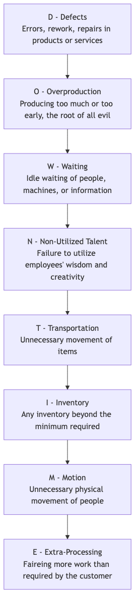

# Opérations Lean

Imaginez une rivière fluide et sans obstacles s'écoulant facilement, apportant directement la source de valeur au client avec une consommation minimale et une vitesse maximale. Tel est l'état idéal vers lequel **les Opérations Lean** tendent. Les Opérations Lean, souvent appelées **Production Lean** ou **Pensée Lean**, constituent à la fois une méthodologie puissante de gestion opérationnelle et une culture organisationnelle profonde ainsi qu'une philosophie de gestion. Son objectif principal est de maximiser la valeur perçue par le client et d'atteindre une efficacité opérationnelle de haute qualité, faible coût et grande rapidité en **identifiant systématiquement et en éliminant toutes les activités qui n'ajoutent pas de valeur (c'est-à-dire le « gaspillage », Muda) dans les processus opérationnels**.

La pensée Lean trouve son origine dans le « Toyota Production System (TPS) » de Toyota Motor Corporation, qui a complètement révolutionné les modèles traditionnels de production massive et poussée. Les Opérations Lean postulent que toute activité qui consomme des ressources sans ajouter de la valeur pour laquelle le client final est prêt à payer constitue un gaspillage. En examinant continuellement le flux de valeur et en éliminant les gaspillages, les organisations peuvent créer des produits et services de meilleure qualité avec moins de ressources et en moins de temps, obtenant ainsi un avantage fondamental dans une concurrence acharnée sur le marché.

## Cinq principes fondamentaux de la pensée Lean

La mise en œuvre de la pensée Lean repose sur cinq principes fondamentaux étroitement liés et cycliques.

1.  **Définir la valeur** : Le point de départ de toutes les activités doit être de définir précisément la valeur du point de vue du **client final**. Il ne s'agit pas de ce que nous pensons être précieux, mais de ce que le client considère comme précieux.
2.  **Cartographier le flux de valeur** : Pour chaque produit ou service, tracez son **processus complet de bout en bout**, de la conception à la livraison au client (c'est-à-dire le « flux de valeur »). Dans ce processus, identifiez clairement les étapes qui ajoutent réellement de la valeur, celles qui n'en ajoutent pas mais sont actuellement inévitables, et celles qui constituent un pur gaspillage devant être éliminées.
3.  **Créer le flux** : Décomposez les silos organisationnels et les modèles de production par lots isolés, et réorganisez les processus de manière à ce que les produits ou services puissent « s'écouler » à travers le flux de valeur aussi facilement, sans interruption et sans attente que possible.
4.  **Instaurer le tirage (pull)** : Contrairement à la production traditionnelle « poussée » (c'est-à-dire produire selon un plan indépendamment des besoins aval), la méthode Lean vise un système basé sur le **« tirage (pull) »**. Autrement dit, les processus en amont ne commencent la production ou ne fournissent des services que lorsque le client (ou le processus aval) émet un signal de demande clair. Cela élimine fondamentalement la surproduction et les stocks inutiles.
5.  **Rechercher la perfection** : Le Lean est un processus sans fin d'amélioration continue. En répétant constamment les quatre étapes ci-dessus, les organisations peuvent continuer à découvrir et à éliminer des niveaux plus profonds de gaspillage, s'approchant ainsi infiniment d'un état idéal de « zéro gaspillage ».

## Les huit gaspillages Lean (DOWNTIME)

La pensée Lean classe systématiquement les gaspillages dans les processus en huit catégories, souvent mémorisées grâce à l'acronyme **DOWNTIME**.

## Comment mettre en œuvre les Opérations Lean

La transformation Lean est un changement culturel et opérationnel profond qui repose sur une série d'outils et de méthodes puissants.

1.  **Cartographie du flux de valeur (VSM)** : C'est le point de départ de la mise en œuvre du Lean. En cartographiant le flux de valeur actuel, identifiez les temps de cycle, les temps d'ajout de valeur et les gaspillages à chaque étape. Ensuite, concevez une carte du flux de valeur future idéale comme objectif d'amélioration.

2.  **Méthodologie 5S** : Utilisée pour créer un environnement de travail propre, organisé et efficace. Elle comprend cinq étapes : Seiri (Tri), Seiton (Rangement), Seiso (Nettoyage), Seiketsu (Standardisation) et Shitsuke (Discipline).

3.  **Kanban** : Un outil de gestion visuelle puissant utilisé pour mettre en œuvre la production par **tirage (pull)**. Les signaux de demande sont transmis via des cartes Kanban, permettant ainsi de contrôler précisément le volume de travaux en cours et d'éviter la surproduction.

4.  **Kaizen** : Signifiant « amélioration continue ». Les organisations doivent instaurer une culture encourageant tous les employés à réfléchir quotidiennement aux processus de travail et à proposer de petites améliorations continues.

5.  **Analyse de la cause racine** : Lorsqu'un problème survient, utilisez des outils comme les **5 pourquoi** ou le **diagramme en arête de poisson** pour identifier la cause profonde du problème, assurant ainsi une résolution permanente et non une simple solution palliative.

## Cas d'application

**Cas 1 : L'amélioration dite du « centimètre » chez Toyota**

*   **Contexte** : Sur les lignes de production Toyota, le Kaizen fait partie intégrante de la culture de l'entreprise.
*   **Application** : Un ouvrier de la chaîne de production a remarqué que chaque fois qu'il prenait une vis dans le bac à pièces, son poignet devait effectuer un petit mouvement de torsion inutile. Il a suggéré d'incliner le bac à pièces de 15 degrés. Cette amélioration apparemment insignifiante lui a permis d'économiser quelques secondes par jour et a réduit le risque de blessures au poignet. Lorsque cette « amélioration d'un centimètre » a été étendue à des milliers de postes de travail dans l'entreprise, les économies cumulées en temps et l'amélioration de la sécurité ont été impressionnantes.

**Cas 2 : Le poste infirmier d’un hôpital**

*   **Problème** : Les infirmières se plaignaient de passer beaucoup de temps chaque jour à chercher des fournitures médicales courantes (par exemple, pansements, ruban adhésif).
*   **Application Lean** : La chef infirmière a organisé une petite activité Kaizen. Les membres de l'équipe ont utilisé la **méthodologie 5S** pour **trier** (éliminer les objets inutiles), **ranger** (placer les objets fréquemment utilisés à portée de main et les étiqueter clairement), **nettoyer**, **standardiser** et **maintenir** les armoires du poste infirmier. Cette activité n'a duré qu'une après-midi mais a considérablement réduit le temps de recherche des infirmières, leur permettant de consacrer davantage d'énergie aux soins directs aux patients.

**Cas 3 : Méthodes Agile et Kanban dans le développement logiciel**

*   **Contexte** : Les modèles traditionnels de développement logiciel en cascade ont des cycles longs et génèrent beaucoup de gaspillage.
*   **Application Lean** : Le développement Agile et les méthodes Kanban sont largement l'application de la pensée Lean au travail intellectuel.
    *   **Élimination des gaspillages** : Grâce à de petites quantités et à des itérations fréquentes, le stock de « travaux en cours » (code incomplet) est réduit. Grâce à l'intégration continue, les attentes et les défauts sont réduits.
    *   **Système de tirage (pull)** : Les équipes de développement « tirent » les tâches de la liste « backlog » pour les développer en fonction des priorités indiquées sur le tableau Kanban, plutôt que d'être assignées par le responsable de projet.
    *   **Amélioration continue** : Des réunions régulières de « rétrospective » institutionnalisent les activités de « Kaizen ».

## Avantages et défis des Opérations Lean

**Avantages principaux**

*   **Amélioration significative de l'efficacité et réduction des coûts** : En éliminant les gaspillages, l'efficacité de production est directement améliorée et les coûts opérationnels sont réduits.
*   **Meilleure qualité et satisfaction client** : En se concentrant sur la valeur et les processus, on garantit la qualité intrinsèque des produits et services.
*   **Plus grande flexibilité et réactivité** : Les modèles de production par petits lots et par tirage permettent aux organisations de répondre plus rapidement aux changements de la demande client.
*   **Empowerment des employés et motivation accrue** : En valorisant et en s'appuyant sur la sagesse et la créativité des employés de première ligne, on favorise l'amélioration continue.

**Défis potentiels**

*   **Exigences élevées sur la chaîne d'approvisionnement** : Juste-à-temps (JIT) exige que les fournisseurs livrent à temps et avec une qualité élevée, ce qui impose des exigences très élevées sur la stabilité de la chaîne d'approvisionnement.
*   **Pas adapté à tous les environnements** : Dans les secteurs où la demande est extrêmement instable et volatile, la mise en œuvre d'un système purement basé sur le tirage peut être très difficile.
*   **Résistance au changement culturel** : La transformation Lean nécessite un changement profond d'état d'esprit, ce qui peut rencontrer une résistance de la part des employés et des gestionnaires habitués aux méthodes de travail traditionnelles.

## Extensions et connexions

*   **Six Sigma** : Le Lean se concentre sur **la rapidité et l'efficacité (élimination des gaspillages)**, tandis que Six Sigma se concentre sur **la qualité et la cohérence (réduction des variations)**. En pratique, les deux méthodes sont souvent combinées en **Lean Six Sigma**, formant une méthodologie d'amélioration opérationnelle plus complète capable à la fois d'éliminer les gaspillages et de réduire les variations.
*   **Gestion totale de la qualité (TQM)** : Très cohérente avec le Lean en ce qui concerne la focalisation sur le client, la participation de tous et l'amélioration continue. Le Lean fournit une perspective et un ensemble d'outils plus spécifiques axés sur « l'élimination des gaspillages ».
*   **Théorie des contraintes (TOC)** : Se concentre sur l'identification et la gestion des « goulots d'étranglement » d'un système pour améliorer la productivité globale du système. Peut être combinée avec des méthodes Lean pour orienter les efforts d'amélioration.

---
*Référence : Les racines de la pensée Lean se trouvent dans le système de production Toyota (TPS) de Toyota Motor Corporation, avec Taiichi Ohno comme figure clé. Le livre « Lean Thinking » de James P. Womack et Daniel T. Jones a été le premier à synthétiser systématiquement les pratiques de Toyota en cinq principes compréhensibles pour les gestionnaires occidentaux, contribuant grandement à la diffusion mondiale du Lean.*