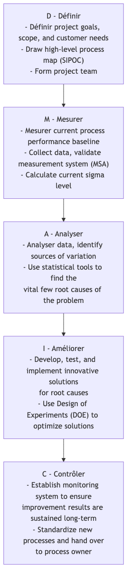

# Six Sigma

Sur la voie menant à l'atteinte d'une qualité ultime et d'une efficacité opérationnelle, comment les entreprises peuvent-elles réduire les défauts et les variations des processus à un niveau quasi parfait ? **Six Sigma (6σ)** est une méthodologie d'amélioration de la qualité et une philosophie de gestion disciplinée, axée sur les données et centrée sur le client, conçue précisément pour cet objectif. Son objectif principal est d'identifier systématiquement et d'éliminer les causes profondes des variations des processus, réduisant ainsi le taux de défauts des produits ou services à un niveau exceptionnel de **seulement 3,4 défauts par million d'opportunités**.

« Sigma (σ) » est une mesure statistique de dispersion des données, représentant l'écart type. Un niveau sigma plus élevé pour un processus signifie qu'il est plus stable et plus constant, avec moins de fluctuations par rapport à la moyenne, et donc moins de défauts. Le nom « Six Sigma » lui-même représente une poursuite extrême de la qualité parfaite. Il ne s'agit pas seulement d'un ensemble d'outils statistiques, mais d'une manière systématique de penser qui permet de résoudre des problèmes complexes et d'atteindre des améliorations significatives en performance grâce au parcours structuré des projets **DMAIC** (Définir-Mesurer-Analyser-Améliorer-Contrôler).

## Principes fondamentaux de Six Sigma

*   **Orientation client** : L'amélioration doit toujours commencer et se terminer par les besoins du client et ses exigences critiques pour la qualité (CTQ).
*   **Décisions basées sur les données** : Toutes les décisions et conclusions doivent reposer sur la collecte de données objectives et une analyse statistique rigoureuse, plutôt que sur l'intuition ou l'expérience.
*   **Amélioration des processus** : On considère fermement que tout défaut ou problème provient d'un processus défectueux. L'accent est donc mis sur l'amélioration du processus, et non sur la recherche de responsabilités individuelles.
*   **Réduction des variations** : Six Sigma considère que les fluctuations et les incohérences des processus sont l'ennemi numéro un de la qualité. Sa tâche principale est de comprendre et d'éliminer les causes profondes des variations.
*   **Amélioration radicale** : L'objectif est d'atteindre des améliorations significatives et mesurables en termes de rentabilité et de performance, et non de simples améliorations incrémentielles mineures.

## DMAIC : La feuille de route des projets Six Sigma

Les projets d'amélioration Six Sigma suivent strictement une feuille de route en cinq phases appelée **DMAIC**. Chaque phase a des objectifs clairs et des outils clés à utiliser.

## Comment mettre en œuvre un projet Six Sigma

1.  **Phase de Définition (Define)** : Formuler clairement le problème métier à résoudre et son impact sur l'entreprise, définir la portée, les objectifs et le calendrier du projet, et identifier toutes les parties prenantes concernées.

2.  **Phase de Mesure (Measure)** : Quantifier la gravité du problème à l’aide de données. Vous devez déterminer quelles sont les métriques clés à mesurer, concevoir un plan de collecte de données, et vous assurer que votre système de mesure est précis et fiable. La sortie de cette phase est une base de données fiable sur la performance actuelle du processus.

3.  **Phase d’Analyse (Analyze)** : C’est le cœur de la méthode DMAIC. Vous devez utiliser divers outils d’analyse statistique (comme les diagrammes de Pareto, les diagrammes causes-effets, les tests d’hypothèses, l’analyse de régression, etc.) pour extraire minutieusement des données collectées les **causes profondes** du problème, validées par les données.

4.  **Phase d’Amélioration (Improve)** : Une fois les causes profondes identifiées, vous devez imaginer des solutions ciblées, puis concevoir et tester des solutions potentielles. La **méthode des plans d’expériences (Design of Experiments, DOE)** est un outil puissant couramment utilisé dans cette phase, vous aidant à trouver la combinaison optimale des paramètres pour l’optimisation du processus.

5.  **Phase de Contrôle (Control)** : Après la mise en œuvre de la solution et l’obtention des améliorations attendues, l’essentiel est de savoir comment maintenir ces résultats. Vous devez mettre en place un système de contrôle du processus (comme les **cartes de contrôle statistique du processus, SPC Chart**), élaborer de nouvelles procédures opérationnelles standard, et former le personnel concerné afin d’éviter la réapparition du problème.

## Système des rôles Ceintures Six Sigma

La mise en œuvre réussie de Six Sigma repose sur un système clair de rôles et de responsabilités, analogue aux grades en arts martiaux utilisant différentes ceintures colorées.

*   **Champions** : Généralement des cadres supérieurs, ils sont responsables de l'identification et de l'approbation des projets Six Sigma, ainsi que de la fourniture des ressources et du soutien nécessaires aux projets.
*   **Master Black Belts** : Experts internes et mentors Six Sigma, ils sont chargés de former et d'encadrer les Black Belts et les Green Belts, et de promouvoir la culture Six Sigma au sein de l'organisation.
*   **Black Belts** : Généralement des gestionnaires de projets Six Sigma à temps plein, ils sont responsables de la conduite de projets d'amélioration complexes et transversaux.
*   **Green Belts** : Ils participent ou dirigent des projets d'amélioration plus modestes tout en exerçant leurs fonctions habituelles. Ils constituent la force principale pour la diffusion et l'application de Six Sigma dans l'organisation.

## Cas d'application

**Cas 1 : General Electric (GE)**

*   **Contexte** : Sous la direction de Jack Welch, GE fut l'une des premières entreprises au monde, et l'une des plus réussies, à élever Six Sigma du statut d'outil qualité à celui de stratégie métier centrale.
*   **Application** : GE a appliqué Six Sigma à tous les domaines d'activité, de la fabrication de moteurs d'avion aux services financiers. Par exemple, dans un cas, sa division santé, grâce à un projet DMAIC, a analysé le processus d'inspection des scanners IRM et a réussi à réduire de 30 % le temps moyen d'inspection par patient, améliorant considérablement l'utilisation des équipements et la satisfaction des patients. Il est rapporté que Six Sigma a permis à GE d'économiser des milliards de dollars dans les premières années.

**Cas 2 : Optimisation du processus de demande de carte de crédit dans une banque**

*   **Problème** : Le temps moyen entre la soumission de la demande de carte de crédit par le client et la réception de la carte était trop long, ce qui entraînait une faible satisfaction client.
*   **Application de DMAIC** :
    *   **D** : L'objectif du projet a été défini comme suit : « Réduire le cycle de traitement de la demande de 15 jours en moyenne à 7 jours en 6 mois. »
    *   **M** : Mesure du temps passé à chaque étape (par exemple, « saisie des données », « analyse de crédit », « production de la carte », « envoi postal ») pour des centaines de demandes au cours des trois derniers mois.
    *   **A** : L'analyse des données a révélé que l'étape « analyse de crédit » prenait le plus de temps et présentait la plus grande variabilité, constituant ainsi le principal goulot d'étranglement du processus.
    *   **I** : L'équipe a redéfini le processus d'analyse de crédit, introduit un système automatisé de pré-analyse et a renforcé les compétences du personnel d'analyse.
    *   **C** : Mise en place d'un tableau de bord de surveillance du nouveau processus et mise à jour des manuels opérationnels. En fin de compte, le cycle moyen a été réduit avec succès à 6,5 jours.

**Cas 3 : Réduction du taux de défauts d'un produit dans une usine de fabrication**

*   **Problème** : Le taux de défauts des pièces produites sur une certaine ligne de production, dues à des dimensions hors normes, atteignait 5 %.
*   **Application de DMAIC** : L'équipe du projet, à l'aide de diagrammes causes-effets et de tests d'hypothèses, a analysé toutes les causes potentielles (homme, machine, matière, méthode, environnement) pouvant entraîner des écarts dimensionnels. Finalement, grâce à la méthode des plans d'expériences (DOE), il a été constaté que l'interaction entre les paramètres « température de refroidissement » et « vitesse de coupe » de la machine était la cause principale des variations dimensionnelles. En définissant un nouveau jeu de paramètres optimisé, l'équipe a réussi à réduire le taux de défauts à moins de 0,1 %.

## Avantages et défis de Six Sigma

**Avantages principaux**

*   **Orientation résultats, retours financiers significatifs** : Chaque projet est lié à des objectifs financiers clairs et mesurables.
*   **Approche disciplinée, logique claire** : Le cadre DMAIC fournit une feuille de route très structurée et répétable pour résoudre des problèmes complexes.
*   **Basé sur les données, objectivité forte** : Met l'accent sur les faits et les données, réduisant la subjectivité et l'arbitraire dans la prise de décision.
*   **Développement des compétences en résolution de problèmes** : Permet de former un groupe de professionnels (Black Belts, Green Belts) au sein de l'organisation, maîtrisant à la fois le métier, les données et l'utilisation d'outils scientifiques pour résoudre des problèmes.

**Défis potentiels**

*   **Peut étouffer l'innovation** : Une sur-valorisation du contrôle et de l'optimisation des processus existants peut parfois entrer en conflit avec une innovation disruptive qui nécessite exploration et tâtonnement.
*   **Risque de bureaucratie** : Si la mise en œuvre n'est pas bien conduite, cela peut devenir un processus bureaucratique rempli d'outils statistiques complexes et de rapports, où l'on fait des projets « pour faire des projets ».
*   **Nécessite un investissement important** : Une mise en œuvre réussie de Six Sigma nécessite un investissement initial important de l'entreprise en formation, en ressources pour les projets et en personnel.

## Extensions et connexions

*   **Lean Manufacturing** : Le cœur de Six Sigma est la **réduction des variations et l'amélioration de la qualité** ; le cœur de Lean est **l'élimination des gaspillages et l'amélioration de la rapidité**. Les deux ont des orientations différentes mais sont très complémentaires. En pratique, ils sont souvent combinés pour former le **Lean Six Sigma**, visant à atteindre simultanément une qualité élevée, une efficacité élevée et un coût faible.
*   **Gestion totale de la qualité (Total Quality Management, TQM)** : Le TQM fournit une philosophie de gestion macroscopique centrée sur le client et impliquant l'ensemble de l'organisation, tandis que Six Sigma propose des méthodes micro-opérationnelles plus spécifiques, basées sur des projets et des données, pour atteindre les objectifs du TQM.

---
*Référence : Six Sigma a été initialement proposé par l'ingénieur de Motorola Bill Smith dans les années 1980 et est devenu célèbre grâce à sa mise en œuvre réussie dans des entreprises comme General Electric (GE) et AlliedSignal. Le livre de Mikel Harry et Richard Schroeder « Six Sigma: The Breakthrough Management Strategy Revolutionizing the World's Top Corporations » est un ouvrage classique dans ce domaine.*