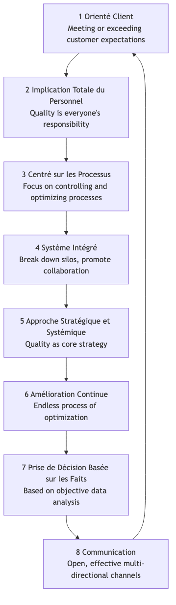

# Gestion Totale de la Qualité

Dans les modèles de production traditionnels, la « qualité » était souvent perçue comme une étape d'inspection séparée à la fin de la chaîne de production, confiée à un service spécialisé du contrôle qualité. Cependant, cette approche réactive est coûteuse et inefficace. La **Gestion Totale de la Qualité (TQM)** propose une philosophie de gestion révolutionnaire et nettement différente. Elle affirme que **la qualité est la responsabilité de tous, qu'elle doit imprégner chaque recoin et chaque maillon des opérations organisationnelles, et que son critère ultime est la satisfaction du client**.

La TQM n'est pas une méthode ou un outil spécifique, mais une philosophie de gestion et une culture organisationnelle centrée sur **la qualité, l'implication de tous les employés et l'amélioration continue**. Elle vise à améliorer en permanence la qualité des produits, services et processus en établissant un système de garantie de la qualité systématique et préventif, permettant ainsi d'acquérir un avantage concurrentiel durable dans une concurrence acharnée. Elle met l'accent sur le fait que la haute qualité ne coûte pas plus cher, mais réduit en réalité **significativement les coûts totaux** et améliore la rentabilité en réduisant les gaspillages, les retouches et les réclamations des clients.

## Principes fondamentaux de la TQM

La Gestion Totale de la Qualité repose sur un ensemble de principes fondamentaux interconnectés qui forment collectivement la base culturelle de la TQM.

1.  **Orientation client** : Le point de départ et d'arrivée de la TQM est le client. La survie et le développement d'une organisation dépendent finalement de sa capacité à satisfaire, voire à dépasser les attentes des clients. Par conséquent, chaque aspect, de la conception du produit au service après-vente, doit être guidé par les besoins et la satisfaction des clients.

2.  **Implication totale des employés** : La qualité n'est pas l'apanage d'un seul département, mais la responsabilité de chacun, du PDG aux employés de première ligne. La TQM insiste sur l'importance d'autonomiser, de former et de motiver tous les employés pour qu'ils participent activement aux activités d'amélioration de la qualité.

3.  **Orientation processus** : La TQM considère que la qualité du produit ou du service final est déterminée par le processus qui l'a produit. Par conséquent, l'accent mis sur la gestion doit passer d'une approche centrée sur l'« inspection des résultats » à une approche axée sur le « contrôle et l'optimisation des processus ».

4.  **Système intégré** : L'organisation est perçue comme un système complexe composé de divers processus horizontaux et verticaux. La TQM cherche à éliminer les silos interdépartementaux et à promouvoir une collaboration transversale, garantissant ainsi que toutes les parties de l'organisation travaillent harmonieusement vers des objectifs de qualité communs.

5.  **Approche stratégique et systématique** : La qualité doit être considérée comme l'une des stratégies fondamentales de l'organisation. Cette dernière doit élaborer une vision claire et à long terme de la qualité et l'intégrer systématiquement à tous les plans et décisions.

6.  **Amélioration continue** : La TQM ne vise pas une « conformité ponctuelle », mais un processus infini et spiralé d'amélioration. Elle encourage les organisations à rechercher constamment des opportunités d'optimisation progressive, mais continue, des produits, services et processus (c'est-à-dire le « Kaizen »).

7.  **Décision basée sur les faits** : Toutes les décisions et améliorations doivent reposer sur la collecte et l'analyse de données objectives, et non sur l'intuition ou l'expérience. Cela nécessite que l'organisation mette en place des systèmes efficaces de mesure et d'analyse des données.

8.  **Communication** : Au sein de l'organisation, des canaux de communication ouverts, efficaces et multidirectionnels doivent être établis pour garantir que les stratégies, objectifs, processus et retours d'information soient transmis et compris en temps opportun.

## Comment mettre en œuvre la TQM

La mise en œuvre de la TQM est un processus de changement culturel à long terme, qui suit généralement la logique du cycle PDCA.

1.  **Phase 1 : Planifier - Poser les bases**
    *   **Engagement de la direction** : Obtenir un soutien inébranlable et un engagement ferme de la direction est la condition essentielle au succès de la mise en œuvre de la TQM.
    *   **Création d'un comité qualité** : Constituer une équipe de direction transversale chargée de planifier et de guider l'ensemble du processus de mise en œuvre de la TQM.
    *   **Élaboration de la vision et de la stratégie qualité** : Définir clairement la politique qualité de l'organisation et ses objectifs à long terme.
    *   **Formation de tous les employés** : Dispenser à tous les employés une formation sur les concepts et outils de base de la TQM.

2.  **Phase 2 : Faire - Déploiement global**
    *   **Identifier les besoins des clients** : Recueillir et analyser systématiquement les besoins et attentes des clients.
    *   **Analyse et normalisation des processus** : Cartographier et analyser les processus clés de l'entreprise, identifier les goulots d'étranglement et les gaspillages, et établir des procédures opérationnelles standardisées.
    *   **Création d'équipes d'amélioration de la qualité** : Encourager les employés (en particulier ceux appartenant à différents départements) à former spontanément des « cercles qualité » ou d'autres groupes pour résoudre des problèmes spécifiques.
    *   **Autonomisation des employés** : Accorder aux employés de première ligne l'autorité et la responsabilité nécessaires pour arrêter la chaîne de production ou le processus lorsqu'ils détectent des problèmes de qualité.

3.  **Phase 3 : Vérifier - Mesure et évaluation**
    *   **Collecte et analyse des données** : Utiliser des outils qualité tels que le contrôle statistique des processus (CSP), les diagrammes de Pareto, les diagrammes causes-effets, etc., pour surveiller et mesurer en continu les processus et les résultats.
    *   **Évaluation des performances** : Évaluer régulièrement les progrès et l'efficacité de la mise en œuvre de la TQM et les comparer aux objectifs prédéfinis.

4.  **Phase 4 : Agir - Amélioration et institutionnalisation**
    *   **Analyse des causes racines** : Effectuer une analyse approfondie des causes racines des problèmes de qualité identifiés.
    *   **Mise en œuvre des mesures d'amélioration** : Prendre des actions correctives et préventives sur la base des résultats de l'analyse.
    *   **Partage et normalisation** : Partager les expériences réussies d'amélioration et les normaliser dans de nouveaux processus, les intégrant à la base de connaissances de l'organisation.
    *   **Cycle continu** : Une fois un cycle d'amélioration terminé, entamer immédiatement le cycle PDCA suivant.

## Cas d'application

**Cas 1 : Toyota Motor Corporation**

*   **Contexte** : Le système de production Toyota (TPS) est considéré comme l'exemple pratique le plus réussi et le plus complet de mise en œuvre de la TQM.
*   **Application** :
    *   **Implication totale des employés** : Le système « Andon » permet à tout ouvrier de la chaîne de production d'arrêter toute la chaîne en cas de problème de qualité, ce qui reflète un haut niveau de confiance et d'autonomisation des employés de première ligne.
    *   **Amélioration continue** : La culture du « Kaizen » de Toyota encourage tous les employés à proposer quotidiennement de petites améliorations continues de leurs processus de travail.
    *   **Orientation processus** : Des principes fondamentaux tels que le « Juste-à-temps (JAT) » et le « Jidoka » visent à éliminer les gaspillages et à garantir la qualité par l'optimisation des processus.

**Cas 2 : L'hôtel The Ritz-Carlton**

*   **Contexte** : En tant que marque d'hôtels de luxe de premier plan, sa qualité de service exceptionnelle constitue un avantage concurrentiel clé.
*   **Application** :
    *   **Orientation client** : Son célèbre mot d'ordre est « Nous sommes des dames et des gentlemen servant des dames et des gentlemen. »
    *   **Implication et autonomisation totales des employés** : L'entreprise autorise chaque employé, sans avoir à demander l'approbation de ses supérieurs, à décider d'utiliser jusqu'à 2000 dollars pour résoudre tout problème client. Cela garantit que les problèmes peuvent être résolus immédiatement et de manière créative.
    *   **Décision basée sur les faits** : L'hôtel utilise une base de données détaillée des préférences des clients pour enregistrer les besoins personnalisés de chaque client régulier, afin de fournir un service précis et dépassant les attentes.

**Cas 3 : Une entreprise de développement logiciel**

*   **Contexte** : L'entreprise souhaite améliorer la qualité du code et la rapidité de livraison de ses produits logiciels.
*   **Application** :
    *   **Orientation processus** : Elle a mis en place des processus d'« intégration continue/déploiement continu (CI/CD) », garantissant la qualité de chaque validation de code grâce à des tests automatisés.
    *   **Implication totale des employés** : Mise en place d'un système de « relecture de code (Code Review) », exigeant que tout code soit relu par au moins un collègue avant d'être fusionné, répartissant ainsi la responsabilité de la qualité entre tous les développeurs.
    *   **Amélioration continue** : Organisation régulière de « journées de remboursement de dette technique » et de « revues post-mortem » pour encourager les équipes à identifier et résoudre activement les problèmes dans les processus.

## Avantages et défis de la TQM

**Avantages principaux**

*   **Amélioration de la satisfaction et de la fidélité des clients** : Met l'ensemble de l'organisation au service des besoins des clients.
*   **Réduction des coûts et augmentation de l'efficacité** : En « faisant bien du premier coup », elle réduit considérablement les coûts liés aux retouches, aux gaspillages et aux réclamations des clients.
*   **Renforcement du sentiment d'appartenance et de responsabilité des employés** : Autonomise les employés, les faisant se sentir comme une partie importante du succès de l'organisation.
*   **Création d'un avantage concurrentiel durable** : La haute qualité constitue en soi un avantage concurrentiel puissant et difficile à imiter.

**Défis potentiels**

*   **Nécessite un changement culturel à long terme** : La TQM n'est pas un « projet » qui donne des résultats rapides, mais un changement culturel profond, de haut en bas, qui prend plusieurs années pour s'enraciner véritablement.
*   **Continuité de l'engagement de la direction** : Si le soutien de la direction vacille, la mise en œuvre de la TQM devient rapidement une simple formalité.
*   **Risque de bureaucratie** : Si les processus et la documentation sont trop mis en avant, de nouvelles bureaucraties peuvent apparaître, étouffant la flexibilité et l'innovation.

## Extensions et connexions

*   **Six Sigma** : Peut être considéré comme une méthodologie plus spécifique, axée sur les données et les projets, pour mettre en œuvre les principes de la TQM tels que la « décision basée sur les faits » et l'« amélioration continue ». La TQM fournit la philosophie et la culture, tandis que Six Sigma fournit les outils statistiques et la feuille de route du projet.
*   **Lean Operations** : Partage avec la TQM des fondations philosophiques communes en matière d'élimination des gaspillages, de concentration sur les processus et d'amélioration continue. Les deux sont souvent combinés pour former le « Lean Six Sigma ».
*   **Système de management de la qualité ISO 9000** : Cadre standardisé et certifiable au niveau international pour les principes de la TQM. Une organisation peut démontrer qu'elle a mis en place un système de management de la qualité conforme aux principes de la TQM en obtenant la certification ISO 9001.

---
*Référence source : Les origines intellectuelles de la Gestion Totale de la Qualité remontent à plusieurs gourous de la gestion de la qualité du milieu du XXe siècle, notamment les « 14 points de gestion » de W. Edwards Deming, la « Trilogie de la qualité » de Joseph M. Juran et les concepts de Philip B. Crosby sur le fait que « La qualité est gratuite ». Ces idées ont été largement développées pendant la reconstruction post-guerre du Japon et ont finalement formé le système complet de la TQM.*