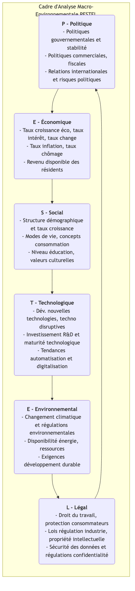

# Analyse PESTEL

Lors de l'élaboration de toute stratégie à long terme, si une organisation se concentre uniquement sur ses forces internes et la concurrence dans son secteur tout en négligeant l'environnement macroéconomique plus large, cela revient à naviguer en mer agitée sans consulter la météo, ce qui est extrêmement dangereux. **L'analyse PESTEL**, souvent appelée analyse PEST, est un cadre puissant permettant d’explorer et de surveiller de manière systématique l’environnement macroéconomique externe d’une organisation. Elle vise à aider les décideurs à identifier les moteurs clés et les risques externes pouvant avoir un impact profond sur l’organisation, actuellement ou à l’avenir.

PESTEL est un acronyme qui correspond à six dimensions, fournissant une liste de vérification complète pour s'assurer que nous ne négligeons aucun aspect important lors de l'analyse environnementale :

*   **P - Politique**
*   **E - Économique**
*   **S - Social**
*   **T - Technologique**
*   **E - Environnemental**
*   **L - Juridique (Legal)**

En analysant systématiquement ces six dimensions, les organisations peuvent mieux anticiper les opportunités, éviter les menaces et élaborer des stratégies plus adaptatives et tournées vers l'avenir.

## Explication détaillée des six dimensions de PESTEL

Chaque lettre de PESTEL représente une série de forces externes qu'il convient d'examiner.

-->

## Comment réaliser une analyse PESTEL

1.  **Brainstorming : Identifier les facteurs clés**
    Réunir une équipe pluridisciplinaire pour mener un brainstorming ouvert sur les six dimensions de PESTEL. Listez autant de facteurs externes que possible sous chaque dimension susceptibles d'être pertinents pour votre organisation, votre secteur ou votre marché.
    *   Par exemple, pour une entreprise de véhicules électriques, sous la dimension « Politique », cela pourrait inclure « politiques de subventions gouvernementales pour les véhicules d'énergie nouvelle », « plans de construction d'infrastructures de bornes de recharge », etc.

2.  **Collecter des informations et des preuves**
    Pour les facteurs clés initialement identifiés, effectuer une collecte et une recherche d'informations plus approfondies. Les données peuvent provenir de rapports gouvernementaux, d’analyses sectorielles, de médias d’information, de recherches académiques, etc., afin de s’assurer que l’analyse repose sur des faits plutôt que sur des spéculations.

3.  **Analyser l'impact : Identifier les opportunités et les menaces**
    Évaluer si l'impact potentiel de chaque facteur clé sur l'organisation est positif (opportunité) ou négatif (menace). Analyser davantage la **probabilité** et la **gravité** de cet impact.
    *   Par exemple, « augmentation des subventions gouvernementales » est une **opportunité** à haute probabilité et à fort impact.
    *   « Introduction d'une nouvelle réglementation sur le recyclage des batteries » pourrait être une **menace** à haute probabilité et à impact moyen.

4.  **Élaborer des réponses stratégiques**
    C’est là l’objectif ultime de l’analyse PESTEL. Développer des actions stratégiques spécifiques pour répondre aux opportunités et menaces clés identifiées.
    *   **Concernant les opportunités** : Comment devons-nous ajuster notre stratégie pour les exploiter au maximum ?
    *   **Concernant les menaces** : Comment devons-nous agir pour les éviter ou atténuer leur impact négatif ?

5.  **Surveillance continue**
    L'environnement macroéconomique évolue constamment, l'analyse PESTEL ne doit donc pas être une tâche ponctuelle mais un processus dynamique nécessitant une surveillance continue et des mises à jour régulières.

## Cas d'application

**Cas 1 : Une chaîne internationale de restauration rapide pénétrant sur le marché indien**

*   **Politique** : Doit faire face à la complexité des réglementations indiennes en matière de sécurité alimentaire et aux relations avec les gouvernements locaux.
*   **Économique** : L’essor de la classe moyenne indienne et la croissance du revenu disponible constituent de grandes opportunités, mais il faut aussi prendre en compte sa forte sensibilité aux prix.
*   **Social** : L'Inde compte un grand nombre de végétariens, et la vache est sacrée dans l'hindouisme. Il s'agit donc d'un défi culturel majeur, mais aussi d'une opportunité. L'entreprise a ainsi spécialement développé des hamburgers sans bœuf (comme le McAloo Tikki) et une carte riche en plats végétariens.
*   **Technologique** : La popularité des plateformes de paiement mobile et de livraison de repas offre de nouveaux canaux pour toucher davantage de consommateurs.
*   **Environnemental** : Les restrictions sur l'utilisation des emballages en plastique deviennent de plus en plus strictes, ce qui exige des alternatives écologiques.
*   **Juridique** : Doit respecter des lois strictes sur le travail et les réglementations liées aux franchises.

**Cas 2 : Défis auxquels est confrontée la presse imprimée traditionnelle**

*   **Politique** : Modifications des réglementations sur la censure de la presse et l'édition.
*   **Économique** : La récession économique entraîne une réduction des budgets publicitaires des entreprises, affectant gravement les revenus des journaux.
*   **Social** : Les habitudes de lecture des lecteurs se sont complètement tournées vers Internet et les appareils mobiles, et la jeune génération n’a plus l’habitude de lire les journaux.
*   **Technologique** : L’émergence d’internet, des réseaux sociaux et des applications de regroupement d’informations a complètement révolutionné la manière de produire et de diffuser l’information, constituant la menace la plus grave.
*   **Environnemental** : Des exigences croissantes concernant la consommation de papier et l'impression écologique.
*   **Juridique** : Des litiges juridiques croissants concernant les droits d’auteur et la reproduction de contenus numériques.

**Cas 3 : Opportunités pour une entreprise de technologie d’éducation en ligne**

*   **Politique** : Les politiques gouvernementales favorables à l’informatisation de l’éducation et à la continuité pédagogique en période de crise (« suspendre les cours sans interrompre l’apprentissage ») constituent une grande opportunité de développement.
*   **Économique** : Les dépenses des ménages en éducation continuent d’augmenter.
*   **Social** : Une demande sociétale croissante pour l’apprentissage tout au long de la vie et l’amélioration des compétences, et la pandémie a accéléré la popularisation et l’acceptation de l’apprentissage en ligne.
*   **Technologique** : Le développement des technologies 5G, de l’intelligence artificielle et des mégadonnées (big data) rend possible une expérience d’apprentissage en ligne personnalisée et immersive.
*   **Environnemental** : L’éducation en ligne réduit les déplacements et la consommation de papier, offrant naturellement des avantages écologiques.
*   **Juridique** : Nécessité de surveiller attentivement les nouvelles réglementations concernant la protection en ligne des mineurs et la confidentialité des données éducatives.

## Avantages et limites de l'analyse PESTEL

**Avantages principaux**

*   **Exhaustivité** : Fournit un cadre systématique et complet, garantissant l’étendue de l’analyse de l’environnement macroéconomique.
*   **Vision prospective** : Incite les organisations à aller au-delà de leurs opérations quotidiennes immédiates et à envisager des tendances et des évolutions à long terme.
*   **Favorise la réflexion stratégique** : Constitue une entrée essentielle pour identifier les opportunités et les menaces et élaborer des stratégies robustes.

**Limites potentielles**

*   **Surcharge d'informations** : Peut identifier trop de facteurs externes, nécessitant un tri ultérieur pour se concentrer sur les plus critiques.
*   **Simplification de la complexité** : Dans le monde réel, les facteurs des six dimensions sont souvent interconnectés et mutuellement influents, et l'analyse PESTEL ne reflète pas pleinement cette complexité.
*   **Manque de dynamisme** : Les résultats de l'analyse ne sont qu'une photographie à un moment donné et doivent être régulièrement mis à jour pour faire face aux changements rapides de l'environnement.

## Extensions et liens

*   **Analyse SWOT** : L'analyse PESTEL constitue un excellent point de départ pour l'analyse SWOT. Les résultats de l'analyse PESTEL peuvent directement servir d'entrée pour les sections **Opportunités** et **Menaces** de l'analyse SWOT.
*   **Modèle des cinq forces de Porter** : L'analyse PESTEL se concentre sur l'environnement macroéconomique plus large affectant l'écosystème d'entreprise entier, tandis que le modèle des cinq forces de Porter se concentre davantage sur l'environnement concurrentiel « micro » au sein du secteur spécifique dans lequel l'organisation opère. La combinaison des deux permet d'avoir une vue complète de l'environnement externe.

---
*Référence : Le modèle PESTEL a été initialement proposé par le professeur de l’université Harvard Francis Aguilar en 1967 sous la forme ETPS. Après des décennies d’évolution et d’expansion, il a progressivement donné naissance au modèle PEST ou PESTEL largement connu aujourd’hui. Il s'agit de l'un des outils d'analyse les plus basiques et fondamentaux en gestion stratégique et en marketing.*