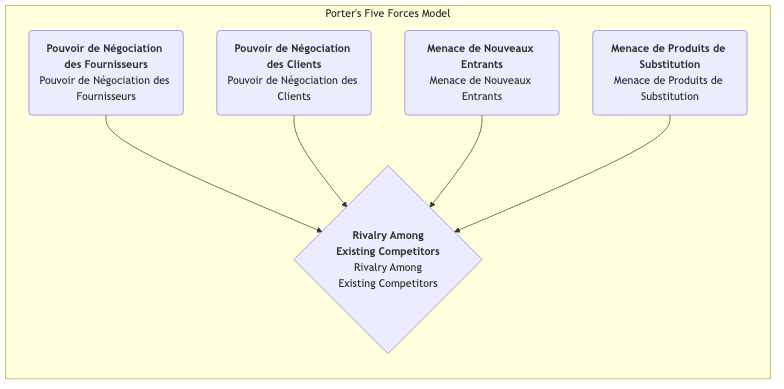

# Modèle des cinq forces de Porter

Dans une concurrence commerciale acharnée, l'attractivité et la rentabilité à long terme d'un secteur ne sont pas déterminées par un seul concurrent, mais façonnées par un écosystème concurrentiel plus large. **Le modèle des cinq forces de Porter** est un cadre révolutionnaire proposé par Michael E. Porter, expert en management stratégique à la Harvard Business School. Il fournit une puissante lentille qui permet d'analyser systématiquement la structure concurrentielle de n'importe quel secteur et de comprendre les cinq forces concurrentielles fondamentales qui déterminent le niveau moyen de profit de ce secteur.

L'idée centrale de ce modèle est que les stratèges d'entreprise doivent regarder au-delà des concurrents directs immédiats et examiner l'ensemble du champ concurrentiel. Ces cinq forces interagissent pour déterminer l'intensité de la concurrence au sein du secteur et la manière dont la valeur est créée et répartie dans la chaîne industrielle. En comprenant la force de chaque facteur, les entreprises peuvent trouver leur position optimale dans le secteur et élaborer des stratégies permettant d'éviter les risques, de tirer parti des avantages et d'obtenir finalement un avantage concurrentiel durable.

## Analyse des cinq forces concurrentielles

Le modèle des cinq forces de Porter décompose la concurrence sectorielle en cinq dimensions distinctes, qui déterminent ensemble les « règles du jeu » dans le secteur.

1.  **Rivalité entre concurrents existants**
    C'est le cœur du modèle des cinq forces, il s'agit de l'affrontement direct et de l'intensité de la concurrence entre les entreprises existantes du secteur. Lorsque la concurrence au sein du secteur est acharnée, les entreprises tombent souvent dans des guerres de prix, des guerres publicitaires et des courses à l'innovation de produits, ce qui réduit le niveau global de profit du secteur.
    *   **Signes d'une concurrence intense** : De nombreux concurrents de force similaire dans le secteur ; une croissance lente du secteur, créant un « jeu à somme nulle » ; une forte homogénéité des produits, sans différenciation ; des barrières de sortie élevées rendant difficile pour les entreprises déficitaires de quitter le secteur.

2.  **Menace des nouveaux entrants**
    Il s'agit de la probabilité que de nouveaux concurrents pénètrent dans un secteur. Si un secteur est rentable et présente de faibles barrières à l'entrée, il attire de nouveaux acteurs comme un aimant, qui apportent de nouvelles capacités et sont désireux de s'emparer d'une part de marché, intensifiant ainsi la concurrence.
    *   La **hauteur des barrières à l'entrée** détermine l'intensité de cette menace. Les barrières courantes incluent : les économies d'échelle, une forte fidélité à la marque, des coûts de changement élevés pour les clients, des investissements importants en capital, le contrôle des canaux de distribution, les politiques gouvernementales et les restrictions réglementaires, ainsi que les brevets sur les technologies clés.

3.  **Menace des produits ou services substituables**
    Il s'agit de la menace provenant de produits ou services substituables provenant de **secteurs différents** mais qui satisfont les mêmes besoins des clients. La présence de substituts fixe un « plafond » pour l'ensemble des prix dans le secteur.
    *   **Distinction importante** : Pour une compagnie aérienne, une autre compagnie aérienne est un **concurrent**, tandis que le train à grande vitesse et la visioconférence sont des **substituts**. Plus le substitut est rentable et moins il coûte cher pour les clients de s'y convertir, plus la menace est grande.

4.  **Pouvoir de négociation des fournisseurs**
    Il s'agit de la capacité des fournisseurs (par exemple, fournisseurs de matières premières, composants, main-d'œuvre ou services) à transférer leurs pressions de coûts aux entreprises du secteur. Des fournisseurs puissants peuvent augmenter les prix, réduire la qualité ou limiter l'approvisionnement, érodant ainsi les profits du secteur.
    *   **Signes d'un fort pouvoir de négociation des fournisseurs** : Le secteur des fournisseurs est très concentré, contrôlé par quelques grands acteurs ; les produits des fournisseurs sont uniques ou différenciés et difficiles à remplacer ; les coûts de changement pour les fournisseurs sont extrêmement élevés ; pour les fournisseurs, votre secteur n'est pas leur principal client.

5.  **Pouvoir de négociation des acheteurs**
    Il s'agit de la capacité des clients (acheteurs) à faire baisser les prix, à exiger une meilleure qualité ou davantage de services. Des acheteurs puissants peuvent obliger les entreprises du secteur à se concurrencer, transférant ainsi la valeur des producteurs vers eux-mêmes.
    *   **Signes d'un fort pouvoir de négociation des acheteurs** : Les acheteurs sont des gros acheteurs concentrés ; les produits du secteur sont standardisés et non différenciés ; les acheteurs ont de faibles coûts de changement de fournisseurs ; les acheteurs peuvent réaliser une « intégration en amont » (c'est-à-dire produire eux-mêmes les produits nécessaires).

## Comment appliquer le modèle des cinq forces

1.  **Définir clairement les limites du secteur**
    Tout d'abord, définir clairement le secteur que vous analysez. La définition du secteur ne doit être ni trop large ni trop étroite.

2.  **Identifier les acteurs clés des cinq forces**
    Identifier spécifiquement qui sont les principaux acteurs dans chaque dimension de force. Par exemple, qui sont les principaux fournisseurs, acheteurs, concurrents, entrants potentiels et substituts respectivement ?

3.  **Évaluer la force potentielle de chaque force**
    Analyser et déterminer les causes profondes qui conduisent au renforcement ou à l'affaiblissement de chaque force. Enfin, émettre une évaluation globale de la force de chaque force (par exemple, forte, moyenne, faible).

4.  **Analyse globale de la structure du secteur**
    Synthétiser les résultats d'évaluation des cinq forces pour déterminer le paysage concurrentiel global et le potentiel de profit à long terme du secteur. Quelle ou quelles forces déterminent principalement la rentabilité du secteur ?

5.  **Élaborer des stratégies pour améliorer la position**
    Sur la base de l'analyse, envisager quelles actions stratégiques l'entreprise peut entreprendre pour « améliorer » sa position dans le secteur. Par exemple, peut-elle réduire le pouvoir de négociation des acheteurs en construisant une marque ? Peut-elle créer des barrières à l'entrée par l'innovation technologique ? Peut-elle réduire le pouvoir de négociation des fournisseurs en verrouillant les fournisseurs ?

## Cas d'application

**Cas 1 : Secteur mondial des boissons gazeuses (par exemple, Coca-Cola et PepsiCo)**

*   **Rivalité entre concurrents existants** : **Intense**. La concurrence entre les deux géants se manifeste dans divers domaines tels que la marque, la distribution et la publicité, mais ils évitent habilement les guerres de prix destructrices.
*   **Menace des nouveaux entrants** : **Faible**. Une fidélité à la marque extrêmement élevée, des réseaux de distribution mondiaux étendus et des investissements publicitaires massifs constituent des barrières infranchissables pour les nouveaux entrants.
*   **Menace des substituts** : **Moyenne à forte**. L'eau, les jus, le thé, le café, etc., sont tous des substituts, et les consommateurs ont de nombreuses options.
*   **Pouvoir de négociation des fournisseurs** : **Faible**. Les matières premières telles que le sucre, l'eau et les emballages sont des produits de base, les fournisseurs sont dispersés et n'ont aucun pouvoir de négociation.
*   **Pouvoir de négociation des acheteurs** : **Moyen**. Pour les consommateurs individuels, le pouvoir de négociation est nul. Mais pour les grands détaillants (par exemple, Walmart, Carrefour) et les canaux de restauration, ils ont un fort pouvoir de négociation.
*   **Conclusion** : La structure du secteur est très attractive, et les deux géants ont efficacement résisté à la pression des nouveaux entrants et des fournisseurs en construisant des barrières solides en matière de marque et de distribution, obtenant ainsi des profits élevés et durables.

**Cas 2 : Secteur de l'informatique personnelle (PC)**

*   **Rivalité entre concurrents existants** : **Extrêmement intense**. Les produits de nombreuses marques (Lenovo, HP, Dell, etc.) sont très homogènes, entraînant des guerres de prix continues.
*   **Menace des nouveaux entrants** : **Moyenne**. Bien que la marque et les canaux nécessitent un certain capital, les composants clés peuvent être achetés, et les barrières à l'entrée ne sont pas insurmontables.
*   **Menace des substituts** : **Forte**. Les smartphones et les tablettes remplacent de nombreuses fonctions des PC.
*   **Pouvoir de négociation des fournisseurs** : **Forte**. Les composants clés (par exemple, processeur et système d'exploitation) sont très concentrés chez quelques entreprises comme Intel et Microsoft, qui contrôlent la majeure partie des profits du secteur PC.
*   **Pouvoir de négociation des acheteurs** : **Forte**. Les consommateurs individuels comme les clients professionnels ont de nombreuses options en raison de produits standardisés et sont sensibles aux prix.
*   **Conclusion** : Presque toutes les cinq forces du secteur PC sont défavorables aux fabricants du secteur, entraînant un état de faible profit à long terme.

**Cas 3 : Secteur des restaurants haut de gamme en Chine**

*   **Rivalité entre concurrents existants** : **Intense**. De nombreux restaurants, imitation sérieuse et effet de suiveur.
*   **Menace des nouveaux entrants** : **Forte**. Barrières à l'entrée relativement basses ; toute personne disposant de capitaux et de chefs peut ouvrir un restaurant.
*   **Menace des substituts** : **Forte**. Les restaurants milieu de gamme, la restauration à emporter, les chefs privés, etc., sont autant d'options alternatives.
*   **Pouvoir de négociation des fournisseurs** : **Moyen**. Pour les ingrédients courants, il y a beaucoup de fournisseurs. Mais pour les ingrédients rares et de haute qualité, quelques fournisseurs peuvent avoir un fort pouvoir de négociation.
*   **Pouvoir de négociation des acheteurs** : **Forte**. Les consommateurs ont de nombreuses options, et les coûts de changement sont nuls.
*   **Conclusion** : La structure concurrentielle du secteur des restaurants haut de gamme est mauvaise, et la rentabilité est très difficile. La clé du succès réside dans la création d'une marque unique, de plats et d'expériences qui réduisent le pouvoir de négociation des acheteurs et la concurrence intra-sectorielle.

## Valeur et limites du modèle des cinq forces

**Valeur centrale**

*   **Au-delà de la concurrence directe** : Fournit une perspective plus large pour comprendre la concurrence, sans se concentrer uniquement sur les rivaux.
*   **Révèle les moteurs de profit** : Aide à identifier les facteurs structurels clés qui déterminent la rentabilité à long terme d'un secteur.
*   **Guide le positionnement stratégique** : Propose une feuille de route claire pour que les entreprises trouvent des positions stratégiques favorables et façonnent des structures sectorielles qui les bénéficient.

**Limites potentielles**

*   **Vision statique** : Le modèle lui-même est statique et peut ne pas capturer pleinement l'évolution dynamique de la structure sectorielle (par exemple, les changements structurels causés par les disruptions technologiques).
*   **Ignore la « sixième force »** : Certains chercheurs affirment que le modèle ignore le rôle des **compléments**. Par exemple, les logiciels et le matériel sont des compléments ; ils créent de la valeur ensemble.
*   **Limites sectorielles floues** : Dans l'écosystème commercial intégré d'aujourd'hui, il devient de plus en plus difficile de définir clairement les limites des secteurs.

## Extensions et connexions

*   **Analyse PESTEL** : Peut être utilisée pour analyser les facteurs macro-environnementaux plus larges qui influencent les cinq forces.
*   **Analyse de la chaîne de valeur** : Après que le modèle des cinq forces ait analysé comment la « part du gâteau » sectorielle est divisée, l'analyse de la chaîne de valeur aide les entreprises à réfléchir à la manière de créer davantage de « part du gâteau » au sein de leurs propres activités.
*   **Analyse des groupes stratégiques** : Lors de l'analyse de la concurrence intra-sectorielle, les entreprises du secteur peuvent être divisées en différents groupes stratégiques en fonction de similitudes stratégiques pour une analyse plus fine.

---
*Référence : Michael Porter a développé systématiquement le modèle des cinq forces dans son article classique « How Competitive Forces Shape Strategy », publié en 1979 dans la Harvard Business Review, et dans son ouvrage ultérieur « Competitive Strategy ». Le modèle reste aujourd'hui un pilier inébranlable dans le domaine du management stratégique.*