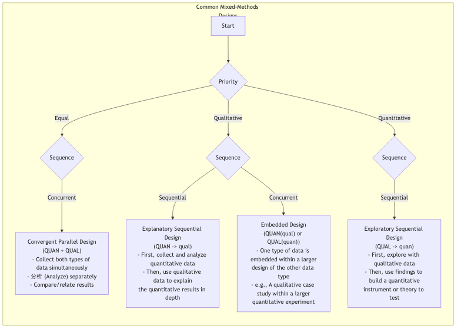

# 混合研究法

研究の分野では、長い間、2つの主要なパラダイムが存在してきました。**量的研究**は数値と統計を武器とし、社会的および自然現象の客観的かつ体系的な測定を目指します。一方、**質的研究**は言語と文脈に焦点を当て、人間の経験の深層的な意味を探求します。前者は客観性と普遍性を追求するのに対し、後者は深さと意味を探ります。しかし、研究者たちの多くは、単一の方法だけでは「盲人の象のなでなで」に過ぎず、現実の一部しか捉えられないことに気づいてきています。**混合研究法**は、2つの方法を単純に足し合わせたものではなく、より成熟し、賢明な研究哲学として登場しました。

その中心的な考え方は、ある研究プロジェクト内で量的データと質的データ、およびそれらの分析手法を戦略的かつ体系的に統合することです。それにより、単一の方法では得られない、より包括的で深く、多面的な理解を得ることが可能になります。このアプローチでは、数値はパターンの広がりを明らかにし、物語はパターンの背後にある深さを明らかにすると信じています。この2つを組み合わせることで、研究の結論はより堅牢で洞察に富むものになります。

## なぜ混合するのか？研究の相乗効果

混合研究法の魅力は、「1+1>2」の相乗効果を達成できることにあります。統合の目的に応じて、そのコアバリューは主に以下の点に現れます：

*   **三角検証（トリアングレーション）**：最も一般的な目的です。一方の方法からのデータを用いて、他方の方法から得られた結論を検証または裏付けます。量的調査の結果と質的インタビューの発見が互いに裏付け合えば、研究結論の信頼性は大幅に高まります。

*   **補完性**：一方の方法の強みを活かして、他方の方法の弱点を補います。例えば、量的調査で見つかった予期せぬ統計的関係を、質的インタビューを用いて深く説明することで、「何が」起きたのかだけでなく、「なぜ」起きたのかについても理解できます。
*   **発展性**：一方の方法の発見をもとに、他方の方法の実施を導きます。例えば、まず探索的な質的インタビューを実施し、重要なテーマや変数を特定し、その発見に基づいて、よりターゲットを絞った大規模なアンケート調査を設計します。
*   **発見性**：量的および質的研究で矛盾または逆説的な結果が得られた場合、それ自体が貴重で重要な発見となります。それは既存の理論に挑戦し、新たな思考やさらに深い研究を促す可能性があります。

### 混合研究法のコアデザインタイプ

混合研究法にはさまざまなデザインパターンがありますが、その中でも中心的な3つは以下の通りです：

## 混合研究法の実施方法

1.  **研究の必要性を明確にする**
    まず、自分の研究質問に答えるためになぜ単一の方法では不十分なのかを明確にします。混合の目的は何か？それは検証、補完、発展、発見のためなのか？明確な根拠が成功の前提です。

2.  **適切な混合デザインの選択**
    自分の研究目的と質問に基づき、最も適した統合パターンを選択します。それは同時並行的（収束デザイン）か、逐次的（逐次デザイン）か？どちらの方法を先に行うべきか？

3.  **段階的なデータ収集と分析**
    選択したデザインに従い、各段階でのデータ収集と分析を体系的に実行します。これは研究者が量的および質的研究手法の両方に精通していることが求められます。

4.  **重要な統合フェーズ**
    これは混合研究法の核であり、最も難しい部分です。2種類の異なるデータを「統合ポイント」で意味ある形で結びつける必要があります。それは結果の議論で両者を比較することを含むかもしれませんし、質的データを用いて量的データ内の特定のグループを説明したり、質的発見に基づいて量的調査項目を構築したりすることも含まれます。

5.  **統合された結論の導出**
    最終的な結論は、量的および質的発見を単純に並べたものであってはなりません。両者の衝突と融合から生まれる、より深く、多面的な洞察が含まれるべきです。

## 実践事例

**事例1：新しい従業員福利厚生プログラムの評価**

* **シナリオ**：ある企業が新しい柔軟な勤務制度を導入し、その効果を総合的に評価したい。
* **適用（説明的逐次デザイン：QUAN → qual）**:

    1. **量的フェーズ**：企業はまず全従業員に匿名アンケートを配布し、新しい福利厚生の利用頻度、職務満足度、仕事のストレスなどの定量データを収集しました。データは全体的な満足度が大幅に増加したことを示しましたが、エンジニアの満足度の増加は顕著ではありませんでした。

    2. **質的フェーズ**：この「予期せぬ」発見を説明するために、研究者は10人のエンジニアと深掘りインタビューを行いました。インタビューでは、プロジェクトサイクルの特殊性により、エンジニアは柔軟な勤務制度から本当に恩恵を受けにくく、むしろ柔軟でない勤務スケジュールの同僚との協働が必要なため、コミュニケーションコストが増加していることが明らかになりました。

    3. **統合された結論**：新しい福利厚生制度は一般的には成功したが、特定の職種（例：エンジニア）に対しては、よりターゲットを絞った支援策を設計する必要がある。

---

**事例2：Z世代向けSNSアプリの開発**

* **シナリオ**：あるスタートアップチームが、Z世代に本当に受け入れられるソーシャルプロダクトを開発したい。
* **適用（探索的逐次デザイン：QUAL → quan）**:

    1. **質的フェーズ**：チームはまず20人のZ世代ユーザーを対象に1か月間の「デジタル民族誌」研究を行い、オンラインでのソーシャル行動、スラング体系、コアなソーシャルニーズを深く観察・インタビューしました。この研究では、「プレッシャーフリーな交流」と「サークルアイデンティティ」が2つのコアニーズであることが判明しました。

    2. **量的フェーズ**：これらの質的洞察を基に、チームは大規模なアンケート調査を設計し、これらのニーズの普遍性を検証し、またこれらのニーズに基づいて開発されたいくつかのプロダクトコンセプト（例：「消えるメッセージ」、「興味サークルマッチング」）の魅力をテストしました。調査結果では、「興味サークルマッチング」機能が最も高い期待値を示しました。

    3. **統合された結論**：プロダクトの核は「興味サークルマッチング」に置き、それに「プレッシャーフリー」な設計思想を取り入れるべき。

---

**事例3：気候変動が農民の生計に与える影響の研究**

* **シナリオ**：ある国際開発機関が、特定地域の小規模農家に対する気候変動の具体的な影響を理解したい。
* **適用（収束デザイン：QUAN + QUAL）**:

    * 研究チームは**同時に**2つの作業を実施しました。一方では、過去20年間の気象データと作物収量データを収集・分析（量的）、他方では村に赴き、高齢農家へのインタビューを通じて、彼らが経験した気候変動、それへの対処戦略、将来への懸念を深く聞く（質的）という作業を行いました。

    * **統合**：最終報告書では、収量減少の冷たい曲線（量的）と、感情的で人生の知恵に満ちた高齢農家の物語（質的）を並列して提示し、気候変動の深刻さを力強く示し、政策立案者への強力な根拠となりました。

## 混合研究法の利点と課題

**コアな利点**

*   **包括的かつ深く**：問題の「全体像」と「詳細」を同時に捉えることができ、より説得力のある結論を導く。
*   **信頼性の向上**：異なる方法間の相互検証（トリアングレーション）により、研究結論の信頼性を大幅に高められる。
*   **より複雑な質問への回答**：単一の方法では対応できない多層的で複雑な研究質問に応えることができる。

**潜在的な課題**

*   **複雑なデザイン**：両方の方法の統合ポイントとタイムラインを慎重に設計する必要がある。
*   **時間と労力がかかる**：通常、単一の方法の研究よりも時間がかかり、リソースや予算が多く必要。
*   **高いスキル要求**：研究者または研究チームが量的および質的研究パラダイムの両方に精通している必要がある。
*   **矛盾する結果の可能性**：2つの方法が矛盾する結論を導いた場合、それをどう説明し統合するかが大きな課題となる（ただし、それは重要な発見の機会にもなり得る）。

## 拡張と関連

*   **量的研究** および **質的研究**：混合研究法の2つの基本構成要素です。両方の哲学的基盤と技術的詳細を理解することは、混合研究法を実施するための前提条件です。

---
*参考：ジョン・W・クレスウェル氏は、混合研究法の分野で最も重要で多産な研究者の一人です。彼の著書『研究デザイン：質的・量的・混合アプローチ』は、この分野における必読の入門書および上級書です。*