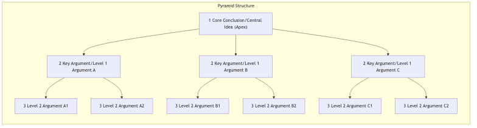

# ピラミッド原理

ビジネスコミュニケーション、文章作成、プレゼンテーションにおいて、私たちはしばしば次のようなジレンマに直面します。伝えたいことがたくさんあるのに、聴衆は混乱してしまい、肝心なポイントを理解してくれないのです。元マッキンゼー・アンド・カンパニーのコンサルタントであるバーバラ・ミントが提唱した「**ピラミッド原理**」は、コミュニケーションの効率性と論理性を高めるための非常に強力な**構造的思考と表現方法**です。その中心的な考え方は、複雑な主張を「**結論優先、上位から下位へ、グループ化され、論理的に進展する**」ピラミッド構造に整理することによって、聴衆が容易に、迅速に、正確にあなたが伝えたい核心メッセージを理解できるようにすることです。

ピラミッド原理の本質は、人間の脳が情報を処理する仕組みに対する深い洞察にあります。私たちは、断片的な情報の中から自動的に論理と構造を探します。聴衆があなたの整理されていない主張を必死でまとめようとするのではなく、あなた自身が最初から核心的な結論とその裏付けとなる論理構造を明確に提示するのです。これは、あなたの思考と表現を「相手に推測させる」ものから「相手に理解させる」ものへと変える強力な方法論です。

## ピラミッド原理の4つの基本原則

明確で堅実なピラミッド構造を構築するには、以下の4つの基本原則に従う必要があります。

1.  **結論優先**：文章やスピーチの冒頭で、最も核心的で包括的な中心的なアイデア（ピラミッドの頂点）を直接述べます。これにより聴衆の注意を引きつけ、その後に続くすべての情報を理解するための「全体像」を提供します。

2.  **上位概念が下位概念を統括**：ピラミッド構造の上位段階の主張は、すべてその下位段階の主張を**要約する概念**でなければなりません。下位段階の主張は、上位段階の主張の詳細な説明と裏付けです。

3.  **グループ化と要約**：同じグループ（同じ階層）に属するすべての主張は、同じ論理カテゴリに属し、それらの共通点を捉える単一名詞によって要約可能でなければなりません。例えば、「私たちの3つの強み」、「直面している4つの課題」などです。

4.  **論理的な順序**：同じグループに属するすべての主張は、明確な論理的順序（例えば、時系列、構造的順序、重要度の順）に並べられなければならず、適当に積み重ねてはいけません。

### ピラミッドの縦横構造

*   **縦方向構造**：「**質問と回答**」型の対話を表します。頂点の中心的なアイデアは、読者に自然な疑問（例えば、「なぜそう言えるのか？」や「具体的にはどうすればいいのか？」）を投げかけ、次のレベルのキー論点はそれらの疑問への回答です。
*   **横方向構造**：同じグループ内での論点同士の論理関係を表します。この関係は、**演繹的推論**（例えば、大前提、小前提、結論）または**帰納的推論**（例えば、複数の事例から共通パターンを要約）のいずれかになります。

## ピラミッド構造の構築方法

ピラミッド構造を構築するには、主に「トップダウン」と「ボトムアップ」の2つの方法があります。

1.  **トップダウン方式**：問題についてある程度明確なアイデアや核心的な結論を持っている場合に適しています。
    *   **ステップ1**：相手に伝えたい**中心的なアイデア（頂点）**を書き出します。
    *   **ステップ2**：この中心的なアイデアを見た読者がどのような核心的な疑問を持つのかを想像します。
    *   **ステップ3**：それらの核心的な疑問に対する直接的な回答を書き出します。これらの回答がピラミッドの第2レベル（キー論点）になります。これらの論点がMECEの原則（Mutually Exclusive, Collectively Exhaustive：互いに排他的で、全体として網羅的）に従うようにします。
    *   **ステップ4**：第2レベルの各論点に対して、「質問と回答」のプロセスを繰り返し、すべての論点が十分なデータや事実によって裏付けられるまで、次の下位レベルの論点を構築します。

2.  **ボトムアップ方式**：頭の中に散らばった多くのアイデア、情報、データがあるが、まだ明確な核心的な結論が形成されていない場合に適しています。
    *   **ステップ1**：**すべてのポイントをリスト化**します。頭の中にある関連するアイデア、情報、データをすべて書き出します。
    *   **ステップ2**：**論理関係を見出し、グループ化**します。これらの散らばったポイントを検討し、それらの内的な論理を見つけ、同じカテゴリに属するポイントをグループ化します。
    *   **ステップ3**：**上位の論点を要約・一般化**します。各グループに対して、そのグループ内のすべてのポイントを包括する上位の結論を要約します。
    *   **ステップ4**：**上記のプロセスを繰り返してピラミッドを形成**します。形成された論点を継続的に再グループ化し、再要約することで、最終的にピラミッドの頂点に位置する包括的な中心的なアイデアを導き出します。

## 実践例

**ケース1：プロジェクト進捗報告**

*   **不明確な表現（ピラミッド構造なし）**：「皆さん、『プロジェクト・アルファ』の進捗をご報告します。先週はユーザーインタビューを終え、議事録を配布しました。その後、デザイナーの王さんが作成したデザイン案にはいくつかのレビュー意見があり、現在修正中です。そうそう、バックエンドのデータベースインターフェースも先週共同でデバッグしました。しかし、当初のサードパーティ決済インターフェースに互換性の問題があることが判明し、ソリューションを変更する必要があり、プロジェクトの遅延が生じるかもしれません…」
*   **明確な表現（ピラミッド構造あり）**：
    *   **（結論優先）**：「皆さん、『プロジェクト・アルファ』について、私の核心的な結論は：**プロジェクト全体は順調に進行していますが、決済モジュールに遅延リスクがあり、バックアッププランの即時発動が必要です。**」
    *   **（裏付け論点1：順調な進捗）**：「まず、プロジェクトの核心部分は順調に進行しています。主に3つの点があります。第一に、すべてのユーザーインタビューを予定通り完了し、要件を明確化しました。第二に、バックエンドのデータベースインターフェースが共同でデバッグ済みです。第三に、コア機能のデザイン案がほぼ最終段階に近づいています。」
    *   **（裏付け論点2：リスクの特定）**：「次に、遅延を引き起こす可能性のある重要なリスクが判明しました。当初のサードパーティ決済インターフェースがテスト中に深刻な互換性の問題を示したことです。」
    *   **（裏付け論点3：提案された解決策）**：「そのため、直ちに以下の対応を推奨します。一方で、技術責任者が今週中に決済インターフェースBの調査を完了すること。他方で、プロジェクトマネージャーがこれにより生じる可能性のあるスケジュールへの影響を再評価すること。」

**ケース2：市場分析レポートの作成**

*   **中心的なアイデア（頂点）**：会社が東南アジアのオンライン教育市場に進出することを推奨します。
*   **主要論点（第2レベル）**：
    1.  巨大な市場ポテンシャル：この地域には若年層が多く、教育ニーズが増加しています。
    2.  競争環境は管理可能：現状では絶対的な独占企業は存在せず、市場機会があります。
    3.  会社戦略と一致：会社の「グローバル化」と「デジタル化」を柱とする長期戦略と非常に一致しています。
*   **裏付け論点（第3レベル）**：各主要論点の下で、具体的なデータ（例えば、人口増加率、市場規模予測、主要競合企業の市場シェアなど）を用いて詳細な裏付けを行います。

**ケース3：就職面接での「自己紹介」の準備**

*   **中心的なアイデア（頂点）**：「この『プロダクトマネージャー』のポジションに私を最適な候補者と考えています。なぜなら、私の能力と経験がこの職務要件と非常に一致しているからです。」
*   **主要論点（第2レベル）**：
    1.  **ユーザー理解**：私はユーザー調査プロジェクトを自らリードし、ユーザーのニーズを深く理解できます。
    2.  **協働能力**：私はあるプロジェクトのコアメンバーとして、デザイン、開発、マーケティングチームを成功裏に調整し、アプリのリリースに貢献しました。
    3.  **成果創出**：私が担当したプロダクト機能は、リリース後3ヶ月以内にコアユーザーのリテンション率を20%向上させました。

## ピラミッド原理の利点と課題

**主な利点**

*   **コミュニケーション効率を大幅に向上**：「結論優先」により、聴衆はあなたの核心的なアイデアを即座に理解でき、理解コストを大幅に削減します。
*   **思考を強制し、論理を深化**：ピラミッド構造を構築するプロセス自体が、曖昧で断片的な思考を構造化し、論理的に深化させる強力なプロセスです。
*   **記憶・伝達が容易**：構造化された情報は、無秩序な情報の塊よりもはるかに脳が記憶しやすく、理解しやすいです。

**潜在的な課題**

*   **「書く前に考える」マインドセットの転換**：「考えながら書く」習慣のある人にとって、「構造を先に作ってから書く」というモードへの移行には意識的な練習と慣れが必要です。
*   **要約能力への高い要求**：一連の論点の核心的なアイデアを正確に要約するには、強い抽象化能力と帰納的推論能力が必要です。
*   **すべてのシナリオに適用できない**：サスペンスや探索的・発散的な議論を必要とする状況では、厳密な「結論優先」は必ずしも適切ではありません。

## 拡張と関連

*   **MECE原則**：ピラミッド原理における「グループ化と要約」の指導的核心です。同じレベルの要素が「互いに排他的で、全体として網羅的」であることを保証することは、堅実なピラミッド構造を構築するための基本です。
*   **マインドマッピング**：ピラミッド原理の「ボトムアップ方式」を実践するのに優れたツールです。まずマインドマップで自由にアイデアを出し、その後それを整理して順序立てたピラミッド構造にまとめることができます。

---
*出典：バーバラ・ミントの著書『ピラミッド原理：書くことと思考の論理』がこの手法の唯一で最も権威ある出典です。この本は、マッキンゼーやボストンコンサルティングなどのトップコンサルティングファームで新人社員が必ず読む古典的な必読書であり、「ビジネスコミュニケーションと文章作成のバイブル」とも称されています。*