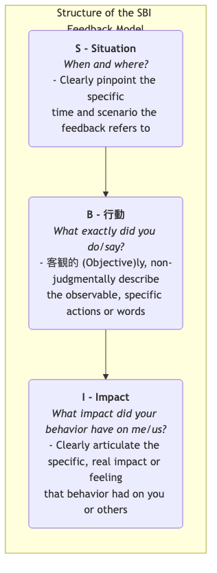

# SBIフィードバックモデル

チームの協働や個人の成長において、**フィードバック**は不可欠な燃料です。しかし、不適切なフィードバックの仕方は逆効果になることがあります。「よくできました」などの漠然としたフィードバックは具体的な指針を提供できず、一方で「あなたは雑すぎる」などの極めて主観的または判断的なフィードバックは、受け手に防衛的・抵抗的な反応を引き起こしやすく、建設的な会話であるべきものが非生産的な口論に変わってしまうことがあります。**SBIフィードバックモデル（SBI = Situation-Behavior-Impact）** は、こうした問題を解決するために設計された、シンプルで明確かつ非判断的な**構造化されたフィードバックコミュニケーションツール**です。

SBIモデルは、世界的なリーダーシップ開発機関である**クリエイティブ・リーダーシップ・センター（CCL）** によって開発されたもので、フィードバックを明確に3つの論理的に順序付けられた部分に分解することで、フィードバックを**具体的に、客観的に、行動とその影響に焦点を当てる**ものにしています。これは、個人の性格に対する抽象的な判断ではなくなります。

-   **S - シチュエーション（状況）**: フィードバックが対象とする具体的な時間と場所。
-   **B - ビヘイビア（行動）**: その状況においてその人が示した観察可能な具体的な行動や発言。
-   **I - インパクト（影響）**: その行動があなた、チーム、プロジェクトに与えた具体的な結果や影響。

この「S-B-I」の構造に従うことで、フィードバックを「人物」に対する漠然とした判断から、「行動」に対する明確な記述へと変えることができ、受け手がフィードバックを理解し、受け入れる可能性を大幅に高めます。また、その後の議論や改善のための客観的で尊重された土台を築くことができます。

## SBIモデルの3つの構成要素

SBIの3つの要素は、完全で説得力のあるフィードバック声明を一緒に形成します。

1.  **S - シチュエーション**
    -   **目的**: フィードバックの明確な文脈を提供し、受け手が自分が言及されている具体的な出来事をすぐに思い出すのを助けます。これにより、漠然とした一般化や「過去のことを蒸し返す」ことを避けます。
    -   **ポイント**: 具体的であることを心がけ、「あなたはいつも…」とは言わず、「昨日の朝のプロジェクト週次ミーティングで…」のように述べます。

2.  **B - ビヘイビア**
    -   **目的**: フィードバックを受ける人の**具体的で客観的、観察可能な** 行動や発言に焦点を当てること。
    -   **ポイント**: 自分が実際に見たこと、聞いたことを記述します。**主観的な仮定や動機の推測、性格の判断を示唆する言葉は一切避けてください**。「あなたは準備不足だったように見えた」ではなく、「計画を発表する際に、データを探して3回も言葉を切った」。「あなたは私を遮った」ではなく、「私がまだ話の途中だったのに、あなたが話し始めた」。

3.  **I - インパクト**
    -   **目的**: フィードバックの核となる部分です。受け手に、自分の行動がなぜ重要であり、それが他人や仕事に具体的にどのような影響を与えたかを理解してもらいます。これは、受け手が行動を変える動機づけをする鍵です。
    -   **ポイント**: 「私」や「私たち」に与えた具体的な影響や感情を明確に伝えます。「私」から始める表現は、受け手の防衛的な反応を抑える効果があります。例えば、「これは私の意見が十分に尊重されていないと感じさせました」、「これによりクライアントが私たちのプロフェッショナリズムに疑問を感じるようになりました」。

## SBIモデルを使ったフィードバックの実施方法

SBIモデルを使うことは、単に形式を適用することではなく、尊重とオープンな姿勢に基づくコミュニケーションのスタイルを身につけることです。

1.  **ステップ1：フィードバックの準備（S-B-I）**
    フィードバックの会話を始める前に、頭の中や紙の上でSBIの内容を明確に整理してください。記述が具体的で、客観的で、非判断的であることを確認します。

2.  **ステップ2：会話の開始**
    適切なプライベートな時間と場所を選んでください。会話の冒頭で、あなたの前向きな意図を明確に述べます。例えば、「今後さらにスムーズに協働するための参考にしてもらいたいと思い、いくつかの観察を共有したいと思います」。

3.  **ステップ3：SBIを明確に述べる**
    「S-B-I」の順序を厳守し、冷静かつ明確にフィードバックを述べます。
    -   「**(S)** 先週月曜日の朝、クライアントとのチーム週次ミーティングで、**(B)** クライアントが予算に関する鋭い質問をした際、あなたは私たちの価値を裏付けるために過去の成功事例を3つ詳細に挙げて説明しました。**(I)** これにより私は非常に安心し自信が持てたし、クライアントの表情も明らかに緩み、私たちへの信頼が高まったと感じました」。（これはポジティブなフィードバックの例です）

4.  **ステップ4：一旦停止し、相手の視点を聞く**
    SBIの説明が終わったら、最も重要なステップは**一旦停止**し、相手に話す機会を渡すことです。オープンエンドな質問を使って、相手の視点を共有するよう促します。例えば、「さきほど私が言ったことについて、どう感じましたか？」、「そのとき、あなたはどんなことを考えていたのかお聞かせいただけますか？」。

5.  **ステップ5：共に議論し、未来に向けて考える**
    双方が十分に意見を交換した後、会話の焦点を未来に移します。共に、「今後、良い点は維持し、改善すべき点をどう改善していけるか」を議論します。

## 実践例

**ケース1：会議で長話をする同僚へのフィードバック**

-   **不適切なフィードバック**: 「あなたは会議で話が長すぎるし、要点を外しがちです」（判断的で漠然としている）
-   **SBIフィードバック**:
    -   **S**: 「今日はチームの週次ミーティングで『次四半期のマーケティング計画』という第3議題を議論していたときのことです」
    -   **B**: 「あなたの計画を説明する際、過去の類似活動の背景情報を詳細に語り、約15分間かかっていました」
    -   **I**: 「これにより私は少し不安を感じました。他の2人の同僚の計画を議論する時間が十分に取れないのではないかと心配になったからです。また、あなたの計画の要点が掴みにくかったのも事実です」
    -   **（会話の促進）**: 「あのとき、背景情報を詳しく説明しようとしたのは、私たちが十分に理解できるようにしたかったからでしょうか？」

**ケース2：他部署の支援を進んで行った新人への称賛**

-   **不適切なフィードバック**: 「王さん、あなたは素晴らしい、これからも頑張ってください！」（漠然としていて具体的な指針がない）
-   **SBIフィードバック**:
    -   **S**: 「王さん、昨日の午後、カスタマーサポートチームが電話対応で忙しかったときのことです」
    -   **B**: 「あなたは進んでサポートに行き、5件の未処理オンラインチケットを処理してくれました」
    -   **I**: 「この行動によりカスタマーサポートチームの負担が大幅に軽減されただけでなく、あなたの強いチームスピリットと責任感が伝わり、チーム全体の雰囲気も良くなりました。本当にありがとう！」
    
**ケース3：上司へのフィードバック（上方向へのフィードバック）**

-   **シチュエーション**: 上司がチームミーティング中に突然、緊急のタスクをあなたに割り振ることがよくある。
-   **SBIフィードバック**:
    -   **S**: 「課長、先週水曜日のプロジェクト計画ミーティングで」
    -   **B**: 「ミーティングの終わりに、金曜日までに完了しなければならない新たな緊急タスクを2つ私に割り当てました」
    -   **I**: 「これにより私は少し戸惑いました。もともと優先度が高いとされていた重要なタスクを中断して対応する必要があったからです。これによりプロジェクト全体のキーパスに影響が出るのではないかと心配しています」
    -   **（会話の促進）**: 「これらの新たな2つのタスクの優先度は、私が現在取り組んでいる重要なタスクよりも本当に高いのでしょうか？それともスケジュールをどのように調整すればよいかご相談できますか？」

## SBIモデルの利点と課題

**主な利点**

-   **具体的で客観的、根拠がある**: 観察可能な事実に基づいてフィードバックを行うため、漠然とした称賛や根拠のない非難を避けることができます。
-   **防衛的な反応を軽減**: 「人物」ではなく「行動」と「影響」に焦点を当てることで、受け手の抵抗感を大幅に軽減し、会話を円滑に進めます。
-   **明確な方向性を示す**: 「影響」の部分で、なぜその行動を維持または変更する必要があるのかを明確に伝えることで、受け手が理解しやすくなり、行動に移しやすくなります。
-   **シンプルで学びやすい**: モデルの構造がシンプルで覚えやすく、日常業務の中で意識的に練習することができます。

**潜在的な課題**

-   **意識的な練習が必要**: 特に衝突や否定的なフィードバックの場面において、SBIを巧みに自然に使いこなすには、習慣的な判断的なコミュニケーションスタイルを乗り越えるための意識的な練習が必要です。
-   **「行動」観察の高い要求**: 日頃から注意深く観察し、具体的な行動の詳細を捉え、正確に記述できる能力が求められます。

## 応用と関連概念

-   **ノンバイオレント・コミュニケーション（NVC）**: SBIモデルはノンバイオレント・コミュニケーションの理念と非常に一致しています。NVCの4つの構成要素は「観察、感情、ニーズ、リクエスト」です。SBIの「シチュエーション・ビヘイビア」はNVCの「観察」に、SBIの「インパクト」はNVCの「感情」と「ニーズ」に関連しています。
-   **BI-C形式のフィードバック**: 一部のシナリオでは、期待をより強く表現する必要がある場合（特に否定的なフィードバックの後）に、SBIに加えて**C - コンsequences/Choice（結果／選択肢）** の要素を追加することができます。これにより、行動を変えない場合に生じる可能性のある具体的な結果や、受け手が選ぶことができる選択肢を明確に伝えることができます。

---
*参考文献：SBIフィードバックモデルは、クリエイティブ・リーダーシップ・センター（CCL）によって開発・普及されたもので、CCLのリーダーシップトレーニングプログラムにおけるコアなコミュニケーションツールの一つであり、世界中の管理者やチームのコミュニケーションスキル開発に広く活用されています。*