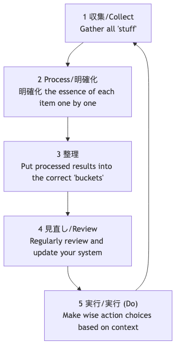

# GTD（やることをやる）

人間の脳は本質的に**アイデアの創出**には非常に優れた「CPU」ですが、**情報の保存**には極めて不向きな「ハードディスク」です。脳を使ってすべてのやるべきこと、予定、アイデア、約束などを覚えようとしてしまうと、脳はそれらの「未完了の事柄」で占められてしまい、ストレスや不安、精神的なごちゃごちゃを引き起こし、目の前のタスクに集中できなくなります。生産性の専門家であるデビッド・アレンが考案した**GTD（GTD：やることをやる）**は、世界的に有名な**パーソナル生産性システムおよびワークフロー管理手法**です。

GTDの中心的な哲学は、頭の中にあるすべての未処理の「事柄」を**外部の信頼できるシステム**に移し、明確かつ厳密なプロセスに従ってそれらを**整理・処理**することで、ストレスフリーで集中力が高く効率的な状態である**「水のような心（Mind Like Water）」**を達成することです。これは単なる時間管理のテクニックではなく、複雑な仕事と生活を冷静にこなせるように心を解放するための完全なオペレーティングシステムです。

## GTDの5つの基本ステップ

1.  **収集（Capture）**: 注意を引くものすべてを脳から「インボックス（受信箱）」へとすぐに移動させます。仕事のタスク、個人的な雑務、突然のひらめき、将来の予定など、何でも構いません。インボックスは物理的なもの（ファイルトレー、ノートブックなど）でも、デジタルのもの（メール受信箱、タスクリストアプリなど）でもかまいません。重要なのは、インボックスをできるだけ少なくし、100％信頼して空にできるようにすることです。

2.  **処理（Process）**: 定期的（少なくとも1日1回）に「インボックス」を**空に**します。**1回に1つの項目だけ**を処理するという原則に厳密に従い、インボックス内の各「事柄」を1つずつ取り上げ、「これは何だろう？行動は必要だろうか？」という核心的な質問を自分自身に投げかけます。
    *   **行動が必要ない場合**: それは**ゴミ**（削除）、**将来必要になるかもしれない情報**（リファレンスファイルへ）、または**育て中のアイデア**（「Someday/Maybe（いつか/ maybe）」リストへ）のいずれかです。
    *   **行動が必要な場合**: 次の整理のステップへ進みます。

3.  **整理（Organize）**: 行動が必要な項目については、その性質に応じて異なる「バケット（仕分け先）」に入れます。
    *   **「2分ルール」**: 行動が**2分以内**で完了できる場合は、**即座に実行**し、それ以上の整理はしません。
    *   **他人への委任**: 他の人が行うべきタスクであれば、**即座に委任**し、「**待機中リスト（Waiting For）**」に入れて追跡します。
    *   **カレンダー**: **特定の日付や時間**（例：会議、アポイント）がある行動については、**カレンダー**に入れます。
    *   **次工程リスト（Next Actions List）**: 自分の注意が必要で、複数のステップが必要であり、特定の日付がない行動については、**最初の具体的で見える化された物理的な行動**に分解し、**文脈**に応じて異なる「次工程リスト」に入れます。文脈には「@コンピュータ」「@オフィス」「@電話」「@スーパー」などがあります。
    *   **プロジェクトリスト（Projects List）**: **複数の行動**を必要とする成果物はすべて「**プロジェクト**」として定義され、「プロジェクトリスト」に入れます。このリストにはプロジェクト名のみを記録し、具体的な次の行動は対応する次工程リストに保存されます。

4.  **点検（Reflect）**: システムの信頼性を維持するためには、**定期的な見直し**を行う必要があります。
    *   **毎日の見直し**: 毎日、カレンダーや次工程リストをさっと確認し、その日の作業を計画します。
    *   **週次の見直し**: これはGTDの**極めて重要な部分**です。週に1回（通常は週末）、1〜2時間を使ってシステム全体を包括的かつ徹底的に見直し、更新・整理し、すべてのプロジェクトが管理下にあり、すべてのリストが最新になっていることを確認します。

5.  **実行（Engage）**: いつでも「今、何をすべきか？」を決める際、以下の基準に基づいて、賢く冷静な選択を行います。
    *   **文脈（Context）**: 今どこにいるか？どのような道具を持っているか？（例：オフィスにいるなら「@オフィス」リストを見る）
    *   **利用可能な時間（Time Available）**: 今どれくらいの空き時間があるか？（例：10分しかなければ、短時間で完了できるタスクを選ぶ）
    *   **利用可能なエネルギー（Energy Available）**: 現在のエネルギー状態は？（例：元気なら集中力が必要なタスクに取り組む）
    *   **優先順位（Priority）**: 上記の条件のもとで、どのタスクが最も重要か？

### GTDワークフロープロセス図

## 実践例

**ケース1：忙しい部署マネージャー**

*   **収集**: 彼のインボックスには、メール受信箱、WeChatのメッセージ、会議中のメモ、突然浮かんだアイデアなどが含まれるかもしれません。
*   **処理と整理**:
    *   「次四半期の予算通知に関するメール」-> 行動不要 -> 「会社の財務」リファレンスフォルダに**アーカイブ**。
    *   「部下の小張さんに週報を送るようリマインドするアイデア」 -> 2分以内で可能 -> **即座に**小張さんにメッセージを送る。
    *   「年次チームビルディングの準備」 -> 複数のステップが必要 -> 「チームビルディング」を「**プロジェクトリスト**」に追加。「最初の行動」である「HRと連絡を取り、候補会場リストを入手する」を「**@オフィス**」の次工程リストに追加。
    *   「来週水曜日の午後3時からクライアントとの会議」 -> **カレンダー**に登録。
*   **実行**: オフィスにいて、1時間の空き時間があり、元気な状態であれば、「@オフィス」リストを開き、「HRとの連絡」を選んで作業できます。

**ケース2：フリーランスのプロジェクト管理**

*   **プロジェクトリスト**: 「クライアントAのウェブサイトデザインプロジェクト」「個人ブログのリデザイン」「新しいプログラミング言語の学習」など。
*   **次工程リスト**:
    *   **@電話**: クライアントAにデザイン案のフィードバックを確認する。
    *   **@コンピュータ-デザイン**: フィードバックに基づき、ウェブサイトのトップページデザインを修正。
    *   **@コンピュータ-執筆**: 「レスポンシブデザイン」についてのブログ記事を書く。
    *   **@読書/学習**: プログラミング講座の第3章を視聴。
*   **週次の見直し**: 金曜日の午後、すべてのプロジェクトの進捗を確認し、各プロジェクトに少なくとも1つの「次工程」があることを確認し、翌週の優先事項を計画します。

**ケース3：学生が学業と生活を管理する例**

*   **インボックス**: 授業のWeChatグループからの通知、教師から出された課題、クラブ活動に関するアイデア、日常用品の買い物リスト。
*   **プロジェクトリスト**: 「歴史のレポートを完成させる」「期末試験の準備」「新入生歓迎会の企画」。
*   **次工程リスト**:
    *   **@図書館**: レポートのテーマに関する参考書3冊を借りる。
    *   **@寮**: 数学の授業ノートを整理。
    *   **@スーパー**: 歯磨きとシャンプーを買う。
*   **GTDシステム**により、学業のタスクと日常の雑務を明確に区別し、適切なタイミングと場所で適切なことを実行できるようになります。

## GTDの利点と課題

**主な利点**

*   **精神的ストレスを軽減し、脳のリソースを解放**: すべての「未完了の事柄」を外部化することで、脳の記憶負荷と「忘れてしまうかもしれない」という不安からくる継続的なストレスを大幅に軽減します。
*   **コントロール感と冷静さを高める**: 信頼できるシステムがあれば、すべてが管理下にあることを確信でき、現在のタスクに落ち着いて集中できます。
*   **「重要なこと」を見逃さない**: 重要な「週次の見直し」により、すべての重要なプロジェクトや長期的な目標に継続的に注力し、進捗を確保します。
*   **非常に適応性が高く柔軟**: GTD自体は優先順位を事前に設定しませんが、現在の文脈に基づいて最も適切な行動を動的に柔軟に選択できるフレームワークを提供します。

**潜在的な課題**

*   **システム構築の初期コストが高い**: 「収集」からリストシステムを完全に構築するまでに、数時間から丸1日かかることもあります。
*   **厳格な自己規律と習慣形成が必要**: GTDの成功は、**継続的な収集**と**定期的な見直し**というコア習慣を身につけられるかどうかに大きく依存します。一度システムを信頼しなくなり、更新が止まると、すぐに崩壊します。
*   **ツール選択のジレンマ**: 市場には多くのGTDソフトウェアやツールがあり、初心者は「完璧なツール」を追い求めすぎ、手法そのものを見失いがちです。

## 拡張と関連

*   **アイゼンハワー・マトリクス**: GTDの「実行（Engage）」ステップで、「優先順位」を判断するための有効な思考モデルとして活用できます。
*   **ポモドーロ・テクニック**: 高い集中力を必要とするGTDの「次工程リスト」のタスクを実行するための優れた具体的戦術です。

---
*参考文献：デビッド・アレンによる世界的ベストセラー『Getting Things Done: The Art of Stress-Free Productivity（やることをやる：ストレスフリーな生産性の磨き方）』は、GTDメソッドの完全な哲学、プロセス、ベストプラクティスを理解するための唯一にして最も権威ある情報源です。*