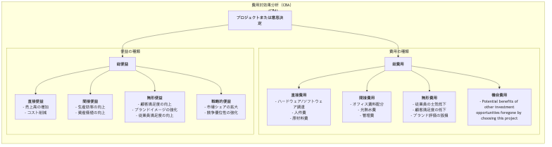

# 費用便益分析

ビジネスの世界でも、公共政策の分野においても、ほぼすべての意思決定には根本的なトレードオフが隠れています。それは、どれほどの**費用**を支払ってでも、ある特定の**便益**を得たいか、という問いです。**費用便益分析 (CBA: Cost-Benefit Analysis)** は、まさにそのような意思決定を支援する体系的な枠組みであり、すべてを金銭的価値で統一して評価します。その中心的な目的は、プロジェクトや意思決定に伴うすべての費用と便益を包括的に特定・定量化・比較し、そのプロジェクトが「実施に値するかどうか」を判断し、複数の代替案の中から合理的な経済的根拠に基づいて選択できるようにすることです。

費用便益分析のロジックは単純明快です。もしプロジェクトの**総便益が総費用を上回れば**、それは経済的に実行可能で効率的です。この分析は、意思決定者に対して曖昧な定性的な説明にとどまらず、すべての関連するプラス・マイナスの影響を可能な限り比較可能な金銭的価値に変換するよう迫ります。新しい政府のインフラプロジェクトの評価から、企業が新しいITシステムへの投資を検討する場合に至るまで、費用便益分析はリソース配分や投資判断において欠かせない合理的ツールです。

## 費用と便益の構成要素

包括的な費用便益分析を実施するには、明示的な費用・便益だけでなく、暗黙的なものも含め、すべての関連する要素を特定する必要があります。

## 費用便益分析の実施手順

1.  **ステップ1：プロジェクトと代替案の定義**
    評価するプロジェクトまたは意思決定を明確に定義します。複数の代替案がある場合は、それぞれについて個別に費用便益分析を実施する必要があります。

2.  **ステップ2：すべての費用と便益を包括的に特定**
    関係するすべての利害関係者とともに、プロジェクトのあり得るプラス・マイナスの影響をリストアップします。この段階では、見落とされがちな無形費用や間接便益に特に注意を払います。

3.  **ステップ3：費用と便益の金銭的評価**
    CBAにおける最も難しいステップです。リストアップされたすべての費用と便益に合理的な金銭的価値を割り当てます。直接的な費用と便益については比較的容易ですが、無形の費用と便益（例：「顧客満足度の向上」）については、市場調査を通じて顧客がより良いサービスに支払える金額を推定したり、顧客離脱率の低下によって回復される損失を計算したりするなどの評価技法が必要です。

4.  **ステップ4：時間価値と割引の考慮**
    将来のお金は現在のお金より価値が低いという概念に基づき、複数年にわたるプロジェクトについては、将来の費用と便益をあらかじめ定めた**割引率**を使って**現在価値**に割り引く必要があります。これにより、すべての費用と便益を同一の時間軸で比較可能にします。

5.  **ステップ5：主要な意思決定指標の計算と比較**
    すべての費用と便益の現在価値を合計し、以下のいずれかの主要な指標を計算します：
    *   **正味現在価値 (NPV)**: **総便益の現在価値 - 総費用の現在価値**。NPV > 0 の場合、プロジェクトは経済的に実行可能です。複数の選択肢の中では、NPVが最も高いものを選ぶのが一般的です。
    *   **便益費用比率 (BCR)**: **総便益の現在価値 / 総費用の現在価値**。BCR > 1 の場合、プロジェクトは実行可能です。この比率は、規模の異なるプロジェクトを比較する際に有効です。
    *   **投資収益率 (ROI)**: **(総便益 - 総費用) / 総費用 × 100%**。投資の収益性を視覚的に示します。
    *   **回収期間**: プロジェクトの累積便益が初期投資額と等しくなるまでの期間。

6.  **ステップ6：感度分析と提言の作成**
    多くの推定値（特に無形項目や割引率の選択）には不確実性が伴うため、**感度分析**が必要です。これは、いくつかの重要な前提（例：「売上成長率が予想より20%低かったら？」）を変化させ、最終的な結果（例：NPV）にどのような影響を与えるかを観察するものです。最終的に、すべての分析結果に基づき、意思決定者に対して明確でデータに基づいた提言を行います。

## 適用事例

**事例1：ERPシステムのアップグレードを検討する企業**

*   **費用**:
    *   直接費用：ソフトウェア購入費、ハードウェア更新費、外部コンサルタントおよび導入費用、従業員トレーニング費用。
    *   無形費用：システム移行中の短期的な生産性低下、新しいシステムへの従業員の抵抗。
*   **便益**:
    *   直接便益：プロセス自動化による労務費削減、在庫最適化による資金繰りの改善。
    *   間接便益：データ精度の向上、意思決定効率の向上。
    *   無形便益：顧客注文処理の迅速化、顧客満足度の向上。
*   **分析**：上記の項目を今後5年間で金銭評価し、割引現在価値を計算した結果、プロジェクトのNPVが正であれば、その投資は実施に値します。

**事例2：新しい高速道路の建設を検討する政府**

*   **費用**:
    *   直接費用：土地取得費、建設費、今後数十年にわたる維持管理費。
    *   無形費用：沿線の自然環境への損害、移転に伴う社会問題、建設中の騒音や交通渋滞。
*   **便益**:
    *   直接便益：通行料収入。
    *   間接便益：沿線住民や企業の交通時間・費用の削減、地域経済の活性化と雇用創出。
    *   無形便益：交通事故の削減により命が救われた価値。
*   **分析**：公共プロジェクトにおけるCBAは特に複雑です。公共政策分野では、「命の価値」や「環境価値」など、専門的な推定が必要です。最終的な便益費用比率（BCR）がプロジェクト実施の判断基準となります。

**事例3：フルタイムMBA取得を検討する個人**

*   **費用**:
    *   直接費用：高額の授業料、教材費、生活費。
    *   機会費用：MBA学習期間中（通常2年間）に失われるすべての給与収入。これは多くの場合、最大の費用です。
*   **便益**:
    *   直接便益：卒業後の大幅な給与増加。
    *   無形便益：得られる知識とスキル、強力な同窓会ネットワーク、個人ブランドの向上。
*   **分析**：候補者は、MBA取得後の生涯キャッシュフロー（MBAあり vs なし）を推定し、その正味現在価値を計算することで、この「自己投資」が妥当かどうかを判断できます。

## 費用便益分析の長所と課題

**主な長所**

*   **合理的かつデータ駆動型**: 明確で合理的な経済比較フレームワークを提供し、主観的なバイアスを軽減します。
*   **包括的**: 意思決定者がプロジェクトのすべてのプラス・マイナスの影響を、最も明白なものだけでなく考慮するよう強制します。
*   **リソース最適化**: 限られたリソースを、最大の純便益を生み出すプロジェクトに配分するのを助けます。

**潜在的な課題**

*   **金銭評価の困難さ**: 最大の課題は、「ブランド評判」や「環境保護」、「命の価値」など、無形の非市場項目に公平で信頼性のある金銭的価値を割り当てることです。このプロセスはしばしば物議を醸します。
*   **予測の正確性**: 分析結果は将来の費用と便益の予測に大きく依存しており、それ自体が多くの不確実性を含んでいます。
*   **公平性問題の無視**: CBAは主に全体的な経済効率に焦点を当てており、費用と便益のグループ間分配が公平かどうかを見過ごすことがあります。

## 拡張と関連手法

*   **意思決定マトリクス**: 意思決定基準を完全に金銭評価できない場合、意思決定マトリクスはより柔軟な代替手段を提供します。
*   **費用効果分析 (CEA)**: プロジェクトの便益が金銭評価しにくい場合（例：医療分野）でも、その効果が一貫した非金銭的単位（例：「成功裏に治療された患者数」、「延命年数」）で測定できるなら、CEAを使用できます。これは、「1単位の効果を達成するためにどれだけの費用がかかるか」を計算します。

---
*参考：費用便益分析の概念は、19世紀のフランスの技術者ジュール・デュプイが公共事業プロジェクトを評価したことに起源を持ちます。20世紀には、イギリスやアメリカなどの国々で公共政策評価に広く応用され、プロジェクト管理や企業の投資判断におけるコアツールとなりました。*