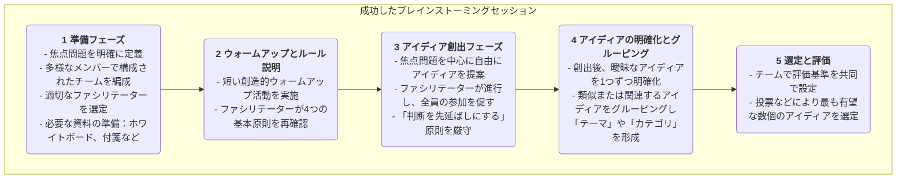

# アイディア創出（ブレインストーミング）

革新的な解決策を求めて複雑な問題を解決する際、私たちの最大の敵は、しばしば私たち自身の心に深く根付いた制限的な思考パターンです。**ブレインストーミング**は、こうした思考の束縛を打ち破るために設計された古典的で強力かつ広く普及している**グループによるアイディア創出技法**です。これは1940年代に広告業界のアレックス・F・オズボーン（Alex F. Osborn）によって提案されたもので、その中心的な目的は、完全にオープンで自由かつ批判を許さない議論の雰囲気を作り出すことによって、短期間で多くの新鮮で多様な、時には現実的でないように思えるアイディアを生み出すことを参加者に促すことです。

ブレインストーミングの本質は、**「量を優先し、質はその次」**にあります。それは、量の蓄積を通じて質を育むことができると堅く信じています。判断を先延ばしにし、奇抜なアイディアを奨励することで、ブレインストーミングはチームの創造性を「批判的モード」から「生成モード」へと効果的に切り替えることができ、安全な環境でさまざまな未知の可能性を探求し、その後の選別と深化のための豊かで多様な素材を提供します。

## ブレインストーミングの4つの基本原則

ブレインストーミングが意図した成果を達成するためには、オズボーンが提唱した以下の4つの基本原則を厳格に守らなければなりません。これらは安全で自由な環境を構築するための礎です。

1.  **判断を先延ばしにする（Defer Judgment）**：これは最も中心的で揺るがない原則です。ブレインストーミング中は、どんなに馬鹿げて非現実的に思えるアイディアであっても、**一切**の批判、質問、判断を許しません。判断は後に行う選別段階で行われます。

2.  **奇抜なアイディアを奨励する（Encourage Wild Ideas）**：参加者が枠にとらわれない思考をするよう奨励します。馬鹿げていたり論理的でないように思えるアイディアは、しばしば思考の硬直性を打ち破り、他の参加者にさらに画期的なアイディアを生み出すきっかけを与えてくれます。

3.  **量を追求する（Go for Quantity）**：明確で挑戦的な量的目標（例：「20分で100のアイディアを生み出す」）を設定します。アイディアの数が多ければ多いほど、質の高いアイディアが生まれる可能性が高まります。

4.  **他者のアイディアを発展させる（Build on the Ideas of Others）**：これは「乗っかり（piggybacking）」や「雪だるま式（snowballing）」とも呼ばれます。参加者に他者のアイディアを注意深く聞き、それらを結合・改善・拡張する方法を考えることを奨励し、新しい、より洗練されたアイディアを生み出します。これは「1＋1＞2」の相乗効果を反映しています。

### ブレインストーミングのプロセス

## 効果的なブレインストーミングセッションの開催方法

1.  **慎重な準備**
    *   **明確な焦点問題の定義**：問題は広すぎず狭すぎないようにする必要があります。例えば、「会社の利益を増やすには？」という非常に広範な質問を、「既存顧客のリピート購入率を20％向上させるには？」に具体化させます。
    *   **多様なメンバーの編成**：異なるバックグラウンドや機能を持つ5〜10人を参加させます。多様な視点はより豊かなアイディアを生み出します。
    *   **優れたファシリテーターの選定**：ファシリテーターは直接アイディアを提案しません。その役割はプロセスを導き、時間管理を行い、参加を奨励し、あらゆる判断的な行動を毅然と止めるところにあります。

2.  **適切な雰囲気の創出**
    *   リラックスでき快適な環境を選び、ホワイトボード、付箋、マーカーなどのツールを準備します。
    *   本格的な開始前に、短い創造的ウォームアップゲーム（例：「クリップの100の使い方」など）を使って、参加者がリラックスし創造的思考モードに入れるようにします。

3.  **アイディアの創出と記録**
    *   ファシリテーターが開始を宣言し、明確な時間制限（通常は15〜30分）を設定します。
    *   参加者が思いついたアイディアを声に出すか、付箋に書き壁に貼り出します。ファシリテーターまたは指定された記録者は、すべてのアイディアを修正や削除することなく迅速に記録する必要があります。

4.  **収束と評価**
    *   創出フェーズの後は収束フェーズに移ります。まずファシリテーターが全員を導いてすべてのアイディアを素早く見直し、曖昧なものを明確にします。
    *   次に、類似するアイディアをカテゴリ化・統合し、数個の主要なテーマ方向にまとめます。
    *   最後に、チームでいくつかの評価基準（例：「実現可能性」「独創性」「ユーザー価値」など）を共同で設定し、投票（例：各人に数枚の小さなシールを配布）によって最も認められ有望な2〜3つのアイディアを選定し、さらなる深掘りに進みます。

## 実施事例

**事例1：新アプリのネーミング**

*   **焦点問題**：「『食の共有』に特化したSNSアプリのためのキャッチーで覚えやすい名前を考える」
*   **実施内容**：マーケティングチームが30分間のブレインストーミングを実施。80以上の候補名が挙がり、「フードノート（Foodie Notes）」「テーストバディーズ（Taste Buddies）」「スナップ＆イート（Snap & Eat）」などが含まれました。その後の選別で、製品の特徴とSNS性を反映した名前が最終的に選ばれました。

**事例2：顧客クレームの解消**

*   **焦点問題**：「『物流配送の遅延』に関する顧客クレームを50％削減するには？」
*   **実施内容**：カスタマーサービス、オペレーション、物流担当者からなる横断的チームが共同でブレインストーミングを実施。アイディアには、「より速い宅配業者との提携」「フロント倉庫の設置」「梱包プロセスの最適化」「遅延時の割引クーポン提供」などが含まれました。これらのアイディアは具体的な解決策の策定に向けた豊かな出発点となりました。

**事例3：マーケティングキャンペーンの設計**

*   **焦点問題**：「今夏向けにジュースブランドのための独創的なオンラインマーケティングキャンペーンを企画するには？」
*   **実施内容**：チームメンバーが想像力を働かせ、「『サマースペシャル』UGCコンテストの開催」「人気リゾート旅行ブロガーとのライブ配信協業」「凍らせてアイスキャンディーにできるパッケージの発売」「SNS上で『サマーテイスト』に挑戦するチャレンジ企画の実施」などのアイディアを提案しました。それらを組み合わせて洗練させた結果、完成されたマーケティングプランが出来上がりました。

## ブレインストーミングの利点と課題

**主な利点**

*   **効率的なアイディア創出**：短期間で多様な大量のアイディアを迅速に生み出すことができます。
*   **チームの協働と結束促進**：平等でプレッシャーのない環境を作り出し、チームの結束と集団的創造性を高める助けとなります。
*   **思考の硬直性打破**：奇抜なアイディアを奨励し、判断を先延ばしにすることで、チームが従来の思考パターンから抜け出すことを効果的に支援します。

**潜在的な課題**

*   **「集団思考（Groupthink）」のリスク**：適切なファシリテーションが行われないと、一部の個人の意見が議論を支配したり、人々が「安全な」アイディアを提案しがちになったりします。
*   **「フリーライダー（Free-Riding）」現象**：チーム内で一部のメンバーが積極的でなく、単に「乗っかって」アイディアをほとんど出さないことがあります。
*   **実施の難しさ**：「判断を先延ばしにする」原則を厳格に守るには、ファシリテーターの高いスキルと成熟したチーム文化が必要です。
*   **フォローアップの不足**：ブレインストーミング自体はアイディア創出までが責任範囲です。その後の体系的な選定、評価、実行の仕組みがなければ、どんなに優れたアイディアも空論に終わってしまいます。

## 拡張と関連技法

*   **逆ブレインストーミング（Reverse Brainstorming）**：興味深いバリエーションです。「どうすれば成功できるか？」ではなく、「どうすれば完全に失敗できるか？」と問うことで、失敗につながるすべての要因を特定し、逆算して予防策を考案します。
*   **ブレインライティング（Brainwriting）**：雄弁な話者が議論を支配するのを防ぐために、文章形式を用いる方法です。例えば、6人の参加者がそれぞれ5分間で3つのアイディアを書き、次の人へ紙を回してインスピレーションや拡張を行う「6-3-5法」などがあります。
*   **シックス・シックス・ハット（Six Thinking Hats）**：ブレインストーミング後の「評価」フェーズに構造化されたツールとして活用でき、チームが選定されたアイディアをさまざまな視点から包括的に検討するのを導きます。
*   **マインドマッピング（Mind Mapping）**：ブレインストーミングの結果を整理・構造化するための優れた視覚的ツールです。

---
*参考文献：アレックス・F・オズボーンは、1953年の著書『応用想像力（Applied Imagination）』でブレインストーミングの原則と方法を初めて体系的に詳述しました。現在でも世界中で最も広く使われているアイディア創出技法の一つです。*