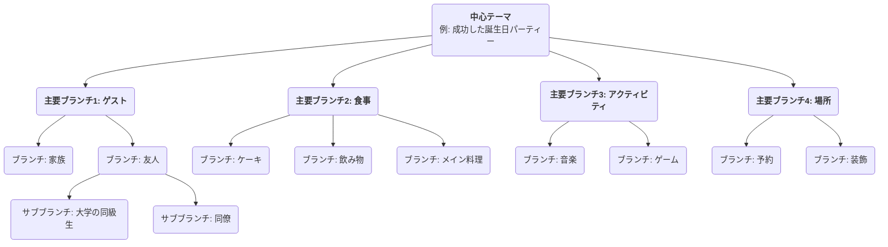

# マインドマッピング

私たちの脳は考えるとき、直線的かつ単純ではなく、ジャンプ、連想、分岐に満ちています。**マインドマッピング**はまさにこのような**視覚的思考ツール**であり、脳の自然な働き方に深く合致しています。1970年代にイギリスの学者トニー・ブザンによって考案されたこの手法は、**中心テーマ**を中心に、キーワード、アイデア、画像、色などを**放射状に、段階的に広がる構造**で結びつけ、複雑なテーマや散らばった情報を整理して、明確で順序立てやすく、覚えやすく、理解しやすい「脳の地図」に変換します。

マインドマップの魅力はその**非直線的**な特徴にあります。自由な連想を促し、ひらめきを捉えて有機的かつ相互に関連した形で整理するのを助けます。情報の記録手段というだけでなく、創造性を刺激し、論理を明確にし、記憶力を高める強力な思考パートナーです。読書ノートの作成やプレゼンテーションの準備、ブレインストーミングに至るまで、マインドマッピングは私たちの思考効率と深さを大幅に向上させます。

## マインドマップの基本構成要素

標準的なマインドマップには、いくつかのシンプルだが重要な描画ルールがあります。

1.  **中心画像／テーマ**: キャンバスの中央に、目を引く画像またはキーワードで中心となるテーマを表します。これはすべての思考の出発点です。
2.  **主要ブランチ（枝）**: 中心テーマから放射状に伸びる太く曲がった線で、テーマの主要な第一段階のカテゴリや分類を表します。各主要ブランチにはキーワードを記します。
3.  **サブブランチ**: 主要ブランチから延びる細い線で、主要ブランチの内容をさらに細分化・詳細化したものを表します。枝は無限に延ばすことができ、階層的なツリー構造を形成します。
4.  **キーワード**: 各枝には、完全な文ではなく、核心的なアイデアを要約する簡潔なキーワードまたは短い語句のみを使用します。これにより、さらに多くの連想が刺激されます。
5.  **色**: 異なる主要ブランチおよびそのサブブランチに異なる色を使用します。色は分類や整理を助け、視覚記憶を大幅に刺激します。
6.  **画像**: マップのさまざまな箇所に、小さなアイコン、シンボル、簡単な絵をできるだけ多く使います。「一枚の絵は千の言葉に値する」とも言われるように、画像はマップの面白さと記憶に残る度合いを高めます。

### マインドマップ構造の例

<!--

-->

## マインドマップの描き方

1.  **ステップ1：中心から始める**
    空白の紙を横向きに置き、真ん中に中心テーマを表す画像を描くか、キーワードを書き込みます。

2.  **ステップ2：主要ブランチを描く**
    中心テーマから放射状に伸びる太く曲がった線を主要ブランチとして描きます。各主要ブランチは主要なカテゴリを表します。線の上に該当するキーワードを書き込みます。

3.  **ステップ3：ブランチとキーワードを追加する**
    各主要ブランチからさらに細い枝を描き、線の上にさらに具体的なキーワードを書き込みます。線の長さと文字の大きさを統一します。このプロセスは、大きな木が新しい小枝を生やすようなものです。

4.  **ステップ4：色と画像を使う**
    異なる主要ブランチ体系に異なる色を割り当てます。適切だと思う箇所に簡単な小さなアイコンやシンボルを描き、マップを「生き生きと」させます。

5.  **ステップ5：自由な連想、継続的な拡張**
    順序にとらわれず、思考を自由にジャンプさせます。新しいポイントを思いついたら、すぐにそれが属するカテゴリを見つけ、新しいブランチを追加します。全体のプロセスはリラックスして楽しく行うべきです。

## 実践例

**ケース1：読書ノートの作成**

*   **シナリオ**: 「効率的な習慣」に関する本を読み終え、その核心内容を整理し、記憶にとどめたい。
*   **活用法**:
    *   **中心テーマ**: 本のタイトル「効率的な習慣」。
    *   **主要ブランチ**: 各章のタイトル、例えば「習慣の力」「習慣ループ」「良い習慣の築き方」「悪い習慣の断ち切り方」など。
    *   **サブブランチ**: 各主要ブランチの下に、その章の核心的な主張、重要な事例、具体的な方法をキーワードで記します。たとえば「習慣ループ」の主要ブランチの下に、「トリガー」「ルーティン」「報酬」などの枝を分岐させます。
    *   このようにして、本全体の論理構造と核心的な知識ポイントを明確な図に凝縮し、復習や記憶に役立てることができます。

**ケース2：プレゼンテーションや報告書の準備**

*   **シナリオ**: 経営陣に「会社の年間マーケティング計画」について20分間の報告を行う必要がある。
*   **活用法**:
    *   **中心テーマ**: 「年間マーケティング計画」。
    *   **主要ブランチ**: 「市場分析」「ターゲット層」「コア戦略」「予算配分」「期待されるKPI」。
    *   **サブブランチ**: 各主要ブランチの下で、さらに詳細なポイントを細分化します。たとえば「コア戦略」の下に、「コンテンツマーケティング」「SNSプロモーション」「オフラインイベント」などを分岐させます。
    *   このマインドマップがプレゼンテーション全体のアウトラインとなります。プレゼン中もこのマップを見ながら進めることで、論理の明確さを保ちつつ、重要なポイントを漏らさずに済みます。

**ケース3：チームのブレインストーミングセッションの整理**

*   **シナリオ**: チームが「製品のユーザー体験の改善方法」について創造的なアイデアを出し合う必要がある。
*   **活用法**:
    *   **中心テーマ**: 「ユーザー体験の改善」。
    *   **主要ブランチ**: ユーザー体験の観点として、「パフォーマンス」「使いやすさ」「ビジュアルデザイン」「カスタマーサポート」など、事前に設定できます。
    *   **プロセス**: チームメンバーがこれらの主要ブランチを中心に自由にアイデアを出し合い、ファシリテーターがリアルタイムでそのアイデアをキーワードとしてマインドマップの対応するブランチに追加していきます。マインドマップの視覚化と相互関連性により、チームメンバーが互いのアイデアを「乗っ取り」、さらに多くの連想や創造性を引き出すことができます。

## マインドマッピングの利点と課題

**主な利点**

*   **脳の思考に合致**: 放射状の構造は脳内の神経接続を模倣し、思考や連想をより自然でスムーズにします。
*   **創造性の刺激**: 非直線的な性質により自由な連想を促し、線形思考の枠を越えて多くのアイデアを生み出します。
*   **記憶力の向上**: キーワード、色、画像などの要素を組み合わせることで、左右の脳を同時に活用し、記憶効果を大幅に高めます。
*   **一目瞭然**: 大量の複雑な情報を非常に凝縮され、構造化された形で提示できるため、全体像を素早く把握できます。

**潜在的な課題**

*   **非常に個人的**: 個人が描くマインドマップは、論理やキーワードの選択に強い主観が反映されるため、他人が最初に理解するにはある程度の説明が必要な場合があります。
*   **最終的な正式文書には不向き**: 思考や概念化に優れたツールですが、手書きで非直線的なスタイルのため、厳密なフォーマットが必要な最終的なビジネス報告書や学術論文には一般的に適していません。
*   **ツールの制約**: 多くのマインドマッピングソフトウェアがありますが、手書きの方が創造性を刺激する方法と一般的に考えられています。ただし、手書きのマップは電子バージョンに比べて修正や共有が不便です。

## 拡張と関連技法

*   **ブレインストーミング**: マインドマッピングはブレインストーミングの実施とその結果の整理に理想的なツールです。ブレインストーミング中に生まれた散らばったアイデアをリアルタイムで分類・構造化できます。
*   **コンセプトマップ**: マインドマップと似ていますが、異なる概念間の**具体的な関係性**を正確に表現することに重点を置きます（例：接続線に「AはBを引き起こす」「BはCの一部である」などと説明文を入れる）。より論理的に厳密であり、一方でマインドマップは自由な連想とブレインストーミングに重点を置きます。

---
*参考：トニー・ブザン氏は「マインドマッピングの父」として知られています。著書『マインドマップの本』はこの手法の権威的なバイブルであり、その原理、規則、さまざまな分野での幅広い応用が詳細に記されています。*