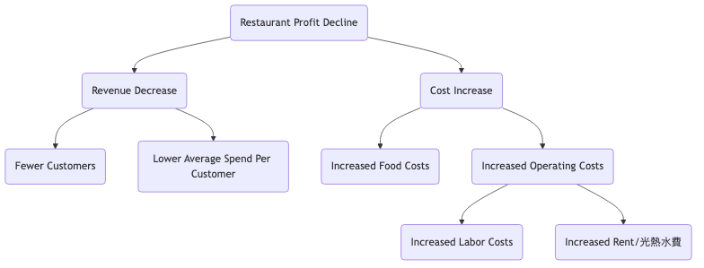

# ロジックツリー分析チュートリアル

## 1. ロジックツリーとは？

**ロジックツリー**とは、複雑な問題や課題を、体系的に小さな部分に分解して分析するための強力な視覚的分析ツールです。その中心となる考え方は、**MECE（Mutually Exclusive, Collectively Exhaustive：排他性・網羅性）**です。これは、分解された要素が重複せず、かつ抜け漏れがないことを意味します。

ロジックツリーは、思考の明確なフレームワークを構築し、分析の厳密性と包括性を確保するのに役立ちます。

## 2. ロジックツリーの主な種類

ロジックツリーは主に2種類あり、それぞれ異なる性質の問題解決に用いられます：

### a. プロブレムツリー（診断ツリー）

-   **目的**: 問題が「**なぜ**」発生したのかを診断・探求するために使用されます。

-   **構造**: コアとなる問題（根）から始まり、問題につながる潜在的な原因を継続的に分解していきます。各階層の枝は、前の階層の問題に対するさらに深い説明となります。

-   **適用シナリオ**: ルーツ原因分析、パフォーマンス低下の診断、トラブルシューティングなど。

### b. 「How」ツリー（解決策ツリー）

-   **目的**: 目標達成や問題解決のための「**どのように**」というアイデアを構築・計画するために使用されます。
-   **構造**: 全体的な目標（根）から始まり、具体的で実行可能な戦略や行動計画に分解していきます。
-   **適用シナリオ**: 戦略立案、目標設定、プロジェクト計画、解決策の模索など。

## 3. ロジックツリーの作成方法

### ステップ1：コアとなる問題または目標を明確に定義する

-   **プロブレムツリー**: 分析する「問題」を明確に述べます。例：「なぜ当社ウェブサイトのユーザー離脱率が上昇しているのか？」
-   **「How」ツリー**: 達成すべき「目標」を明確に定義します。例：「ウェブサイトの月間アクティブユーザー数を20%増やすにはどうすればよいか？」
-   この問題または目標をロジックツリーの出発点（根）とします。

### ステップ2：第一段階の分解（MECEの原則を適用）

-   **ブレインストーミング**: コアとなる問題／目標を中心に、どのような主要な要素に分解できるかを考えます。
-   **MECEの原則を適用**: 第一段階の枝が互いに排他的（重複なし）であり、全体として網羅的（重要な要素の抜け漏れなし）であることを保証します。
    -   **例（プロブレムツリー）**: ユーザー離脱率の増加は、「新規ユーザーの離脱」と「既存ユーザーの離脱」に分解できます。
    -   **例（「How」ツリー）**: 月間アクティブユーザー数の増加は、「新規ユーザーの獲得」「既存ユーザーのアクティブ化」「離脱ユーザーの再獲得」に分解できます。

### ステップ3：階層ごとに分解を続ける

-   **問いかけを続ける**: 各枝に対して「なぜこれは起こっているのか？」（プロブレムツリー）または「これを具体的にどうやって実行するのか？」（「How」ツリー）と問いかけ、さらに深い階層に分解していきます。
-   **明確な構造を維持**: 各階層でMECEの原則を引き続き適用し、問題がデータで検証可能または直接対応可能な十分に具体的なレベルまで分解し続けます。

### ステップ4：仮説の検証と優先順位の決定

-   **データによる検証**: プロブレムツリーでは、どの枝が真の原因であるかを検証するためにデータを収集します。
-   **解決策の評価**: 「How」ツリーでは、各行動計画の実行可能性、コスト、期待効果を評価します。
-   **重要ルートの特定**: 問題解決や目標達成において最も大きな影響を与える主要な原因または主要な行動を特定し、優先順位を付けます。

## 4. 実践的なケース

### ケース1：プロブレムツリー - 「なぜレストランの利益が減少しているのか？」を分析

**分析**: このツリー図を通じて、管理者は利益減少の主因を明確に把握でき、各枝（例：「顧客数の減少」）に対してデータ収集とさらに深い分析を行うことができます。

### ケース2：「How」ツリー - 「個人の仕事効率を高めるには？」を計画

**分析**: このツリー図は抽象的な目標を一連の具体的で実行可能なステップに分解し、個人が明確な改善計画を作成するのを助けます。

ロジックツリーはコンサルタント、プロダクトマネージャー、戦略プランナーにとって不可欠なコアスキルであり、思考の深さと広がりを大幅に高めるものです。